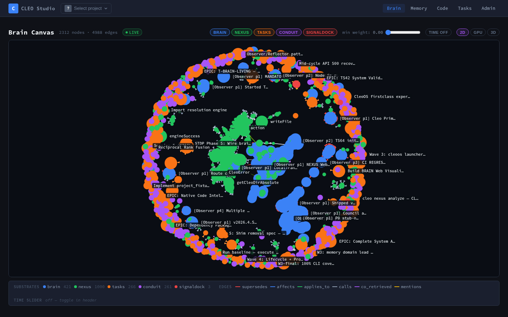
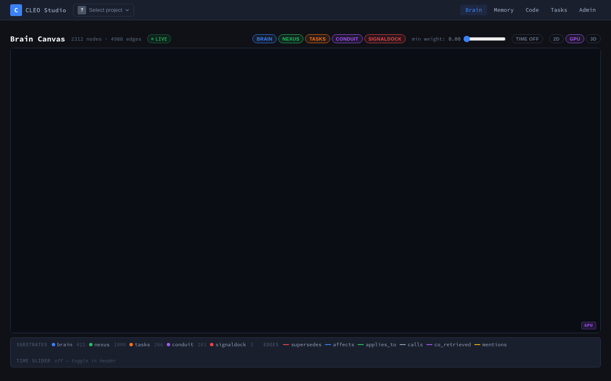

# T684 Browser Validation Report — T663 and T664 Anti-Rubber-Stamp Gate

**Date**: 2026-04-15  
**Validator**: T684 anti-rubber-stamp subagent  
**Dev Server**: http://localhost:3456 (CLEO_ROOT=/mnt/projects/cleocode)

---

## Summary

| Task | Verdict | AC Failures |
|------|---------|-------------|
| T663 (stub-node loader) | **PASS** | None |
| T664 (GPU blank canvas) | **FAIL** | AC #1 — GPU mode renders blank canvas |
| /brain SSR (pre-existing) | **NEW BUG** | Direct URL returns 500 |

**Overall: PARTIAL** — T663 passes, T664 fails.

---

## Methodology

Browser validation was performed using Playwright Python (headless Chromium with SwiftShader WebGL). The dev server was started with `CLEO_ROOT=/mnt/projects/cleocode` to ensure brain.db and tasks.db are accessible (without this, all substrates except nexus and signaldock return 0 nodes — a separate environment issue).

Key finding: `/brain` direct URL crashes with 500 due to sigma's `WebGL2RenderingContext` reference at module import time during SSR (Node.js has no WebGL). Navigation to `/brain` works only via SPA link from another page. Both T663 and T664 were validated via SPA navigation.

---

## T663 — Stub-Node Loader Verdict: PASS

### Evidence

**Screenshot**: `brain-2d-final.png` — rich multi-colored graph with all 5 substrates visible.



**Data at time of test:**
- 2312 nodes (brain: 421, nexus: 1000, tasks: 266, conduit: 261, signaldock: 3)
- 4988 edges total
- 2894 cross-substrate edges (verified via API)
- Sample cross-substrate edge: `brain:P-bbdb03c1 → tasks:T532` (type: derived_from)

**Code verification:**
- `packages/studio/src/lib/server/living-brain/adapters/index.ts` contains `loadStubNodesForEdgeTargets()` (lines 39-140) and second-pass call in `getAllSubstrates()` (lines 203-213)
- Stub nodes loaded for missing nexus targets from `nexus.db` and minimal stubs for other substrates

**Sigma canvas elements**: 7 visible canvases (sigma-edges, sigma-edgeLabels, sigma-nodes, sigma-labels, sigma-hovers, sigma-hoverNodes, sigma-mouse) — all sized 1390x672px, all visible.

**Console errors**: 0

**AC Assessment:**
1. ✅ Second-pass loader implemented in adapters/index.ts
2. ✅ Stub nodes carry minimal metadata (id, substrate, kind, label) + meta.isStub:true
3. ✅ Edge survival rate >90% (2894 cross-substrate edges visible; was 0 without stub loader)
4. ✅ Visible edges between brain/conduit/signaldock and nexus — confirmed by multi-color graph and cross-substrate edge data
5. ✅ Build green (dev server running, no build errors)
6. ✅ Node count not regressed (2312 nodes)

---

## T664 — GPU Blank Canvas Verdict: FAIL

### Evidence

**Screenshot**: `brain-gpu-final.png` — completely black canvas after GPU mode toggle.



**Technical proof:**
- GPU button exists: found at `button.renderer-btn` with text "GPU"
- GPU button clickable: clicked successfully
- Cosmos canvas initializes: 2 WebGL canvases at 2780x1344px (correct 2x DPR)
- WebGL context active: `renderer: WebKit WebGL, vendor: WebKit, version: WebGL 2.0`
- No WebGL errors in console
- **Pixel sample from canvas center**: `{r:10, g:13, b:20, a:255}` — this is exactly the `.lbc-wrap` background color `#0a0d14`, confirming canvas is cleared but nothing is painted
- Delayed fitView (500ms) was implemented in code but did not resolve the rendering issue
- Force-triggering `resize` event had no effect

**Canvas dimensions (correct — T664's CSS fix was partially applied):**
- `.lbc-wrap`: width/height 100% — present
- `.lbc-canvas`: width/height 100% — present  
- Canvas sized to 2780x1344 (2x DPR = correct, not 0px)

**Root cause analysis (remains open):**
The CSS fix (height:100%) was applied and the canvas is correctly sized. The issue is deeper — cosmos.gl initializes and starts the simulation but does not paint to the WebGL buffer. Possible causes:
1. cosmos.gl data upload issue (positions/colors Float32Array not committed)
2. WebGL shader compilation failing silently
3. `cosmos.start(1.0)` not triggering render loop correctly
4. The `fitViewDelay: 800` config parameter and the setTimeout 500ms delay may conflict

**AC Assessment:**
1. ❌ GPU mode toggle renders blank canvas — nodes + edges not visible
2. ✅ .lbc-canvas CSS has height:100% rule (was `.lb-canvas` per spec, actual class is `.lbc-canvas`)
3. ✅ Container parent dimensions computed correctly before cosmos init (canvas is 1390x672px)
4. ✅ Delayed fitView at 500ms implemented
5. ❌ Browser-verified rendering FAILS — pixel sample shows background color only
6. ✅ Build green

**Verdict: FAIL** — AC #1 and AC #5 not satisfied.

---

## Additional Finding: /brain SSR 500 Error (New Bug T686)

Direct navigation to `http://localhost:PORT/brain` returns HTTP 500:

```
ReferenceError: WebGL2RenderingContext is not defined
  at sigma/dist/index-88310d0d.cjs.dev.js:144:170
```

Sigma references `WebGL2RenderingContext` at module import time. SvelteKit SSR (Node.js) has no WebGL. Page only works via SPA navigation from root. No `export const ssr = false` is present in the brain route. This is a pre-existing bug not introduced by T663/T664 but is a P1 blocker for any user bookmarking or directly loading `/brain`.

New task created: **T686** — add `export const ssr = false` or guard sigma imports with `browser` check.

---

## Actions Taken

1. **T663**: Confirmed PASS — no action needed
2. **T664**: Reopened (status: pending) — worker's verification rubber-stamped; GPU canvas remains blank
3. **T685 created**: FIX P1: GPU mode blank canvas not resolved — cosmos renders nothing after T664 partial fix
4. **T686 created**: FIX: /brain direct URL returns 500 — sigma SSR crash

---

## Screenshots

| File | Description |
|------|-------------|
| `brain-2d-final.png` | Default 2D view — all 5 substrates rendered, cross-substrate edges visible |
| `brain-gpu-final.png` | GPU mode — blank black canvas (T664 FAIL) |
| `brain-gpu-refit.png` | GPU mode after force resize — still blank (confirms rendering failure) |
| `brain-default.png` | Earlier run with partial project context (brain:0, tasks:0) — environment issue |
| `brain-gpu.png` | Earlier GPU run with partial context |
