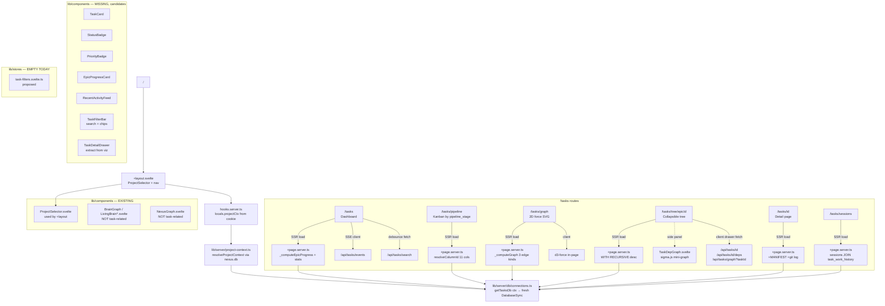

# Studio `/tasks` Architecture Audit — Blueprint for Viz Merge

Date: 2026-04-18
Task: T910 (Docs/Architecture Audit)
Auditor: frontend-architect
Scope: `packages/studio/src/routes/tasks/**` + supporting lib + `/tmp/task-viz/index.html`

---

## Section 1 — Conventions Matrix

| # | Question | Answer | File:Line Evidence |
|---|----------|--------|--------------------|
| **A. Routing conventions** | | | |
| A1 | URL structure | `/tasks` (dashboard) · `/tasks/[id]` (detail) · `/tasks/pipeline` (kanban-by-pipeline-stage) · `/tasks/graph` (2D force-directed SVG) · `/tasks/sessions` (session history) · `/tasks/tree/[epicId]` (collapsible hierarchy — ONLY addressable by epic). There is no bare `/tasks/tree` index and no `/tasks/kanban`. | `packages/studio/src/routes/tasks/` (ls) |
| A2 | SSR vs CSR | **All tasks pages are SSR'd via `+page.server.ts`.** Each page has a `load()` that opens `tasks.db` per-request and ships typed props. No `export const ssr = false`. d3-force simulation + search debounce run on client only. | `packages/studio/src/routes/tasks/+page.server.ts:147`, `graph/+page.server.ts:195`, `pipeline/+page.server.ts:113`, `tree/[epicId]/+page.server.ts:83` |
| A3 | Project context flow | Cookie `cleo_project_id` → `hooks.server.ts` resolves it via `getActiveProjectId(cookies)` → `resolveProjectContext(id)` from `nexus.db:project_registry` → assigns to `event.locals.projectCtx: ProjectContext`. Every `+page.server.ts` reads `locals.projectCtx` and calls `getTasksDb(locals.projectCtx)` which opens a fresh `DatabaseSync` per-request (not cached). | `packages/studio/src/hooks.server.ts:19-24`, `lib/server/project-context.ts:29,56,86,133`, `lib/server/db/connections.ts:98-102`, `app.d.ts:5-7` |
| **B. Data loading** | | | |
| B1 | How does data load happen | **Direct-DB via `getTasksDb(locals.projectCtx)` in every `+page.server.ts`.** Each page runs its own SQL. No shared loader library. `/api/tasks/**` endpoints exist for client-triggered fetches (search, SSE, graph for the 3D legacy drawer, deps) but pages do not self-fetch their own `/api`. | `tasks/+page.server.ts:20,148`, `graph/+page.server.ts:19,196`, `pipeline/+page.server.ts:19,114`, `tree/[epicId]/+page.server.ts:5,84` |
| B2 | Centralized loader? | **No.** Each page builds its own query. Closest shared primitive is `getTasksDb(ctx)` + pure compute helpers exported per-page for tests: `_computeEpicProgress` in `+page.server.ts:102` and `_computeGraph` in `graph/+page.server.ts:75`. | `tasks/+page.server.ts:102`, `graph/+page.server.ts:75` |
| B3 | Auto-refresh mechanism | **SSE** via `/api/tasks/events` — 2s poll of `MAX(updated_at), COUNT(*)` on server; emits `task-updated` or `heartbeat`. Dashboard (`/tasks`) subscribes in `$effect`, renders a `liveConnected` green dot + `updated Xm ago` badge. **Only the dashboard subscribes today.** Pipeline/Graph/Tree/Sessions do not subscribe. | `api/tasks/events/+server.ts:15-86`, `tasks/+page.svelte:183-202` |
| **C. Component patterns** | | | |
| C1 | Shared task components | **One** shared component: `$lib/components/TaskDepGraph.svelte` (mini sigma.js graph, used only by `/tasks/tree/[epicId]` in its side panel). **No** `TaskCard`, `StatusBadge`, `PriorityBadge`, `EpicProgressCard`, `RecentActivityFeed`. Each page re-implements `statusIcon()`, `statusClass()`, `priorityClass()` locally. | `lib/components/TaskDepGraph.svelte:1-214`, `tree/[epicId]/+page.svelte:4`, duplicated helpers in `tasks/+page.svelte:142-161`, `graph/+page.svelte:39-65`, `pipeline/+page.svelte:12-31` |
| C2 | State: runes vs stores | **Svelte 5 runes throughout.** `$props`, `$state`, `$derived`, `$effect`. `src/lib/stores/` directory exists but is **empty**. No writable stores for tasks/filters. | `tasks/+page.svelte:7,40-55,57`, `graph/+page.svelte:26,33-34,74-75`, `tree/[epicId]/+page.svelte:9,12`, `lib/stores/` (empty) |
| C3 | Theming | **Hand-rolled CSS with hex tokens + per-component `<style>` blocks.** No Tailwind, no CSS vars, no shadcn-svelte. Dark theme only. Palette: bg `#0f1117` / elev `#1a1f2e` / border `#2d3748` / accent `#a855f7` (purple) / text `#f1f5f9` / muted `#94a3b8`. Priority colors via `:global(.priority-critical|high|medium|low)`. Status colors via `:global(.status-done|active|blocked|pending)`. | `+layout.svelte:61-66,116-140`, `tasks/+page.svelte:898-906,1031-1034`, `graph/+page.svelte:486-505`, `pipeline/+page.svelte:367-376` |
| **D. URL state + filters** | | | |
| D1 | Filter → URL sync | **Yes on dashboard and graph.** Dashboard has `?deferred=1`, `?archived=1` — toggled via `<a href>` links with `data-sveltekit-noscroll`; SSR re-reads them. Graph has `?archived=1` and `?epic=<id>`. Pipeline has NO URL-synced filters. Sessions has NO URL filters. | `tasks/+page.server.ts:151-153`, `tasks/+page.svelte:25-34,348-368`, `graph/+page.server.ts:197-198`, `graph/+page.svelte:115-126,160-181` |
| D2 | In-memory filter state | Client-only state: dashboard search (`searchRaw`), pipeline keyboard focus (`focusedCol`, `focusedRow`), tree collapse set (`collapsed`), graph hover (`hoverId`). All `$state(...)`. | `tasks/+page.svelte:40-55`, `pipeline/+page.svelte:49-50`, `tree/[epicId]/+page.svelte:12`, `graph/+page.svelte:34` |
| D3 | Shared filter component | **None exists.** Dashboard defines its own `.filter-chip` CSS (lines 762-791). Graph page re-implements `.filter-chip` (lines 344-373) with nearly identical styles. Pure CSS duplication. | `tasks/+page.svelte:762-791`, `graph/+page.svelte:344-373` |
| **E. Dashboard concept** | | | |
| E1 | What IS the dashboard | `/` is a portal homepage (4 cards: Brain · Code · Memory · Tasks). **`/tasks` is THE task dashboard** — stats, priority bars, type chips, search, Epic Progress, Recent Activity, SSE live dot. | `routes/+page.svelte:9-46`, `routes/tasks/+page.svelte:209-436` |
| E2 | Cards/widgets on `/tasks` | Header + tab nav (Dashboard/Pipeline/Graph/Sessions) · live indicator · search box + dropdown results · stats row (Total/Active/Pending/Done/Cancelled/Archived) · Priority bar breakdown · Type chips · Filter bar (deferred/archived toggles) · `Epic Progress` panel · `Recent Activity` panel. | `tasks/+page.svelte:210-435` |
| E3 | "Epic Progress" location | Component: inline in `tasks/+page.svelte:371-410`. Data produced by exported pure fn `_computeEpicProgress(db, {includeDeferred})` at `tasks/+page.server.ts:102-145`. Renders per-epic `done/total` bar + sub-counts, rows link to `/tasks/tree/{ep.id}`. | `tasks/+page.server.ts:102-145`, `tasks/+page.svelte:371-410` |
| E4 | "Recent Activity" location | Inline in `tasks/+page.svelte:412-434`. Server produces `recentTasks` — 20 most-recently-updated non-archived rows. Rows link to `/tasks/{t.id}`. | `tasks/+page.server.ts:204-212`, `tasks/+page.svelte:412-434` |
| **F. Integration points (current state)** | | | |
| F1 | Existing tab shape | All 3 sub-pages (`/tasks/pipeline`, `/tasks/graph`, no `/tasks/tree` root) duplicate the same `.tasks-nav` markup with `Dashboard/Pipeline/Graph/Sessions` buttons — "tabs" are actually standalone pages with duplicated nav. | `tasks/+page.svelte:213-218`, `pipeline/+page.svelte:79-84`, `graph/+page.svelte:143-148` |
| F2 | Tree availability | `/tasks/tree/[epicId]` exists but is **epic-scoped only** (not a global hierarchy view). Accessed by clicking Epic Progress rows. No top-level "Hierarchy" tab. | `tree/[epicId]/+page.server.ts:83`, `tasks/+page.svelte:382` |
| F3 | Viz tabs to merge | Standalone `/tmp/task-viz/index.html`: three tabs `graph` (vis-network Dependency Graph with 360px right-side detail drawer), `hierarchy` (collapsible `<ul>` tree), `kanban` (4 columns: Pending / In-Progress / Done / Cancelled — **axis is `status`, not `pipeline_stage`**). Shared header: search + status chips + priority chips + labels dropdown. | `/tmp/task-viz/index.html:741-768,741,826,830-842,1016,1203,1301` |
| F4 | Viz detail drawer shape | 360px right-side drawer (`.detail` @ line 330) shows `.d-id`, `.d-title`, `.d-meta` grid (status/priority/parent/labels), upstream/downstream lists, label pills. Clicking list items re-pins the drawer to that task. **This component is the highest-value extract.** | `/tmp/task-viz/index.html:330-459` |
| F5 | Where Kanban should live | Viz Kanban axis is `status`. Studio `/tasks/pipeline` axis is `pipeline_stage` (11 RCASD-IVTR+C columns). **These are different concepts** — see HITL question Q3. | `/tmp/task-viz/index.html:830-842`, `pipeline/+page.server.ts:29-41` |

---

## Section 2 — Component Dependency Tree



### Duplication hotspots (DRY violations)

1. `priorityClass()`, `statusIcon()`, `statusClass()` — defined inline in **4 files**:
   `tasks/+page.svelte:142-161`, `pipeline/+page.svelte:12-31`, `graph/+page.svelte` (via status CSS only), `tree/[epicId]/+page.svelte:57-76`.
2. `.tasks-nav` + `.nav-tab` markup + CSS — duplicated in **3 files**:
   `tasks/+page.svelte:213-218,467-490`, `pipeline/+page.svelte:79-84,165-188`, `graph/+page.svelte:143-148,308-328`.
3. `.filter-chip` CSS — duplicated in `tasks/+page.svelte:762-791` and `graph/+page.svelte:344-373`.
4. Inline `formatTime()`, `progressPct()` — inline in `tasks/+page.svelte:163-181`.

---

## Section 3 — Integration Blueprint for Viz Merge

### 3.1 Route structure after merge (recommended)

```
/                               Portal home (unchanged)
/tasks                          DASHBOARD — stats, epic progress, recent activity, SSE
/tasks/[id]                     DETAIL — full task page (unchanged)
/tasks/explorer                 NEW — merged viz with 3 tabs under one shared filter bar
     ?view=graph                  tab 1 — dependency graph (from viz, upgrades /tasks/graph)
     ?view=hierarchy              tab 2 — all-epics collapsible tree (from viz, new)
     ?view=kanban-status          tab 3 — kanban by status (from viz, new)
     shared query params: ?q=&status=&priority=&labels=&epic=&archived=1
/tasks/pipeline                 KEEP — kanban by pipeline_stage (RCASD-IVTR+C, distinct)
/tasks/tree/[epicId]            KEEP — deep-link epic tree (addressable URL)
/tasks/sessions                 KEEP — session timeline (unchanged)

DEPRECATE after migration (redirect to /tasks/explorer?view=graph):
/tasks/graph                    301 → /tasks/explorer?view=graph (preserve ?epic, ?archived)
```

**Rationale:**

- `/tasks` remains the dashboard. The viz is not a dashboard — it's a multi-modal explorer. Promoting the viz to `/tasks` would bury Epic Progress + Recent Activity, which are the "what should I work on next" widgets operators depend on.
- A single `/tasks/explorer` route with `?view=` tabs lets the three modes share **one** load function, **one** filter bar, **one** detail drawer, and **one** URL state — matching the viz's current UX where switching tabs keeps the selection/filters.
- `/tasks/pipeline` stays separate because RCASD-IVTR+C pipeline is a lifecycle concept, not a status concept. Merging would confuse operators who distinguish "this task's pipeline stage" from "this task's kanban status". See HITL Q3.
- `/tasks/tree/[epicId]` stays separate for shareable deep-links; the `hierarchy` tab inside `/tasks/explorer` is the global view; epic rows on Epic Progress still link to `/tasks/tree/{id}` for the zoomed single-epic experience.

### 3.2 Shared state shape

**URL (shareable, SSR-correct):**

```
/tasks/explorer?view=graph|hierarchy|kanban-status
                &q=<search>                        (title fuzzy + ID exact)
                &status=pending,active,done        (CSV, matches /api/tasks convention)
                &priority=critical,high            (CSV)
                &labels=infra,migration            (CSV)
                &epic=T876                         (restrict to one epic's subtree)
                &archived=1                        (include archived rows)
                &selected=T882                     (pre-open detail drawer on load)
```

**Server load (single `/tasks/explorer/+page.server.ts`):**

```ts
// Returns one payload for all 3 tabs to avoid 3 duplicate queries.
export const load = ({ locals, url }) => {
  const filters = parseExplorerFilters(url);
  const db = getTasksDb(locals.projectCtx);
  if (!db) return { nodes: [], edges: [], filters, counts: empty };

  // Single query, three projections on client.
  const { nodes, edges, counts } = _computeExplorerPayload(db, filters);
  return { nodes, edges, filters, counts };
};
```

**Page-local `$state` (Svelte 5 runes, no stores needed):**

- `selectedId: string | null` — drives the detail drawer. Synced to `?selected=` for deep-links.
- `activeView: 'graph' | 'hierarchy' | 'kanban-status'` — driven from `?view=` via `$derived($page.url)`. No client-only state.
- `hoverId: string | null` — ephemeral, client-only.
- `collapsedIds: Set<string>` — ephemeral, persists to `sessionStorage` (NOT URL — too noisy).

**No Svelte store required.** The empty `lib/stores/` directory stays empty. Runes + URL are sufficient.

### 3.3 Component reuse plan

| Source | New location | Notes |
|--------|--------------|-------|
| **REUSE** `EpicProgressCard` row | Extract from `tasks/+page.svelte:371-410` → `lib/components/tasks/EpicProgressCard.svelte` | Used by `/tasks` today; will also be used by explorer hierarchy tab if filter `?epic=` not set. Props: `epic: EpicProgress`. |
| **REUSE** `TaskDepGraph.svelte` | Already in `lib/components/` | Used by `/tasks/tree/[epicId]` side panel. Could be swapped INTO the explorer's graph tab — but the viz's vis-network is richer. **Decision pending HITL Q5.** |
| **REUSE** SSE live indicator | Extract from `tasks/+page.svelte:183-202,220-225` → `lib/components/tasks/LiveIndicator.svelte` | Wire into explorer header so graph/hierarchy/kanban also refresh on commit. Pure UX win. |
| **EXTRACT from viz** detail drawer | `lib/components/tasks/TaskDetailDrawer.svelte` | Port `/tmp/task-viz/index.html:330-459` CSS + drawer population logic. Props: `taskId`, emits `onPin` / `onClose` / `onNavigate`. Fetches via existing `/api/tasks/[id]` + `/api/tasks/[id]/deps` — no new API needed. |
| **EXTRACT from viz** vis-network graph | `lib/components/tasks/DependencyGraph.svelte` | vis-network is richer than the current d3-SVG in `/tasks/graph`. Accept `nodes, edges` props; emit `onSelect(id)`. Replace d3-force code in `graph/+page.svelte:77-109`. Bundle impact: vis-network is ~400KB gzipped — see HITL Q4. |
| **EXTRACT from viz** hierarchy tree | `lib/components/tasks/HierarchyTree.svelte` | Tree view rendered as nested `<ul>` with caret toggle + epic highlight. Props: `root: TreeNode[]`. The existing `/tasks/tree/[epicId]` already renders this for one epic; extract that render logic and share. |
| **EXTRACT from viz** kanban | `lib/components/tasks/StatusKanban.svelte` | 4 columns `pending|in-progress|done|cancelled` by `status`. **Distinct from `PipelineKanban` at `/tasks/pipeline`.** |
| **NEW** shared filter bar | `lib/components/tasks/TaskFilterBar.svelte` | Search box + status chips + priority chips + labels dropdown + archived/epic/deferred toggles. URL-synced. Replaces three duplicated implementations. |
| **NEW** status + priority badges | `lib/components/tasks/{StatusBadge,PriorityBadge,TaskCard}.svelte` | Kills the `priorityClass()` / `statusClass()` / `statusIcon()` duplication in 4 files. |
| **NEW** tabs | `lib/components/tasks/TasksNav.svelte` | Extract the `.tasks-nav` markup duplicated in 3 pages. Takes a list of `{href, label}` and reads `$page.url.pathname`. |

### 3.4 Project-context resolution (the "not hardcoded" requirement)

The viz currently loads **static** `tasks.json` + `deps.json` from the operator's one-off export. When merged into Studio, it must become project-aware:

1. **Server load reads `locals.projectCtx`** — already the pattern; zero viz-specific wiring needed. `/tasks/explorer/+page.server.ts` calls `getTasksDb(locals.projectCtx)` exactly like `/tasks/graph/+page.server.ts:196` does today.
2. **ProjectSelector in header** (already present via `+layout.svelte:28-31`) switches the cookie; every subsequent SSR load re-reads `tasks.db` for the new project. **No new code needed on the viz side.**
3. **Live updates per project**: `/api/tasks/events` already reads `projectCtx` from `locals` (`events/+server.ts:13`), so SSE events automatically follow the active project.
4. **Label data** — viz reads `labels_json` from the `tasks` table. That column already exists and is SELECT'd in `/api/tasks/+server.ts:64`. Labels become first-class in the filter bar — tier-3 work.
5. **Static HTML assets** — the viz's inline `<style>` + `<script>` must be split: styles become `<style>` in each Svelte component, vis-network loaded as an NPM dep (already absent from `package.json` — add `vis-network` or `@vis/network`), JS logic split by tab.

**Migration path:** keep `/tmp/task-viz/index.html` as the visual reference during implementation. Do **not** ship it as-is — it fails project-context, SSR, ProjectSelector integration, and the CLEO Studio dark theme tokens.

---

## Section 4 — Open Questions for HITL (yes/no or A/B/C)

**Q1. Route structure for the viz.**
A. Merge all 3 viz tabs under one new `/tasks/explorer?view=graph|hierarchy|kanban-status` route and deprecate `/tasks/graph` (301 redirect to `?view=graph`).
B. Keep `/tasks/graph` standalone, promote `/tasks/hierarchy` and `/tasks/kanban-status` as separate sibling pages (matching today's pattern), share only a filter bar component.
→ **Recommendation: A.** Viz UX assumes tabs share filters + selection; separate pages would force reload-on-tab-switch.

**Q2. Dashboard scope.**
Stays as is: `/` = portal home, `/tasks` = task dashboard (stats + epic progress + recent activity). Confirm **YES** to keep — or do you want the viz to BECOME `/tasks` and push the dashboard to `/tasks/overview`?
→ **Recommendation: keep as is.** The dashboard is the "what now" summary; the explorer is the "explore everything" tool. Different jobs.

**Q3. Kanban axis — status vs pipeline_stage.**
The viz's Kanban uses `status` (pending/in-progress/done/cancelled). Studio's `/tasks/pipeline` uses `pipeline_stage` (11 RCASD-IVTR+C columns). These are different concepts.
A. Ship both: `/tasks/explorer?view=kanban-status` (new, from viz) **and** keep `/tasks/pipeline` (unchanged).
B. Only ship one; if so — which? (status-kanban drops the pipeline semantics; pipeline-kanban drops the casual operator-facing board.)
→ **Recommendation: A — ship both.** They serve different mental models. Owner note in memory: "pipeline and kanban are different concepts" — confirm this decision matches that intent.

**Q4. vis-network vs d3-force for the Dependency Graph tab.**
A. Adopt vis-network from the viz (richer UX: drag, pin, legend, detail drawer wired) — add `vis-network` npm dep (~400KB gzipped).
B. Keep current d3-force SVG in `/tasks/graph` (already zero bundle cost, already committed, T879) and just port the viz's **detail drawer** onto it.
C. Use existing `TaskDepGraph.svelte` (sigma.js — already in deps) everywhere.
→ **Recommendation: B for v1**, re-evaluate if operator wants vis-network polish. The d3 SVG approach satisfies "2D force-directed" and the bundle budget; the drawer is the highest-value extract.

**Q5. Hierarchy tab scope.**
A. Global hierarchy tree across all epics (from the viz — huge tree on big projects, may be slow past 1000+ tasks).
B. Epic-scoped only (`/tasks/tree/[epicId]`) + "pick an epic" screen as the tab landing page.
C. Both: default to "pick an epic", allow "View all" button that renders the global tree with virtualization.
→ **Recommendation: C**, but ship A first if simpler and only add virtualization if `.cleo/agent-outputs/T910-docs-audit/stats.json` > 1000 non-archived tasks.

**Q6. Shared task-components directory name.**
`lib/components/tasks/` already exists in `lib/` directory listing? → Yes, `packages/studio/src/lib/tasks/` exists (currently empty) per the `lib/` ls. Separately `lib/components/` exists and holds `TaskDepGraph.svelte`.
A. Put new shared components in `lib/components/tasks/` (grouped by domain).
B. Put them flat in `lib/components/` alongside `TaskDepGraph.svelte`, `ProjectSelector.svelte`.
→ **Recommendation: A.** Brain/Code/Tasks will all grow shared component sets. Namespacing by domain prevents a 40-file flat directory later.

**Q7. Filter URL-param contract.**
`/api/tasks/+server.ts:46-58` accepts `?status=a,b,c` / `?priority=a,b,c` / `?type=a,b,c` as comma-separated. The dashboard uses single-flag URLs (`?archived=1`, `?deferred=1`). The viz has in-memory `Set<string>`.
A. Standardize on comma-separated CSV everywhere (matches existing API contract).
B. Standardize on repeated params (`?status=pending&status=active`) — more idiomatic for SvelteKit `url.searchParams.getAll()`.
→ **Recommendation: A.** API already uses CSV; duplicating the convention keeps client and server in sync.

**Q8. Keep or drop `/tasks/graph` after merge.**
A. 301 redirect to `/tasks/explorer?view=graph` once explorer ships and preserves `?epic`, `?archived` query params.
B. Keep both live indefinitely (no redirect).
→ **Recommendation: A** after 1 release cycle where explorer is stable. A stale route is confusing.

---

## Appendix — File:line index for viz merge implementers

| Need | File:line |
|------|-----------|
| SSR + projectCtx pattern to copy | `packages/studio/src/routes/tasks/graph/+page.server.ts:195-227` |
| Pure compute fn for testability | `packages/studio/src/routes/tasks/+page.server.ts:102-145` (`_computeEpicProgress`) |
| URL-synced filter toggle pattern | `packages/studio/src/routes/tasks/+page.svelte:25-34,348-368` |
| SSE subscription pattern | `packages/studio/src/routes/tasks/+page.svelte:186-202` |
| SSE producer | `packages/studio/src/routes/api/tasks/events/+server.ts:15-86` |
| d3-force SVG rendering | `packages/studio/src/routes/tasks/graph/+page.svelte:77-256` |
| sigma.js mini-graph | `packages/studio/src/lib/components/TaskDepGraph.svelte:83-136` |
| Tree recursion (WITH RECURSIVE) | `packages/studio/src/routes/tasks/tree/[epicId]/+page.server.ts:118-150` |
| Pipeline column taxonomy | `packages/studio/src/routes/tasks/pipeline/+page.server.ts:29-69` |
| Project selector | `packages/studio/src/lib/components/ProjectSelector.svelte` |
| Cookie → ProjectContext | `packages/studio/src/hooks.server.ts:19-24` + `lib/server/project-context.ts:86-127` |
| Per-request DB open (no cache) | `packages/studio/src/lib/server/db/connections.ts:98-102` |
| Theme palette + duplicated helpers | `packages/studio/src/routes/tasks/+page.svelte:142-181,898-906,1031-1034` |
| Viz tab/view structure | `/tmp/task-viz/index.html:741-842` |
| Viz detail drawer (HIGH REUSE VALUE) | `/tmp/task-viz/index.html:330-459` |
| Viz hierarchy tree CSS | `/tmp/task-viz/index.html:459-520` |
| Viz kanban CSS | `/tmp/task-viz/index.html:521-740` |
