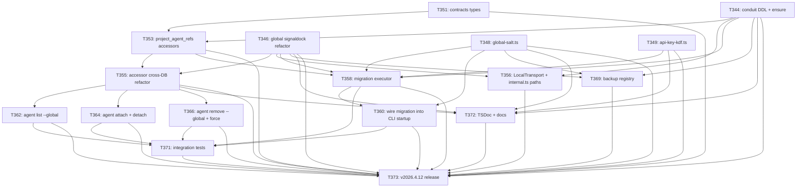

# T310 Decomposition: Conduit + Signaldock Implementation Plan

> Breaks T328 specification into atomic implementation subtasks with wave
> ordering. Each subtask is scoped to ≤3 files with ≥3 acceptance criteria.
> Orchestrator dispatches subtasks in wave order; within a wave, tasks can
> run in parallel.

## Summary Statistics

- **Total implementation subtasks**: 16
- **Waves**: 7 (0 through 6)
- **Critical path length**: 7 serial tasks (T344 → T353 → T355 → T358 → T360 → T371 → T373)
- **Parallel opportunities**: Wave 0 (5 tasks in parallel), Wave 1 (3 tasks in parallel), Wave 3 (3 tasks in parallel), Wave 4 (1 task alongside Wave 3)
- **Estimated total file count**: 9 new files, 7 modified files

---

## Wave Ordering

### Wave 0: Schemas and Primitive Modules (no dependencies — start immediately)

All five tasks can run in parallel. They establish the foundation that every subsequent
wave depends on.

| Task | Title | Files | AC Summary |
|------|-------|-------|------------|
| T344 | conduit-sqlite.ts: DDL, ensureConduitDb, path helper | `conduit-sqlite.ts` (new) | Full conduit.db DDL, WAL mode, idempotent ensure, health check |
| T346 | signaldock-sqlite.ts: refactor to global-tier only | `signaldock-sqlite.ts` (refactor) | Global-only schema, getGlobalSignaldockDbPath, requires_reauth column |
| T348 | global-salt.ts: atomic write, memoized read, validation | `global-salt.ts` (new) | Atomic write, 0o600 perms, memoized, validateGlobalSalt |
| T349 | api-key-kdf.ts: deriveApiKey and deriveLegacyProjectKey | `api-key-kdf.ts` (new) | HMAC-SHA256 KDF, pure functions, deterministic output |
| T351 | contracts: ProjectAgentRef and AgentWithProjectOverride types | `contracts/src/agent.ts`, `contracts/src/index.ts` | Contract types, strict mode, no inline types elsewhere |

### Wave 1: Accessor Refactor and Path Updates (depends on Wave 0)

Three tasks can run in parallel. T353 extends T344; T355 consumes T346 and T353; T356
updates the import paths after T344 and T346 exist.

| Task | Title | Files | AC Summary |
|------|-------|-------|------------|
| T353 | conduit-sqlite.ts: project_agent_refs CRUD accessors | `conduit-sqlite.ts`, `store/__tests__/conduit-sqlite.test.ts` | attach/detach/list/get/updateLastUsed, TC-004–TC-010 |
| T355 | agent-registry-accessor.ts: cross-DB refactor and global functions | `agent-registry-accessor.ts`, `store/__tests__/agent-registry-accessor.test.ts` | Cross-DB JOIN, lookupAgent, listGlobal, TC-050–TC-059 |
| T356 | LocalTransport and internal.ts: conduit.db path migration | `conduit/local-transport.ts`, `internal.ts` | No signaldock refs in transport, deprecated re-export |

### Wave 2: Migration Executor (depends on Wave 0 + Wave 1 T353)

Two serial tasks. T360 depends on T358 completing.

| Task | Title | Files | AC Summary |
|------|-------|-------|------------|
| T358 | migrate-signaldock-to-conduit.ts: 15-step migration executor | `migrate-signaldock-to-conduit.ts` (new), `store/__tests__/migrate-signaldock-to-conduit.test.ts` | needsMigration, full 15-step sequence, rollback matrix, TC-060–TC-073 |
| T360 | cli/index.ts: wire migration and startup sequence | `packages/cleo/src/cli/index.ts` | Startup order per spec §4.6, non-fatal failures, salt fingerprint log |

### Wave 3: CLI Surface (depends on Wave 1 T355)

Three tasks can run in parallel. All touch only `cli/commands/agent.ts`.

| Task | Title | Files | AC Summary |
|------|-------|-------|------------|
| T362 | cleo agent list --global and agent info: CLI flag additions | `packages/cleo/src/cli/commands/agent.ts` | Project-scoped default, --global full scan, TC-081/082/084 |
| T364 | cleo agent attach and detach: new CLI verbs | `packages/cleo/src/cli/commands/agent.ts` | attach creates ref, detach sets enabled=0, exit 4 on not-found |
| T366 | cleo agent remove --global and --force: safety-gated global deletion | `packages/cleo/src/cli/commands/agent.ts` | Q4=C enforcement, cross-project scan warning, exit 1 without --force |

> Note: T362, T364, and T366 all modify the same file. Orchestrator should
> dispatch them sequentially to avoid merge conflicts, or assign to one
> agent as a combined CLI surface task.

### Wave 4: Backup Registry (depends on Wave 0 T344, T346, T348)

One task. Can run in parallel with Wave 3.

| Task | Title | Files | AC Summary |
|------|-------|-------|------------|
| T369 | sqlite-backup.ts: conduit, global signaldock, and global-salt registry | `sqlite-backup.ts`, `conduit-sqlite.ts` (add getNativeDb export) | Three backup targets registered, global-salt rotation, TC-100–TC-105 |

### Wave 5: Integration Tests and Documentation (depends on Waves 2 + 3)

Two tasks can run in parallel.

| Task | Title | Files | AC Summary |
|------|-------|-------|------------|
| T371 | T310 cross-project agent lifecycle integration tests | `packages/core/src/__tests__/t310-conduit-migration.test.ts` (new) | TC-080–TC-093, ≥30 it() blocks, real SQLite in tmp dirs |
| T372 | TSDoc updates and docs/ reference corrections for T310 modules | 5 source modules (doc-only edits) | All exports have TSDoc, no stale signaldock project-tier refs in docs/ |

### Wave 6: Release Mechanics (depends on everything)

| Task | Title | Files | AC Summary |
|------|-------|-------|------------|
| T373 | v2026.4.12 release: version bumps, CHANGELOG, gauntlet | All `package.json` files, `CHANGELOG.md` | Version 2026.4.12, CHANGELOG entry, zero regressions, ≥50 new tests, git tag |

---

## Dependency Graph



---

## Critical Path

The longest serial chain from Wave 0 to release:

```
T344 (conduit DDL)
  → T353 (project_agent_refs accessors)
    → T355 (accessor cross-DB refactor)
      → T358 (migration executor — also needs T346, T348, T349)
        → T360 (wire migration into CLI startup)
          → T371 (integration tests)
            → T373 (v2026.4.12 release)
```

**Critical path length**: 7 serial tasks.

The migration executor (T358) is the true integration point — it depends on all four Wave 0
schema/primitive modules plus the Wave 1 project_agent_refs accessor. Nothing in Wave 2
or later can complete until T358 passes its tests.

---

## Per-Subtask Summary Table

| ID | Wave | Title | Files (count) | Depends | Priority | Size |
|----|------|-------|---------------|---------|----------|------|
| T344 | 0 | conduit-sqlite.ts: DDL, ensureConduitDb, path helper | 1 (new) | — | critical | medium |
| T346 | 0 | signaldock-sqlite.ts: refactor to global-tier only | 1 (refactor) | — | critical | medium |
| T348 | 0 | global-salt.ts: atomic write, memoized read, validation | 1 (new) | — | critical | small |
| T349 | 0 | api-key-kdf.ts: deriveApiKey and deriveLegacyProjectKey | 1 (new) + 1 (test) | — | critical | small |
| T351 | 0 | contracts: ProjectAgentRef and AgentWithProjectOverride types | 2 (extend) | — | critical | small |
| T353 | 1 | conduit-sqlite.ts: project_agent_refs CRUD accessors | 2 (extend + test) | T344, T351 | high | medium |
| T355 | 1 | agent-registry-accessor.ts: cross-DB refactor and global functions | 2 (refactor + test) | T346, T353 | high | large |
| T356 | 1 | LocalTransport and internal.ts: conduit.db path migration | 2 (update) | T344, T346 | high | small |
| T358 | 2 | migrate-signaldock-to-conduit.ts: 15-step migration executor | 2 (new + test) | T344, T346, T348, T349, T353 | critical | large |
| T360 | 2 | cli/index.ts: wire migration and startup sequence | 1 (update) | T358, T348 | critical | small |
| T362 | 3 | cleo agent list --global and agent info: CLI flag additions | 1 (update) | T355 | medium | small |
| T364 | 3 | cleo agent attach and detach: new CLI verbs | 1 (update) | T355 | medium | small |
| T366 | 3 | cleo agent remove --global and --force: safety-gated global deletion | 1 (update) | T355 | medium | small |
| T369 | 4 | sqlite-backup.ts: conduit, global signaldock, and global-salt registry | 2 (update + extend) | T344, T346, T348 | medium | medium |
| T371 | 5 | T310 cross-project agent lifecycle integration tests | 1 (new) | T358, T360, T362, T364, T366 | medium | large |
| T372 | 5 | TSDoc updates and docs/ reference corrections for T310 modules | 5 (doc edits) | T344, T346, T348, T349, T355 | medium | small |
| T373 | 6 | v2026.4.12 release: version bumps, CHANGELOG, gauntlet | all package.json + CHANGELOG | all above | critical | medium |

---

## Parallel Dispatch Plan

### Wave 0 — fully parallel (5 agents)
Dispatch T344, T346, T348, T349, T351 simultaneously. No ordering constraints.
All five can complete independently.

### Wave 1 — partially parallel (3 agents with coordination note)
Dispatch T353 and T356 in parallel once Wave 0 completes.
Dispatch T355 once T353 completes (T355 depends on T353).
Net: T353 and T356 run in parallel; T355 starts after T353.

### Wave 2 — serial (2 agents sequential)
Dispatch T358 once all of T344, T346, T348, T349, T353 are complete.
Dispatch T360 only after T358 completes.

### Wave 3 and Wave 4 — parallel across waves
Wave 3 (T362, T364, T366) can start once T355 is complete.
Wave 4 (T369) can start once T344, T346, and T348 are complete — it does NOT need
Wave 1 or Wave 2 to finish. Orchestrator should launch T369 as soon as its Wave 0
prerequisites are satisfied, in parallel with Wave 1 and Wave 2 work.

**Caution on Wave 3**: T362, T364, and T366 all modify `packages/cleo/src/cli/commands/agent.ts`.
Orchestrator MUST assign these to a single agent or sequence them to avoid merge conflicts.

### Wave 5 — parallel (2 agents)
Dispatch T371 and T372 simultaneously once all preceding waves complete.
T372 (TSDoc) is independent of T371 (integration tests) — they touch different files.

### Wave 6 — serial (1 agent)
Dispatch T373 only after T371 and T372 both complete (full quality gauntlet required).

---

## ADR-037 Decision Coverage Matrix

Every consensus decision (Q1–Q8) is traceable to at least one implementation subtask:

| Decision | Subtask(s) |
|----------|-----------|
| Q1 — Project-scoped default for agent list | T355 (listAgentsForProject default), T362 (--global flag) |
| Q2 — Cloud tables in global signaldock | T346 (DDL carries forward all tables) |
| Q3 — machine-key + global-salt KDF | T348 (global-salt.ts), T349 (api-key-kdf.ts), T358 (re-keying in migration) |
| Q4 — Never auto-delete global identity | T355 (remove = detach), T366 (--global + --force) |
| Q5 — conduit.db name | T344 (module name + DB_FILENAME constant) |
| Q6 — project_agent_refs override table | T353 (DDL + CRUD), T355 (cross-DB JOIN uses this table) |
| Q7 — LocalTransport project-scoped | T356 (local-transport.ts opens conduit.db) |
| Q8 — Automatic migration on first invocation | T358 (needsMigration + runMigration), T360 (startup wire-up) |
