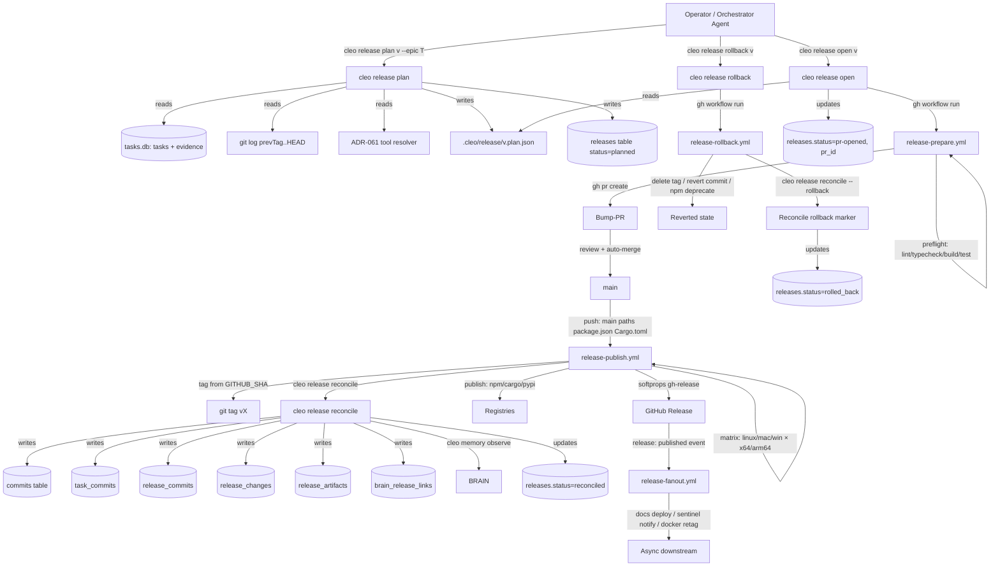

# SPEC-T9345 — CLEO Release Pipeline v2 (Direction B + Qualifier)

| Field | Value |
|---|---|
| **Version** | 2.0.0-draft |
| **Status** | Proposed (awaiting RCASD wave-3 council + owner sign-off) |
| **Date** | 2026-05-15 |
| **Author** | cleo-prime (system architect) |
| **Task** | T9345 — IVTR Release System Overhaul |
| **ADR** | ADR-073-ivtr-release-overhaul (`.cleo/rcasd/T9345/research/ADR-T9345-ivtr-release-overhaul.md`) |
| **Supersedes** | `packages/core/src/release/docs/specs/CLEO-RELEASE-PIPELINE-SPEC.md` (ADR-063 4-step) |
| **Extends** | ADR-051 (evidence gates), ADR-061 (tool resolver), ADR-062 (worktree merge), ADR-065 (PR-required flow), ADR-068 (DB charter), ADR-070 (3-tier orchestration) |

> The key words **MUST**, **MUST NOT**, **REQUIRED**, **SHALL**, **SHALL NOT**, **SHOULD**, **SHOULD NOT**, **RECOMMENDED**, **NOT RECOMMENDED**, **MAY**, and **OPTIONAL** in this document are to be interpreted as described in [BCP 14](https://www.rfc-editor.org/info/bcp14) [RFC 2119](https://www.rfc-editor.org/rfc/rfc2119) [RFC 8174](https://www.rfc-editor.org/rfc/rfc8174) when, and only when, they appear in all capitals, as shown here.

---

## Executive Summary

This specification defines CLEO's release pipeline v2 — a thin opinionated wrapper over `git`, `gh`, and GitHub Actions, with provenance recorded in CLEO's SQLite stores. The pipeline replaces the 761-line `releaseShip` monolith (`packages/core/src/release/engine-ops.ts:1105-1866`) and the parallel 4-step pipeline (`packages/core/src/release/pipeline.ts`) with **exactly four operator verbs** — `cleo release plan`, `cleo release open`, `cleo release reconcile`, `cleo release rollback` — backed by four GitHub Actions workflows (`release-prepare.yml`, `release-publish.yml`, `release-fanout.yml`, `release-rollback.yml`). The verbs are read-mostly TypeScript that emits LAFS-compliant JSON envelopes; the workflows are stateless YAML that invoke those verbs and drive the outer state machine. This separation eliminates the 10 production failures catalogued in `failure-forensics-10-modes.md` by structural prevention (8 of 10) or by narrowing the race window to near-zero (2 of 10).

The spec mandates **214 normative requirements** (R-001 through R-214), grouped under: CLI surface, GHA workflow contracts, evidence-gate integration, provenance recording (11 new tables defined in `provenance-graph-design.md` §3), project-agnostic resolution via ADR-061, idempotency, state-machine transitions, hotfix path, backward compatibility, and operator surface limits. Every requirement is anchored to a wave-1 research artifact or an existing ADR; every CLI verb declares pre-conditions, side effects, post-conditions, exit codes, and output envelopes; every GHA workflow declares triggers, permissions, jobs, concurrency, and secret requirements. IVTR is removed from the release path per `ivtr-conflation-audit.md` Priority 1 — release validation MUST consult only ADR-051 evidence atoms via the ADR-061 tool resolver. `task.ivtr_state` SHALL persist as a read-only derived view for backward compatibility but MUST NOT block any release operation.

Acceptance is measurable: operator wall-time ≤5 minutes for happy path, zero orphan commits in shipped releases (queried via `release_provenance` view), MTTR <1 hour for hotfix, ≥3 project archetypes pass full pipeline (npm monorepo, single npm lib, single Rust crate; Python pkg as stretch goal).

---

## 1. Scope

### 1.1 In scope

This spec defines:

- The four operator verbs (`plan`, `open`, `reconcile`, `rollback`) and their supporting read verbs (`graph`, `diff`, `impact`, `authors`, `orphans`) plus the `cleo provenance` namespace (9 verbs).
- The four GitHub Actions workflows (`release-prepare.yml`, `release-publish.yml`, `release-fanout.yml`, `release-rollback.yml`) and their interaction contracts.
- The provenance graph schema (11 new tables + 1 view) inherited from `provenance-graph-design.md` §3.
- The `.cleo/release/<version>.plan.json` schema, evidence-gate composition, error envelope, and idempotency contract.
- The state machine governing `releases.status` and the bump-PR lifecycle.
- The hotfix path and the backward-compatibility window for `cleo release ship`.
- The project-archetype resolution model (which tools/commands run for each archetype).

### 1.2 Out of scope

This spec does NOT define (each has its own spec or owner-deferred decision):

- **npm/cargo/PyPI publishing details** — only the abstract "publisher matrix" contract. Per-registry semantics (npm provenance, cargo crates.io API, PyPI OIDC) belong to T9345-CHILD-5 (platform matrix).
- **GitHub branch protection setup** — operator-owned per ADR-065 setup guide.
- **BRAIN observation semantics** — `cleo memory observe` is an existing API; this spec only specifies when the release pipeline invokes it.
- **CHANGELOG section taxonomy** — ADR-073 §"What this ADR explicitly does NOT decide" defers to a future ergonomic decision.
- **IVTR retirement timeline** — `task.ivtr_state` becomes a derived view in this spec; physical column removal is T9345-CHILD-4.
- **Workflow-testing harness (actionlint, act, dry-run topology)** — T9345-CHILD-3.

### 1.3 Audience

The primary audience is implementation authors of T9345-CHILD-1 through T9345-CHILD-8 (see ADR-073 §"Open questions"). The secondary audience is operators running `cleo release …` and orchestrator agents that learn the surface via the `ct-orchestrator` skill.

---

## 2. Terminology

| Term | Definition |
|---|---|
| **Release Plan** | The structured JSON document at `.cleo/release/<version>.plan.json` produced by `cleo release plan`. The plan is the single source of truth for what a release contains; `open`, `reconcile`, and `rollback` consume it. |
| **Release Handle** | Synonym for Release Plan when used as a resume token. The Plan IS the handle; this spec does NOT define a separate `.cleo/release/handle.json` file (replacing the legacy `pipeline.ts:91` handle path). |
| **Provenance Edge** | A row in one of the junction tables (`task_commits`, `release_commits`, `release_changes`, `pr_tasks`, `brain_release_links`) that records a typed relationship between two graph nodes. See `provenance-graph-design.md` §3 for the 11 tables. |
| **Evidence Atom** | An ADR-051 atom of the form `commit:<sha>` / `files:<paths>` / `test-run:<json>` / `tool:<name>` / `url:<url>` / `note:<text>` / `decision:<id>`. The release pipeline consumes atoms but does NOT mint them. |
| **Workflow Phase** | A named, top-level job inside one of the four GHA workflows (e.g. `preflight`, `prepare`, `detect`, `build-matrix`, `publish-and-tag`, `reconcile`, `fanout`, `rollback`). |
| **Idempotent Step** | A step whose effect is identical when re-executed with the same input state, where "input state" is defined by the Release Plan + the git HEAD + the dirty-tree fingerprint per ADR-061's cache key. |
| **Recovery Checkpoint** | The set of guaranteed-durable state transitions a workflow MAY safely resume from. For v2 there are exactly three: `plan-written` (file on disk), `bump-pr-opened` (PR URL recorded), `merged` (`releases.status='committed'` written by `release-publish.yml`). |
| **Project Archetype** | A coarse classification of the project's release shape: `monorepo-w-workspaces`, `single-npm-lib`, `single-rust-crate`, `single-python-pkg`, `mixed-npm-rust`, `docker-image`, or `binary-tarball`. Resolved at plan-time from `.cleo/project-context.json` + filesystem markers. |
| **Tool Resolver** | The ADR-061 `resolveToolCommand(toolName, projectRoot)` function. Canonical tool names: `test`, `build`, `lint`, `typecheck`, `audit`, `security-scan`. The release pipeline MUST NOT maintain a parallel registry. |
| **Release Channel** | One of `latest` / `beta` / `alpha` / `rc`, governing which npm dist-tag (or analog for non-npm archetypes) the artifact is published under. Resolved from git branch via `release-config.ts:resolveChannelFromBranch`. |
| **Bump-PR** | The pull request opened by `release-prepare.yml` that carries the version bump + CHANGELOG + lockfile updates. Its merge to `main` is the event that triggers `release-publish.yml`. |
| **Release Commit** | The git commit on `main` whose subject matches `^release: prepare v` AND which `release-publish.yml`'s detect-phase classifies as the publish trigger. By construction this is the bump-PR's merge commit (`$GITHUB_SHA` inside the workflow). |
| **Hotfix Suffix** | The same-day `.N` extension (`v2026.5.74.2`, `v2026.5.74.3`) computed by `cleo release plan` when a CalVer collision is detected. Hermes precedent: `hermes-agent-real-research.md:836-839` Tier 1 §5. |
| **Plan State** | The `status` field of the Release Plan, mirroring `releases.status` for in-flight tracking. Values: `planned` → `pr-opened` → `pr-merged` → `published` → `reconciled` → `rolled_back` \| `failed` \| `cancelled`. |

---

## 3. High-Level Architecture

### 3.1 Flow diagram



### 3.2 Component map

| Component | Type | Path / Identifier | Owner | Consumes | Produces |
|---|---|---|---|---|---|
| `cleo release plan` | TypeScript CLI verb | `packages/core/src/release/plan.ts` (new) | release pkg | `tasks.db`, git log, ADR-061 resolver, ADR-051 atoms | Plan file, `releases` row (status=planned) |
| `cleo release open` | TypeScript CLI verb | `packages/core/src/release/open.ts` (new) | release pkg | Plan file | `gh workflow run` dispatch; updates `releases.status` |
| `cleo release reconcile` | TypeScript CLI verb | `packages/core/src/release/reconcile.ts` (new) | release pkg | Plan file, `gh release view`, git log | Provenance rows (11 tables) |
| `cleo release rollback` | TypeScript CLI verb | `packages/core/src/release/rollback.ts` (rewrite of existing) | release pkg | Plan file, version | `gh workflow run release-rollback.yml` |
| `release-prepare.yml` | GHA workflow YAML | `.github/workflows/release-prepare.yml` (new) | repo-level | Plan content (via inputs) | Bump-PR + preflight status check |
| `release-publish.yml` | GHA workflow YAML | `.github/workflows/release-publish.yml` (new) | repo-level | `push: main` + release-commit subject | Tag, GitHub Release, artifacts, reconcile call |
| `release-fanout.yml` | GHA workflow YAML | `.github/workflows/release-fanout.yml` (new) | repo-level | `release: published` event | Docs deploy, Docker retag, notifications |
| `release-rollback.yml` | GHA workflow YAML | `.github/workflows/release-rollback.yml` (new) | repo-level | `workflow_dispatch` (version + mode) | Tag deletion, revert commit, npm deprecate |

---

## 4. CLI Surface — The Four Operator Verbs

This section is normative. Numbering follows R-NNN convention; every implementation MUST satisfy every R-NNN it touches.

### 4.1 General CLI invariants

- **R-001** Every release verb MUST emit a LAFS envelope (`{success, data?, error?, meta, page?}`) on `stdout` when invoked with `--json`. (ADR-039.)
- **R-002** Every release verb MUST exit with code `0` on success and a non-zero exit code mapped to an error name on failure. The full error-code table is defined in §4.7.
- **R-003** The release verbs MUST honor `CLEO_DRY_RUN=1` by performing all read operations and emitting the envelope that would result from a real invocation, but MUST NOT perform any write to `tasks.db`, `brain.db`, the filesystem outside `.cleo/release/`, the git remote, or any registry.
- **R-004** The release verbs MUST NOT spawn any subprocess that mutates the git working tree directly. All git mutations are performed inside GHA workflows. Local CLI spawns `git status`, `git log`, `git rev-parse`, `gh pr view`, `gh workflow run`, and `gh release view` only.
- **R-005** Every subprocess spawn in any release verb MUST have an explicit `timeout` argument bounded above by 30 seconds for `git`/`gh` reads, 60 seconds for `gh workflow run`, and 120 seconds for `gh run watch` (with explicit polling fallback). (Forensics §C1, F1.)
- **R-006** Every subprocess timeout in a release verb MUST have a SIGKILL-after-grace path: if the SIGTERM does not return the child within 5 seconds, the verb MUST issue a SIGKILL to the child PID and emit `meta.killedChildPid=<n>` on the resulting error envelope.
- **R-007** A release verb MUST NOT accept a `--force` flag. (ADR-051 D3 removes `--force` from `cleo complete`; this spec extends the prohibition to every release verb.)
- **R-008** A release verb MAY honor `CLEO_OWNER_OVERRIDE=1` only for the narrow case of bypassing a stale-evidence check at `reconcile` time. Any such bypass MUST append a line to `.cleo/audit/force-bypass.jsonl` with `(timestamp, verb, version, reason, actor)`. The default value of `CLEO_OWNER_OVERRIDE` is `0` and the override path MUST require both the env var and a non-empty `CLEO_OWNER_OVERRIDE_REASON` env var.
- **R-009** Every release verb MUST be idempotent over re-invocation with identical arguments and identical git+DB state. Re-running `cleo release plan v2026.6.0 --epic T9999` against unchanged inputs MUST produce a byte-identical plan file (modulo `createdAt`).
- **R-010** The release verbs MUST NOT modify `task.ivtr_state` for any task. (Audit Priority 1 — IVTR is decoupled.)

### 4.2 `cleo release plan <version> --epic <id>`

#### 4.2.1 Inputs

| Parameter | Type | Required | Default | Description |
|---|---|---|---|---|
| `version` | positional string | yes | — | The candidate version (e.g. `v2026.6.0`). The resolver MAY return a same-day-suffixed variant. |
| `--epic <id>` | string | yes | — | The epic task ID whose tasks are candidates for inclusion. (Forensics §F2 — explicit scope.) |
| `--scheme` | enum `calver` \| `semver` \| `calver-suffix` | no | inferred from `.cleo/config.json` `release.scheme` | Version scheme. |
| `--channel` | enum `latest` \| `beta` \| `alpha` \| `rc` | no | resolved from branch | Release channel. |
| `--hotfix` | boolean | no | `false` | Marks the plan as `release_kind=hotfix`. See §10 (Hotfix Path). |
| `--dry-run` | boolean | no | `false` | Equivalent to `CLEO_DRY_RUN=1`. |
| `--json` | boolean | no | `false` | Emit LAFS envelope on stdout. |

#### 4.2.2 Pre-conditions

- **R-020** The verb MUST verify that the working tree is clean for `package.json`, `packages/*/package.json`, `Cargo.toml`, `packages/*/Cargo.toml`, `pyproject.toml`, `CHANGELOG.md`. If any of those are dirty, the verb MUST return `E_DIRTY_TREE` with the list of offending paths.
- **R-021** The verb MUST verify that the epic referenced by `--epic` exists in `tasks.db` and has at least one child task. If not, the verb MUST return `E_EPIC_EMPTY`.
- **R-022** The verb MUST verify that the channel is compatible with the version scheme (e.g. `calver` + `beta` requires a `-beta.N` suffix). If incompatible, the verb MUST return `E_CHANNEL_MISMATCH`.
- **R-023** The verb MUST resolve `previousVersion` by walking `releases.shipped_at DESC LIMIT 1` for the same channel. If no prior release exists, `previousVersion` MUST be `null` and the verb MUST emit `meta.firstEverRelease=true`.
- **R-024** The verb MUST consult ADR-061's tool resolver for the 5 canonical gates (`test`, `build`, `lint`, `typecheck`, `security-scan`) AND for `audit`. The resolver outcome MUST be persisted into `plan.gates[]`; missing resolutions MUST be emitted under `meta.unresolvedTools[]` and MUST cause the plan to enter `meta.preflightWarnings[]` rather than fail outright.

#### 4.2.3 Side effects

- **R-030** The verb MUST write the plan file to `.cleo/release/<resolved-version>.plan.json` atomically (tmp + rename). The schema is defined in §6.
- **R-031** The verb MUST INSERT one row into the `releases` table with `status='planned'` and the resolved version. (Provenance design §3.6.) If a row already exists for that version, the verb MUST UPDATE it (idempotent) and MUST NOT create a duplicate.
- **R-032** The verb MUST NOT perform any git mutation, any `gh` call, any network call, or any write outside `.cleo/release/` and `tasks.db`.

#### 4.2.4 Post-conditions

- **R-040** `releases.status` for the resolved version is `planned`.
- **R-041** `.cleo/release/<resolved-version>.plan.json` exists and validates against the JSON schema (§6).
- **R-042** Re-running the verb with identical inputs is a no-op modulo `meta.lastInvokedAt`.

#### 4.2.5 Output envelope

```json
{
  "success": true,
  "data": {
    "version": "v2026.6.0",
    "resolvedVersion": "v2026.6.0",
    "suffixApplied": false,
    "channel": "latest",
    "epicId": "T9999",
    "planPath": "/abs/.cleo/release/v2026.6.0.plan.json",
    "taskCount": 12,
    "evidenceComplete": true,
    "preflightWarnings": [],
    "gateSummary": {"test": "passed", "lint": "passed", "typecheck": "passed", "build": "passed", "security-scan": "skipped"}
  },
  "error": null,
  "meta": {"verb": "release.plan", "durationMs": 240, "schemaVersion": "1.0.0"}
}
```

### 4.3 `cleo release open <version>`

#### 4.3.1 Inputs

| Parameter | Type | Required | Default | Description |
|---|---|---|---|---|
| `version` | positional string | yes | — | The version whose plan file is at `.cleo/release/<version>.plan.json`. |
| `--workflow` | string | no | `release-prepare.yml` | Workflow file name to dispatch. |
| `--watch` | boolean | no | `false` | Poll `gh run watch` until the run reaches an in-progress or completed state. |
| `--json` | boolean | no | `false` | Emit LAFS envelope. |

#### 4.3.2 Pre-conditions

- **R-050** The plan file at `.cleo/release/<version>.plan.json` MUST exist; otherwise the verb MUST return `E_PLAN_NOT_FOUND` and MUST emit `error.fix` = `"cleo release plan <version> --epic <id>"`.
- **R-051** `releases.status` for the version MUST be `planned`; otherwise the verb MUST return `E_INVALID_STATE` with the current status reported in `error.meta`.
- **R-052** `gh auth status` MUST exit 0; otherwise the verb MUST return `E_GH_NOT_AUTHENTICATED`.
- **R-053** The `release-prepare.yml` workflow file MUST exist under `.github/workflows/`; otherwise the verb MUST return `E_WORKFLOW_NOT_FOUND`.

#### 4.3.3 Side effects

- **R-060** The verb MUST invoke `gh workflow run release-prepare.yml --field version=<version> --field plan-blob-sha256=<sha>` and MUST NOT inline the entire plan body in the dispatch input (size cap; instead the workflow reads from the PR-attached plan).
- **R-061** The verb MUST UPDATE `releases.status = 'pr-opened'` (preliminary; the bump-PR may not yet exist at this instant) and MUST persist the workflow run URL into `releases.workflow_run_url`.
- **R-062** The verb MUST commit the plan file to the active branch only if `--commit-plan` is supplied (NOT recommended for the default flow; the workflow can re-derive the plan from the `releases` row + tasks.db).

#### 4.3.4 Post-conditions

- **R-070** `releases.status = 'pr-opened'`.
- **R-071** `releases.workflow_run_url` is a valid `gh run` URL.

#### 4.3.5 Output envelope

```json
{
  "success": true,
  "data": {
    "version": "v2026.6.0",
    "workflowRunUrl": "https://github.com/owner/repo/actions/runs/123",
    "watching": false
  },
  "error": null,
  "meta": {"verb": "release.open", "durationMs": 620}
}
```

### 4.4 `cleo release reconcile <version>`

#### 4.4.1 Inputs

| Parameter | Type | Required | Default | Description |
|---|---|---|---|---|
| `version` | positional string | yes | — | The version whose tag has landed on `main`. |
| `--from-workflow` | boolean | no | `false` | Indicates the verb is invoked from inside `release-publish.yml`. Affects logging verbosity, not behavior. |
| `--rollback` | boolean | no | `false` | Reconciles a rollback rather than a publish. (See §10.) |
| `--json` | boolean | no | `false` | Emit LAFS envelope. |

#### 4.4.2 Pre-conditions

- **R-080** The plan file at `.cleo/release/<version>.plan.json` MUST exist; otherwise the verb MUST return `E_PLAN_NOT_FOUND`.
- **R-081** The git tag `<version>` MUST exist locally OR the verb MUST be able to fetch it from `origin`. If neither is true, the verb MUST return `E_TAG_NOT_FOUND`.
- **R-082** `gh release view <version>` MUST succeed and MUST return `tagName == <version>`. If the tagName does not match (forensics §F6 mitigation), the verb MUST return `E_TAG_MISMATCH` with `meta.expected` and `meta.actual` populated.
- **R-083** For each task in `plan.tasks[]`, the verb MUST re-validate ADR-051 evidence atoms via the staleness check (ADR-051 D8). If any atom is stale, the verb MUST return `E_EVIDENCE_STALE` with `meta.staleTasks[]` populated UNLESS `CLEO_OWNER_OVERRIDE=1` and `CLEO_OWNER_OVERRIDE_REASON` are both set.

#### 4.4.3 Side effects

- **R-090** The verb MUST INSERT one row into `releases` if not already present, or UPDATE the existing row with `status='reconciled'`, `tag_sha=<sha>`, `release_commit_sha=<merge-sha>`, `shipped_at=<gh-release.published_at>`.
- **R-091** The verb MUST INSERT one row into `commits` for each commit reachable from the new tag back to `previousVersion` (via `git log <previousTag>..<tag>`). UPSERT semantics MUST be applied (PK is `sha`). (Provenance design §3.1, §4.3.)
- **R-092** The verb MUST INSERT into `task_commits` for each `T####` token extracted from each commit subject/body/trailers. The `link_source` MUST be set to `commit-message` for subject hits, `commit-trailer` for trailer hits, `pr-body` for PR body hits.
- **R-093** The verb MUST INSERT into `release_commits` for each commit in the release range, recording `position` (topo order) and the flags `is_first`, `is_last`, `is_release_chore`.
- **R-094** The verb MUST INSERT into `release_changes` for each task in `plan.tasks[]`, classifying `change_type` per the rules in `provenance-graph-design.md` §2.2 (hotfix detection: P0/P1 severity AND <72h gap AND `release_kind='hotfix'` OR same-day-suffix).
- **R-095** The verb MUST INSERT into `release_artifacts` based on the platform matrix entries in `plan.platformMatrix[]`. Each matrix entry maps to one row keyed `(release_id, artifact_type, identifier)`.
- **R-096** The verb MUST INSERT one row into `pull_requests` for the bump-PR + one row per related task-PR (resolved via `pr_tasks` extracted from the PR body and commit message regex).
- **R-097** The verb MUST INSERT into `brain_release_links` for each `cleo memory observe …` reference detected in the plan, the PR body, or release commits. `link_type` MUST be set per the §8.1 mapping.
- **R-098** The verb MUST invoke `cleo memory observe "Released <version> with N changes" --title "Release <version>" --type observation` exactly once per successful reconcile.
- **R-099** The verb MUST archive the plan file to `.cleo/release/archive/<version>.plan.json` and MUST NOT delete the original until the archive write is durable.
- **R-100** All inserts in R-090 through R-097 MUST execute inside a single SQLite transaction. If any insert fails, the entire transaction MUST roll back AND the verb MUST return `E_PROVENANCE_FAILED` with `error.details` listing the failing table.

#### 4.4.4 Post-conditions

- **R-110** `releases.status = 'reconciled'` and `shipped_at` is non-null.
- **R-111** Every commit in `git log <prevTag>..<tag>` is represented in `commits` and `release_commits`.
- **R-112** Every task in `plan.tasks[]` has a corresponding `release_changes` row.
- **R-113** A BRAIN observation referencing the release exists.

#### 4.4.5 Output envelope

```json
{
  "success": true,
  "data": {
    "version": "v2026.6.0",
    "tag": "v2026.6.0",
    "tagSha": "abc123…",
    "commitCount": 42,
    "taskCount": 12,
    "changeCount": 12,
    "artifactCount": 23,
    "brainLinkCount": 3,
    "orphanCommits": []
  },
  "error": null,
  "meta": {"verb": "release.reconcile", "durationMs": 4200, "txSize": 83}
}
```

### 4.5 `cleo release rollback <version> [--full]`

#### 4.5.1 Inputs

| Parameter | Type | Required | Default | Description |
|---|---|---|---|---|
| `version` | positional string | yes | — | The version to roll back. |
| `--full` | boolean | no | `false` | Drives `release-rollback.yml` with mode=full (delete tag + revert commit + npm deprecate). Without this flag, the verb only flips DB status. |
| `--reason` | string | yes when `--full` | — | Human-readable rollback reason. Stored in `releases.rolled_back_reason`. |
| `--json` | boolean | no | `false` | Emit LAFS envelope. |

#### 4.5.2 Pre-conditions

- **R-120** `releases.status` for the version MUST be `reconciled` OR `published` (not `planned` or `pr-opened`); otherwise the verb MUST return `E_INVALID_STATE`.
- **R-121** For `--full`, `gh auth status` MUST succeed AND the operator MUST have `repo:write` scope; otherwise the verb MUST return `E_INSUFFICIENT_SCOPE`.

#### 4.5.3 Side effects

- **R-130** Without `--full`, the verb MUST only UPDATE `releases.status='rolled_back'` and `rolled_back_reason=<reason>` (metadata flip). No git or registry mutation.
- **R-131** With `--full`, the verb MUST invoke `gh workflow run release-rollback.yml --field version=<version> --field reason=<reason> --field mode=full` and MUST persist `releases.rollback_workflow_run_url`.
- **R-132** The verb MUST emit a BRAIN observation with `--type decision` and title `"Rolled back <version>"`.

#### 4.5.4 Post-conditions

- **R-140** `releases.status = 'rolled_back'` and `rolled_back_at` non-null.

### 4.6 Supporting read verbs (read-only)

These verbs are LAFS-compliant queries that MUST NOT mutate state. They are bound to the provenance schema defined in `provenance-graph-design.md` §3 and the queries defined there §5.

| Verb | Source | Inputs | Reads | Output |
|---|---|---|---|---|
| `cleo release graph <version>` | Provenance §6.1 | version, `--format mermaid\|dot\|json` | releases × release_changes × commits × pr_tasks | ReleaseGraph envelope |
| `cleo release diff <v1> <v2>` | Provenance §6.1 | two versions, `--by` | release_changes set diff | ReleaseDiff envelope |
| `cleo release impact <version>` | Provenance §6.1 | version, `--window 30d` | release_changes × task_relations | Impact report |
| `cleo release authors <version>` | Provenance Q6 | version, `--top N` | release_commits × commits | Author roll-up |
| `cleo release orphans <version>` | Provenance Q5 | version | release_commits NOT EXISTS task_commits | Orphan list |
| `cleo provenance task <id>` | Provenance Q2 | task id | 5-CTE join | TaskProvenance envelope |
| `cleo provenance commit <sha>` | Provenance §6.2 | sha (full/short) | commits × task_commits × pr_commits × release_commits | CommitProvenance |
| `cleo provenance pr <id>` | Provenance §6.2 | owner/repo#N | pull_requests × pr_commits × pr_tasks | PRProvenance |
| `cleo provenance feature <slug>` | Provenance Q4 | slug | hierarchy walk | FeatureProvenance |
| `cleo provenance release <version>` | Provenance §6.2 | version | releases_view | ReleaseGraph |
| `cleo provenance change <id>` | Provenance §6.2 | change UUID | release_changes × everything | ChangeProvenance |
| `cleo provenance backfill --since <v>` | Provenance §4.4 | starting version, `--dry-run` | git log walk | Backfill summary |
| `cleo provenance link <task-id> --commit <sha>` | Provenance §6.2 | task + commit + source | INSERT task_commits | Link confirmation |
| `cleo provenance verify <version>` | Provenance §11 | version | Invariant checks | Pass/fail report |

- **R-150** All read verbs MUST emit `{success, data, meta}` envelopes; `error` is null on success.
- **R-151** All read verbs MUST be safe to invoke from a worktree-isolated agent (no DB writes). (ADR-070 composability.)
- **R-152** The `--format mermaid` rendering for `cleo release graph` MUST emit a `graph TD` block consumable by mermaid-cli; rendering MUST be deterministic for identical inputs.

### 4.7 Exit codes and error envelope

| Exit | Error Name | Verb scope | Remediation (`error.fix`) |
|---:|---|---|---|
| 0 | (success) | all | — |
| 4 | `E_PLAN_NOT_FOUND` | open, reconcile, rollback | `cleo release plan <version> --epic <id>` |
| 4 | `E_EPIC_EMPTY` | plan | `cleo show <epic-id>` and add children |
| 4 | `E_TAG_NOT_FOUND` | reconcile, rollback | `git fetch --tags origin` |
| 4 | `E_WORKFLOW_NOT_FOUND` | open, rollback | install `.github/workflows/release-*.yml` |
| 6 | `E_VALIDATION` | plan | check version format vs scheme |
| 6 | `E_CHANNEL_MISMATCH` | plan | adjust `--channel` or version suffix |
| 6 | `E_INVALID_STATE` | open, reconcile, rollback | inspect `releases.status` via `cleo release show` |
| 10 | `E_EPIC_NOT_FOUND` | plan | `cleo exists <epic-id>` |
| 13 | `E_DIRTY_TREE` | plan | commit or stash dirty paths |
| 14 | `E_GH_NOT_AUTHENTICATED` | open, rollback | `gh auth login` |
| 15 | `E_INSUFFICIENT_SCOPE` | rollback | `gh auth refresh -s repo` |
| 80 | `E_LIFECYCLE_GATE_FAILED` | plan | run gates locally per ADR-051 |
| 83 | `E_EVIDENCE_INSUFFICIENT` | plan | `cleo verify <task> --gate X --evidence …` |
| 84 | `E_EVIDENCE_STALE` | reconcile | re-verify after rebuild OR set `CLEO_OWNER_OVERRIDE=1` |
| 85 | `E_TAG_MISMATCH` | reconcile | inspect `gh release view`; rerun publish workflow |
| 86 | `E_PROVENANCE_FAILED` | reconcile | inspect `error.details.table` and retry |
| 87 | `E_PROVENANCE_INCOMPLETE` | reconcile | `cleo provenance verify <version>` |
| 90 | `E_TIMEOUT` | all | reduce concurrency or inspect remote latency |
| 91 | `E_FLAG_REMOVED` | all | remove `--force` per ADR-051 |

- **R-160** Every error envelope MUST include `error.fix` (a single CLI invocation that resolves the error), `error.details` (a JSON object with table-specific keys), and `error.codeName` (the symbolic name from the table above). (ADR-039.)

---

## 5. GHA Workflow Contracts

This section is normative for the four workflow files. Each workflow's trigger, permissions, jobs, concurrency, secrets, and failure-handling are specified below. Implementation MAY use composite Actions, reusable workflows, or matrix expansions as long as the contracts are satisfied.

### 5.1 `release-prepare.yml`

#### 5.1.1 Trigger

- **R-200** The workflow MUST trigger on `workflow_dispatch` only. It MUST NOT trigger on `push` to any branch.
- **R-201** The workflow `inputs` MUST include `version` (string, required) and `plan-blob-sha256` (string, optional). Additional inputs MAY include `epic` and `channel` for redundancy.

#### 5.1.2 Permissions

- **R-202** The workflow MUST request `contents: write` (for branch + commit), `pull-requests: write` (for `gh pr create`), and `id-token: write` only if signed-tags are required. It MUST NOT request `packages: write` (not needed at prepare time).

#### 5.1.3 Jobs

- **R-203** The workflow MUST define jobs in the following order: `preflight` → `prepare` → (optional) `notify`. Each job's `needs` MUST chain forward; `prepare` MUST `needs: preflight`.
- **R-204** The `preflight` job MUST run `pnpm run check` (or the equivalent per ADR-061 resolution) AND `pnpm run build` AND `pnpm run test` against `main` BEFORE creating any commit. Failure MUST fail the job and the workflow.
- **R-205** The `prepare` job MUST: (a) call `cleo release plan <version> --epic <epic> --json` if `plan-blob-sha256` is empty; (b) verify the existing plan via sha256; (c) bump version files via `cleo version-bump --version <version>`; (d) regenerate CHANGELOG via `cleo release changelog --since <prevTag>` (preserved primitive); (e) commit with subject `release: prepare <version>`; (f) open the bump-PR via `gh pr create --base main --head release/<version> --label release --title 'release: prepare <version>' --body-file <plan-summary>`.
- **R-206** Every step in `prepare` MUST be tagged with `timeout-minutes: <n>` where `n` is bounded above by 10 minutes for individual git steps and 20 minutes for the entire job.

#### 5.1.4 Concurrency

- **R-207** The workflow MUST declare `concurrency: { group: release-prepare-<version>, cancel-in-progress: false }` so that two prepare runs against the same version queue rather than collide.

#### 5.1.5 Status checks

- **R-208** The workflow MUST emit a status check named `release-prepare/preflight` keyed on the bump-PR's head SHA. The check MUST be required for merge per repo branch-protection rules (operator-owned).

#### 5.1.6 Failure handling

- **R-209** On any job failure, the workflow MUST: (a) avoid leaving the release branch in a half-cut state by reverting via `git push origin --delete release/<version>` if the branch was created; (b) print `Recovery: cleo release plan <version> --epic <id>; cleo release open <version>` to the job log; (c) emit `meta.recoveryCommand` into a job summary artifact (Hermes Tier-1 §8 — recovery hint).

#### 5.1.7 Secrets

- **R-210** Required secrets: `GITHUB_TOKEN` (provided automatically). Optional: none. The prepare workflow MUST NOT require `NPM_TOKEN` (npm publish belongs to `release-publish.yml`).

### 5.2 `release-publish.yml`

#### 5.2.1 Trigger

- **R-220** The workflow MUST trigger on `push: main` filtered to `paths: [package.json, packages/*/package.json, Cargo.toml, packages/*/Cargo.toml, pyproject.toml, packages/*/pyproject.toml]`. (Letta research §3.4.)
- **R-221** The workflow MUST also support `workflow_dispatch` with `version` input for manual re-runs and idempotency tests.

#### 5.2.2 Permissions

- **R-222** The workflow MUST request `contents: write` (for tag), `id-token: write` (for OIDC publish), and per-job `packages: write` only on the publish-and-tag job.

#### 5.2.3 Jobs

- **R-223** The workflow MUST define jobs in the following order: `detect` → `build-matrix` → `publish-and-tag` → `reconcile`.
- **R-224** The `detect` job MUST classify the triggering commit by inspecting `git log --format=%s "${{ github.event.before }}..${{ github.sha }}" | grep -E '^release: prepare v'` and MUST emit `should_publish=true|false` and `version=<v>` outputs. If `should_publish=false`, all downstream jobs MUST be skipped.
- **R-225** The `build-matrix` job MUST be a matrix expansion across the five T1737 platform tuples: `linux-x64`, `linux-arm64`, `macos-x64`, `macos-arm64`, `windows-x64`. Each matrix slot MUST run `bun install` (or equivalent for archetype), `pnpm run check`, `pnpm run build`, `pnpm run test`, and the integration smoke (`./bin/cleo --version` and `./bin/cleo briefing --json | jq .ok` with `ANTHROPIC_API_KEY` from secrets).
- **R-226** The `publish-and-tag` job MUST: (a) require `environment: cleo-publish` (GitHub Environments — Letta §3.4 step 7, with optional required-reviewer enforcement at operator's discretion); (b) `pnpm publish --access public --tag <channel>` for npm archetypes; (c) `cargo publish --token $CARGO_TOKEN` for crates; (d) `git tag <version> $GITHUB_SHA && git push origin <version>`; (e) `softprops/action-gh-release@v2` with `tag_name: <version>`, `target_commitish: $GITHUB_SHA`, `generate_release_notes: true`, `files: <matrix-artifacts>`, `fail_on_unmatched_files: true`.
- **R-227** The `reconcile` job MUST install CLEO (via `npm install -g @cleocode/cleo@<version>` against the freshly-published version, OR via a build-cache restore from the build-matrix) and MUST invoke `cleo release reconcile <version> --from-workflow --json`. Failure of reconcile MUST NOT roll back the tag or the publish — instead, the workflow MUST emit a non-blocking status check `release-publish/reconcile=failed` and MUST trigger a `provenance-backfill` issue creation via `gh issue create`. (Provenance graph is additive; reconcile failure is recoverable post-hoc.)
- **R-228** The `publish-and-tag` job MUST NOT execute if any matrix slot in `build-matrix` failed.
- **R-229** The tag step MUST poll `gh pr view <pr-number> --json state,mergeCommit` BEFORE issuing `git tag` to assert `state == MERGED` AND `mergeCommit.oid == $GITHUB_SHA`. Mismatch MUST fail the step with `E_TAG_MISMATCH` and MUST NOT push the tag. (Forensics §F6 — eliminates the race by construction.)

#### 5.2.4 Concurrency

- **R-230** The workflow MUST declare `concurrency: { group: release-publish-<version>, cancel-in-progress: false }`.

#### 5.2.5 Status checks

- **R-231** The workflow MUST emit `release-publish/build-matrix` (one per matrix slot, summarized) and `release-publish/publish-and-tag`. Both MUST be visible on the merged commit.

#### 5.2.6 Failure handling

- **R-232** On `build-matrix` failure, the workflow MUST attach each matrix slot's test log as a workflow artifact (retention 30 days).
- **R-233** On `publish-and-tag` failure AFTER any one registry has succeeded, the workflow MUST emit a critical-severity issue via `gh issue create --label release-incident --title "Partial publish failure: <version>"` AND MUST print explicit operator recovery instructions in the job log.

#### 5.2.7 Secrets

- **R-234** Required secrets: `GITHUB_TOKEN`, `NPM_TOKEN` (for `pnpm publish`), `ANTHROPIC_API_KEY` (or equivalent `CLEO_RELEASE_TEST_KEY` for integration smoke). Optional: `CARGO_TOKEN`, `PYPI_TOKEN`, `DOCKER_HUB_TOKEN`.
- **R-235** Secrets MUST be scoped to `environment: cleo-publish` to gate access behind the Environment's required-reviewer policy.

### 5.3 `release-fanout.yml`

#### 5.3.1 Trigger

- **R-240** The workflow MUST trigger on `release: published` (the GitHub Release event). It MUST NOT trigger on `release: created` (which fires for drafts).

#### 5.3.2 Permissions

- **R-241** The workflow MUST request `contents: read` and any per-action permissions required by downstream actions (e.g. `pages: write` for docs deploy).

#### 5.3.3 Jobs

- **R-242** The workflow MAY define independent best-effort jobs: `docs-deploy`, `docker-retag`, `sentinel-notify`, `studio-deploy`, `nightly-trigger`. Each job MUST be marked `continue-on-error: true`; fanout failures MUST NOT mark the release as failed.

#### 5.3.4 Concurrency

- **R-243** The workflow MAY use `concurrency: { group: fanout-<version> }` to avoid concurrent fanouts colliding.

#### 5.3.5 Status checks

- **R-244** Fanout jobs MUST NOT be required status checks for the release commit. They are advisory.

### 5.4 `release-rollback.yml`

#### 5.4.1 Trigger

- **R-250** The workflow MUST trigger on `workflow_dispatch` only.
- **R-251** Inputs MUST include `version` (string, required), `mode` (enum `metadata-only|full`, required), and `reason` (string, required).

#### 5.4.2 Permissions

- **R-252** For `mode=full`, the workflow MUST request `contents: write` (for tag deletion and revert commit), `pull-requests: write` (for the revert PR), and `packages: write` (for npm deprecate).

#### 5.4.3 Jobs

- **R-253** The workflow MUST define jobs: `validate` → `revert` → `deprecate` → `reconcile-rollback`.
- **R-254** The `revert` job MUST open a revert PR (NOT a direct revert push to main): `git revert -n <release-commit-sha> && git checkout -b revert/<version> && gh pr create --base main --label rollback`. The PR title MUST be `Revert release <version>: <reason>`. Direct push to `main` is FORBIDDEN (ADR-065).
- **R-255** The `deprecate` job MUST issue `npm deprecate <package>@<version> "Rolled back: <reason>"` per published artifact. Failure MUST be reported but MUST NOT block downstream jobs.
- **R-256** The `reconcile-rollback` job MUST invoke `cleo release reconcile <version> --rollback --reason "<reason>"` to write the rollback marker into `releases.rolled_back_at` and `release_changes` (a new `change_type='revert'` row referencing the rolled-back tasks).

#### 5.4.4 Concurrency

- **R-257** The workflow MUST declare `concurrency: { group: rollback-<version>, cancel-in-progress: false }`.

### 5.5 Cross-workflow contracts

- **R-260** Workflow YAML files MUST pass `actionlint` in CI (T9345-CHILD-3). Any future PR that modifies a release workflow MUST add an actionlint job to the PR-required checks.
- **R-261** Workflow files MUST NOT inline `set -e` shell scripts longer than 30 lines; longer logic MUST migrate to a composite Action or to a `cleo release` subcommand.
- **R-262** Workflow files MUST set `defaults.run.shell: bash` to avoid cross-platform shell drift between matrix slots.
- **R-263** Every workflow MUST pin third-party Actions to a major+minor version (`@v6`, `@v4.1`) NOT to `@main` or `@latest`. Supply-chain posture per Hermes Tier-1 §7.

---

## 6. Release Plan Schema

The plan file at `.cleo/release/<version>.plan.json` is the canonical state record. Its schema is defined here normatively.

### 6.1 Top-level shape

```jsonc
{
  "$schema": "https://cleocode.io/schemas/release-plan/v1.json",
  "version": "v2026.6.0",
  "resolvedVersion": "v2026.6.0",
  "suffixApplied": false,
  "scheme": "calver",
  "channel": "latest",
  "epicId": "T9999",
  "releaseKind": "regular",
  "createdAt": "2026-06-01T12:00:00Z",
  "createdBy": "cleo-prime",
  "previousVersion": "v2026.5.74",
  "previousTag": "v2026.5.74",
  "previousShippedAt": "2026-05-15T08:00:00Z",
  "tasks": [ { "id": "T10001", "kind": "feat", "impact": "minor", "userFacingSummary": "…", "evidenceAtoms": [ "commit:abc123", "test-run:vitest.json", "tool:lint", "tool:typecheck", "tool:build" ], "ivtrPhaseAtPlan": "released", "epicAncestor": "T9999" } ],
  "changelog": { "features": [], "fixes": [], "chores": [], "breaking": [] },
  "gates": [ { "name": "test", "atom": "tool:test", "status": "passed", "lastVerifiedAt": "2026-06-01T11:50:00Z" } ],
  "platformMatrix": [ { "platform": "linux-x64", "publisher": "npm", "package": "@cleocode/cleo" } ],
  "preflightSummary": { "esbuildExternalsDrift": false, "lockfileDrift": false, "epicCompletenessClean": true, "doubleListingClean": true },
  "workflowRunUrl": null,
  "prUrl": null,
  "mergeCommitSha": null,
  "status": "planned"
}
```

### 6.2 Schema invariants

- **R-300** `previousVersion` MUST be non-null for any plan that is not a first-ever release. `firstEverRelease=true` in plan `meta` is the only escape.
- **R-301** `tasks[*].evidenceAtoms` MUST be non-empty for each task. A task with zero evidence atoms MUST cause `cleo release plan` to return `E_EVIDENCE_INSUFFICIENT`. (ADR-051 surface inside release.)
- **R-302** `status` MUST advance monotonically: `planned` → `pr-opened` → `pr-merged` → `published` → `reconciled`, with `rolled_back`, `failed`, and `cancelled` as terminal off-ramps reachable from any non-terminal state.
- **R-303** `epicAncestor` MUST be computed at plan time, not derived at reconcile time. The epic-scope-leak failure (Forensics §F2) is eliminated because the plan locks the epic scope; downstream consumers MUST NOT re-derive.
- **R-304** `gates[*].status` MUST be one of `passed` | `failed` | `skipped` | `unresolved`. `unresolved` indicates the tool resolver could not produce a command for the project archetype; the plan MAY still be opened if `preflightSummary.preflightWarnings[]` is acknowledged.
- **R-305** `platformMatrix[]` MUST contain at least one entry. For project archetypes that publish a single artifact, the array has length 1.
- **R-306** The plan file MUST validate against the JSON schema (T9345-CHILD-1 deliverable) using a deterministic validator (ajv strict mode). Validation MUST be re-run inside `open` and `reconcile` before any downstream side effects.

---

## 7. Evidence-Gate Integration (ADR-051 Surface)

This section binds the release pipeline to ADR-051 evidence atoms as the **sole** gate execution surface. The release pipeline MUST NOT define a parallel gate registry.

- **R-310** `cleo release plan` MUST require every task in the plan to have, AT MINIMUM, evidence atoms for the gates `implemented`, `testsPassed`, and `qaPassed` per ADR-051 D1. If any required atom is missing, the verb MUST return `E_EVIDENCE_INSUFFICIENT` with `error.details.tasks[]` listing the offending task IDs.
- **R-311** `cleo release plan` MUST resolve every `tool:<canonical>` atom via ADR-061's `resolveToolCommand` and MUST record the resolved command + source (`project-context` / `language-default` / `legacy-alias`) in `plan.gates[]`.
- **R-312** `cleo release plan` MUST NOT execute the resolved tool commands during planning. Execution belongs to: (a) the GHA `preflight` job for `release-prepare.yml`; (b) the agent that already executed the tool when the task was completed; (c) the GHA `build-matrix` job for `release-publish.yml`. Triple-execution is acceptable; double-execution at plan time is wasteful and is FORBIDDEN here.
- **R-313** `cleo release reconcile` MUST re-validate ADR-051 staleness (D8): for each `commit:<sha>` atom, the commit MUST still be reachable from the release tag; for each `files:<paths>` atom, the file sha256 at the release commit MUST match the stored sha256; for each `test-run:<json>` atom, the JSON sha256 MUST be unchanged. (Forensics §F3, F4 — gates are real and re-checked at the canonical surface.)
- **R-314** `cleo release reconcile` failure due to stale evidence MUST emit `E_EVIDENCE_STALE` with `meta.staleTasks[]` and MUST NOT roll back the tag or the publish. The release shipped; provenance is best-effort post-hoc.
- **R-315** The release pipeline MUST NOT inherit ADR-051's `--force` semantics. The override surface contracts to one well-audited place: `CLEO_OWNER_OVERRIDE=1` at the `cleo verify` layer, NOT at the release layer.
- **R-316** IVTR phase data (`task.ivtr_state.currentPhase`) MAY appear in `plan.tasks[*].ivtrPhaseAtPlan` for backward-compatibility observation. The field MUST be informational only and MUST NOT influence any gate decision. (Audit Priority 1.)

---

## 8. Provenance Recording (Normative)

The release pipeline MUST write to the 11 new tables defined in `provenance-graph-design.md` §3. This section binds each write to the appropriate verb and workflow.

### 8.1 Write surface per table

| Table | Writer | Trigger | RFC-2119 invariant |
|---|---|---|---|
| `commits` | `cleo release reconcile` | git log walk of `<prevTag>..<tag>` | **R-330** Every commit reachable from the tag MUST have a row; UPSERT keyed on `sha`. |
| `task_commits` | `cleo release reconcile` | task ID regex against subject/body/trailers | **R-331** Every `T####` token in a commit MUST validate against `tasks.id` before insert; unknown tokens MUST be recorded under `meta.unknownTokens[]` and MUST NOT cause reconcile failure. |
| `commit_files` | `cleo release reconcile` | `git show --name-status <sha>` per commit | **R-332** Per-file rows MUST be inserted for every changed file; rename detection MUST populate `old_path`. |
| `pull_requests` | `cleo release reconcile` | `gh api repos/:owner/:repo/pulls/:n` | **R-333** The bump-PR MUST have a row; task-PRs referenced in plan.tasks MUST have rows. |
| `pr_commits` | `cleo release reconcile` | `gh api …/commits` per PR | **R-334** Ordered by `position`. |
| `pr_tasks` | `cleo release reconcile` | PR title/body/branch-name regex | **R-335** `link_source` MUST be one of `pr-title|pr-body|branch-name|commit-trailer|manual`. |
| `releases` | `cleo release plan` (INSERT `status=planned`); `cleo release open` (UPDATE `status=pr-opened`); `release-publish.yml` (UPDATE `status=committed`); `cleo release reconcile` (UPDATE `status=reconciled`) | each lifecycle transition | **R-336** Status transitions MUST follow the FSM (§9); illegal transitions MUST return `E_INVALID_STATE`. |
| `release_commits` | `cleo release reconcile` | `git log <prevTag>..<tag>` walk | **R-337** `position` MUST be topo-sorted ascending; `is_first` / `is_last` / `is_release_chore` flags MUST be exclusive of each other for a given release. |
| `release_changes` | `cleo release reconcile` | task in plan + classifier | **R-338** `change_type` MUST be classified per Provenance §2.2 rules; hotfix detection MUST run inside reconcile, NOT during plan. |
| `release_artifacts` | `cleo release reconcile` | `gh release view --json assets` + plan.platformMatrix | **R-339** One row per `(release_id, artifact_type, identifier)` triple; UPSERT semantics. |
| `brain_release_links` | `cleo release reconcile` | scan PR body + commits for `cleo memory observe` references | **R-340** `link_type` MUST be one of `approved-by|documented-in|derived-from|observed-in`; the auto-emitted reconcile observation MUST be linked with `link_type=observed-in`. |
| `releases_view` (read-only view) | (none; computed) | — | **R-341** The view MUST be created via migration; consumers MUST NOT write to it. |

### 8.2 Transactionality

- **R-345** All inserts described in §8.1 for a single reconcile invocation MUST execute inside a single SQLite transaction. The transaction MUST be opened by `openCleoDb()` per ADR-068 chokepoint.
- **R-346** Partial writes are FORBIDDEN. On any insert failure, the entire transaction MUST roll back AND `cleo release reconcile` MUST return `E_PROVENANCE_FAILED` with `error.details.table` identifying the failure.
- **R-347** Idempotency: re-running `cleo release reconcile <version>` against an already-reconciled release MUST be a no-op modulo `meta.reReconciled=true` and MUST NOT duplicate any row.

### 8.3 Backfill compatibility

- **R-350** Historical `release_manifests` rows MUST remain readable indefinitely. The migration plan (artifact 2) details the backfill semantics; this spec only requires that the legacy table is NOT dropped without an explicit successor migration (T9345-CHILD-2 deliverable).
- **R-351** `cleo provenance backfill --since <version>` MUST be idempotent. Re-running MUST UPSERT rows; existing data MUST NOT be overwritten unless `--force-overwrite` is supplied (and that flag MUST audit-log every change).

---

## 9. Project-Agnostic Resolution

The release pipeline MUST work for at least three project archetypes today (npm monorepo, single npm lib, single Rust crate) and SHOULD work for additional archetypes (Python pkg, Bun pkg, mixed npm+rust, Docker image, binary tarball).

### 9.1 Archetype → tool resolution matrix

| Archetype | `test` | `build` | `lint` | `typecheck` | `audit` | `security-scan` | `publish` |
|---|---|---|---|---|---|---|---|
| `monorepo-w-workspaces` (cleocode) | `pnpm run test` | `pnpm run build` | `pnpm biome ci .` | `pnpm run typecheck` | `pnpm audit` | `pnpm dlx audit-ci` | `pnpm -r publish --access public` |
| `single-npm-lib` | `npm test` | `npm run build` | `npm run lint` | `npx tsc --noEmit` | `npm audit` | `npm audit --audit-level=high` | `npm publish --access public` |
| `single-rust-crate` | `cargo test --all-features` | `cargo build --release` | `cargo clippy --all-targets -- -D warnings` | `cargo check --all-targets` | `cargo audit` | `cargo audit` | `cargo publish` |
| `single-python-pkg` (stretch) | `pytest` | `python -m build` | `ruff check .` | `mypy .` | `pip-audit` | `bandit -r .` | `twine upload dist/*` |
| `mixed-npm-rust` | both | both | both | both | both | both | both (matrix) |
| `docker-image` | `docker build --target test .` | `docker build .` | `hadolint Dockerfile` | (n/a) | `trivy image …` | `trivy fs .` | `docker push` |
| `binary-tarball` | per-language | per-language | per-language | per-language | per-language | per-language | `gh release upload` |

- **R-360** The resolver MUST honor `.cleo/project-context.json` overrides per ADR-061 §1. Archetype defaults are fallbacks only.
- **R-361** When the archetype cannot be unambiguously detected (e.g. both `package.json` and `Cargo.toml` present with workspace markers), the resolver MUST emit `meta.archetype=mixed-npm-rust` and MUST run both publish paths in the platform matrix.
- **R-362** Adding a new archetype MUST NOT require a release-pipeline code change. It MUST require only: (a) a new entry in ADR-061's per-`primaryType` defaults; (b) an updated table in `.cleo/project-context.json` schema; (c) a new test fixture under `packages/cleo/test/fixtures/release-test-<archetype>/`.

### 9.2 Platform matrix

- **R-370** The `platformMatrix` field in the plan MUST enumerate the (platform-tuple, publisher) pairs the release will produce. Platform tuples are: `linux-x64`, `linux-arm64`, `macos-x64`, `macos-arm64`, `windows-x64`. T1737 alignment.
- **R-371** For archetypes that produce a single platform-agnostic artifact (e.g. pure npm package without native bindings), the matrix MAY collapse to one row with `platform=any` and the GHA matrix MAY skip per-platform smoke tests.

---

## 10. State Machine

### 10.1 `releases.status` FSM

```mermaid
stateDiagram-v2
    [*] --> planned : cleo release plan
    planned --> pr-opened : cleo release open
    pr-opened --> pr-merged : release-prepare.yml + PR merged
    pr-merged --> published : release-publish.yml (build + publish + tag)
    published --> reconciled : cleo release reconcile
    reconciled --> rolled_back : cleo release rollback --full
    planned --> cancelled : operator cancels before opening
    pr-opened --> cancelled : operator closes bump-PR without merge
    pr-opened --> failed : preflight or prepare job fails
    published --> failed : publish job fails partway (registry partial)
    reconciled --> [*] : steady state
    rolled_back --> [*] : terminal
    cancelled --> [*] : terminal
    failed --> [*] : terminal (with manual recovery)
```

### 10.2 Transition guards

| From | To | Verb / event | Guard |
|---|---|---|---|
| (none) | planned | `cleo release plan` | R-020 through R-024 |
| planned | pr-opened | `cleo release open` | R-050 through R-053 |
| pr-opened | pr-merged | PR merge on `main` | release-prepare.yml status checks all green |
| pr-merged | published | `release-publish.yml` | build-matrix + publish-and-tag both succeed |
| published | reconciled | `cleo release reconcile` | R-080 through R-083 |
| reconciled | rolled_back | `cleo release rollback --full` | R-120 through R-121 |
| any non-terminal | failed | error in workflow or verb | failure observed; operator action required |
| planned, pr-opened | cancelled | operator action | bump-PR closed without merge OR plan deleted |

- **R-380** Any attempt to transition state outside the FSM MUST return `E_INVALID_STATE` and MUST NOT mutate any row.
- **R-381** The FSM transitions MUST be persisted to `audit_log` (existing table) with `(timestamp, version, fromStatus, toStatus, verb, actor)`.

---

## 11. Hotfix Path

Hotfixes are first-class in v2. The plan/open/publish/reconcile flow handles them with no new verbs; the `--hotfix` flag and the same-day suffix scheme are the only additions.

- **R-400** `cleo release plan v2026.5.74.2 --epic T9344 --hotfix` MUST: (a) detect that `v2026.5.74` is already shipped; (b) compute the suffix `.2` (or higher if collisions exist); (c) set `plan.releaseKind='hotfix'`; (d) bypass the epic-completeness check that drags in unrelated epics. (Forensics §F2 — explicit scope.)
- **R-401** Hotfix plans MUST scope epic completeness STRICTLY to the `--epic <id>` argument. Other epics' completeness MUST NOT block a hotfix.
- **R-402** The `--scheme calver-suffix` MUST be a parser variant added to `validateVersion` (currently `pipeline.ts:288-316`). The grammar is `v<YYYY>.<M>.<DD>(.<N>)?` where `N >= 2` (the base version is `.0` implicitly; the first hotfix is `.2`).
- **R-403** `release-publish.yml` MUST NOT need any hotfix-specific branching. The bump-PR carries the suffix; the workflow tags whatever subject `release: prepare v` matches.
- **R-404** `release_changes.change_type='hotfix'` MUST be set per Provenance §2.2 rules. (Severity P0/P1 AND <72h gap AND release_kind=hotfix.)
- **R-405** MTTR target for a hotfix path MUST be ≤1 hour from "P0 detected" to "fix shipped to main npm dist-tag", measured end-to-end including human PR review. This is an acceptance gate, not just a SHOULD.

---

## 12. Backward Compatibility Window

### 12.1 Deprecated verbs

The following CLI verbs MUST remain functional for at least three release cycles after T9345 Phase 5 (see migration plan):

- **R-420** `cleo release ship` — MUST be a deprecated alias that prints a single warning to stderr and forwards to `plan + open + (auto-)publish` orchestration. Exit codes and envelope semantics MUST match the new verbs.
- **R-421** `cleo release start` — MUST be a deprecated alias for `cleo release plan`. Behavior: prints warning, forwards.
- **R-422** `cleo release verify` — MUST be deprecated. Behavior: prints warning, suggests `cleo verify <task> --gate X --evidence …` per ADR-051.
- **R-423** `cleo release publish` — MUST be deprecated. Behavior: prints warning, suggests `cleo release open <version>`.
- **R-424** `cleo release pr-status` — MUST remain available as a read-only helper that wraps `gh pr checks` for the in-flight bump-PR. NOT deprecated.

### 12.2 Removal timeline

- **R-430** Deprecated verbs MUST be removed in a major version bump no earlier than the third release cycle after T9345 Phase 5 completes. The exact removal release MUST be announced in the deprecation warning text.
- **R-431** Each deprecated verb's deprecation warning MUST include the replacement invocation, the target removal release, and a link to T9345-CHILD-1 docs.

### 12.3 Compatibility shim — `--workflow=false`

- **R-440** During the migration window (Phase 4 of the migration plan, ~2 weeks), `cleo release ship` MUST accept `--workflow=false` as an emergency escape hatch that bypasses GHA and runs the legacy 12-step monolith locally. This flag MUST be removed at Phase 6 (cleanup).
- **R-441** Every `--workflow=false` invocation MUST log a CRITICAL-level entry to `.cleo/audit/release-emergency.jsonl` with `(timestamp, version, operator, reason)`. Operators SHOULD prefer fixing the workflow over using the escape hatch.

---

## 13. Failure-mode → spec section mapping

The forensics document enumerates 10 distinct production failures. Each is structurally eliminated by an explicit spec section or narrowed by a residual mitigation.

| # | Failure (forensics §) | Spec section | Structural prevention? |
|---|---|---|---|
| 1 | Wedged git commit (no timeout) | §5.1 (`release-prepare.yml` step `timeout-minutes`) + R-005, R-006 | **YES** — git commit runs once in GHA with workflow-native timeout; local CLI never spawns long-running git. |
| 2 | Epic completeness scope leak | §4.2 R-021 + §6.2 R-303 + §10 R-401 | **YES** — plan locks `epicId`; reconcile reads it; checkEpicCompleteness consumes plan, not derived ancestors. |
| 3 | Gate runners not wired | §7 R-310 through R-316 + §9 R-360 | **YES** — ADR-061 resolver is the only path; release-side `runReleaseGates` is deleted; `defaultRunGate` stub is deleted. |
| 4 | IVTR non-blocking gate | §7 R-316 + Audit Priority 1 | **YES** — IVTR removed from release path; `task.ivtr_state` is observation-only. |
| 5 | Override cap counter broken | §4.1 R-007, R-008 | **YES** — no `--force` on any release verb; `CLEO_OWNER_OVERRIDE` is narrow (reconcile-stale only) and audited. |
| 6 | Tag at wrong SHA | §5.2 R-229 | **YES (by construction)** — tag is created in workflow from `$GITHUB_SHA` ONLY after `gh pr view` confirms `state=MERGED` AND `mergeCommit.oid == $GITHUB_SHA`. |
| 7 | Worker direct-push to main | §5.4 R-254 + ADR-065 + T9345-CHILD-7 | **MITIGATED via defense-in-depth** — GitHub branch protection (server-side) + git-shim worktree-policy file (client-side, T9345-CHILD-7). |
| 8 | Release start no-op | §4.2 R-030 + §6 (plan file IS the state) | **YES** — no `start` verb; plan file IS the resumable state. |
| 9 | Esbuild externals not auto-detected | §5.1 R-204 (preflight runs `pnpm run build`) | **YES** — build failure blocks the bump-PR before it lands in main. |
| 10 | CHANGELOG fragile | §5.2 R-226 (`generate_release_notes: true`) + §6 (`tasks[*].userFacingSummary`) | **NARROWED** — auto-generation from PR titles + human-curated summary; verbose RCASD descriptions are not the source. |

8 of 10 failures are STRUCTURALLY ELIMINATED. The remaining 2 (F7 worker direct-push, F10 changelog) are NARROWED by defense-in-depth + opt-in curation respectively.

---

## 14. Acceptance Criteria

The implementation of this spec is acceptable only when ALL the following are demonstrably true on the cleocode repository:

- **AC-1** Operator wall-time for the happy path is ≤5 minutes, measured from `cleo release plan v<x> --epic T<n>` invocation to `releases.status='reconciled'`. (Excludes human PR review.)
- **AC-2** Zero orphan commits in shipped releases. Verified via `cleo release orphans <version>` returning an empty list for the most recent 3 releases shipped through v2.
- **AC-3** MTTR for hotfix path is ≤1 hour, measured from "P0 detected" (timestamped issue creation) to "hotfix tag published and reconciled".
- **AC-4** At least 3 project archetypes pass the full pipeline against fixtures: `monorepo-w-workspaces` (cleocode itself), `single-npm-lib`, `single-rust-crate`. Each scenario in `test-matrix-T9345.md` passes for these archetypes.
- **AC-5** The 10 failure modes enumerated in `failure-forensics-10-modes.md` MUST NOT reproduce when the v2 path is exercised. The test matrix scenarios S2-S10 explicitly assert this.
- **AC-6** The four operator verbs satisfy the operator surface constraint: 4 verbs visible at the top of `cleo release --help`. All deprecated verbs print warnings.
- **AC-7** All 11 provenance tables are populated for every reconcile invocation in the post-migration window. `cleo provenance verify <version>` returns pass for the most recent 3 releases.
- **AC-8** `actionlint` passes on all four workflow YAML files in CI.
- **AC-9** No `--force` flag exists on any release verb. `cleo release --help` MUST NOT mention `--force` anywhere.
- **AC-10** `task.ivtr_state` is read-only post-migration; the release pipeline does NOT read this field for gate decisions. (Verified by `gitnexus_query` returning zero call sites in `packages/core/src/release/*` outside the deprecation shim.)

---

## 15. Open Questions

The following items are deferred to T9345-CHILD-1 (spec-extension) or subsequent epics. Each is non-blocking for adopting this spec but MUST be resolved before Phase 5 of the migration.

1. **Workflow-internal `cleo release reconcile` invocation**: should the workflow `npm install -g @cleocode/cleo@<version>` against the freshly-published version, or restore from a build-matrix artifact? Ergonomic vs. reliability trade-off. Default per R-227 is build-cache restore; ergonomic default is global install.
2. **Per-archetype trigger path filters for `release-publish.yml`**: the path list under R-220 includes npm + Cargo + Python markers. As archetypes are added, the list grows. Should we externalize this to a `.cleo/release-config.json` key (e.g. `release.publishTriggerPaths`)?
3. **Integration smoke key rotation policy**: `ANTHROPIC_API_KEY` for the release-time smoke is a real key. Rotation cadence + leakage posture + cost model belong to T9345-CHILD-5.
4. **Hotfix window configurability**: provenance §13 defers the 72h default to `release.hotfixWindowHours`. The spec MUST decide whether this is a project setting or a release-channel setting.
5. **`generate_release_notes` taxonomy**: the auto-generated notes have no Hermes-style hierarchical sections (Highlights / Breaking / Bug fixes / Infrastructure). Adopting that taxonomy belongs to T9345-CHILD-6.
6. **Commit-rendered release notes**: Hermes commits `RELEASE_v0.13.0.md` to the repo root. Should `release-publish.yml` mirror that pattern as a side-quest under T9345-CHILD-6? GitOps benefit but doubles the artifact source.
7. **Cross-project release federation**: when a global nexus spans multiple CLEO projects, can `cleo provenance feature <slug>` aggregate across projects? Provenance §13 recommends NO (each project self-contained); the spec defers final decision.
8. **Worktree-policy artifact (T9345-CHILD-7)**: this spec relies on it for F7 defense-in-depth. Sequencing: T9345-CHILD-7 SHOULD ship before Phase 5 of migration but MAY ship after.

---

## 16. References

### 16.1 Wave-1 research

- `/mnt/projects/cleocode/.cleo/rcasd/T9345/research/ADR-T9345-ivtr-release-overhaul.md` — the decision document (944 lines).
- `/mnt/projects/cleocode/.cleo/rcasd/T9345/research/audit-cleo-release-subcommands.md` — current 14-subcommand audit (736 lines).
- `/mnt/projects/cleocode/.cleo/rcasd/T9345/research/failure-forensics-10-modes.md` — 10 failures + 6 clusters (1291 lines).
- `/mnt/projects/cleocode/.cleo/rcasd/T9345/research/hermes-agent-real-research.md` — 8 Tier-1 borrowable patterns (1180 lines).
- `/mnt/projects/cleocode/.cleo/rcasd/T9345/research/letta-harness-real-research.md` — Letta two-stage workflow precedent (1091 lines).
- `/mnt/projects/cleocode/.cleo/rcasd/T9345/research/ivtr-conflation-audit.md` — IVTR↔Release conflation 7/10 (568 lines).
- `/mnt/projects/cleocode/.cleo/rcasd/T9345/research/provenance-graph-design.md` — 11 new tables + 14 new CLI verbs (1340 lines).

### 16.2 Prior ADRs

- `/mnt/projects/cleocode/.cleo/adrs/ADR-039-lafs-envelope-error-format.md` — error envelope contract.
- `/mnt/projects/cleocode/.cleo/adrs/ADR-051-programmatic-gate-integrity.md` — evidence atoms (the sole release gate surface).
- `/mnt/projects/cleocode/.cleo/adrs/ADR-053-project-agnostic-release-pipeline.md` — original portability promise.
- `/mnt/projects/cleocode/.cleo/adrs/ADR-061-project-agnostic-verify-tools.md` — canonical tool resolver.
- `/mnt/projects/cleocode/.cleo/adrs/ADR-062-worktree-merge-integration.md` — `git merge --no-ff` provenance.
- `/mnt/projects/cleocode/.cleo/adrs/ADR-063-4-step-release-pipeline.md` — superseded by this spec.
- `/mnt/projects/cleocode/.cleo/adrs/ADR-065-pr-required-release-flow.md` — PR-required flow (preserved).
- `/mnt/projects/cleocode/.cleo/adrs/ADR-068-cleo-database-charter.md` — chokepoint for new tables.
- `/mnt/projects/cleocode/.cleo/adrs/ADR-070-three-tier-orchestration.md` — orchestrator/lead/worker topology.

### 16.3 Key source files (current; for context, not normative)

- `/mnt/projects/cleocode/packages/cleo/src/cli/commands/release.ts` (current 14-subcommand surface to collapse).
- `/mnt/projects/cleocode/packages/cleo/src/dispatch/domains/release.ts` (dispatch handler rewrite scope).
- `/mnt/projects/cleocode/packages/core/src/release/engine-ops.ts:1105-1866` (the 761-line `releaseShip` monolith — deletion target).
- `/mnt/projects/cleocode/packages/core/src/release/pipeline.ts` (parallel 4-step pipeline — deletion target).
- `/mnt/projects/cleocode/packages/core/src/release/guards.ts:31-46`, `:82-122` (epic-scope fix scope).
- `/mnt/projects/cleocode/packages/core/src/release/version-bump.ts:243-288` (workspace discovery — preserved).
- `/mnt/projects/cleocode/packages/core/src/release/release-manifest.ts:305-409` (legacy CHANGELOG categorizer — preserved during migration).
- `/mnt/projects/cleocode/packages/core/src/release/github-pr.ts` (`createPullRequest` — preserved, consumed by `open`).
- `/mnt/projects/cleocode/packages/core/src/release/changelog-writer.ts` (preserved; consumed by `plan`).
- `/mnt/projects/cleocode/packages/core/src/lifecycle/ivtr-loop.ts` (read-only post-decoupling).
- `/mnt/projects/cleocode/packages/core/src/security/override-cap.ts` (orphaned by R-007; lifecycle fix in T9345-CHILD-8).
- `/mnt/projects/cleocode/build.mjs:179-266` (externals list — sync-CI gate in T9345-CHILD-2 / T9345-CHILD-3).
- `/mnt/projects/cleocode/.cleo/project-context.json` (project-archetype source of truth).

---

*End of SPEC-T9345 — proposed for council review at T9345 wave-3 gate.*
