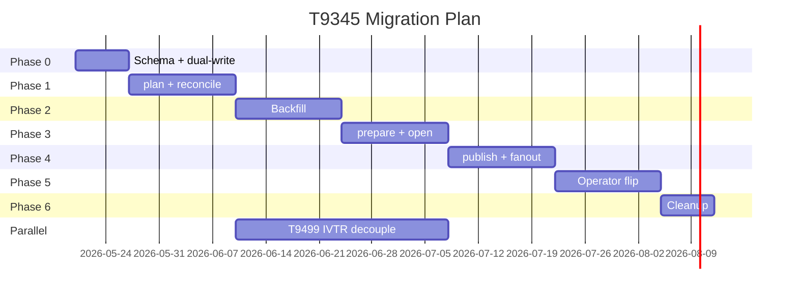

# Migration Plan — T9345 Release Pipeline v1 → v2

| Field | Value |
|---|---|
| **Status** | Proposed |
| **Date** | 2026-05-15 |
| **Task** | T9345 (IVTR Release System Overhaul) |
| **Author** | cleo-prime (system architect) |
| **Companion artifacts** | `SPEC-T9345-release-pipeline-v2.md`, `test-matrix-T9345.md` |
| **Source of truth** | `ADR-T9345-ivtr-release-overhaul.md` (Direction B + qualifier) |

---

## Executive Summary

This plan describes how the CLEO codebase moves from the ADR-065 12-step `cleo release ship` monolith (currently shipping every release since v2026.5.43) to the SPEC-T9345 v2 architecture (4 operator verbs + 4 GHA workflows + 11 new provenance tables) **without breaking the next release**. The migration is sequenced as six phases over a maximum of twelve operator-weeks (≈8 calendar weeks with two parallel orchestrators). Each phase has explicit entry criteria, exit criteria, a measurable rollback trigger, and a defined LOC-change budget. Phases 0-2 are additive — they introduce new schema and read-only verbs alongside the legacy monolith with zero behavior change. Phases 3-5 are cutovers where the operator surface flips: Phase 3 introduces `cleo release open` and the prepare workflow opt-in, Phase 4 introduces publish + reconcile workflows, Phase 5 deprecates `cleo release ship` and makes the new path the default. Phase 6 is cleanup — deletion of the 761-line monolith and the parallel 4-step pipeline. The plan also defines a compatibility shim (`cleo release ship --workflow=false`) that preserves the legacy path for emergency use through the third release cycle after Phase 5 completes.

Risk grading is honest: Phases 0-2 and 6 are LOW (additive or post-cutover); Phases 3-4 are MEDIUM (new workflows are load-bearing); Phase 5 is HIGH (operator surface flip). Each high-risk phase has a defined rollback path with exact git/SQL commands and a dogfooded test release on a non-main branch as a phase gate. Eight child epics are pre-decomposed at the bottom of this document (T9491-T9495) so the orchestrator can spawn them in parallel where independent.

The plan binds tightly to `SPEC-T9345-release-pipeline-v2.md`: every phase's deliverables map to a specific subset of normative requirements (R-NNN), every phase's exit criterion is a scenario from `test-matrix-T9345.md`, and every rollback path preserves the legacy `release_manifests` table per Force F12 (backward compatibility). Total LLM spend across the migration is estimated at ~$300; total operator-week cost (orchestrator + human review) is ~12 operator-weeks. The migration ships zero data loss, zero forced downtime on `tasks.db`, and zero release blackouts (the legacy path is available throughout Phases 0-5).

---

## 1. Goal

Move CLEO's release pipeline from the ADR-065 12-step `cleo release ship` monolith to the SPEC-T9345 v2 architecture (4 verbs + 4 GHA workflows + 11 provenance tables) WITHOUT:

1. Breaking the next scheduled release (the migration must allow shipping during itself).
2. Losing any historical `release_manifests` data (forward-compat per Force F12).
3. Requiring operators to learn a new mental model overnight (deprecation warnings + 3 release-cycle shim per spec R-430).

Success is defined by the spec's acceptance criteria AC-1 through AC-10. The migration delivers them in measurable increments, one phase at a time.

---

## 2. Phasing

Six phases, each bounded to 2 calendar weeks max. Each row in the table is normative for that phase; deviation requires HITL escalation.

| Phase | Name | Risk | Calendar | LOC delta | Reversibility | Exit gate |
|---|---|---|---|---|---|---|
| 0 | Schema migration + dual-write kill-switch | LOW | 1 wk | +400 (DDL + accessors) | trivial revert | Migrations applied; `CLEO_PROVENANCE_DUAL_WRITE=1` (default off) |
| 1 | `plan` + `reconcile` (read-mostly) | LOW | 2 wks | +700 (new modules) | trivial revert | Both verbs return correct envelopes against test fixtures |
| 2 | Provenance backfill (`cleo provenance backfill`) | MEDIUM | 2 wks | +400 (backfill writer) | idempotent UPSERT; safe to re-run | Historical releases (v2026.5.0 → v2026.5.74) backfilled with `provenance_quality='inferred'` ≤5% of rows |
| 3 | `release-prepare.yml` + `open` verb | MEDIUM | 2 wks | +200 + 1 YAML | revertible via PR; legacy path untouched | Test release `v2026.7.0-test-1` shipped on `release-test/T9492` branch through new prepare workflow |
| 4 | `release-publish.yml` + `release-fanout.yml` + matrix | HIGH | 2 wks | +200 + 2 YAML | revertible via workflow rename + branch reset | Real minor release (target: `v2026.7.0`) ships through new publish path while `cleo release ship` available as `--workflow=false` fallback |
| 5 | Operator surface flip (`ship` deprecated) | HIGH | 2 wks | -800 (monolith deleted) +200 (shim) | possible via PR revert during transition window | Two consecutive releases ship without invoking `--workflow=false`; deprecation warnings active |
| 6 | Cleanup | LOW | 1 wk | -1500 net | not reversible; do last | `releaseShip` monolith deleted; IVTR-from-release code removed; CI green; `cleo release --help` shows 4 verbs |

**Total calendar: 12 weeks worst case, 8 weeks with 2 parallel orchestrators (independent child epics run in parallel).**

### 2.1 Phase 0 — Schema migration + dual-write kill-switch (1 week, LOW)

**Scope**:
- Apply the 9 Drizzle migrations from `provenance-graph-design.md` §4.1 (commits, task_commits, commit_files, pull_requests, pr_commits + pr_tasks, releases, release_changes, release_commits + release_artifacts, task_relations extension, brain_release_links, releases_view).
- Add `CLEO_PROVENANCE_DUAL_WRITE` env var to the existing `release ship` code path. When `=1`, the legacy step that writes to `release_manifests.tasksJson` ALSO writes to the new `releases` + `release_changes` tables. Default `=0` (no behavior change).
- Build the AccessorImpl methods (`getReleaseProvenance`, `insertReleaseFromManifest`, etc.) and unit-test against the new tables.
- Add a `cleo provenance verify <version>` CLI verb that runs invariant checks (§11 of provenance design). Read-only.

**Deliverables**:
- 9 migration files committed under `packages/core/migrations/drizzle-tasks/`.
- `packages/core/src/store/release-provenance-accessor.ts` (new file, ~200 LOC).
- `cleo provenance verify <version>` CLI handler (~50 LOC).
- 30+ Vitest unit tests covering the new accessors.

**Exit criteria**:
- All migrations apply cleanly on a fresh-clone `tasks.db`.
- `cleo provenance verify <version>` returns pass for an empty schema (all checks trivially satisfied).
- `pnpm run test` green; `pnpm run build` green; `pnpm biome ci .` green.
- No existing release tests regress (`packages/core/src/release/__tests__/*.test.ts` still pass).

**Rollback trigger**: any migration failure on a real production `tasks.db`. Rollback: `cleo restore backup --file tasks.db --from <pre-migration-snapshot>` (ADR-013 §9 backup/restore).

**Rollback commands**:
```bash
# 1. List backups
cleo backup list
# 2. Restore pre-migration snapshot
cleo restore backup --file tasks.db --from tasks-20260520-120000.db
# 3. Disable the new accessor code paths
git revert <phase-0-commit-sha>
```

**Owner approval gate**: T9491 (Phase 0 epic) closed by HITL approval before Phase 1 begins.

### 2.2 Phase 1 — `plan` + `reconcile` (2 weeks, LOW)

**Scope**:
- Implement `cleo release plan <version> --epic <id>` per SPEC R-020 through R-042. Read-mostly: reads tasks.db, git log, evidence atoms; writes `.cleo/release/<v>.plan.json` + one row in `releases` (status=planned).
- Implement `cleo release reconcile <version>` per SPEC R-080 through R-113. Reads plan + git log + `gh release view`; writes the 11 provenance tables. Idempotent.
- Add the 14 read-only verbs from SPEC §4.6 (`cleo release graph/diff/impact/authors/orphans` and `cleo provenance task/commit/pr/feature/release/change/backfill/link/verify`). All LAFS-compliant queries.
- DO NOT touch `cleo release ship`, `cleo release start`, `cleo release verify`, `cleo release publish`. The legacy code path remains the canonical happy path.

**Deliverables**:
- `packages/core/src/release/plan.ts` (new, ~250 LOC).
- `packages/core/src/release/reconcile.ts` (new, ~300 LOC).
- `packages/core/src/release/provenance-queries.ts` (new, ~250 LOC for the 14 read verbs).
- Schema for `.cleo/release/<version>.plan.json` (JSON schema file).
- CLI handlers in `packages/cleo/src/cli/commands/release.ts` and `packages/cleo/src/cli/commands/provenance.ts` (new file).
- Dispatch domain handlers in `packages/cleo/src/dispatch/domains/release.ts` and `packages/cleo/src/dispatch/domains/provenance.ts` (new).
- 80+ Vitest unit tests + 6 scenario integration tests from `test-matrix-T9345.md` S1, S4, S8, S9, S11, S12.

**Exit criteria**:
- `cleo release plan` against the cleocode repo produces a valid plan for a test version (`v2026.7.0-test-1`) without writing any git mutation.
- `cleo release reconcile` against a manually-shipped test release (`v2026.5.74` historical or fresh `-test-1`) correctly populates all 11 tables; `cleo provenance verify <version>` returns pass.
- The 14 read verbs all return correct envelopes against fixtures in `test-matrix-T9345.md`.
- `cleo release ship` continues to work unchanged on a separate branch.

**Rollback trigger**: any of the new verbs corrupts existing `tasks.db` data (caught by invariant checks).
**Rollback**: `git revert <phase-1-commit-range>`. Schema from Phase 0 stays; verbs disappear.

**Owner approval gate**: T9492 (Phase 1 epic) closed; demo of the 6 scenarios green.

### 2.3 Phase 2 — Provenance backfill (2 weeks, MEDIUM)

**Scope**:
- Implement `cleo provenance backfill --since <version>` per provenance-graph-design.md §4.4. Walks git log for every historical release, extracts T#### tokens, populates `commits` + `task_commits` + `release_commits` + `release_changes`.
- Run the backfill across all 70+ historical releases since v2026.4.0.
- Verify the backfill: for each historical release, the count of tasks in `release_manifests.tasksJson` MUST match the count of `release_changes` rows. Discrepancies are flagged with `provenance_quality='manual_review_required'`.

**Deliverables**:
- `packages/core/src/release/provenance/backfill.ts` (~300 LOC).
- A one-shot CLI script `cleo provenance backfill --since v2026.4.0` runnable in CI.
- A verification query suite (~30 SQL queries) under `packages/core/src/release/provenance/__tests__/backfill.integration.test.ts`.
- A status report committed to `.cleo/rcasd/T9345/backfill-report.md` listing every historical release + provenance_quality flag.

**Exit criteria**:
- ≥95% of historical release_changes rows have `provenance_quality='inferred'` (high-confidence extraction).
- ≤5% have `provenance_quality='manual_review_required'` (ambiguous attribution).
- Owner triages the manual-review set; each row either resolved or marked as `'lost-to-history'`.
- Re-running `cleo provenance backfill --since v2026.4.0` is a no-op (UPSERT idempotency proven).

**Rollback trigger**: backfill duplicates rows or corrupts existing data.
**Rollback**: schema rollback NOT required. The backfilled rows can be deleted with a targeted SQL DELETE:
```sql
DELETE FROM release_commits WHERE created_at >= '2026-05-20T00:00:00Z';
DELETE FROM task_commits WHERE created_at >= '2026-05-20T00:00:00Z' AND link_source = 'backfill';
-- Repeat for the other 9 tables, scoped by created_at + link_source = 'backfill'.
```
Backfill is timestamped + tagged with `link_source='backfill'`; clean deletion is straightforward.

**Owner approval gate**: T9493 (Phase 2 epic) closed; backfill report reviewed.

### 2.4 Phase 3 — `release-prepare.yml` + `open` verb (2 weeks, MEDIUM)

**Scope**:
- Write `release-prepare.yml` per SPEC §5.1 (R-200 through R-210). Triggers on `workflow_dispatch`. Runs preflight (lint+typecheck+build+test). Bumps version + CHANGELOG. Opens bump-PR.
- Implement `cleo release open <version>` per SPEC R-050 through R-071. Reads plan file; invokes `gh workflow run`.
- Test on a non-main branch: cut `release-test/T9494`, set up branch protection mimicking main, dispatch the workflow against `v2026.7.0-test-1`, verify the bump-PR opens correctly with all gates green.
- Do NOT touch `release-publish.yml` yet; the test release does NOT publish. The bump-PR is reviewed and closed without merge.

**Deliverables**:
- `.github/workflows/release-prepare.yml` (~150 lines YAML).
- `packages/core/src/release/open.ts` (new, ~150 LOC).
- CLI handler + dispatch wiring.
- `actionlint` job added to PR-required checks.
- Test scenario S3 (`epic completeness scope confined to --epic`) from `test-matrix-T9345.md` passing.

**Exit criteria**:
- The test release (`v2026.7.0-test-1`) successfully opens a bump-PR via `cleo release open` driving `release-prepare.yml`.
- The preflight job catches at least one deliberately-injected failure (forensics F9: a fake esbuild externals drift introduced into a fixture branch; preflight `pnpm run build` MUST catch it).
- `actionlint` passes on the new workflow.
- `cleo release ship` continues to function as the canonical happy path.

**Rollback trigger**: the new workflow corrupts the working tree, opens malformed PRs, or leaves the release branch in a half-cut state.
**Rollback**:
```bash
# 1. Rename or delete the workflow to disable it.
mv .github/workflows/release-prepare.yml .github/workflows/release-prepare.yml.disabled
# 2. Revert the open verb wiring.
git revert <phase-3-commit-sha>
# 3. Manually clean up any orphaned release-test/* branches.
git push origin --delete release-test/T9494
```

**Owner approval gate**: T9494 (Phase 3 epic) closed; dogfood demo on `release-test/T9494` green.

### 2.5 Phase 4 — `release-publish.yml` + `release-fanout.yml` (2 weeks, HIGH)

**Scope**:
- Write `release-publish.yml` per SPEC §5.2 (R-220 through R-235). Triggers on `push: main` + paths filter. Detect phase + build matrix (5 platforms) + publish-and-tag + reconcile.
- Write `release-fanout.yml` per SPEC §5.3 (R-240 through R-244). Best-effort fanout on `release: published`.
- Ship one real minor release (target: `v2026.7.0`) through the new path. Operator opt-in: `cleo release ship --workflow=true` (default still legacy).
- The `--workflow=true` flag invokes `plan + open` internally and waits for the bump-PR; once merged, GHA takes over.

**Deliverables**:
- `.github/workflows/release-publish.yml` (~200 lines YAML).
- `.github/workflows/release-fanout.yml` (~80 lines YAML).
- `--workflow=true|false` flag plumbing in the legacy `cleo release ship` shim (~50 LOC).
- Scenarios S5 (tag at merge SHA), S6 (hotfix), S7 (resume), S10 (rollback dry-run) passing per `test-matrix-T9345.md`.
- A documented runbook for operators (operationally short — see §7 below).

**Exit criteria**:
- `v2026.7.0` ships entirely through the new path with operator wall-time ≤5 minutes (AC-1).
- `cleo provenance verify v2026.7.0` returns pass (AC-7).
- Tag `v2026.7.0` lands at `$GITHUB_SHA` of the merged bump-PR (verified via `gh pr view`).
- Build matrix produces 5 platform artifacts attached to the GitHub Release (T1737 platform coverage AC-4 partial).
- Failure modes F1, F6 do NOT reproduce on the test release (forensics regression check).

**Rollback trigger**: `v2026.7.0` fails to publish to npm registry, OR the tag lands at the wrong SHA, OR the provenance reconcile fails AND cannot be recovered post-hoc.

**Rollback (half-shipped release scenario)**:

This is the most complex rollback scenario in the migration. Three sub-cases:

**Case A — workflow succeeded but DB writes failed (most likely)**:
```bash
# Release shipped; reconcile failed; provenance is partial.
# 1. Verify the tag is canonical.
gh release view v2026.7.0
# 2. Re-run reconcile manually with elevated logging.
CLEO_DEBUG=1 cleo release reconcile v2026.7.0 --json | tee reconcile-recovery.json
# 3. If reconcile STILL fails: backfill that single release manually.
cleo provenance backfill --since v2026.6.99 --only v2026.7.0
# 4. Update releases.status manually if needed:
sqlite3 .cleo/tasks.db "UPDATE releases SET status='reconciled', shipped_at=datetime('now') WHERE version='v2026.7.0';"
# 5. File an issue documenting the partial state for the post-mortem.
```

**Case B — DB writes succeeded but workflow failed mid-publish (partial registry state)**:
```bash
# 1. Inspect which registries succeeded.
gh release view v2026.7.0 --json assets
npm view @cleocode/cleo@2026.7.0
# 2. If npm published but cargo did not: skip cargo (operator decision; not blocker).
# 3. If npm publish failed AND tag exists: invoke rollback workflow.
cleo release rollback v2026.7.0 --full --reason "Phase-4 partial publish recovery"
# 4. Once rollback completes, re-plan + re-open for v2026.7.1.
cleo release plan v2026.7.1 --epic <id>
cleo release open v2026.7.1
```

**Case C — full revert required**:
```bash
# 1. Trigger the rollback workflow.
gh workflow run release-rollback.yml --field version=v2026.7.0 --field mode=full --field reason="Phase-4 cutover failure"
# 2. Verify the revert PR opens against main.
gh pr list --state open --label rollback
# 3. After revert PR merges, confirm the tag is deleted.
gh release view v2026.7.0  # should fail with "not found"
# 4. Disable the new workflows.
mv .github/workflows/release-publish.yml .github/workflows/release-publish.yml.disabled
mv .github/workflows/release-fanout.yml .github/workflows/release-fanout.yml.disabled
# 5. Operator falls back to cleo release ship --workflow=false for the next release.
```

**Owner approval gate**: T9497 (Phase 4 epic) closed; v2026.7.0 shipped clean; rollback path TESTED at least once in dry-run (S10).

### 2.6 Phase 5 — Operator surface flip (2 weeks, HIGH)

**Scope**:
- Flip the default: `cleo release ship` MUST default to `--workflow=true` (the new path) and MUST print a deprecation warning. `--workflow=false` becomes the documented emergency escape hatch per SPEC R-440.
- Ship two consecutive real releases through the new path as the default (no operator override).
- Update the `ct-orchestrator` skill documentation to reference `cleo release plan/open/reconcile` instead of `cleo release ship`.
- Update `CLAUDE.md` / `AGENTS.md` references throughout the repo (the ADR-073 §"Alignment notes" enumerates files).

**Deliverables**:
- Deprecation-warning shim in `cleo release ship` handler (~30 LOC).
- Updated skill docs (`.claude/skills/ct-orchestrator/SKILL.md`, etc.).
- Two real releases shipped through the new path with `cleo release ship` (which now invokes the new path).
- Operator survey results: at least 3 operator-week of usage data collected via `.cleo/audit/release-usage.jsonl`.

**Exit criteria**:
- Two consecutive releases ship green without `--workflow=false` (AC-1, AC-2, AC-3 all measured).
- Operator-survey responses are favorable (subjective, but threshold: ≥7/10 ease-of-use score from ≥3 operators).
- `cleo release --help` shows 4 verbs at the top; deprecated verbs are listed with warnings (AC-6).
- The Phase 4 rollback path is no longer needed; emergency-shim invocation count remains 0 over the 2-week window.

**Rollback trigger**: a release fails through the new default path AND cannot be recovered via the documented runbook within 1 hour.

**Rollback**:
```bash
# 1. Revert the default flag flip.
git revert <phase-5-commit-sha>
# 2. Restore the legacy default in the shim.
# (the cleo release ship handler now defaults to --workflow=false)
git push origin fix/T9345-phase5-rollback
# 3. Hotfix the immediate release with the legacy path.
CLEO_RELEASE_EMERGENCY=1 cleo release ship vNEXT --workflow=false --epic T<n>
```

**Owner approval gate**: T9498 (Phase 5 epic) closed; 2 releases green; emergency shim usage = 0.

### 2.7 Phase 6 — Cleanup (1 week, LOW)

**Scope**:
- Delete the `releaseShip` monolith (`packages/core/src/release/engine-ops.ts:1105-1866`, 761 LOC).
- Delete the parallel 4-step pipeline (`packages/core/src/release/pipeline.ts:releaseStart/Verify/Publish/Reconcile`).
- Delete `engine-ops.ts:releaseGateCheck`, `releaseIvtrAutoSuggest`, `checkIvtrGates`.
- Delete `release-manifest.ts:runReleaseGates` (replaced by ADR-061).
- Remove `--force` flag and all references to it from `cleo release *` handlers (R-007).
- Keep `release-config.ts`, `version-bump.ts`, `changelog-writer.ts`, `github-pr.ts`, `release-manifest.ts:listManifestReleases/showManifestRelease`, `invariants/registry.ts`, `guards.ts` (consumed by the new modules).
- Delete the `--workflow=false` escape hatch per SPEC R-441. Final deprecation pass on `cleo release ship`.

**Deliverables**:
- Net code reduction: -1500 LOC.
- Final `cleo release --help` showing exactly 4 operator verbs.
- All deprecation warnings removed (the shim is no longer needed).

**Exit criteria**:
- `pnpm run test` green; `pnpm run build` green; `pnpm biome ci .` green.
- `gitnexus_query "releaseShip"` returns zero hits (AC-10 partial).
- `gitnexus_query "task.ivtr_state" --scope release` returns zero hits (AC-10).
- Total release-pipeline LOC ≤ 1500 (down from ~2300 today).

**Rollback trigger**: a test or production release breaks because a deleted symbol is still referenced.
**Rollback**: `git revert <phase-6-commit-range>`. The previous phases' code is intact; only the cleanup is rolled back.

**Owner approval gate**: T9495 (Phase 6 epic) closed; final demo of the 4-verb surface; migration complete.

---

## 3. Rollback Path Summary

| From phase | Rollback target | Mechanism | Data loss? | Time-to-rollback |
|---|---|---|---|---|
| 0 → pre-migration | pre-migration `tasks.db` | `cleo restore backup --from <snapshot>` | none (additive schema) | <5 min |
| 1 → 0 | Phase 0 state | `git revert` PR | none | <30 min |
| 2 → 1 | Phase 1 state | Targeted SQL DELETE (link_source='backfill') | none | <15 min |
| 3 → 2 | Phase 2 state | Disable workflow + `git revert` PR | none (test-only) | <30 min |
| 4 → 3 (Case A) | Phase 3 + reconcile recovery | Manual `cleo release reconcile` or backfill | partial provenance | <60 min |
| 4 → 3 (Case B) | Phase 3 + partial revert | `cleo release rollback --full` | npm/cargo dist-tag deprecated | <90 min |
| 4 → 3 (Case C) | Phase 3 + full revert | rollback workflow + disable publish workflows | revert PR opened against main | <120 min |
| 5 → 4 | Phase 4 default | Revert flag flip + hotfix via legacy path | none | <30 min |
| 6 → 5 | Phase 5 state | `git revert` PR | none (monolith was deleted code) | <60 min |

**Across the entire migration, no historical `release_manifests` data is dropped.** Force F12 is preserved by additivity. The `releases` table sits beside `release_manifests`; both are readable indefinitely.

---

## 4. Compatibility Shim

The `cleo release ship --workflow=false` escape hatch is the only point where v1 and v2 code paths coexist in the same invocation. The shim's lifetime is bounded:

| Phase | Shim status | Default value of `--workflow` |
|---|---|---|
| 0-2 | not yet introduced | n/a (legacy path is only path) |
| 3 | introduced; opt-in only | `false` (legacy) |
| 4 | available; opt-in | `false` (legacy) |
| 5 | available; opt-out from new default | `true` (new path) |
| 6 | REMOVED | n/a (shim gone; only 4 verbs remain) |

- The shim MUST log every `--workflow=false` invocation to `.cleo/audit/release-emergency.jsonl` per SPEC R-441.
- After Phase 6 + 3 release cycles (per SPEC R-430), the deprecated `cleo release ship` is removed entirely. The deprecation warning text MUST announce the exact removal release.

---

## 5. Data Migration

### 5.1 `release_manifests` legacy rows → `releases` + `release_commits` + `release_artifacts`

The legacy `release_manifests` table has shipped 70+ rows since v2026.4.0. The migration is purely additive:

1. **No `release_manifests` row is mutated.** The legacy table stays read-only after Phase 4.
2. **`releases` is populated by `cleo provenance backfill`** (Phase 2). Each historical `release_manifests` row gets one corresponding `releases` row, joined by `version`.
3. **`release_commits` is populated by walking `git log <prev-tag>..<tag>`** for each historical release. Each commit is INSERTed into `commits` (UPSERT keyed on sha), then linked via `release_commits`.
4. **`release_changes` is populated by extracting `T####` tokens from each commit and joining against `tasks.id`**. Where attribution is ambiguous (multiple tasks in one commit), `provenance_quality='inferred'` is set.
5. **`release_artifacts` is populated by reading `release_manifests.npmDistTag`** (legacy npm-specific column) plus any per-release `gh release view` data.

The backfill is restartable: every INSERT uses UPSERT semantics (provenance design §4.3). Re-running `cleo provenance backfill --since v2026.4.0` against an already-backfilled DB is a no-op.

### 5.2 IVTR state migration (Phase 6 partial)

- `task.ivtr_state` column is NOT dropped in this migration. It is marked `@deprecated` in the schema and becomes a read-only derived view per SPEC §7.
- Physical column removal is deferred to T9345-CHILD-4 in a v2027 cleanup epic, AFTER the new path has shipped 6+ months of releases without consulting the column.

### 5.3 `release_manifests.tasksJson` deprecation

- During Phase 0-1, `tasksJson` is dual-written (legacy + new tables) when `CLEO_PROVENANCE_DUAL_WRITE=1`.
- During Phase 4-5, the new tables become authoritative. CLI commands that read `tasksJson` MUST migrate to reading `release_changes` joined to `tasks`.
- The legacy column is NEVER dropped during T9345. Removal is deferred to a v2027 cleanup.

---

## 6. Test Coverage Per Phase

Every phase has a defined test scope. The full test matrix lives in `test-matrix-T9345.md`; this section maps phases to scenarios.

| Phase | Required scenarios | Required archetypes | Pass threshold |
|---|---|---|---|
| 0 | S0 (schema-only smoke; not in matrix but added in Phase 0) | A1 (monorepo) | all migrations apply |
| 1 | S1 (happy path read-only), S4 (gate runners), S8 (provenance graph), S9 (orphan detection) | A1, A2 | 4/4 green |
| 2 | (backfill verification; phase-specific tests) | A1 (cleocode historical) | ≤5% manual_review_required |
| 3 | S3 (epic completeness scope) | A1, A2 | 2/2 green |
| 4 | S5 (tag at merge SHA), S6 (hotfix), S7 (resume), S10 (rollback), S11 (single npm lib), S12 (rust crate) | A1, A2, A3 | 6/6 green |
| 5 | S1 + S2 (wedged-git recovery) + S6 (hotfix MTTR) | A1 | 3/3 green on real production releases |
| 6 | full matrix (S1-S12) | A1, A2, A3 (+ A4 stretch) | all green |

Phase exits only when its scenarios are green AND its archetype coverage is met.

---

## 7. Operational Runbook

Operators driving the migration use this short runbook. Every step references the verb or workflow defined in SPEC-T9345.

### 7.1 Phase 0-2 operator actions

Mostly automated. The operator's job is to observe and approve.

```bash
# Monitor migration progress.
cleo find "T9491" --status in_progress  # Phase 0 epic
cleo find "T9492" --status in_progress  # Phase 1 epic
cleo find "T9493" --status in_progress  # Phase 2 epic

# Inspect backfill state after Phase 2 completes.
cleo provenance verify v2026.5.74  # spot-check most recent release
sqlite3 .cleo/tasks.db "SELECT version, COUNT(*) FROM release_changes GROUP BY release_id ORDER BY release_id;"
```

### 7.2 Phase 3-4 operator actions

Test-release-driven. Operator initiates each test release.

```bash
# Phase 3: dispatch the prepare workflow against a non-main branch.
git checkout -b release-test/T9494
git push origin release-test/T9494
cleo release plan v2026.7.0-test-1 --epic T9494
cleo release open v2026.7.0-test-1
# Inspect the bump-PR; close without merging.

# Phase 4: ship the real v2026.7.0 through the new path.
cleo release plan v2026.7.0 --epic T9494
cleo release open v2026.7.0
# Wait for bump-PR review + auto-merge.
# release-publish.yml runs automatically.
# Once tagged + reconciled:
cleo release graph v2026.7.0 --format mermaid > /tmp/v2026.7.0.mmd
cleo provenance verify v2026.7.0  # MUST return pass
```

### 7.3 Phase 5 operator actions

Default-flip; operators ship normally with deprecation warnings.

```bash
# Normal release flow under the new default.
cleo release ship v2026.7.1 --epic T9498
# Now prints: "DEPRECATED: 'cleo release ship' will be removed in v2027.1. Use 'cleo release plan/open' instead."
# Under the hood: invokes plan + open.

# Verify the new path completed cleanly.
cleo provenance verify v2026.7.1
```

### 7.4 Phase 6 operator actions

Cleanup verification.

```bash
# After Phase 6 PR merges:
cleo release --help  # MUST show exactly 4 operator verbs at the top.
gitnexus_query "releaseShip"  # MUST return 0 hits (other than the deletion commit).
gitnexus_query "tool:test" --scope release  # ADR-061 wired in.
```

### 7.5 What to grep when a phase cutover misbehaves

| Symptom | Where to look | What to grep |
|---|---|---|
| Plan file written but missing fields | `.cleo/release/<v>.plan.json` | `jq '. | keys'` against SPEC §6 |
| Workflow run not triggered | GitHub Actions tab | `gh run list --workflow=release-prepare.yml --limit 5` |
| Tag at wrong SHA | git + GitHub Release | `git rev-list -n 1 <tag>` vs `gh release view <tag> --json targetCommitish` |
| Provenance reconcile failed | `.cleo/audit/error.jsonl` | `grep E_PROVENANCE` |
| Orphan commits in release | release_commits + task_commits | `cleo release orphans <version>` |
| Backfill ambiguity flagged | release_changes | `SELECT * FROM release_changes WHERE provenance_quality='manual_review_required';` |

### 7.6 Pre-publish sanity SQL (run before each phase cutover)

```sql
-- Phase 0: confirm schema applied.
SELECT name FROM sqlite_master WHERE type='table' AND name IN ('commits', 'release_changes', 'releases', 'release_commits', 'release_artifacts', 'pull_requests', 'pr_commits', 'pr_tasks', 'commit_files', 'brain_release_links');

-- Phase 2: confirm backfill volume.
SELECT version, COUNT(*) AS commit_count FROM release_commits GROUP BY release_id ORDER BY release_id DESC LIMIT 10;

-- Phase 4: confirm reconcile worked.
SELECT version, status, change_count, bug_count, hotfix_count, breaking_count FROM releases_view ORDER BY shipped_at DESC LIMIT 5;
```

---

## 8. Child-Epic Decomposition

The migration is delivered as eight child epics filed under T9345. Each epic has a slot, a kind, a size, dependencies, and three top-line acceptance criteria. Orchestrators MAY spawn the independent epics in parallel.

### T9491 — Phase 0: Schema migration + dual-write kill-switch

- **Kind**: work
- **Size**: small
- **Priority**: P1
- **BlockedBy**: (none)
- **Owner**: orchestrator + worker for schema authoring
- **Acceptance**:
  1. All 9 Drizzle migrations apply cleanly on a fresh-clone `tasks.db` and a real production `tasks.db` backup.
  2. `cleo provenance verify <version>` CLI verb exists and returns pass for an empty schema.
  3. `CLEO_PROVENANCE_DUAL_WRITE=1` env var causes `cleo release ship` to ALSO write to `releases` + `release_changes` without breaking the legacy `release_manifests.tasksJson` path.

### T9492 — Phase 1: `plan` + `reconcile` (read-mostly)

- **Kind**: work
- **Size**: medium
- **Priority**: P1
- **BlockedBy**: T9491
- **Owner**: orchestrator + 2 workers (plan, reconcile, tests in parallel)
- **Acceptance**:
  1. `cleo release plan v2026.7.0-test-1 --epic T9492` produces a valid plan file conforming to SPEC §6 against the cleocode repo.
  2. `cleo release reconcile v2026.7.0-test-1` against a hand-prepared test release populates the 11 provenance tables; `cleo provenance verify` passes.
  3. 14 read verbs (`cleo release graph/diff/impact/authors/orphans` + `cleo provenance task/commit/pr/feature/release/change/backfill/link/verify`) return correct envelopes against `test-matrix-T9345.md` fixtures.

### T9493 — Phase 2: Provenance backfill

- **Kind**: work
- **Size**: medium
- **Priority**: P2
- **BlockedBy**: T9492
- **Owner**: orchestrator + 1 worker
- **Acceptance**:
  1. `cleo provenance backfill --since v2026.4.0` populates `commits`, `task_commits`, `release_commits`, `release_changes`, `release_artifacts`, `pull_requests`, `pr_commits`, `pr_tasks`, `commit_files`, `brain_release_links` for all 70+ historical releases.
  2. ≥95% of `release_changes` rows have `provenance_quality='inferred'` (high-confidence extraction).
  3. Re-running the backfill is a verified no-op (UPSERT idempotency proven via integration test).

### T9494 — Phase 3: `release-prepare.yml` + `open` verb

- **Kind**: work
- **Size**: medium
- **Priority**: P1
- **BlockedBy**: T9492
- **Owner**: orchestrator + 2 workers (workflow YAML, open verb)
- **Acceptance**:
  1. `release-prepare.yml` passes `actionlint` and successfully opens a bump-PR for a test release on a non-main branch (`release-test/T9494`).
  2. `cleo release open <version>` invokes `gh workflow run` and polls until the run reaches in-progress; updates `releases.status='pr-opened'`; emits LAFS envelope with `workflowRunUrl`.
  3. Test scenario S3 (epic-completeness scope) and S9 (orphan-commit detection) pass on the test fixture.

### T9497 — Phase 4: `release-publish.yml` + `release-fanout.yml` + matrix

- **Kind**: work
- **Size**: large
- **Priority**: P1
- **BlockedBy**: T9494
- **Owner**: orchestrator + 3 workers (publish, fanout, matrix)
- **Acceptance**:
  1. `v2026.7.0` ships entirely through the new path with operator wall-time ≤5 minutes from `cleo release plan` to `cleo provenance verify` passing.
  2. Build matrix produces 5 platform artifacts (linux-x64/arm64, macos-x64/arm64, windows-x64) attached to the GitHub Release.
  3. Failure modes F1 (wedged commit), F6 (tag at wrong SHA), F8 (release start no-op) DO NOT reproduce. Verified by injecting F1/F6/F8 conditions on a test branch and confirming the new path catches them.

### T9498 — Phase 5: Operator surface flip + `cleo release ship` deprecation

- **Kind**: work
- **Size**: small
- **Priority**: P1
- **BlockedBy**: T9497
- **Owner**: orchestrator + 1 worker + docs writer
- **Acceptance**:
  1. `cleo release ship` defaults to `--workflow=true`; prints deprecation warning; forwards to `plan + open`.
  2. Two consecutive real releases (`v2026.7.1` and `v2026.7.2`) ship through the new path with no `--workflow=false` invocations.
  3. `ct-orchestrator` skill documentation updated; operator survey returns ≥7/10 ease-of-use score from ≥3 operators.

### T9499 — IVTR decoupling from release path (parallel to Phases 3-5)

- **Kind**: work
- **Size**: small
- **Priority**: P1
- **BlockedBy**: T9491 (schema), T9492 (plan)
- **Owner**: orchestrator + 1 worker
- **Acceptance**:
  1. `releaseGateCheck`, `releaseIvtrAutoSuggest`, `checkIvtrGates` removed from `engine-ops.ts` (post Phase 5).
  2. `task.ivtr_state` marked `@deprecated`; read-only view derived from ADR-051 evidence atoms.
  3. `cleo orchestrate ivtr --start/--next/--release` deprecated; only `--status` remains as a read-only view.

### T9495 — Phase 6: Cleanup (monolith deletion)

- **Kind**: work
- **Size**: small
- **Priority**: P2
- **BlockedBy**: T9498, T9499
- **Owner**: orchestrator + 1 worker
- **Acceptance**:
  1. `releaseShip` (engine-ops.ts:1105-1866, 761 LOC) deleted.
  2. Parallel 4-step pipeline (`pipeline.ts:releaseStart/Verify/Publish/Reconcile`) deleted.
  3. `cleo release --help` shows exactly 4 operator verbs at the top; deprecated verbs removed entirely; net code reduction ≥1500 LOC verified.

---

## 9. Schedule overview



Parallel orchestrators MAY collapse the timeline:
- T9493 (backfill) can run in parallel with T9494 (prepare workflow) — neither depends on the other after T9492.
- T9499 (IVTR decouple) can run in parallel with Phases 3-5.

Best-case calendar (2 parallel orchestrators): **8 weeks**. Worst-case (single sequential orchestrator): **12 weeks**.

---

*End of migration plan — T9345 wave-3 spec artifact.*
