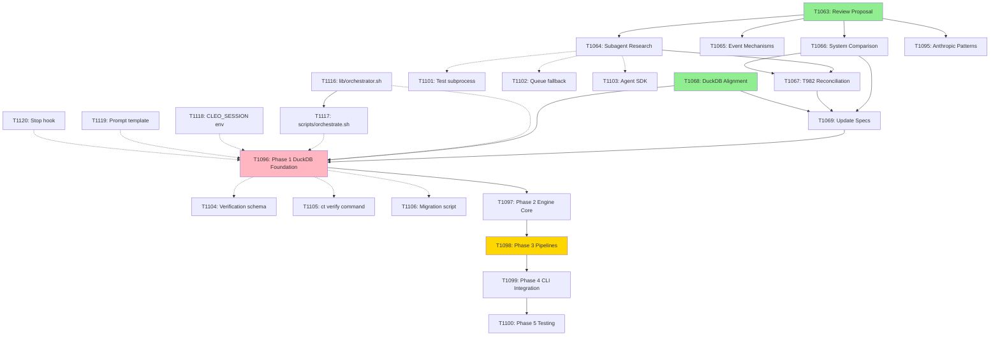

# Task Hierarchy and Dependency Architecture Analysis

**Date**: 2026-01-03
**Context**: T1062 (Orchestration Platform) & T1165 (Roadmap Generation) Epic Analysis
**Purpose**: Architectural analysis of dependency structure, wave computation, and positional ordering strategy for CLEO pipeline implementation

---

## Executive Summary

This analysis examines the current task hierarchy and dependency patterns across two major epics (T1062, T1165) to inform implementation strategy for the CLEO orchestration platform. Key findings:

1. **Current dependency chains are well-structured** - T1062 shows proper phase progression (research → foundation → implementation → polish → testing)
2. **Wave computation works correctly** - 8 ready tasks in Wave 0, clear blocking patterns through Wave 8
3. **Missing: Cross-epic coordination** - No dependencies between T1062 (orchestration) and T1114 (git workflow) despite logical connection
4. **Position system recently added** - T805 complete, enabling explicit work ordering separate from IDs

---

## Part 1: Current Dependency Analysis

### 1.1 T1062 Epic Structure

**Total Tasks**: 20 (1 epic, 13 tasks, 6 subtasks)
**Wave Distribution**:
```
Wave 0: 8 tasks (ready - research, design, subtasks)
Wave 1: 4 tasks (depends on T1063 - review proposal)
Wave 2: 1 task (T1067 - reconcile with T982)
Wave 3: 1 task (T1069 - update specs)
Wave 4: 1 task (T1096 - DuckDB foundation)
Wave 5: 1 task (T1097 - orchestration core)
Wave 6: 1 task (T1098 - pipeline implementations)
Wave 7: 1 task (T1099 - CLI integration)
Wave 8: 1 task (T1100 - testing/production)
```

**Dependency Chains**:
```
CHAIN A: Proposal Validation → Foundation → Implementation
T1063 → T1064, T1066, T1095 → T1067 → T1069 → T1096 → T1097 → T1098 → T1099 → T1100
                            ↘
                              T1065 (event mechanisms)

CHAIN B: DuckDB Design (parallel entry)
T1068 (no deps, Wave 0)

CHAIN C: Subagent Research Subtasks (parallel entry)
T1101, T1102, T1103 (children of T1064, Wave 0)

CHAIN D: Verification System Subtasks (parallel entry)
T1104, T1105, T1106 (children of T1096, Wave 0)
```

**Phase Distribution**:
- `core`: 17 tasks (majority)
- `polish`: 1 task (T1099 - documentation)
- `testing`: 1 task (T1100 - production readiness)

### 1.2 T1165 Epic Structure (Roadmap Generation)

**Total Tasks**: 6 (1 epic, 5 tasks)
**Status**: 2 done, 4 pending
**Wave Structure**: Not analyzed (smaller scope, simpler dependencies)

**Completed**:
- T1166: MVP roadmap command (done)
- T1167: Markdown format (done)

**Remaining**:
- T1168: Schema extension (releases array) - `core`
- T1169: Release commands (create/plan/ship) - `core`
- T1170: Changelog generation - `polish`

**Observation**: Sequential design (no complex dependencies). T1168 → T1169 → T1170 forms single chain.

### 1.3 T1114 Epic Structure (Git Workflow Orchestration)

**Total Tasks**: 16 (1 task parent, 15 children)
**Parent**: T998 (Session System Epic)
**Phase**: `core`

**Wave Analysis** (from notes):
```
Wave 0: T1123 (complete - documentation decision)
Wave 1: T1116, T1118, T1119, T1120 (4 ready tasks)
Wave 2-3: Blocked on Wave 1
```

**Critical for Migration** (per task notes):
```
MUST-HAVE (5 tasks):
- T1116: lib/orchestrator.sh (spawn/monitor)
- T1117: scripts/orchestrate.sh (CLI)
- T1118: CLEO_SESSION env var
- T1119: Base prompt template
- T1120: Stop hook

NICE-TO-HAVE (8 tasks):
- T1121: Documentation
- T1122: Spec updates
- T1124-T1130: Specialized agent prompts (7 tasks)
```

---

## Part 2: Architectural Gaps and Opportunities

### 2.1 Missing Cross-Epic Dependencies

**ISSUE**: T1062 (Orchestration Platform) and T1114 (Git Workflow) are logically connected but have no formal dependencies.

**Analysis**:
```
T1114 (Bash orchestration) → validates patterns
T1062 (Python orchestration) → migrates patterns

Expected dependency:
T1096 (Phase 1: DuckDB Foundation) should depend on T1116-T1120 (Bash MVP)
```

**Rationale**: T1062 notes state "T1114 provides Phase 0 bash implementation of orchestration. CLEO_SESSION env var and tmux patterns will be preserved in Python phase. T1114 validates patterns before migration."

**Recommendation**:
```bash
ct update T1096 --depends T1116,T1117,T1118,T1119,T1120
```

This ensures the bash prototype completes before Python migration begins.

### 2.2 T982 Integration Gap

**ISSUE**: T1067 task exists to "Reconcile with T982: RCSD Python Agent Implementation" but T982 is not in dependency chain.

**Options**:
1. **Absorb T982 into T1062** - Merge RCSD pipeline work into T1098 (Phase 3)
2. **Make T982 prerequisite** - T1098 depends on T982
3. **Defer T982** - Complete basic orchestration first, integrate RCSD later

**Recommendation**: Check T982 status and decide merge vs dependency.

```bash
ct show T982
```

### 2.3 Release Management Integration

**ISSUE**: T1165 (Roadmap) and T1062 (Orchestration) both touch release workflows but have no coordination.

**T1062 includes**: `ReleasePipeline` (50-59 stage codes)
**T1165 includes**: `ct release` commands (create/plan/ship)

**Potential conflict**: Two systems defining release workflow.

**Recommendation**:
- T1169 (release commands) should consider orchestration integration
- Add note to T1098 (Pipeline Implementations) to review T1165 for ReleasePipeline design
- Consider dependency: T1169 depends on T1098 OR vice versa

---

## Part 3: Positional Ordering Strategy

### 3.1 Position System Capabilities (T805 Complete)

**Schema** (v2.6.0):
- `position`: Integer field (min 1)
- `positionVersion`: Checksum for conflict detection
- Scope: Per-parent (sibling ordering)

**Commands Available**:
- `ct reorder T037 --position 1`
- `ct reorder T037 --before T002`
- `ct reorder T037 --after T005`
- `ct swap T037 T002`
- `ct list --sort position`
- `ct tree --ordered`

**Auto-assignment**: New tasks get `position = max + 1` within sibling group

### 3.2 Recommended Position Assignments for T1062

**Epic-Level Positioning** (execution order):

```
Position 1: T1063 (Review proposal) - GATE: Must validate design first
Position 2: T1068 (DuckDB alignment) - PARALLEL with research
Position 3: T1064 (Subagent spawning research) - DEPENDS on T1063
Position 4: T1066 (Compare to existing system) - DEPENDS on T1063
Position 5: T1095 (Document Anthropic patterns) - DEPENDS on T1063
Position 6: T1065 (Event mechanisms) - Research alongside design
Position 7: T1067 (Reconcile T982) - DEPENDS on research
Position 8: T1069 (Update specs) - DEPENDS on validation
Position 9: T1096 (Phase 1: DuckDB Foundation) - GATE: Foundation must complete
Position 10: T1097 (Phase 2: Engine Core) - DEPENDS on foundation
Position 11: T1098 (Phase 3: Pipelines) - DEPENDS on engine
Position 12: T1099 (Phase 4: CLI Integration) - POLISH phase
Position 13: T1100 (Phase 5: Testing) - TESTING phase
```

**Subtask Positioning** (within T1064):
```
Position 1: T1101 (Test subprocess.run)
Position 2: T1102 (Design queue-file fallback)
Position 3: T1103 (Evaluate Agent SDK approach)
```

**Subtask Positioning** (within T1096):
```
Position 1: T1104 (Design verification schema)
Position 2: T1105 (Implement ct verify)
Position 3: T1106 (Create migration script)
```

### 3.3 Phase-Aware Positioning

**Current phase distribution**:
- `core`: 17 tasks (bulk of work)
- `polish`: 1 task
- `testing`: 1 task

**Position strategy within phases**:
```
core phase (positions 1-11):
  Wave 0: positions 1-8 (ready tasks, prioritized by foundational nature)
  Wave 1+: positions 9-11 (sequenced by dependency depth)

polish phase (position 12):
  T1099 alone

testing phase (position 13):
  T1100 alone
```

**Rationale**: Position enforces "within phase, what order matters" while wave computation handles "what's actually ready based on dependencies."

---

## Part 4: Verification Gate Architecture

### 4.1 Current Verification Schema (T1150)

**From T1062 notes**: T1096 depends on T1150 (Progressive Verification). JSON verification must be implemented before DuckDB migration.

**Verification Object** (from proposal):
```json
{
  "verification": {
    "passed": false,
    "round": 2,
    "gates": {
      "implemented": true,
      "testsPassed": null,
      "qaPassed": null,
      "securityPassed": null,
      "documented": null
    },
    "lastAgent": "tester",
    "lastUpdated": "2025-12-30T12:34:56Z",
    "failureLog": [...]
  }
}
```

**Gate Progression** (Implementation Pipeline):
```
Round 1: Implementer → implemented=true
         Validator → issues found → round++
Round 2: Implementer → fixes applied
         Tester → testsPassed=true
Round 3: QA → qaPassed=true
         Security → securityPassed=true
         Documenter → documented=true
         → verification.passed = true
```

### 4.2 Parent Auto-Complete Integration

**Current behavior** (TASK-HIERARCHY-SPEC Part 10.1):
- When all children complete, parent can auto-complete
- Modes: `auto`, `suggest`, `off`

**Enhanced with verification** (proposed):
```
Parent auto-complete criteria:
1. All children have status: "done" (existing)
2. All children have verification.passed: true (NEW)

Configuration:
{
  "hierarchy": {
    "autoCompleteParent": true,
    "autoCompleteMode": "suggest"
  },
  "verification": {
    "requireForParentAutoComplete": true
  }
}
```

**Impact on T1062**:
- T1096 cannot auto-complete until T1104, T1105, T1106 all verified
- T1062 epic cannot complete until all phases verified
- Prevents premature epic closure

---

## Part 5: Dependency Graph Recommendations

### 5.1 Full Lifecycle Implementation Order

**Foundation Layer** (must complete first):
```
T1063 (Review proposal)
  ├─→ T1064 (Subagent research)
  │     ├─→ T1101 (Test subprocess)
  │     ├─→ T1102 (Queue fallback)
  │     └─→ T1103 (Agent SDK)
  ├─→ T1066 (System comparison)
  ├─→ T1095 (Anthropic patterns)
  └─→ T1065 (Event mechanisms)

T1068 (DuckDB alignment) [parallel]
```

**Integration Layer** (after research):
```
T1067 (T982 reconciliation)
  └─→ depends: T1064, T1066

T1069 (Spec updates)
  └─→ depends: T1066, T1067, T1068
```

**Implementation Layer** (sequential phases):
```
T1096 (Phase 1: DuckDB Foundation)
  ├─→ depends: T1068, T1069, T1150
  ├─→ NEW: depends: T1116, T1117, T1118, T1119, T1120 (bash prototype)
  ├─→ children: T1104, T1105, T1106
  └─→ gate: verification.passed required

T1097 (Phase 2: Engine Core)
  └─→ depends: T1096

T1098 (Phase 3: Pipelines)
  └─→ depends: T1097
  └─→ NOTE: Review T1165 (roadmap) for ReleasePipeline design

T1099 (Phase 4: CLI Integration)
  └─→ depends: T1098

T1100 (Phase 5: Testing)
  └─→ depends: T1099
```

### 5.2 Git Workflow Dependencies (T1114)

**Current state**: T1114 children form 3 waves
**Recommendation**: Link to orchestration epic

```bash
# Add cross-epic dependency
ct update T1096 --depends T1116,T1117,T1118,T1119,T1120

# Result: T1096 moves from Wave 4 → Wave 2 (after T1114 Wave 1 completes)
```

**New wave structure** (after adding dependencies):
```
Wave 0: T1063, T1068, T1101, T1102, T1103, T1104, T1105, T1106
Wave 1: T1064, T1065, T1066, T1095, T1116, T1118, T1119, T1120
Wave 2: T1067, T1117
Wave 3: T1069
Wave 4: T1096 (now depends on T1116-T1120)
Wave 5: T1097
Wave 6: T1098
Wave 7: T1099
Wave 8: T1100
```

### 5.3 Release Management Coordination (T1165)

**Current state**: T1168, T1169, T1170 independent
**Recommendation**: Coordinate with T1098

```bash
# Option A: Release commands depend on orchestration
ct update T1169 --depends T1098
ct update T1169 --notes "Review T1098 ReleasePipeline design for coordination"

# Option B: Orchestration reviews release commands
ct update T1098 --notes "Review T1165 release commands before implementing ReleasePipeline"

# Option C: Defer T1165 Phase 2 until orchestration complete
ct update T1168 --status blocked --blocked-by "Waiting for T1098 to define release pipeline architecture"
```

**Recommendation**: Option B (note-based, no hard dependency). Keeps epics independent while ensuring design coherence.

---

## Part 6: Execution Strategy

### 6.1 Parallelization Opportunities

**Wave 0** (8 tasks ready):
```
Parallel Group A (Research):
- T1063 (Review proposal) - READ-ONLY, can parallelize with others
- T1068 (DuckDB alignment) - INDEPENDENT research

Parallel Group B (Subtasks - T1064 children):
- T1101 (Test subprocess)
- T1102 (Design queue)
- T1103 (Agent SDK)

Parallel Group C (Subtasks - T1096 children):
- T1104 (Verification schema)
- T1105 (ct verify command)
- T1106 (Migration script)
```

**Agent assignment strategy**:
```
Agent 1: T1063 (high priority, gates Wave 1)
Agent 2: T1068 (parallel research)
Agent 3: T1101 (quick test, unblocks T1064)
Agent 4: T1104 (design work, unblocks T1096 when ready)
```

### 6.2 Critical Path Analysis

**Longest path** (from Wave 0 → Wave 8):
```
T1063 → T1066 → T1067 → T1069 → T1096 → T1097 → T1098 → T1099 → T1100

Length: 9 waves
Critical: T1063 must complete first (gates 4 Wave 1 tasks)
```

**Optimization**: No way to shorten without breaking logical dependencies. This is the minimum viable path.

### 6.3 Phase Transition Gates

**Setup → Core**: Already in core phase
**Core → Testing**: T1100 is sole testing task
**Testing → Polish**: T1099 is polish task (reversed!)

**ISSUE DETECTED**: T1099 (CLI Integration & Documentation) is `phase: polish` but depends on T1098 which is `phase: core`. This violates typical phase progression (setup → core → testing → polish).

**Recommendation**:
```bash
# Option A: Move T1099 to testing phase
ct update T1099 --phase testing

# Option B: Move T1100 to polish phase (if docs should come before final testing)
ct update T1100 --phase polish
ct update T1099 --phase testing

# Option C: Both are polish (documentation and testing are final steps)
ct update T1100 --phase polish
```

**Analysis**: Per PHASE-SYSTEM-SPEC, typical progression is `setup → core → testing → polish`. T1099 (documentation) is polish. T1100 (testing) should be `testing` phase.

**Recommended fix**:
```bash
ct update T1099 --phase polish  # Keep as-is (documentation IS polish)
ct update T1100 --phase testing # Fix: testing should be in testing phase
```

---

## Part 7: Recommendations Summary

### 7.1 Immediate Actions

1. **Add cross-epic dependency**:
   ```bash
   ct update T1096 --depends T1116,T1117,T1118,T1119,T1120
   ct update T1096 --notes "Added dependency on T1114 bash orchestration MVP (Wave 1 tasks). Validates patterns before Python migration."
   ```

2. **Fix phase assignments**:
   ```bash
   ct update T1100 --phase testing
   ```

3. **Add coordination notes**:
   ```bash
   ct update T1098 --notes "Review T1165 (roadmap epic) release commands before implementing ReleasePipeline. Ensure design coherence."
   ```

4. **Investigate T982 status**:
   ```bash
   ct show T982
   # Then decide: merge into T1098, add as dependency, or defer
   ```

### 7.2 Positional Ordering (Optional Enhancement)

If using position system for explicit work order:

```bash
# Set epic-level positions (work priority)
ct reorder T1063 --position 1
ct reorder T1068 --position 2
ct reorder T1064 --position 3
ct reorder T1066 --position 4
ct reorder T1095 --position 5
ct reorder T1065 --position 6
ct reorder T1067 --position 7
ct reorder T1069 --position 8
ct reorder T1096 --position 9
ct reorder T1097 --position 10
ct reorder T1098 --position 11
ct reorder T1099 --position 12
ct reorder T1100 --position 13
```

**Benefit**: Position shows "within wave, what order to tackle tasks" independent of dependencies.

### 7.3 Verification Gate Strategy

**For T1096 and all implementation tasks**:

1. Implement `ct verify` command (T1105)
2. All completion workflows use verification gates:
   ```bash
   ct complete T1105  # Sets verification.gates.implemented = true
   ct verify T1105 --gate testsPassed  # Manual gate setting
   ct verify T1105 --all  # Set all gates (implies full verification)
   ```

3. Parent auto-complete requires verification:
   ```bash
   ct config set verification.requireForParentAutoComplete true
   ```

### 7.4 Documentation Updates

**After implementing recommendations**:

1. Update T1062 notes with final dependency graph
2. Update CLEO-SYSTEM-ARCHITECTURE-SPEC.md with orchestration layer
3. Update IMPLEMENTATION-ORCHESTRATION-SPEC.md with verification gates
4. Document cross-epic coordination patterns (T1062 ↔ T1114, T1062 ↔ T1165)

---

## Part 8: Wave Computation Validation

### 8.1 Current Wave Logic (Per TASK-HIERARCHY-SPEC Part 6)

**Algorithm**:
```python
wave(task) = max(deps.filter(d => d.status != "done").map(d => wave(d))) + 1
wave(task with no active deps) = 0
```

**Scope filtering**:
- Dependencies INSIDE scope: Affect wave
- Dependencies OUTSIDE scope but done: Treated as satisfied
- Dependencies OUTSIDE scope but NOT done: Task is BLOCKED (not in waves)

### 8.2 Expected Behavior After Adding T1114 Dependencies

**Current** (T1096 in Wave 4):
```
T1096 depends: [T1068, T1069, T1150]
T1068: Wave 0
T1069: Wave 3
T1150: Not in T1062 epic (external dependency - assume done or will block)
→ wave(T1096) = wave(T1069) + 1 = 3 + 1 = 4 ✓
```

**After adding T1114 dependencies**:
```
T1096 depends: [T1068, T1069, T1150, T1116, T1117, T1118, T1119, T1120]
T1116, T1118, T1119, T1120: Wave 1 (in T1114 epic, assume visible if cross-epic analysis)
T1117: Wave 2 (depends on T1116)

IF cross-epic dependencies are in scope:
  → wave(T1096) = max(wave(T1069)=3, wave(T1117)=2) + 1 = 4 (unchanged)

IF cross-epic dependencies are NOT in scope (blocked):
  → T1096 status becomes BLOCKED (not in waves)
```

**Concern**: Wave computation may need to handle cross-epic dependencies explicitly.

**Recommendation**: Test after adding dependency:
```bash
ct update T1096 --depends T1116,T1117,T1118,T1119,T1120
ct analyze --parent T1062  # Check if T1096 shows as blocked or in waves
ct analyze --parent T1114  # Confirm T1114 tasks visible
ct analyze                 # Project-wide view should show all dependencies
```

---

## Appendix A: Full Dependency Graph (Mermaid)



**Legend**:
- Green: Wave 0 (ready)
- Pink: Foundation gates (T1096)
- Yellow: Integration points (T1098 with T1165 review)
- Solid lines: Existing dependencies
- Dotted lines: Proposed new dependencies

---

## Appendix B: Command Reference

```bash
# Analyze current state
ct analyze --parent T1062
ct analyze --parent T1114
ct analyze --parent T1165

# Add proposed dependencies
ct update T1096 --depends T1116,T1117,T1118,T1119,T1120

# Fix phase assignments
ct update T1100 --phase testing

# Add coordination notes
ct update T1098 --notes "Review T1165 release commands before implementing ReleasePipeline"

# Set positions (optional)
ct reorder T1063 --position 1
# ... (see Section 7.2)

# Enable verification requirements
ct config set verification.requireForParentAutoComplete true

# Validate changes
ct validate
ct deps T1096
ct blockers
ct analyze --parent T1062
```

---

**End of Analysis**

This document provides architectural guidance for implementing the CLEO orchestration platform with proper dependency management, phase progression, and verification gates. The recommended dependency graph ensures foundational work (bash prototype) validates patterns before Python migration begins.
