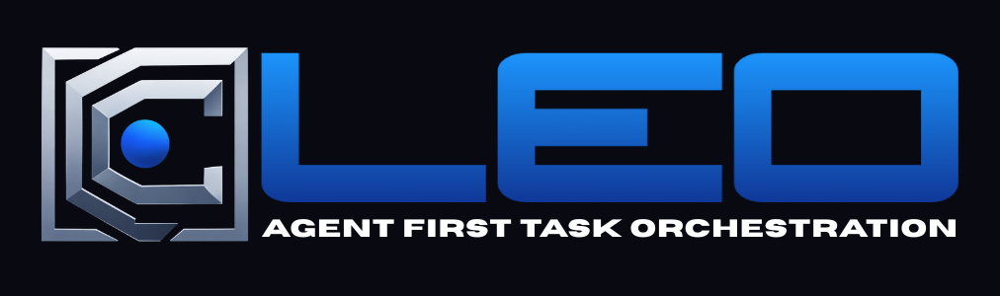

<p align="center">
  
</p>

<h1 align="center">CLEO</h1>
<h3 align="center">Command Line Entity Orchestrator</h3>

<p align="center">
  <strong>The task management system designed for AI coding agents and solo developers</strong>
</p>

<p align="center">
  
  <a href="CHANGELOG.md"></a>
  <a href="docs/specs/LLM-AGENT-FIRST-SPEC.md"></a>
  <a href="tests/"></a>
</p>

<p align="center">
  <a href="#quick-start">Quick start</a> ·
  <a href="#command-reference">Command reference</a> ·
  <a href="#documentation">Documentation</a> ·
  <a href="#contributing">Contributing</a>
</p>

<!-- VERSION_SYNC: This badge version should match VERSION file. Run ./dev/bump-version.sh to update. -->

---

## Table of Contents

<details>
<summary><strong>Open the full outline</strong></summary>

- **Getting started**
  - [One Developer. One Agent. One Source of Truth.](#one-developer-one-agent-one-source-of-truth)
  - [Why This Exists](#why-this-exists)
  - [Core Principles](#core-principles)
  - [Quick Start](#quick-start)
- **Using CLEO**
  - [Command Reference](#command-reference)
  - [Task Hierarchy](#task-hierarchy-v0170)
  - [Session Protocol](#session-protocol)
  - [Output Formats & Exit Codes](#output-formats--exit-codes)
  - [Validation & Integrity](#validation--integrity)
  - [Phase Tracking](#phase-tracking)
  - [Configuration](#configuration)
- **Integrations and extensibility**
  - [For Claude Code Users](#for-claude-code-users)
  - [Skills Architecture](#skills-architecture-v0550)
  - [Orchestrator Protocol](#orchestrator-protocol-v0550)
  - [Extensibility](#extensibility)
- **Reference**
  - [Project Structure](#project-structure)
  - [Troubleshooting](#troubleshooting)
  - [Performance](#performance)
  - [Documentation](#documentation)
- **Community**
  - [The Philosophy](#the-philosophy)
  - [Contributing](#contributing)
  - [Star History](#star-history)
  - [License](#license)
  - [Licensing FAQ](#license-faq)
</details>

---

## One Developer. One Agent. One Source of Truth.

**CLEO** (Command Line Entity Orchestrator) is a task management system designed for AI coding agents and solo developers. It's the **contract between you and your AI coding agent**—not just a task tracker, but a structured protocol designed for the unique challenges of AI-assisted development:

- **Agents hallucinate**. CLEO validates every operation before execution.
- **Agents lose context**. CLEO persists state across sessions with immutable audit trails.
- **Agents need structure**. CLEO outputs JSON by default, with human-readable formatting opt-in.

Built specifically for [Claude Code](https://claude.ai/claude-code), but the principles apply to any LLM-agent workflow.

---

## Why This Exists

Traditional task management assumes human users. But when your primary "user" is an LLM agent:

| What Humans Need | What Agents Need |
|------------------|------------------|
| Natural language | Structured JSON |
| Descriptive errors | Exit codes |
| Flexibility | Constraints |
| Trust | Validation |
| Memory | Persistence |

**CLEO is built for agents first.** The `--human` flag is for you—the developer reviewing what your agent sees.

---

## Core Principles

### LLM-Agent-First Design

Every command follows a consistent pattern:

```bash
# JSON by default (agent-first)
cleo list                              # Returns JSON
cleo list | jq '.tasks[0].id'          # Parse with jq

# Human-readable when you need it (developer-friendly)
cleo list --human                      # Formatted text output

# Exit codes for programmatic branching (17 documented codes)
cleo exists T042 --quiet && echo "Found"
```

### Anti-Hallucination Protection

Four layers of validation prevent AI-generated errors:

| Layer | Purpose | What It Catches |
|-------|---------|-----------------|
| **1. Schema** | JSON Schema enforcement | Missing fields, wrong types, invalid enums |
| **2. Semantic** | Business logic validation | Duplicate IDs, future timestamps, invalid status transitions |
| **3. Cross-File** | Referential integrity | Orphaned references, archive inconsistencies, data loss |
| **4. State Machine** | Transition rules | Invalid status changes, constraint violations |

Before any write operation:
```bash
✓ ID exists (prevent hallucinated references)
✓ ID unique (across todo.json AND archive)
✓ Status valid (pending|active|blocked|done)
✓ Timestamps sane (not future, completedAt > createdAt)
✓ Dependencies acyclic (no circular references)
✓ Parent exists (hierarchy integrity)
```

### Stable Task IDs

```
T001, T002, T042, T999, T1000...
```

IDs are **flat, sequential, and eternal**. No hierarchical IDs like `T001.2.3` that break when you restructure. Hierarchy is stored in the `parentId` field—identity and structure are decoupled.

**Every external reference stays valid forever:**
- Git commits: `"Fixes T042"` → always resolves
- Documentation: `See [T042]` → never orphaned
- Scripts: `grep T042` → always finds it

---

## Quick Start

### TL;DR - Just Install It

**Option 1: One-liner (Easiest)**

```bash
curl -fsSL https://github.com/kryptobaseddev/cleo/releases/latest/download/install.sh | bash

# Reinstalling over existing installation? Use --force:
curl -fsSL https://github.com/kryptobaseddev/cleo/releases/latest/download/install.sh | bash -s -- --force
```

**Option 2: Download and Run**

<p align="center">
  <a href="https://github.com/kryptobaseddev/cleo/releases/latest/download/install.sh">
    
  </a>
</p>

After downloading, open Terminal and run:
```bash
# macOS/Linux: Run with bash (no chmod needed)
bash ~/Downloads/install.sh
```

**Option 3: From source (for contributors)**

```bash
git clone https://github.com/kryptobaseddev/cleo.git && cd cleo && ./installer/install.sh --dev
```

Then initialize in your project:
```bash
cd /path/to/your/project && cleo init
```

<details>
<summary><strong>Prerequisites</strong></summary>

**Required (Core CLI):**

| Dependency | Version | Install |
|------------|---------|---------|
| **Bash** | 4.0+ | Pre-installed (check: `bash --version`). macOS: `brew install bash` |
| **jq** | 1.6+ | `apt install jq` / `brew install jq` / `dnf install jq` |
| **flock** | Any | For atomic file operations. Linux: pre-installed. macOS: `brew install flock` or `brew install util-linux` |
| **curl** or **wget** | Any | Pre-installed on most systems (for remote install) |
| **sha256sum** | Any | For checksum verification. Linux: pre-installed. macOS: comes with coreutils |

**Optional (Advanced Features):**

| Dependency | For | Install |
|------------|-----|---------|
| **Python 3.x** | Skill creator scripts | Pre-installed on most systems |
| **PyYAML** | Skill creator scripts | `pip install pyyaml` |
| **ajv-cli** | JSON Schema validation | `npm install -g ajv-cli` |

> **Note**: The core CLEO CLI is pure Bash. Python is only needed for skill creation/validation scripts.

</details>

<details>
<summary><strong>Detailed Installation Options</strong></summary>

#### Download from Releases (Recommended for Users)

1. Go to [Releases](https://github.com/kryptobaseddev/cleo/releases/latest)
2. Download `cleo-X.Y.Z.tar.gz`
3. Extract and install:
   ```bash
   tar xzf cleo-*.tar.gz
   cd cleo-*
   ./installer/install.sh
   ```

#### One-liner Install (for Developers)

```bash
curl -fsSL https://raw.githubusercontent.com/kryptobaseddev/cleo/main/install.sh | bash
```

#### From Source (for Contributors)

```bash
# Clone repository
git clone https://github.com/kryptobaseddev/cleo.git
cd cleo

# Install for development (creates symlinks to repo)
./installer/install.sh --dev

# Or install as release (copies files)
./installer/install.sh --release
```

#### Verify Installation

```bash
cleo version
cleo --validate
```

#### Initialize in Your Project

```bash
cd /path/to/your/project
cleo init
```

> **Note**: The installer creates symlinks in `~/.local/bin/`, which works immediately with Claude Code and most modern shells.

</details>

<details>
<summary><strong>Upgrade & Self-Update</strong></summary>

#### When to Use Each Method

| Scenario | Command |
|----------|---------|
| **Fresh install** | `curl ... \| bash` |
| **Update to latest** | `cleo self-update` (preferred) |
| **Update to specific version** | `cleo self-update --version X.Y.Z` |
| **Switch dev → release** | `cleo self-update --to-release` |
| **Switch release → dev** | `cleo self-update --to-dev /path/to/repo` |
| **Reinstall / fix broken install** | `curl ... \| bash -s -- --force` |

#### Self-Update (Recommended)

Use `self-update` for routine updates. It preserves user data and is safer than reinstalling.

```bash
# Check for updates
cleo self-update --check

# Update to latest version
cleo self-update

# Update to specific version
cleo self-update --version 0.60.0

# Show current version and update status
cleo self-update --status
```

#### Mode Switching (v0.58.0+)

Switch between development mode (symlinks) and release mode (copied files):

```bash
# Switch from dev mode to release mode
cleo self-update --to-release

# Switch from release mode to dev mode
cleo self-update --to-dev /path/to/cleo-repo
```

See [Installation Modes Guide](docs/guides/INSTALLATION-MODES.md) for details.

#### Reinstall with --force

Only use installer `--force` for fresh reinstalls or troubleshooting broken installations:

```bash
# Force reinstall (overwrites existing installation)
curl -fsSL https://github.com/kryptobaseddev/cleo/releases/latest/download/install.sh | bash -s -- --force
```

#### Manual Upgrade (Legacy)

```bash
# Check for updates (if self-update unavailable)
./installer/install.sh --check-upgrade

# Upgrade to latest
./installer/install.sh --upgrade

# For project schema migrations
cleo migrate status
cleo migrate run
```

</details>

<details>
<summary><strong>Uninstall</strong></summary>

```bash
./installer/install.sh --uninstall
```

</details>

### The `ct` Shortcut

```bash
ct list        # Same as cleo list
ct add "Task"  # Same as cleo add "Task"
ct done T001   # Same as cleo complete T001
ct find "auth" # Fast fuzzy search (99% less tokens than list)
```

**Built-in aliases**: `ls`, `done`, `new`, `edit`, `rm`, `check`, `tags`, `overview`, `dig`

### Tab Completion

Enable shell completion for faster command entry and context-aware suggestions:

**Bash** (add to `~/.bashrc`):
```bash
source ~/.cleo/completions/bash-completion.sh
```

**Zsh** (add to `~/.zshrc`):
```bash
fpath=(~/.cleo/completions $fpath)
autoload -Uz compinit && compinit
```

**Features:**
- Context-aware `--parent` completion (shows only valid parents: epics and tasks, not subtasks)
- All commands, subcommands, and flags
- Task ID completion with status filtering
- Phase, label, and priority value completion

```bash
# Example usage
cleo add --parent <TAB>     # Shows T001, T002 (epic/task only)
cleo list --status <TAB>    # Shows pending, active, blocked, done
cleo focus set <TAB>        # Shows pending/active task IDs
```

---

<details>
<summary><h2>Command Reference</h2></summary>

### 48 Commands Across 5 Categories

| Category | Commands | Purpose |
|----------|----------|---------|
| **Write (14)** | `add`, `update`, `complete`, `focus`, `session`, `phase`, `archive`, `promote`, `reparent`, `populate-hierarchy`, `delete`, `uncancel`, `reopen`, `verify` | Modify task state |
| **Read (17)** | `list`, `show`, `find`, `analyze`, `next`, `dash`, `deps`, `blockers`, `phases`, `labels`, `stats`, `log`, `commands`, `exists`, `export`, `history`, `research` | Query and analyze |
| **Sync (3)** | `sync`, `inject`, `extract` | TodoWrite integration |
| **Orchestration (5)** | `orchestrator`, `context`, `tree`, `import-tasks`, `export-tasks` | Multi-agent coordination |
| **Maintenance (9)** | `init`, `validate`, `backup`, `restore`, `migrate`, `migrate-backups`, `config`, `upgrade`, `self-update` | System administration |

### Essential Commands

```bash
# Task lifecycle
cleo add "Implement authentication" --priority high
cleo list                     # View all tasks (JSON default)
cleo list --status pending    # Filter by status
cleo update T001 --labels "backend,security"
cleo complete T001
cleo archive

# Session workflow
cleo session start
cleo focus set T001           # Only ONE active task allowed
cleo focus note "Working on JWT validation"
cleo session end

# Analysis & planning
cleo dash                     # Project overview
cleo analyze                  # Task triage with leverage scoring
cleo analyze --auto-focus     # Auto-set focus to highest leverage task
cleo next --explain           # What should I work on?
cleo blockers analyze         # Critical path analysis

# Context-efficient search (v0.19.2+)
cleo find "auth"              # Fuzzy search (~1KB vs 355KB for full list)
cleo find --id 42             # Find T42, T420, T421...
cleo find "api" --status pending --field title

# Single task inspection
cleo show T001                # Full task details
cleo show T001 --history      # Include audit trail
cleo exists T001 --quiet      # Exit 0 if exists, 1 if not

# Research & discovery (v0.23.0+)
cleo research "TypeScript patterns"           # Multi-source web research
cleo research --library svelte --topic state  # Official docs via Context7
cleo research --url https://example.com       # Extract from URL

# Verification gates (v0.43.0+)
cleo verify T001 --gate testsPassed           # Set specific gate
cleo verify T001 --all                        # Set all required gates

# Task cancellation (v0.32.0+)
cleo delete T001 --reason "No longer needed"  # Cancel/soft-delete task
cleo uncancel T001                            # Restore cancelled task

# Context monitoring (v0.46.0+)
cleo context                                  # Check context window usage
cleo context check                            # Exit codes for scripting

# Self-update (v0.56.0+)
cleo self-update                              # Update to latest version
cleo self-update --check                      # Check for updates
```

### Command Discovery (v0.21.0+)

```bash
# Native filters - no jq needed
cleo commands                     # List all (JSON by default)
cleo commands --human             # Human-readable
cleo commands --category write    # Filter by category
cleo commands --relevance critical # Filter by agent relevance
cleo commands --workflows         # Agent workflow sequences
cleo commands add                 # Details for specific command
```

### Agent-Friendly Output

**LLM-Agent-First**: JSON is the default output format for all commands. Use `--human` for human-readable text.

```bash
# Default behavior (JSON everywhere)
cleo list                    # JSON output (LLM-Agent-First default)
cleo analyze                 # JSON output
cleo show T001               # JSON output

# Human-readable when you need it
cleo list --human            # Human-readable text
cleo dash --human            # Formatted dashboard

# Pipe to jq for parsing
cleo list | jq '.tasks[0].id'
```

#### JSON Envelope Structure

All commands return a consistent envelope with `$schema`, `_meta`, and `success` fields:

```json
{
  "$schema": "https://cleo-dev.com/schemas/v1/output.schema.json",
  "_meta": {
    "format": "json",
    "command": "list",
    "version": "0.23.0",
    "timestamp": "2025-12-19T10:30:45Z"
  },
  "success": true,
  "tasks": [...]
}
```

#### Error Response Structure

Errors return structured JSON with error codes, exit codes, and recovery suggestions:

```json
{
  "$schema": "https://cleo-dev.com/schemas/v1/error.schema.json",
  "_meta": {
    "format": "json",
    "command": "show",
    "version": "0.23.0",
    "timestamp": "2025-12-19T10:30:45Z"
  },
  "success": false,
  "error": {
    "code": "E_TASK_NOT_FOUND",
    "message": "Task T999 does not exist",
    "exitCode": 4,
    "recoverable": false,
    "suggestion": "Use 'ct exists T999 --quiet' to verify task ID"
  }
}
```

---

</details>

## Task Hierarchy (v0.17.0+)

Three levels, no more:

```
Epic (strategic initiative)
  └── Task (primary work unit)
        └── Subtask (atomic operation)
```

```bash
# Create hierarchy
cleo add "Auth System" --type epic --size large
cleo add "JWT middleware" --parent T001 --size medium
cleo add "Validate tokens" --parent T002 --type subtask

# View tree
cleo list --tree
T001 [epic] Auth System
├── T002 [task] JWT middleware
│   └── T003 [subtask] Validate tokens
└── T004 [task] Session management

# Filter by hierarchy
cleo list --type epic
cleo list --parent T001
cleo list --children T001
```

### Hierarchy Constraints

| Constraint | Default | Configurable |
|------------|---------|--------------|
| Max depth | 3 levels | `hierarchy.maxDepth` |
| Max siblings | 20 per parent | `hierarchy.maxSiblings` |
| Max active siblings | 8 per parent | `hierarchy.maxActiveSiblings` |

### Scope-Based Sizing (No Time Estimates)

| Size | Scope | Action |
|------|-------|--------|
| **Small** | 1-2 files, straightforward | Execute |
| **Medium** | 3-7 files, moderate complexity | Execute |
| **Large** | 8+ files, architectural | **Decompose first** |

Time estimates are prohibited. They're unpredictable for humans and meaningless for agents.

---

## Session Protocol

Agents lose context between invocations. Sessions provide checkpoints:

```bash
# Morning routine
cleo session start
cleo dash              # Where am I?
cleo focus show        # What was I working on?

# Work session
cleo focus set T042
cleo focus note "Implementing validation logic"
cleo update T042 --notes "Tests passing"

# End of day
cleo complete T042
cleo session end
```

**Single active task enforcement**: Only ONE task can be `active` at a time. This prevents context confusion and scope creep.

### Session Notes vs Task Notes

| Command | Purpose | Storage |
|---------|---------|---------|
| `focus note "text"` | Session-level progress | Replaces `.focus.sessionNote` |
| `update T001 --notes "text"` | Task-specific history | Appends to `.tasks[].notes[]` with timestamp |

### Session Maintenance (v0.60.0+)

**Garbage Collection**: Clean up session artifacts and auto-archive inactive sessions.

```bash
cleo session gc                     # Full cleanup
cleo session gc --dry-run           # Preview without changes
cleo session gc --verbose           # Detailed output
cleo session gc --orphans           # Clean orphaned context files only
cleo session gc --stale             # Archive old sessions only
```

**Auto-Archive**: Sessions inactive for 30+ days are automatically archived during garbage collection. Configure via `retention.autoArchiveEndedAfterDays` in config.

---

## Output Formats & Exit Codes

### LLM-Agent-First Output

All commands output **JSON by default**. This is the core LLM-Agent-First principle—agents are the primary consumer.

| Output Mode | How to Get It | Use Case |
|-------------|---------------|----------|
| **JSON** (default) | No flags needed | Agent automation, scripting, parsing |
| **Human-readable** | `--human` or `--format text` | Developer inspection, debugging |

```bash
# JSON is always the default
cleo list                    # JSON
cleo list --human            # Human-readable text
cleo list --format text      # Same as --human
```

### Exit Codes

17 documented exit codes for programmatic handling:

| Range | Purpose | Examples |
|-------|---------|----------|
| `0` | Success | Operation completed |
| `1-9` | General errors | Invalid input (2), File error (3), Not found (4), Validation (6) |
| `10-19` | Hierarchy errors | Parent not found (10), Depth exceeded (11), Sibling limit (12) |
| `20-29` | Concurrency errors | Checksum mismatch (20), Lock timeout (7) |
| `100+` | Special conditions | No data (100), Already exists (101), No change (102) |

```bash
cleo exists T042 --quiet
case $? in
  0) echo "Found" ;;
  1) echo "Not found" ;;
  2) echo "Invalid ID format" ;;
esac
```

---

## Validation & Integrity

### Atomic Write Pattern

Every file modification follows this exact sequence:

```
1. Write to temp file (.todo.json.tmp)
2. Validate temp (schema + anti-hallucination)
3. IF INVALID: Delete temp → Abort → Exit with error
4. IF VALID: Backup original → Atomic rename → Rotate backups
```

**No partial writes. No corruption.** The OS guarantees atomic rename.

### Checksum System

```bash
# SHA256 checksum of .tasks array
cleo validate           # Check integrity
cleo validate --fix     # Repair checksum mismatches
```

Checksums detect corruption but don't block multi-writer scenarios (CLI + TodoWrite).

### Backup System

- **Automatic**: Safety backup before every write
- **Rotation**: 10 versioned backups (`.backups/todo.json.1` through `.10`)
- **Recovery**: `cleo restore` or `cleo backup --list`

---

## Phase Tracking

Organize work into project phases:

```bash
# Define phases
cleo add "Design API" --phase planning --add-phase
cleo add "Implement core" --phase development

# Manage phases
cleo phase set development    # Set current project phase
cleo phase show               # Show current phase details
cleo phases                   # View all phases with progress
cleo phases stats             # Detailed breakdown

# Filter by phase
cleo list --phase core
```

**Phase lifecycle**: `pending` → `active` → `completed` (only ONE can be active)

---

<details>
<summary><h2>Configuration</h2></summary>

### Priority Resolution

Values resolved in order (later overrides earlier):

```
Defaults → Global (~/.cleo/config.json) → Project (.cleo/config.json) → Environment (CLEO_*) → CLI Flags
```

### Key Options

```json
{
  "hierarchy": {
    "maxDepth": 3,
    "maxSiblings": 20,
    "maxActiveSiblings": 8
  },
  "validation": {
    "strictMode": false,
    "checksumEnabled": true,
    "maxActiveTasks": 1
  },
  "archive": {
    "daysUntilArchive": 7,
    "archiveOnSessionEnd": true
  },
  "backup": {
    "enabled": true,
    "maxSafetyBackups": 5
  }
}
```

### Configuration Commands

```bash
cleo config show              # View merged configuration
cleo config get hierarchy.maxDepth
cleo config set archive.daysUntilArchive 14
cleo config set --global validation.strictMode true
```

### Environment Variables

```bash
CLEO_HOME=/custom/path        # Installation directory
CLEO_DEBUG=1                  # Verbose output
CLEO_FORMAT=json              # Force output format
```

</details>

---

## Project Structure

```
~/.cleo/                     # Global installation
├── scripts/                 # Command implementations (56 scripts)
├── lib/                     # Shared libraries (58 files)
├── schemas/                 # JSON Schema definitions
├── skills/                  # Modular agent skills (14 skills)
│   ├── manifest.json        # Skill registry with versions
│   ├── ct-epic-architect/   # Epic creation skill
│   ├── ct-orchestrator/     # Workflow coordination
│   └── ...                  # 12 more skills
├── templates/               # Starter templates
└── docs/                    # Documentation

your-project/.cleo/          # Per-project instance
├── todo.json                # Active tasks (source of truth)
├── todo-archive.json        # Completed tasks (immutable)
├── todo-log.json            # Audit trail (append-only)
├── config.json              # Project configuration
└── .backups/                # Automatic versioned backups
```

---

## For Claude Code Users

CLEO integrates seamlessly with Claude Code:

### CLAUDE.md Integration

```bash
# Initialize project with automatic agent doc injection
cleo init

# Update existing agent docs to latest version
cleo upgrade
```

This injects essential commands and protocols into CLAUDE.md, AGENTS.md, and GEMINI.md between `<!-- CLEO:START -->` and `<!-- CLEO:END -->` markers.

### TodoWrite Sync

Bidirectional sync with Claude Code's ephemeral todo system:

```bash
cleo sync --inject              # Push to TodoWrite (session start)
cleo sync --inject --focused-only  # Only push focused task
cleo sync --extract             # Pull from TodoWrite (session end)
cleo sync --extract --dry-run   # Preview changes
```

### Agent Workflow Pattern

```bash
# Agent verifies before operating (anti-hallucination)
if cleo exists T042 --quiet; then
  cleo update T042 --notes "Progress update"
else
  echo "ERROR: Task T042 not found" >&2
  exit 1
fi

# Agent parses structured output
ACTIVE=$(cleo list | jq -r '.tasks[] | select(.status=="active") | .id')
cleo focus note "Working on $ACTIVE"

# Context-efficient task discovery
cleo find "auth" | jq '.matches[0].id'  # 99% less tokens than list
```

---

<details>
<summary><h2>Skills Architecture (v0.55.0+)</h2></summary>

CLEO uses a **2-tier subagent architecture** for multi-agent coordination:

| Tier | Component | Role |
|------|-----------|------|
| **0** | ct-orchestrator | HITL coordinator, delegates ALL work |
| **1** | cleo-subagent | Universal executor with skill injection |

> **Architecture Reference**: See [CLEO-SUBAGENT.md](docs/architecture/CLEO-SUBAGENT.md) for complete documentation.

CLEO includes 14 modular skills for AI agent workflows:

### Token Injection System (v0.60.0+)

The token injection system provides validated placeholder replacement for skill templates:

| Function | Purpose |
|----------|---------|
| `ti_inject_tokens()` | Replace `{{TOKEN}}` placeholders in templates |
| `ti_validate_required()` | Ensure required tokens (TASK_ID, DATE, TOPIC_SLUG) are set |
| `ti_set_task_context()` | Auto-populate tokens from CLEO task data |
| `validate_token_value()` | Validate against enum/path/array/required types |

Token validation prevents hallucinated or malformed values from reaching skill templates.

### Orchestrator Automation (v0.60.0+)

The `orchestrator_spawn_for_task()` function consolidates subagent spawning into a single call:

```bash
# Programmatic spawning (from lib/orchestrator-spawn.sh)
source lib/orchestrator-spawn.sh
prompt=$(orchestrator_spawn_for_task "T1234")              # Default protocol
prompt=$(orchestrator_spawn_for_task "T1234" "ct-research-agent")  # Specific protocol

# NOTE: All spawns use subagent_type: "cleo-subagent"
# The second argument selects the protocol to inject, not a separate agent type
```

Automates: task validation, context loading, token injection, template rendering, and prompt generation.

### Installed Skills (Protocol Identifiers)

> **Note**: Skills are protocol identifiers, NOT separate agent types. All spawns use a single agent type (`cleo-subagent`) with the selected skill injected as context. The `-agent` suffix in some skill names is legacy naming.

| Skill Protocol | Purpose |
|----------------|---------|
| `ct-epic-architect` | Create epics with task decomposition |
| `ct-orchestrator` | Multi-agent workflow coordination |
| `ct-docs-lookup` | Documentation search via Context7 |
| `ct-docs-write` | Documentation generation |
| `ct-docs-review` | Documentation compliance review |
| `ct-research-agent` | Multi-source research protocol |
| `ct-task-executor` | Generic task execution protocol |
| `ct-spec-writer` | Technical specification writing |
| `ct-test-writer-bats` | BATS test generation |
| `ct-validator` | Compliance validation |
| `ct-skill-creator` | Create new skills |
| `ct-skill-lookup` | Search prompts.chat skills |
| `ct-library-implementer-bash` | Bash library creation |
| `ct-documentor` | Documentation orchestration |

### Skills Installation

Skills are installed as symlinks to `~/.claude/skills/ct-*`:

```bash
# Install with skills (default)
./installer/install.sh

# Skip skills installation
./installer/install.sh --skip-skills

# Check installed skills
ls ~/.claude/skills/ct-*
```

### Skills Manifest

All skills are tracked in `skills/manifest.json`:

```bash
# View registered skills
cat skills/manifest.json | jq '.skills[].name'

# Check skill versions
cleo upgrade  # Detects and updates skill versions
```

</details>

---

<details>
<summary><h2>Orchestrator Protocol (v0.55.0+)</h2></summary>

Coordinate multi-agent workflows with the orchestrator command:

```bash
# Start orchestrator session
cleo orchestrator start --epic T001

# Get next task to spawn
cleo orchestrator next --epic T001

# Check parallel execution safety
cleo orchestrator check T002 T003 T004

# Analyze dependency waves
cleo orchestrator analyze T001

# Validate protocol compliance
cleo orchestrator validate --epic T001
```

See [Orchestrator Protocol Guide](docs/guides/ORCHESTRATOR-PROTOCOL.md) for details.

</details>

---

<details>
<summary><h2>Extensibility</h2></summary>

CLEO supports extension points for custom workflows:

```bash
.cleo/validators/           # Custom validation scripts
.cleo/hooks/                # Event hooks (on-complete, on-archive, etc.)
~/.cleo/formatters/    # Custom output formatters
~/.cleo/integrations/  # External system integrations
```

### Event Hooks Example

```bash
# .cleo/hooks/on-task-complete.sh
#!/usr/bin/env bash
task_id="$1"
# Send notification, update external tracker, etc.
```

See [docs/PLUGINS.md](docs/PLUGINS.md) for extension development.

</details>

---

<details>
<summary><h2>Troubleshooting</h2></summary>

### Common Issues

| Problem | Solution |
|---------|----------|
| `command not found` | Check `~/.local/bin` in PATH, run `source ~/.bashrc` |
| `Permission denied` | `chmod 755 ~/.cleo/scripts/*.sh` |
| `Invalid JSON` | `cleo validate --fix` or `cleo restore` |
| `Duplicate ID` | `cleo restore .cleo/.backups/todo.json.1` |
| `Checksum mismatch` | `cleo validate --fix` |
| `Multiple active tasks` | `cleo focus set <correct-id>` (resets others) |
| `Schema outdated` | `cleo migrate run` |

### Debug Mode

```bash
CLEO_DEBUG=1 cleo list  # Verbose output
cleo --validate                # Check CLI integrity
cleo --list-commands           # Show all available commands
```

</details>

---

<details>
<summary><h2>Performance</h2></summary>

Target metrics (optimized for 1000+ tasks):

| Operation | Target |
|-----------|--------|
| Task creation | < 100ms |
| Task completion | < 100ms |
| List tasks | < 50ms |
| Archive (100 tasks) | < 500ms |
| Validation (100 tasks) | < 200ms |

</details>

---

## Documentation

| Category | Documents |
|----------|-----------|
| **Start Here** | [Quick Start](docs/getting-started/quick-start.md) · [Design Philosophy](docs/guides/design-philosophy.md) |
| **Installation** | [Installer Architecture](docs/guides/installer-architecture.md) · [Migration Guide](docs/guides/installer-migration.md) |
| **Reference** | [Command Index](docs/commands/COMMANDS-INDEX.json) · [Quick Reference](docs/QUICK-REFERENCE.md) · [Task Management](docs/TODO_Task_Management.md) |
| **Architecture** | [System Architecture](docs/architecture/ARCHITECTURE.md) · [Data Flows](docs/architecture/DATA-FLOWS.md) · [2-Tier Subagent](docs/architecture/CLEO-SUBAGENT.md) |
| **Specifications** | [LLM-Agent-First Spec](docs/specs/LLM-AGENT-FIRST-SPEC.md) · [Task ID System](docs/specs/LLM-TASK-ID-SYSTEM-DESIGN-SPEC.md) · [Hierarchy Spec](docs/specs/TASK-HIERARCHY-SPEC.md) |
| **Integration** | [Claude Code Guide](docs/integration/CLAUDE-CODE.md) · [CI/CD Integration](docs/ci-cd-integration.md) · [Orchestrator Protocol](docs/guides/ORCHESTRATOR-PROTOCOL.md) |

**Complete documentation**: [docs/INDEX.md](docs/INDEX.md)

---

## The Philosophy

CLEO is built on three pillars:

### 1. Agent-First, Human-Accessible
JSON output by default. Exit codes for branching. Structured errors. The `--human` flag is opt-in for developer visibility.

### 2. Validate Everything
LLMs hallucinate. Every operation validates before execution. Schema enforcement, semantic checks, state machine rules. If it fails validation, it doesn't happen.

### 3. Persist Everything
Agents lose context. Immutable audit trails, automatic backups, session checkpoints. Pick up exactly where you left off.

**One developer. One agent. One source of truth.**

---

## Contributing

Contributions welcome! See [CONTRIBUTING.md](CONTRIBUTING.md).

```bash
# Run tests
./tests/run-all-tests.sh

# Run specific test suite
./tests/test-validation.sh

# Validate installation
cleo --validate
```

---

## Star History

[](https://star-history.com/#kryptobaseddev/cleo&Date)

---

## License

CLEO is licensed under the Business Source License 1.1.
- Free for personal and non-production use
- Commercial and production use requires a paid license
- Automatically converts to Apache 2.0 on January 26, 2029

See [LICENSE](LICENSE) for details.

---

## Licensing FAQ

See [LICENSING_FAQ.md](LICENSING_FAQ.md) for details.

---

<p align="center">
  <strong>Ready to build with your AI agent?</strong><br>
  <code>./installer/install.sh && cleo init</code>
</p>

<p align="center">
  <a href="docs/INDEX.md">Documentation</a> ·
  <a href="docs/guides/design-philosophy.md">Design Philosophy</a> ·
  <a href="docs/specs/LLM-AGENT-FIRST-SPEC.md">LLM-Agent-First Spec</a> ·
  <a href="CONTRIBUTING.md">Contributing</a>
</p>
