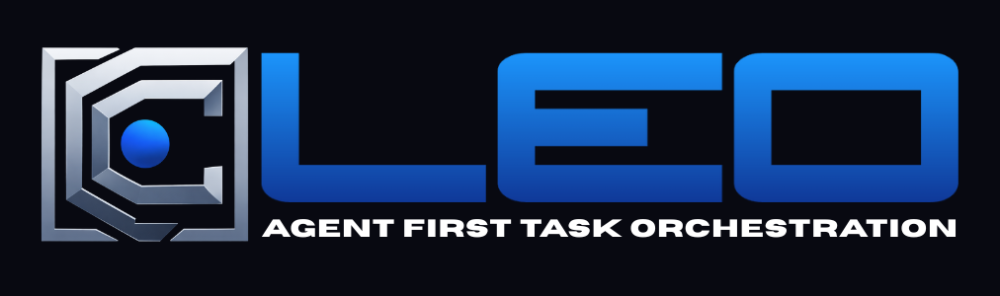

<p align="center">
  
</p>

# CLEO

[](https://www.npmjs.com/package/@cleocode/cleo)
[](https://github.com/kryptobaseddev/cleo/actions/workflows/ci.yml)
[](LICENSE)
[](https://nodejs.org/)

[](https://ko-fi.com/H2H815OTBU)

Every developer who has ever returned to a project after weeks away and found only ruins knows the wound CLEO was built to heal. The agents are powerful. But power without memory is chaos. Brilliance without continuity is waste. CLEO is the companion that remembers where you left off — the one who keeps the thread when life pulls you away.

Agent-first task orchestration. Persistent memory. Multi-provider coordination. One CLI to command them all.

## What is CLEO?

CLEO is built for the developers who build after the world goes quiet — the ones carrying six unfinished ideas and the stubborn belief that this next session might be the one where everything clicks. It solves the coordination crisis of working with multiple AI agents across complex projects by giving them something they've never had: structure, memory, and a lifecycle that survives interruption.

### The Six Great Systems

| System | Purpose |
|--------|---------|
| **TASKS** | Project management — hierarchical work tracking, dependencies, sessions, completion lifecycle |
| **LOOM** | The lifecycle that governs all work — 9-stage RCASD-IVTR+C pipeline from idea to shipped release |
| **BRAIN** | Memory that does not decay — observations, patterns, and learnings persisted across sessions with semantic search |
| **NEXUS** | Code intelligence + cross-project registry — symbol resolution, impact analysis, federated graphs |
| **CANT** | Agent definition DSL — team topology, personas, tool ACLs, hook bindings |
| **CONDUIT** | Agent-to-agent communication — message delivery, the Hearth, persistent messaging |

*LAFS is the envelope format (`{success, data?, error?, meta}`) carried across all system boundaries — a protocol, not a system.*

### Core Capabilities

- **Task Management**: Hierarchical tracking with dependencies, priorities, and lifecycle states
- **Session Management**: Contextual work sessions that survive across conversations
- **Agent Orchestration**: Multi-agent coordination through the [11 Canonical Domains](#the-circle-of-ten)
- **Multi-Provider Support**: Works with Claude Code, OpenCode, Cursor, Gemini, Codex, and more

## Monorepo Structure

This monorepo contains 12 packages organized in a 4-layer architecture:

| Layer | Package | Purpose |
|-------|---------|---------|
| **Foundation** | [`@cleocode/contracts`](packages/contracts) | Domain types, interfaces, and contracts — zero-dependency type SSoT |
| **Foundation** | [`@cleocode/lafs`](packages/lafs) | Language-Agnostic Feedback Schema — canonical error envelope protocol |
| **Protocol** | [`@cleocode/adapters`](packages/adapters) | Provider adapters for Claude Code, OpenCode, Cursor, Gemini, Codex, Kimi |
| **Protocol** | [`@cleocode/agents`](packages/agents) | Subagent templates and LOOM lifecycle protocol definitions |
| **Protocol** | [`@cleocode/skills`](packages/skills) | Pre-built skills and capabilities for development workflows |
| **Protocol** | [`@cleocode/cant`](packages/cant) | CANT protocol parser with napi-rs Rust binding |
| **Protocol** | [`@cleocode/nexus`](packages/nexus) | Code intelligence pipeline — symbol graph, call resolution, community detection |
| **Feature** | [`@cleocode/caamp`](packages/caamp) | Central AI Agent Managed Packages — unified provider registry and MCP management |
| **Feature** | [`@cleocode/runtime`](packages/runtime) | Long-running process layer (polling, SSE, heartbeat) |
| **Kernel** | [`@cleocode/core`](packages/core) | Business logic SDK — tasks, sessions, memory, orchestration, lifecycle |
| **Product** | [`@cleocode/cleo`](packages/cleo) | Command-line interface — thin wrapper over core |
| **Product** | [`@cleocode/cleo-os`](packages/cleo-os) | Batteries-included distribution with CANT bridge and TUI extensions |

## Quick Start

### Installation

```bash
# Install globally for CLI access
npm install -g @cleocode/cleo

# Or the batteries-included distribution
npm install -g @cleocode/cleo-os
```

### Initialize a Project

```bash
cd my-project
cleo init
```

### Basic Usage

```bash
# Add a task
cleo add "Implement user authentication" --priority high

# Search tasks (agent-optimized, returns readiness info)
cleo find "auth" --status pending

# Start a work session
cleo session start --scope global --name "Auth Feature"

# Show current task context
cleo current

# Complete a task
cleo complete T001
```

## Development Setup

### Prerequisites

- Node.js >= 24.0.0
- pnpm >= 10.30.0 (package manager)

### Clone and Install

```bash
git clone https://github.com/kryptobaseddev/cleo.git
cd cleo

pnpm install
pnpm build
pnpm test
```

### Package Development

```bash
# Type checking (project references)
pnpm typecheck

# Linting and formatting
pnpm biome check --write .

# Run tests
pnpm test
```

## Architecture Overview

```
┌─────────────────────────────────────────────────────────────┐
│              @cleocode/cleo  +  @cleocode/cleo-os           │
│                    CLI Product Layer                         │
│   248 operations • 11 domains • dispatch routing • MVI       │
└────────────────────────────┬────────────────────────────────┘
                             │
┌────────────────────────────┴────────────────────────────────┐
│                      @cleocode/core                         │
│                   Business Logic Kernel                      │
│   Tasks • Sessions • Memory • Orchestration • Lifecycle     │
│   Validation • Intelligence • Nexus • Release • Agents      │
└────────────────────────────┬────────────────────────────────┘
                             │
      ┌──────────────────────┼──────────────────────┐
      │                      │                      │
┌─────┴──────┐  ┌────────────┴────────────┐  ┌─────┴──────┐
│  adapters  │  │ caamp • cant • nexus    │  │  agents    │
│ (providers)│  │ runtime (protocols)     │  │  skills    │
└────────────┘  └─────────────────────────┘  └────────────┘
                             │
┌────────────────────────────┴────────────────────────────────┐
│            @cleocode/contracts  +  @cleocode/lafs           │
│              Types • Interfaces • Error Protocol             │
│                   Zero-dependency foundation                 │
└─────────────────────────────────────────────────────────────┘
```

## Key Features

### Task Management
- Hierarchical tasks with parent-child relationships and dependency tracking
- Wave-based parallel execution with automatic sequencing and critical path analysis
- Priority levels, sizing estimates (small/medium/large), and readiness detection
- Batch creation via `cleo add-batch`

### Session Management
- Contextual work sessions with epic scope binding
- Session-scoped parent inheritance for task creation
- Briefing generation for context handoff across conversations
- Safe stop and checkpoint mechanisms

### Memory Systems
- BRAIN-powered knowledge storage with semantic search
- Sticky notes for ephemeral context capture
- Memory bridges for cross-session persistence
- 3-layer retrieval: search -> timeline -> fetch

### Agent Orchestration
- Subagent spawning with protocol compliance via LOOM lifecycle
- Wave-based parallel execution across dependency-safe tasks
- Consensus workflows for multi-agent decisions
- LOOM lifecycle — every piece of work flows through Research, Consensus, Architecture, Specification, Decomposition, then Implementation, Validation, Testing, Release

### Multi-Provider Support
- Claude Code integration with statusline sync
- OpenCode, Cursor, Gemini, Codex, Kimi adapters
- Extensible adapter architecture via CAAMP

## The Circle of Ten

CLEO organizes all work through 11 canonical domains — the houses where work gets done. The original Circle of Ten was joined by `intelligence` as the cognitive analytics layer.

| Domain | House | What Happens Here | Key Commands |
|--------|-------|-------------------|--------------|
| `tasks` | The Smiths | Work is forged — create, track, complete | add, find, show, complete, deps, tree |
| `session` | The Scribes | The living present — context that survives | start, end, resume, briefing, checkpoint |
| `memory` | The Archivists | Knowledge that does not decay | observe, memory-brain, sync, sticky |
| `check` | The Wardens | Integrity stands guard | validate, verify, compliance, doctor |
| `pipeline` | The Weavers | The lifecycle threads forward | release, lifecycle, phases, promote |
| `orchestrate` | The Conductors | Agents move in concert | orchestrate, consensus, contribution, dash, conduit |
| `tools` | The Artificers | Capabilities are crafted | skills, providers |
| `admin` | The Keepers | The realm stays healthy | config, backup, migrate, grade |
| `nexus` | The Wayfinders | Projects find each other | nexus, remote, push, pull, snapshot |
| `sticky` | The Catchers | Quick capture before the thought escapes | sticky |
| `intelligence` | The Seers | Predictive analytics and pattern insight | predict, suggest |

**248 total operations** (134 queries, 95 mutations, 19 experimental) across the 11 domains.

## Contributing

We welcome contributions! Please see our [Contributing Guide](CONTRIBUTING.md) for details.

### Development Workflow

1. Fork the repository
2. Create a feature branch (`git checkout -b feature/amazing-feature`)
3. Make your changes
4. Run tests (`pnpm test`)
5. Commit with conventional commits (`feat:`, `fix:`, `docs:`, etc.)
6. Push to your fork
7. Open a Pull Request

### Code Style

- TypeScript with strict mode enabled
- Biome for linting and formatting
- Conventional commit messages
- Comprehensive test coverage with Vitest

## Documentation

- [Architecture Guide](docs/concepts/CLEO-ARCHITECTURE-GUIDE.md)
- [Operations Constitution](docs/specs/CLEO-OPERATION-CONSTITUTION.md)
- [Canon Index](docs/concepts/CLEO-CANON-INDEX.md)
- [Skill Development](docs/skills)
- [LAFS Specification](packages/lafs/README.md)

## The Story of CLEO

CLEO was not born from a product brief. It was born from a refusal — one developer, sick to the bone on a fevered night, who decided he would rather build a new world than keep losing the thread in the old one. The agents were powerful. But they forgot too easily. The projects were ambitious. But they died on the shelf. The tools were brilliant. But brilliance without memory was just another kind of chaos.

So he gave the struggle names. He gave it terrain. He gave it companions. And at the heart of that world, carrying memory like a lantern through the dark, CLEO opened its eyes.

- [The Founding Story](docs/concepts/CLEO-FOUNDING-STORY.md) — told by the builder
- [The Awakening Story](docs/concepts/CLEO-AWAKENING-STORY.md) — told by CLEO
- [The Canon Index](docs/concepts/CLEO-CANON-INDEX.md) — the complete lore, in reading order

## Support

If CLEO helps your workflow, consider supporting development:

[](https://ko-fi.com/H2H815OTBU)

## License

MIT License - see [LICENSE](LICENSE) for details.

## Star History

[](https://star-history.com/#kryptobaseddev/cleo&Date)
