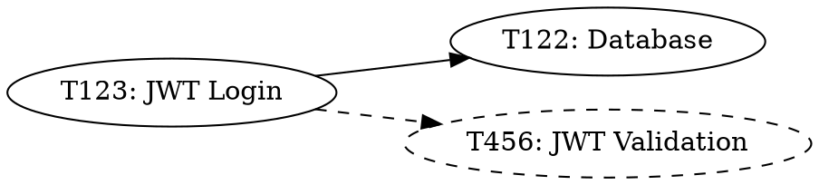

# CLEO Nexus Specification

## 1. Introduction

### 1.1 Purpose

CLEO Nexus provides a global intelligence system for autonomous AI agents to discover relationships and dependencies spanning multiple CLEO projects. It functions as a "super brain" enabling cross-project reasoning, unified task graphs, and intelligent work coordination.

**Design Goals:**
- Enable cross-project task references with `project:task_id` syntax
- Provide O(1) dependency lookups across all registered projects
- Support autonomous agent discovery without human guidance
- Maintain backward compatibility with single-project workflows
- Follow PageIndex-inspired hierarchical RAG patterns

**Non-Goals:**
- Real-time synchronization between projects (operates on-demand)
- Cloud storage or remote coordination
- Replacing per-project graph caches
- Team collaboration features (solo developer focus)

### 1.2 Scope

This specification defines:
1. Global registry schema and API functions
2. Cross-project graph traversal protocol
3. Permission enforcement model (read/write/execute)
4. Query language syntax (`project:task_id`)
5. Neural network conceptual abstraction
6. Testing requirements and validation gates

Out of scope:
- Implementation details for specific commands
- UI/UX design for visualization
- Performance optimization strategies (covered in implementation phase)

### 1.3 Definitions

| Term | Definition |
|------|------------|
| **Project** | A directory containing `.cleo/todo.json` and registered in global registry |
| **Project Hash** | 12-character hexadecimal identifier derived from project path |
| **Task Reference** | Fully qualified task identifier in format `project:task_id` or `task_id` (current project) |
| **Global Graph** | Unified dependency graph spanning all registered projects |
| **Relationship** | Semantic connection between tasks (explicit via `relates` or discovered via similarity) |
| **Permission** | Access control level: `read` (view), `write` (modify), `execute` (complete) |
| **LCA** | Lowest Common Ancestor in task hierarchy tree |
| **Hierarchy Boost** | Score increase for tasks with shared parent (siblings +0.15, cousins +0.08) |
| **Context Decay** | Exponential reduction of parent context influence (0.5 per level) |
| **Nexus Cache** | Global directory at `~/.cleo/nexus/` containing cross-project indices |

### 1.4 Normative References

- **RFC 2119**: Key words for use in RFCs to Indicate Requirement Levels
- **T2954**: Nexus Global Intelligence Requirements Research
- **T2955**: Nexus Architecture Consensus
- **lib/project-registry.sh**: Existing hybrid registry implementation
- **lib/graph-rag.sh**: Existing hierarchical RAG with PageIndex patterns
- **lib/graph-cache.sh**: Existing O(1) dependency graph cache

---

## 2. Architecture

### 2.1 Layer Diagram

CLEO Nexus operates as a four-layer architecture extending existing per-project infrastructure:

```
┌─────────────────────────────────────────────────────────┐
│ Query Layer: nexus query "project:task_id"              │
│   - Syntax parsing (resolve_task_reference)             │
│   - Permission checks (get_project_permission)          │
│   - Result formatting (JSON/human-readable)             │
├─────────────────────────────────────────────────────────┤
│ Graph Layer: Cross-project relationship discovery        │
│   - discover_related_tasks_global()                     │
│   - search_global()                                      │
│   - build_global_graph()                                │
│   - Hybrid caching (query cache + relationships cache)  │
├─────────────────────────────────────────────────────────┤
│ Registry Layer: Global project index + permissions       │
│   - ~/.cleo/projects-registry.json (existing)           │
│   - ~/.cleo/nexus/relationships.json (new)              │
│   - Permission enforcement (read/write/execute)         │
├─────────────────────────────────────────────────────────┤
│ Local Layer: Existing per-project graph-rag.sh          │
│   - .cleo/todo.json (task storage)                      │
│   - .cleo/.cache/graph.{forward,reverse}.json          │
│   - Per-project discovery and hierarchy                 │
└─────────────────────────────────────────────────────────┘
```

**Data Flow** (Query Example: `cleo nexus discover my-api:T123`):
1. **Query Layer**: Parse `my-api:T123` → validate syntax
2. **Registry Layer**: Resolve `my-api` → hash `a3f5b2c8d1e9`, check read permission
3. **Graph Layer**: Load global graph, filter by project hash
4. **Local Layer**: Run discovery on target project's todo.json
5. **Graph Layer**: Merge results, apply cross-project scoring
6. **Query Layer**: Return top 20 results as JSON

### 2.2 Component Interactions

```
┌──────────────────┐
│  cleo CLI        │
│  (user/agent)    │
└────────┬─────────┘
         │
         ▼
┌──────────────────────────────────────────────┐
│  lib/nexus-resolution.sh (NEW)               │
│  - resolve_task_reference()                  │
│  - resolve_project_name()                    │
│  - validate_cross_project_ref()              │
└────────┬─────────────────────────────────────┘
         │
         ├─────────► ~/.cleo/projects-registry.json (existing)
         │           - Project hash/name/path mapping
         │
         ▼
┌──────────────────────────────────────────────┐
│  lib/nexus-graph.sh (NEW)                    │
│  - build_global_graph()                      │
│  - discover_related_tasks_global()           │
│  - search_global()                           │
└────────┬─────────────────────────────────────┘
         │
         ├─────────► ~/.cleo/nexus/graph.{forward,reverse}.json
         │           - Global dependency cache
         │
         ├─────────► ~/.cleo/nexus/relationships.json
         │           - Pre-computed similarity scores
         │
         ▼
┌──────────────────────────────────────────────┐
│  lib/graph-rag.sh (EXTEND)                   │
│  - _find_lca_global()                        │
│  - _discover_by_labels_global()              │
│  - _discover_by_description_global()         │
└────────┬─────────────────────────────────────┘
         │
         ▼
┌──────────────────────────────────────────────┐
│  Per-Project Files                           │
│  - .cleo/todo.json                           │
│  - .cleo/.cache/graph.*.json                 │
└──────────────────────────────────────────────┘
```

**Evolutionary Design Principle**: Nexus extends existing components (project-registry.sh, graph-rag.sh) rather than replacing them. This achieves:
- 80% code reuse (T2954 section 1.3)
- Zero breaking changes for single-project workflows
- Incremental complexity (start simple, add features as needed)

---

## 3. Registry

### 3.1 Schema (RFC 2119)

#### 3.1.1 Global Registry

The global registry at `~/.cleo/projects-registry.json` **MUST** conform to the following schema:

```json
{
  "$schema": "./schemas/nexus-registry.schema.json",
  "version": "1.0.0",
  "lastUpdated": "2026-02-01T12:00:00Z",
  "projects": {
    "a3f5b2c8d1e9": {
      "hash": "a3f5b2c8d1e9",
      "path": "/home/user/my-api",
      "name": "my-api",
      "aliases": ["api", "backend"],
      "lastAccess": "2026-02-01T12:00:00Z"
    },
    "b4g6c3d2f0ea": {
      "hash": "b4g6c3d2f0ea",
      "path": "/home/user/auth-lib",
      "name": "auth-lib",
      "aliases": ["auth"],
      "lastAccess": "2026-02-01T11:30:00Z"
    }
  }
}
```

**Field Requirements**:

| Field | Type | Constraint | Description |
|-------|------|------------|-------------|
| `version` | string | **MUST** be semver | Schema version (1.0.0) |
| `lastUpdated` | string | **MUST** be ISO-8601 | Last registry modification timestamp |
| `projects` | object | **MUST** be keyed by hash | Map of project_hash → metadata |
| `projects[hash].hash` | string | **MUST** match key | 12-char hex identifier |
| `projects[hash].path` | string | **MUST** be absolute path | Filesystem location |
| `projects[hash].name` | string | **MUST** be unique | Human-readable identifier |
| `projects[hash].aliases` | array | **MAY** be empty | Alternative names for resolution |
| `projects[hash].lastAccess` | string | **SHOULD** be ISO-8601 | Last read timestamp (for pruning) |

**Validation Rules**:
- Project names **MUST** be unique across all registered projects
- Aliases **MUST NOT** conflict with project names
- Hashes **MUST** be generated via `generate_project_hash()` (stable SHA256 of path)
- Paths **MUST** contain `.cleo/todo.json` to be valid

#### 3.1.2 Nexus Relationships Cache

The relationships cache at `~/.cleo/nexus/relationships.json` **MUST** conform to:

```json
{
  "$schema": "./schemas/nexus-relationships.schema.json",
  "version": "1.0.0",
  "lastUpdated": "2026-02-01T12:00:00Z",
  "projectsIndexed": ["a3f5b2c8d1e9", "b4g6c3d2f0ea"],
  "relationships": [
    {
      "from": "a3f5b2c8d1e9:T123",
      "to": "b4g6c3d2f0ea:T456",
      "score": 0.78,
      "method": "labels",
      "reason": "Shared labels: auth, jwt",
      "discoveredAt": "2026-02-01T12:00:00Z"
    }
  ]
}
```

**Field Requirements**:

| Field | Type | Constraint | Description |
|-------|------|------------|-------------|
| `relationships[].from` | string | **MUST** be `hash:task_id` | Source task (fully qualified) |
| `relationships[].to` | string | **MUST** be `hash:task_id` | Target task (fully qualified) |
| `relationships[].score` | number | **MUST** be 0.0-1.0 | Similarity strength |
| `relationships[].method` | string | **MUST** be enum | Discovery method: labels, description, files, hierarchy |
| `relationships[].reason` | string | **SHOULD** be present | Human-readable explanation |
| `relationships[].discoveredAt` | string | **MUST** be ISO-8601 | Cache timestamp (for staleness) |

**Cache Invalidation**:
- Relationships cache **MUST** be rebuilt when any indexed project's `todo.json` checksum changes
- Relationships older than 7 days **MAY** be pruned automatically
- Cache rebuild **SHOULD** occur lazily on first query miss

#### 3.1.3 Permission Schema

The permission schema at `~/.cleo/nexus/permissions.json` **MUST** conform to:

```json
{
  "$schema": "./schemas/nexus-permissions.schema.json",
  "version": "1.0.0",
  "defaultPermission": "read",
  "projectRelationships": [
    {
      "from": "a3f5b2c8d1e9",
      "to": "b4g6c3d2f0ea",
      "permission": "read",
      "reason": "Discover auth patterns for API integration"
    },
    {
      "from": "a3f5b2c8d1e9",
      "to": "c5h7d4e3g1fb",
      "permission": "write",
      "reason": "Update shared API contract tasks"
    }
  ]
}
```

**Field Requirements**:

| Field | Type | Constraint | Description |
|-------|------|------------|-------------|
| `defaultPermission` | string | **MUST** be enum | Default: read, write, execute |
| `projectRelationships[].from` | string | **MUST** be valid hash | Source project |
| `projectRelationships[].to` | string | **MUST** be valid hash | Target project |
| `projectRelationships[].permission` | string | **MUST** be enum | Access level: read, write, execute |
| `projectRelationships[].reason` | string | **SHOULD** be present | Rationale for permission grant |

**Permission Inheritance**:
- If no relationship exists, use `defaultPermission` value
- Permissions are **directional**: `A→B` does not imply `B→A`
- `execute` permission **MUST** imply `write`, which **MUST** imply `read`

### 3.2 Operations

#### 3.2.1 Project Registration

```bash
cleo nexus register <path> [--name <name>] [--alias <alias>]
```

**Algorithm**:
1. Validate path contains `.cleo/todo.json`
2. Generate project hash via `generate_project_hash()`
3. Check for name conflicts in registry
4. Add entry to `~/.cleo/projects-registry.json`
5. Initialize per-project info at `<path>/.cleo/project-info.json`
6. Update `lastUpdated` timestamp

**Exit Codes**:
- 0: Success
- 3: E_DUPLICATE (project already registered)
- 4: E_NOT_FOUND (path invalid or missing .cleo)
- 6: E_VALIDATION_FAILED (name conflicts with existing project)

#### 3.2.2 Project Resolution

```bash
resolve_project_name() {
    local name_or_alias="$1"

    # Check exact name match
    local hash=$(jq -r \
        --arg name "$name_or_alias" \
        '.projects[] | select(.name == $name) | .hash' \
        "$PROJECTS_REGISTRY_FILE")

    if [[ -n "$hash" ]]; then
        echo "$hash"
        return 0
    fi

    # Check alias match
    hash=$(jq -r \
        --arg alias "$name_or_alias" \
        '.projects[] | select(.aliases[]? == $alias) | .hash' \
        "$PROJECTS_REGISTRY_FILE")

    if [[ -n "$hash" ]]; then
        echo "$hash"
        return 0
    fi

    # Not found
    return 70  # E_NEXUS_PROJECT_NOT_FOUND
}
```

**Resolution Priority**:
1. Exact project name match (highest priority)
2. Alias match
3. Hash prefix match (for CLI auto-completion)
4. Error: E_NEXUS_PROJECT_NOT_FOUND

#### 3.2.3 Registry Pruning

```bash
cleo nexus prune [--dry-run]
```

**Algorithm**:
1. For each project in registry:
   - Check if path exists
   - Check if `.cleo/todo.json` exists
2. If invalid, mark for removal
3. Show pruning preview (dry-run mode)
4. Remove invalid projects from registry
5. Clean up orphaned nexus cache entries

**Pruning Criteria**:
- Project path no longer exists
- Project path exists but `.cleo/` directory removed
- `lastAccess` timestamp older than 90 days (optional, user-configurable)

---

## 4. Query Language

### 4.1 Syntax (RFC 2119)

#### 4.1.1 Task Reference Format

Task references **MUST** follow one of these formats:

| Format | Description | Example |
|--------|-------------|---------|
| `task_id` | Current project (implicit) | `T123` |
| `project:task_id` | Named project reference | `my-api:T123` |
| `.:task_id` | Current project (explicit) | `.:T123` |
| `*:pattern` | Wildcard search across all projects | `*:T123` |

**Grammar** (ABNF notation):
```abnf
task-reference = [project-prefix ":"] task-id
project-prefix = project-name / "." / "*"
project-name   = 1*( ALPHA / DIGIT / "-" / "_" )
task-id        = "T" 1*DIGIT
```

**Validation Rules**:
- Task IDs **MUST** start with uppercase "T" followed by digits
- Project names **MUST** match registry entry (name or alias)
- Colon separator (`:`) is **reserved** and **MUST NOT** appear in task IDs
- Whitespace **MUST NOT** appear in task references

#### 4.1.2 Resolution Algorithm

```bash
resolve_task_reference() {
    local ref="$1"

    # Parse syntax
    if [[ "$ref" =~ ^([a-zA-Z0-9_-]+):(.+)$ ]]; then
        local project_name="${BASH_REMATCH[1]}"
        local task_id="${BASH_REMATCH[2]}"

        # Resolve project
        if [[ "$project_name" == "." ]]; then
            # Current project
            project_name=$(get_current_project_name)
        elif [[ "$project_name" == "*" ]]; then
            # Wildcard (handled by caller)
            echo "*:$task_id"
            return 0
        fi

        # Resolve to hash
        local project_hash=$(resolve_project_name "$project_name")
        if [[ -z "$project_hash" ]]; then
            echo "ERROR: Project '$project_name' not registered" >&2
            return 70  # E_NEXUS_PROJECT_NOT_FOUND
        fi

        # Validate task exists
        local project_path=$(get_project_path "$project_hash")
        local todo_file="${project_path}/.cleo/todo.json"

        if ! jq -e --arg id "$task_id" '.tasks[] | select(.id == $id)' "$todo_file" &>/dev/null; then
            echo "ERROR: Task '$task_id' not found in project '$project_name'" >&2
            return 4  # E_NOT_FOUND
        fi

        # Return fully qualified reference
        echo "$project_hash:$task_id"
        return 0
    else
        # No prefix - current project
        local project_hash=$(get_current_project_hash)
        echo "$project_hash:$ref"
        return 0
    fi
}
```

**Error Handling**:
- **E_NEXUS_PROJECT_NOT_FOUND** (70): Project name not in registry
- **E_NOT_FOUND** (4): Task ID not in project's todo.json
- **E_NEXUS_INVALID_SYNTAX** (72): Malformed reference (e.g., multiple colons)

### 4.2 Examples

#### 4.2.1 Basic References

```bash
# Current project (implicit)
cleo show T123                    # → <current-hash>:T123

# Current project (explicit)
cleo show .:T123                  # → <current-hash>:T123

# Named project
cleo show my-api:T123            # → a3f5b2c8d1e9:T123

# Project alias
cleo show api:T123               # → a3f5b2c8d1e9:T123 (via alias resolution)
```

#### 4.2.2 Cross-Project Dependencies

```bash
# Add dependency on external project
cleo add "Implement JWT validation" --depends auth-lib:T456

# Resulting task:
{
  "id": "T124",
  "title": "Implement JWT validation",
  "depends": ["auth-lib:T456"]  # Stored with project prefix
}
```

#### 4.2.3 Wildcard Search

```bash
# Find all tasks with ID T001 across projects
cleo search --id "*:T001"

# Results:
# - my-api:T001 (Setup database)
# - auth-lib:T001 (Initialize JWT library)
# - frontend:T001 (Create login form)
```

#### 4.2.4 Permission-Aware Queries

```bash
# Attempt cross-project update without permission
$ cleo update auth-lib:T456 --status done
ERROR: Permission denied (E_NEXUS_PERMISSION_DENIED)
Project 'my-api' has 'read' permission to 'auth-lib' but requires 'write'

# Successful cross-project read
$ cleo show auth-lib:T456
{
  "id": "T456",
  "title": "Add JWT token validation",
  ...
}
```

---

## 5. Permissions

### 5.1 Model (RFC 2119)

#### 5.1.1 Three-Tier Permission Model

Nexus **MUST** implement a three-tier permission system:

| Level | Operations Allowed | Use Case |
|-------|-------------------|----------|
| **read** | View tasks, discover relationships, read metadata | Autonomous agents discovering patterns |
| **write** | All read operations + modify tasks, add dependencies, update metadata | Coordinated agents updating shared tasks |
| **execute** | All write operations + complete tasks, spawn subagents, delete tasks | Orchestrators managing cross-project workflows |

**Permission Hierarchy**:
```
execute (highest privilege)
  │
  ├──► Implies write permission
  │
  ▼
write
  │
  ├──► Implies read permission
  │
  ▼
read (lowest privilege)
```

#### 5.1.2 Permission Verification

```bash
check_cross_project_permission() {
    local from_project_hash="$1"
    local to_project_hash="$2"
    local required_permission="$3"  # read, write, or execute

    # Same project - always allowed
    if [[ "$from_project_hash" == "$to_project_hash" ]]; then
        return 0
    fi

    # Look up permission relationship
    local granted_permission=$(jq -r \
        --arg from "$from_project_hash" \
        --arg to "$to_project_hash" \
        '.projectRelationships[] |
         select(.from == $from and .to == $to) |
         .permission' \
        "$NEXUS_PERMISSIONS_FILE")

    # No relationship - use default
    if [[ -z "$granted_permission" ]]; then
        granted_permission=$(jq -r '.defaultPermission' "$NEXUS_PERMISSIONS_FILE")
    fi

    # Check permission hierarchy
    case "$required_permission" in
        read)
            [[ "$granted_permission" =~ ^(read|write|execute)$ ]]
            ;;
        write)
            [[ "$granted_permission" =~ ^(write|execute)$ ]]
            ;;
        execute)
            [[ "$granted_permission" == "execute" ]]
            ;;
        *)
            return 1
            ;;
    esac
}
```

**Verification Points**:
- **MUST** check permission before all cross-project operations
- **MUST** return E_NEXUS_PERMISSION_DENIED (71) if insufficient
- **SHOULD** suggest required permission level in error message

### 5.2 Enforcement

#### 5.2.1 Operation-Permission Mapping

| Command | Required Permission | Rationale |
|---------|-------------------|-----------|
| `cleo show <ref>` | read | View task details |
| `cleo discover <ref>` | read | Find related tasks |
| `cleo deps <ref>` | read | View dependency graph |
| `cleo search <query>` | read | Search across projects |
| `cleo update <ref>` | write | Modify task fields |
| `cleo add --depends <ref>` | write | Create dependency link |
| `cleo relate <ref> <ref>` | write | Add relationship |
| `cleo complete <ref>` | execute | Mark task done |
| `cleo delete <ref>` | execute | Remove task |
| `cleo spawn-subagent --task <ref>` | execute | Create new work |

#### 5.2.2 Default Permission Policy

The `defaultPermission` field in permissions.json **MUST** be applied when:
- No explicit `projectRelationships` entry exists
- Source project is querying newly registered project
- Bootstrapping first cross-project operation

**Recommended Defaults**:
- **Development/Testing**: `read` (safe exploration)
- **Production**: `read` (explicit grants required for modification)
- **Single User, Trusted Projects**: `write` (reduce friction)

#### 5.2.3 Permission Management Commands

```bash
# Grant permission
cleo nexus grant <from-project> <to-project> --permission <level>

# Revoke permission (reset to default)
cleo nexus revoke <from-project> <to-project>

# List all permissions
cleo nexus permissions --list

# Audit permission usage
cleo nexus permissions --audit
```

**Audit Log Format**:
```json
{
  "timestamp": "2026-02-01T12:00:00Z",
  "operation": "cleo update",
  "fromProject": "a3f5b2c8d1e9",
  "toProject": "b4g6c3d2f0ea",
  "taskRef": "b4g6c3d2f0ea:T456",
  "permissionRequired": "write",
  "permissionGranted": "write",
  "result": "allowed"
}
```

---

## 6. Cross-Project Operations

### 6.1 Discovery

#### 6.1.1 Global Discovery Algorithm

```bash
discover_related_tasks_global() {
    local task_ref="$1"          # Format: "project:task_id" or "task_id"
    local method="${2:-auto}"    # auto, labels, description, files, hierarchy
    local scope="${3:-all}"      # all, project-name, current
    local threshold="${4:-0.6}"  # Minimum similarity score

    # Resolve source task
    local project_hash task_id
    IFS=':' read -r project_hash task_id <<< "$(resolve_task_reference "$task_ref")"

    # Get source project path
    local source_path=$(get_project_path "$project_hash")
    local source_todo="${source_path}/.cleo/todo.json"

    # Determine candidate projects
    local candidate_projects=()
    if [[ "$scope" == "all" ]]; then
        # All registered projects
        readarray -t candidate_projects < <(jq -r '.projects[].hash' "$PROJECTS_REGISTRY_FILE")
    elif [[ "$scope" == "current" ]]; then
        # Current project only
        candidate_projects=("$project_hash")
    else
        # Specific project
        local target_hash=$(resolve_project_name "$scope")
        candidate_projects=("$target_hash")
    fi

    # Discover across all candidates
    local all_results="[]"
    for candidate_hash in "${candidate_projects[@]}"; do
        # Check read permission
        if ! check_cross_project_permission "$project_hash" "$candidate_hash" "read"; then
            continue  # Skip projects without read access
        fi

        # Get candidate project path
        local candidate_path=$(get_project_path "$candidate_hash")
        local candidate_todo="${candidate_path}/.cleo/todo.json"

        # Run discovery on this project
        local results=$(GRAPH_RAG_TODO_FILE="$candidate_todo" \
                       discover_related_tasks "$task_id" "$method")

        # Prefix results with project hash
        results=$(echo "$results" | jq \
            --arg prefix "${candidate_hash}:" \
            'map(.taskId = ($prefix + .taskId))')

        # Apply cross-project scoring adjustments
        if [[ "$candidate_hash" != "$project_hash" ]]; then
            # Zero hierarchy boost for different projects
            results=$(echo "$results" | jq 'map(.hierarchyBoost = 0.0)')
        fi

        # Aggregate results
        all_results=$(echo "$all_results $results" | jq -s 'add')
    done

    # Global ranking and filtering
    echo "$all_results" | jq \
        --argjson threshold "$threshold" \
        'sort_by(-.score) | map(select(.score >= $threshold)) | .[:20]'
}
```

**Key Behaviors**:
- **MUST** respect read permissions (skip projects without access)
- **MUST** prefix all task IDs with project hash
- **MUST** zero out hierarchy boost for cross-project relationships
- **SHOULD** cache results in `~/.cleo/nexus/relationships.json`
- **MAY** run in background for large project sets

#### 6.1.2 Discovery Methods

| Method | Description | Cross-Project Behavior |
|--------|-------------|------------------------|
| **labels** | Jaccard similarity on shared labels | Works unchanged |
| **description** | Tokenized description similarity | Works unchanged |
| **files** | Shared file references | Works unchanged |
| **hierarchy** | Parent-child proximity | **Disabled** (different trees = infinite distance) |
| **auto** | Best of all methods | Hierarchy disabled for cross-project |

**Hierarchy Boost Rule**:
```bash
if [[ "$source_project" == "$target_project" ]]; then
    hierarchy_boost=0.15  # Siblings
elif [[ "$source_project" != "$target_project" ]]; then
    hierarchy_boost=0.00  # Different projects (no shared tree)
fi
```

### 6.2 Dependencies

#### 6.2.1 Cross-Project Dependency Resolution

```bash
cleo deps <task-ref> [--global] [--format json]
```

**Algorithm**:
1. Resolve task reference to `project_hash:task_id`
2. Read task's `depends` array from todo.json
3. For each dependency:
   - Parse project prefix (if present)
   - Resolve to target project
   - Check read permission
   - Load task details from target project
4. Build dependency tree (local + cross-project)
5. Return formatted output

**Example Output**:
```json
{
  "taskId": "a3f5b2c8d1e9:T123",
  "dependencies": [
    {
      "taskId": "a3f5b2c8d1e9:T122",
      "project": "my-api",
      "title": "Setup database schema",
      "status": "done",
      "location": "local"
    },
    {
      "taskId": "b4g6c3d2f0ea:T456",
      "project": "auth-lib",
      "title": "JWT token validation",
      "status": "active",
      "location": "external"
    }
  ],
  "blocked": false,
  "blockedBy": []
}
```

#### 6.2.2 Reverse Dependencies (Dependents)

```bash
cleo dependents <task-ref> [--global] [--format json]
```

**Algorithm**:
1. Resolve task reference
2. Query global reverse dependency graph:
   - Load `~/.cleo/nexus/graph.reverse.json`
   - Lookup `project_hash:task_id` key
3. For each dependent:
   - Check read permission
   - Load task details
4. Return formatted output

**Global Reverse Graph Structure**:
```json
{
  "a3f5b2c8d1e9:T122": [
    "a3f5b2c8d1e9:T123",
    "a3f5b2c8d1e9:T124"
  ],
  "b4g6c3d2f0ea:T456": [
    "a3f5b2c8d1e9:T123",
    "c5h7d4e3g1fb:T789"
  ]
}
```

### 6.3 Graph Export

#### 6.3.1 Project Subgraph Extraction

```bash
cleo nexus graph --project <name> [--format dot|json] [--output <file>]
```

**Algorithm**:
1. Resolve project name to hash
2. Extract all tasks belonging to project
3. Include cross-project dependencies (outgoing + incoming)
4. Generate graph in requested format
5. Write to output file or stdout

**DOT Format Example**:


**Use Cases**:
- Visualize cross-project relationships
- Generate documentation diagrams
- Analyze circular dependencies
- Export to external tools (Graphviz, Mermaid)

---

## 7. Neural Semantics

### 7.1 Concept Mapping

CLEO Nexus **MAY** be conceptualized as a neural network for documentation and reasoning purposes. The following mapping **SHOULD** be used:

| Neural Concept | Nexus Implementation | Justification |
|----------------|---------------------|---------------|
| **Neuron** | Task | Discrete computational unit with activation state |
| **Synapse** | Relationship (explicit or discovered) | Connection between tasks with weight (score) |
| **Weight** | Similarity Score | Strength of relationship (0.0-1.0) |
| **Activation** | Task Status | Binary state: pending/active (0), done (1) |
| **Forward Pass** | Context Propagation | Parent descriptions flow to children with decay |
| **Propagation** | Hierarchy Boost | Score increase based on tree proximity |
| **Memory** | Persistent Storage | todo.json + relationships.json + todo-log.json |
| **Learning** | Relationship Update | Future: adjust weights based on co-completion |

**Mathematical Equivalence**:

```
Nexus Discovery Score:
  final_score = min(1.0, base_score + hierarchy_boost)
  where base_score = max(labels_score, description_score, files_score)

Neural Activation:
  activation = min(1.0, Σ(weight_i × input_i) + bias)
  where weights = relationship scores, inputs = related task activations
```

**Context Propagation as Forward Pass**:
```bash
# Nexus implementation
parent_context_weight = 0.5^depth

# Neural equivalent
layer_activation = sigmoid(weights · inputs)
where weights decay exponentially by layer
```

### 7.2 Usage Guidance

#### 7.2.1 When to Use Neural Terminology

**Appropriate Contexts**:
- Developer documentation explaining design rationale
- Research papers analyzing CLEO's approach
- Conceptual diagrams for architecture discussions
- Blog posts about task management as neural computation

**Inappropriate Contexts**:
- User-facing CLI help text (use "task", "relationship", "score")
- API function names (keep `discover_related_tasks`, not `activate_neurons`)
- Error messages (avoid "weight update failed", use "relationship discovery failed")
- Code comments (unless explicitly explaining neural equivalence)

#### 7.2.2 Documentation Convention

When documenting neural metaphors, **MUST** include this disclaimer:

> **Neural Metaphor**: The following explanation uses neural network terminology conceptually. CLEO does not implement actual neural networks, machine learning, or training algorithms. The metaphor describes how CLEO's deterministic graph algorithms produce similar behaviors to neural computation.

#### 7.2.3 Future Extensions

If learning mechanisms are implemented (Phase 3, v0.72.0+), the following **MAY** be added:

**Hebbian Learning** (relationships strengthen with co-activation):
```bash
update_relationship_strength() {
    local task_a="$1"
    local task_b="$2"
    local co_completed="$3"  # Boolean

    if [[ "$co_completed" == "true" ]]; then
        # Strengthen relationship (10% boost)
        local current_score=$(get_relationship_score "$task_a" "$task_b")
        local new_score=$(awk "BEGIN {print $current_score * 1.1}")
        update_discovered_relates "$task_a" "$task_b" "$new_score"
    fi
}
```

**This feature is OPTIONAL** and **MUST NOT** be implemented in v1.0.0.

---

## 8. Testing

### 8.1 Unit Tests

#### 8.1.1 Resolution Tests (`tests/unit/nexus-resolution.bats`)

| Test Name | Function | Assertion |
|-----------|----------|-----------|
| `resolve_simple_task_id` | `resolve_task_reference("T123")` | Returns `<current-hash>:T123` |
| `resolve_qualified_task_id` | `resolve_task_reference("my-api:T123")` | Returns `a3f5b2c8d1e9:T123` |
| `resolve_current_project_explicit` | `resolve_task_reference(".:T123")` | Returns `<current-hash>:T123` |
| `resolve_wildcard` | `resolve_task_reference("*:T123")` | Returns `*:T123` (no resolution) |
| `resolve_invalid_project` | `resolve_task_reference("invalid:T123")` | Returns exit code 70 (E_NEXUS_PROJECT_NOT_FOUND) |
| `resolve_missing_task` | `resolve_task_reference("my-api:T999")` | Returns exit code 4 (E_NOT_FOUND) |
| `resolve_by_alias` | `resolve_task_reference("api:T123")` | Returns `a3f5b2c8d1e9:T123` (via alias) |

#### 8.1.2 Graph Tests (`tests/unit/nexus-graph.bats`)

| Test Name | Function | Assertion |
|-----------|----------|-----------|
| `build_empty_graph` | `build_global_graph()` | Returns empty forward/reverse JSON |
| `build_single_project` | `build_global_graph()` | Prefixes task IDs with hash |
| `build_multi_project` | `build_global_graph()` | Merges two projects correctly |
| `invalidate_on_change` | Cache invalidation | Checksum mismatch triggers rebuild |
| `permission_filtering` | Discovery with permissions | Skips projects without read access |

#### 8.1.3 Permission Tests (`tests/unit/nexus-permissions.bats`)

| Test Name | Function | Assertion |
|-----------|----------|-----------|
| `check_read_permission` | `check_cross_project_permission()` | Allows read with read grant |
| `check_write_requires_write` | `check_cross_project_permission()` | Denies write with read-only grant |
| `check_execute_implies_write` | `check_cross_project_permission()` | Allows write with execute grant |
| `check_default_permission` | `check_cross_project_permission()` | Falls back to default when no relationship |
| `check_same_project_always_allowed` | `check_cross_project_permission()` | Always allows same-project operations |

### 8.2 Integration Tests

#### 8.2.1 Cross-Project Discovery (`tests/integration/nexus-discovery.bats`)

**Fixture Setup**:
```bash
setup_nexus_fixture() {
    # Create isolated test environment
    export CLEO_HOME="/tmp/cleo-test-nexus-$$"
    mkdir -p "$CLEO_HOME"

    # Copy pre-built fixtures
    cp -r tests/fixtures/nexus/project-{a,b,c} "$CLEO_HOME/"

    # Install mock registry
    cp tests/fixtures/nexus/mock-registry.json "$CLEO_HOME/projects-registry.json"

    # Install mock permissions
    cp tests/fixtures/nexus/mock-permissions.json "$CLEO_HOME/nexus/permissions.json"
}
```

**Test Scenarios**:

| Test | Setup | Expected Result |
|------|-------|-----------------|
| `discover_cross_project_by_labels` | project-a:T001 + project-b:T005 share "auth" label | Score ≥ 0.6, result includes both tasks |
| `discover_cross_project_by_description` | Both have "JWT validation" in description | High Jaccard score (≥ 0.7) |
| `no_hierarchy_boost_cross_project` | Siblings in different projects | hierarchy_boost = 0.00 |
| `permission_blocks_discovery` | project-a lacks read to project-c | project-c tasks not in results |
| `wildcard_search_all_projects` | `*:T001` | Returns T001 from all 3 projects |

#### 8.2.2 End-to-End Workflows (`tests/integration/nexus-e2e.bats`)

**Workflow: Cross-Project Dependency Creation**
```bash
@test "create cross-project dependency" {
    cd "$CLEO_HOME/project-a"

    # Add task with external dependency
    run cleo add "Implement login endpoint" --depends "auth-lib:T456"
    assert_success

    # Verify dependency stored with prefix
    run jq -r '.tasks[-1].depends[0]' .cleo/todo.json
    assert_output "auth-lib:T456"

    # Verify dependency resolution
    run cleo deps T001 --format json
    assert_success
    assert_json_contains '.dependencies[0].project' "auth-lib"
}
```

**Workflow: Global Search and Show**
```bash
@test "global search and show workflow" {
    cd "$CLEO_HOME/project-a"

    # Search across all projects
    run cleo search "authentication" --scope all
    assert_success
    assert_line --partial "project-a:T001"
    assert_line --partial "project-b:T005"

    # Show external task
    run cleo show project-b:T005
    assert_success
    assert_json_contains '.id' "T005"
}
```

### 8.3 Performance Benchmarks

#### 8.3.1 Benchmark Targets

| Benchmark | Setup | Target | Measurement |
|-----------|-------|--------|-------------|
| Global graph build | 20 projects, 500 tasks each | <10 seconds | Wall clock time |
| Cross-project discover | 10,000 tasks total | <1 second | Query latency |
| Cache hit performance | Pre-built relationships.json | <50ms | Lookup time |
| Incremental rebuild | Change 1 project, rebuild global | <2 seconds | Rebuild time |
| Memory usage | 20 projects loaded | <500MB | Peak RSS |

#### 8.3.2 Benchmark Implementation

```bash
# tests/benchmark/nexus-performance.bats
@test "benchmark: global graph build" {
    # Generate 20 mock projects with 500 tasks each
    for i in {1..20}; do
        generate_mock_project "project-$i" 500
        cleo nexus register "$CLEO_HOME/project-$i" --name "project-$i"
    done

    # Measure build time
    time_start=$(date +%s%N)
    build_global_graph
    time_end=$(date +%s%N)

    duration_ms=$(( (time_end - time_start) / 1000000 ))
    echo "Build time: ${duration_ms}ms"

    [ "$duration_ms" -lt 10000 ]  # Must be under 10 seconds
}
```

### 8.4 Validation Gates

The following tests **MUST** pass before merging Nexus features:

**Phase 1 (Cross-Project Syntax)**:
- All unit tests for `nexus-resolution.bats`
- All integration tests for basic reference resolution
- No performance regressions in single-project workflows

**Phase 2 (Global Discovery)**:
- All unit + integration tests
- Global graph build benchmark passes (<10s)
- Cross-project discover benchmark passes (<1s)

**Phase 3 (Agent Interface)**:
- All previous tests continue passing
- New agent workflow tests pass
- Learning mechanism unit tests pass (if implemented)

---

## 9. Exit Codes

### 9.1 Nexus-Specific Exit Codes

CLEO Nexus reserves exit codes 70-79 for cross-project errors:

| Code | Name | Description | Recovery |
|------|------|-------------|----------|
| **70** | E_NEXUS_PROJECT_NOT_FOUND | Project name not in registry | Run `cleo nexus register <path>` |
| **71** | E_NEXUS_PERMISSION_DENIED | Insufficient permission level | Run `cleo nexus grant <from> <to> --permission <level>` |
| **72** | E_NEXUS_INVALID_SYNTAX | Malformed task reference | Check `project:task_id` format |
| **73** | E_NEXUS_SYNC_FAILED | Global graph rebuild failed | Check disk space, re-run `cleo nexus index` |
| **74** | E_NEXUS_HASH_COLLISION | Project hash conflict (rare) | Manually edit registry to resolve |
| **75** | E_NEXUS_CACHE_CORRUPT | Relationships cache invalid JSON | Delete `~/.cleo/nexus/relationships.json` |
| **76** | E_NEXUS_AMBIGUOUS_NAME | Multiple projects match name | Use full path or add unique alias |
| **77-79** | (Reserved) | Future use | — |

### 9.2 Error Message Format

Exit codes 70-76 **MUST** produce structured error output:

```json
{
  "success": false,
  "error": {
    "code": 70,
    "name": "E_NEXUS_PROJECT_NOT_FOUND",
    "message": "Project 'my-api' not found in registry",
    "context": {
      "requestedProject": "my-api",
      "registeredProjects": ["auth-lib", "frontend", "database"]
    },
    "fix": "cleo nexus register <path> --name my-api",
    "alternatives": [
      {
        "action": "List registered projects",
        "command": "cleo nexus list"
      },
      {
        "action": "Search for similar names",
        "command": "cleo nexus list | grep -i api"
      }
    ]
  }
}
```

**Required Fields**:
- `code`: Numeric exit code
- `name`: Error constant name
- `message`: Human-readable description
- `fix`: Copy-paste-ready command to resolve
- `alternatives`: Array of alternative actions (optional)

---

## 10. References

### 10.1 CLEO Infrastructure

- **T2231**: EPIC: CLEO Global Intelligence System with PageIndex RAG
- **T2233**: EPIC: CLEO Nexus Global Registry (20+ projects requirement)
- **T2234**: EPIC: Cross-Project Intelligence
- **T2954**: Nexus Global Intelligence Requirements Research
- **T2955**: Nexus Architecture Consensus
- **lib/project-registry.sh**: Existing hybrid registry (80% reusable)
- **lib/graph-cache.sh**: O(1) dependency graphs
- **lib/graph-rag.sh**: Hierarchical RAG with PageIndex patterns
- **lib/hierarchy.sh**: Hierarchy validation and traversal

### 10.2 Academic & Industry References

- **PageIndex (VectifyAI)**: Vectorless, reasoning-based RAG framework
- **RAPTOR (Stanford ICLR 2024)**: Recursive abstractive processing for long documents
- **TreeRAG (ACL 2025)**: Bidirectional tree traversal with LCA
- **GraphRAG (Microsoft)**: Knowledge graph construction with community detection
- **Docker Image Syntax**: `image:tag` reference pattern precedent
- **Kubernetes Resources**: `namespace:resource` reference pattern precedent
- **UNIX Permissions**: `rwx` (read/write/execute) model inspiration

### 10.3 Schema References

- **schemas/todo.schema.json**: Task schema v2.10.0 (baseline)
- **schemas/nexus-registry.schema.json**: Global registry schema (to be created)
- **schemas/nexus-relationships.schema.json**: Relationships cache schema (to be created)
- **schemas/nexus-permissions.schema.json**: Permission model schema (to be created)

### 10.4 Implementation Phases

**Phase 1: Foundation (v0.70.0)**
- Implement `project:task_id` syntax parsing
- Add cross-project reference validation
- Create `lib/nexus-resolution.sh`
- Update schemas to allow project prefixes

**Phase 2: Global Discovery (v0.71.0)**
- Implement `build_global_graph()`
- Implement `discover_related_tasks_global()`
- Create `lib/nexus-graph.sh`
- Add `~/.cleo/nexus/` cache directory
- Implement hybrid caching strategy

**Phase 3: Autonomous Agent Interface (v0.72.0)**
- Add `--format json` to all discovery commands
- Implement `discoveredRelates` field persistence
- Add relationship learning mechanism (optional)
- Create agent workflow documentation

---

*Specification Status*: Draft
*Last Updated*: 2026-02-01
*Version*: 1.0.0
*Epic*: T2231
*Specification Task*: T2956
