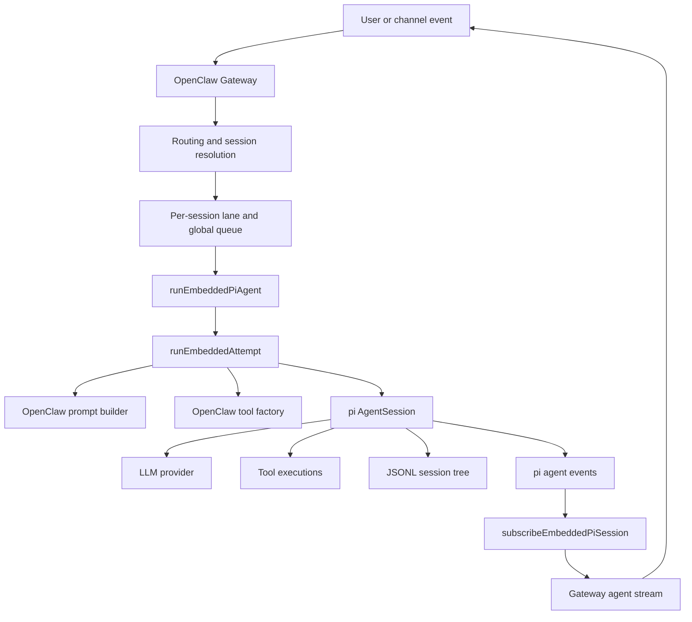
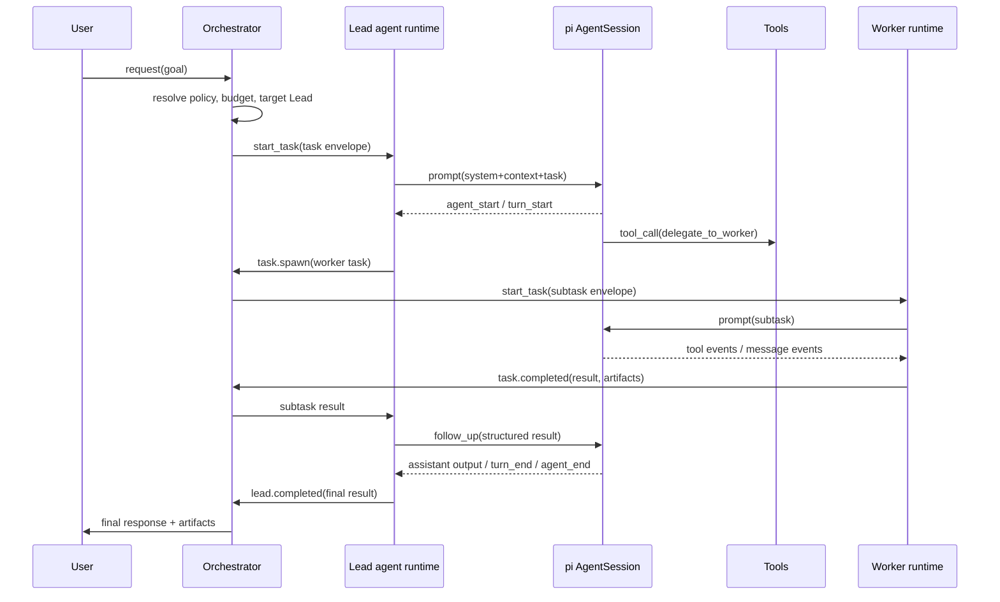
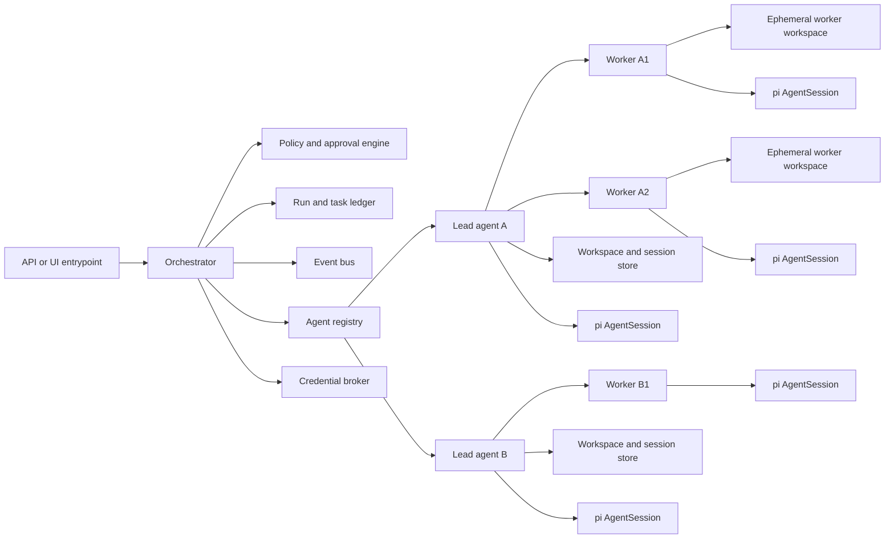

# OpenClaw Harness Internals and a Custom Orchestrator Design on Pi

## Executive summary

OpenClaw is best understood as a **control plane built around an embedded pi runtime**, not as a thin wrapper around a subprocess. Its own docs describe a single embedded agent runtime, an OpenClaw-owned system prompt, OpenClaw-owned session routing and persistence, and a bridge that converts pi session events into Gateway lifecycle and stream events. In practice, the important boundary is this: **pi provides the agent core**—model invocation, tools, session tree, compaction, extensions, event hooks—while **OpenClaw provides the harness**—routing, queueing, tool wiring, auth-profile selection, sandbox policy, streaming to channels, retries, and multi-agent isolation. citeturn22view1turn24view3turn33view1turn21search4

For your goal, the closest faithful reimplementation is **not** “one pi session that pretends to be many agents.” It is a **single-point-of-entry Orchestrator** that owns task decomposition and policy, plus **separate Lead and Worker runtimes**, each with its own session state, workspace view, tool profile, and credentials. That mirrors the way OpenClaw treats agent identity and session isolation: each agent gets a distinct workspace, `agentDir`, session store, and auth profile store, and OpenClaw explicitly warns not to reuse an `agentDir` across agents because it causes auth and session collisions. citeturn31view1turn22view3

If your broader system is Python-first, the most robust architecture is usually **Python orchestrator, Node worker layer**. The reason is that pi’s official integration model is the Node/TypeScript `AgentSession` API, while RPC mode is explicitly documented for embedding the agent in other applications and custom UIs over JSONL on stdin/stdout. That means you should keep orchestration, scheduling, persistence, and approvals in Python if you want, but keep the pi core in a dedicated Node boundary rather than trying to reimplement its state machine in Python. citeturn7view0turn38view0

My main recommendation is therefore:

- **Central Orchestrator**: Python service, owns task graph, approvals, budgets, run ledger, and cross-agent routing.
- **Lead Agent Runtimes**: Node workers embedding pi `AgentSession` directly, one active run per session, one session tree per long-lived lead thread.
- **Worker Agent Runtimes**: mostly short-lived or scoped sessions, tightly limited tools, often read-only or sandboxed.
- **Shared control bus + durable state**: task envelopes, progress events, audit log, artifact registry, and heartbeats live outside pi.
- **Pi remains the cognition/tool loop inside each agent**, not the system-wide scheduler. citeturn33view1turn33view0turn7view2turn38view0

## How OpenClaw layers on pi

OpenClaw’s official runtime docs say the embedded agent runtime is built on the pi core for models, tools, and prompt pipeline, while session management, discovery, tool wiring, and channel delivery are OpenClaw-owned layers on top. Its system prompt docs also say plainly that OpenClaw builds a custom system prompt for every run and does **not** use the default pi system prompt. That is the defining architectural move in OpenClaw’s harness: pi is the execution kernel, OpenClaw is the policy-and-delivery shell around it. citeturn22view1turn24view3

The pi SDK’s own model fits this well. `createAgentSession()` is the main factory, and the resulting `AgentSession` owns agent lifecycle, message history, model state, compaction, and event streaming. The SDK also intentionally exposes customization seams for tools, `ResourceLoader`, extensions, skills, context files, and persistent or in-memory session managers. OpenClaw is effectively a large production example of using those seams aggressively. citeturn7view0turn7view2turn7view4

OpenClaw’s Gateway architecture then wraps this embedded agent in a long-lived process that owns messaging surfaces, a typed WebSocket API, device pairing, and server-push events such as `agent`, `chat`, `presence`, `health`, `heartbeat`, and `cron`. Its agent loop docs say the high-level path is: validate request, resolve session, call `runEmbeddedPiAgent`, subscribe to pi events, stream lifecycle/tool/assistant deltas, and wait for completion or timeout. That is the actual harness. citeturn36view0turn33view1

A concise reconstruction of the OpenClaw stack looks like this:



That diagram is a synthesis, but each major box is reflected in the OpenClaw docs and code paths: `runEmbeddedPiAgent`, `runEmbeddedAttempt`, custom prompt ownership, custom tool wiring, pi event subscription, queueing rules, and JSONL-backed session state. citeturn15search0turn33view1turn24view3turn22view1

One subtle but important OpenClaw choice is that **identity, workspace, state, and credentials travel together**. In multi-agent mode, each `agentId` is a fully isolated persona with its own workspace, its own state directory, and its own session store. Auth profiles are per-agent and explicitly not shared automatically. That is exactly the pattern you should copy for Leads and Workers. A lead agent is not just “a prompt preset”; it is a real runtime identity with its own persistence and trust boundary. citeturn31view1turn22view3turn24view1

## Session lifecycle and event plumbing

The official OpenClaw agent-loop docs are unusually explicit about lifecycle. A run enters through Gateway RPC or CLI, gets serialized through per-session and global queue lanes, prepares workspace and session state, builds prompt and tools, subscribes to pi events, streams output, and finally persists usage and lifecycle state. Transcript writes are additionally guarded by a **process-aware file-based session write lock**, which means OpenClaw does not rely only on in-process queue discipline to keep session files consistent. citeturn33view1turn33view0

The command queue matters because it explains how OpenClaw avoids cross-run corruption. Queue docs say inbound auto-reply runs are serialized to prevent collisions; there is one session lane per session key and then a global lane that caps total parallelism. The same page notes default lane concurrency of `1` for unconfigured lanes, with `main` defaulting to `4` and `subagent` defaulting to `8`. For your design, that strongly argues for **one active run per session, many sessions in parallel**, rather than concurrent mutation inside a single session. citeturn33view0

At the pi layer, events are first-class. The SDK exposes `session.subscribe(...)`, and the extension model exposes lifecycle events such as `agent_start`, `agent_end`, `turn_start`, `turn_end`, `message_*`, `tool_execution_*`, `tool_call`, and `tool_result`. The docs are especially important on tool concurrency: in the default parallel mode, sibling tool calls are preflighted sequentially and then executed concurrently, and `tool_call` handlers are **not** guaranteed to see sibling tool results from the same assistant message. That concurrency contract should shape your harness design: never put cross-tool coordination logic inside assumptions about synchronous sibling visibility. citeturn7view0turn8view3turn8view6turn10view1turn10view2

OpenClaw then bridges those pi events into its own stream semantics. Its agent-loop docs say `subscribeEmbeddedPiSession` maps tool events to `stream: "tool"`, assistant deltas to `stream: "assistant"`, and lifecycle events to `stream: "lifecycle"`. Its streaming docs also clarify that channel delivery is not token-delta streaming; it is block streaming and preview-message updates at the channel layer. This is another useful separation for your harness: **internal event stream** and **user-facing delivery stream** should be distinct. citeturn33view1turn33view2

A clean sequence for a single orchestrated run looks like this:



That design is faithful to both layers: pi remains responsible for the intra-agent cognition/tool loop, while the outer harness owns orchestration, delegation, and artifact transfer. It also aligns with OpenClaw’s session tools, which include listing sessions, reading transcript history, sending messages across sessions, spawning isolated sub-agents, yielding for follow-up results, and managing spawned sub-agents. citeturn22view4turn24view0

Persistent session structure is also important. Pi stores sessions as **JSONL trees** with `id`/`parentId` links, supports branching, and distinguishes extension state that does not enter LLM context (`custom` entries) from extension-injected context that does (`custom_message`). OpenClaw stores transcripts per agent under `~/.openclaw/agents/<agentId>/sessions/<SessionId>.jsonl`. That gives you a very practical rule: use pi/JSONL only for **conversation and compacted context**, and keep orchestration metadata—task graph state, retries, budgets, ownership, artifact indexes—in a separate store. citeturn9view7turn9view6turn22view1

## Orchestrator, Lead, and Worker architecture for your harness

The architecture I recommend is a **three-tier harness**:

- **Orchestrator**: single public entry point, policy engine, scheduler, and ledger.
- **Lead agents**: domain specialists that keep medium-lived context and own a branch of work.
- **Worker agents**: short-lived or tightly scoped executors for bounded subtasks.

This is closer to OpenClaw’s actual separation of concerns than trying to use pi itself as the whole multi-agent operating system. OpenClaw already separates Gateway control-plane duties from the embedded pi runtime, and its multi-agent docs make each agent a fully scoped brain with isolated workspace, state, sessions, and auth. Your Orchestrator should therefore sit **above** pi, not inside one fat system prompt. citeturn36view0turn31view1turn22view1

A good component model is:



The key design choice is **what persists at each layer**. Lead sessions should persist because they hold the evolving problem understanding. Worker sessions should usually be ephemeral unless the task is naturally thread-like, such as open-ended code repair or background monitoring. OpenClaw’s own sub-agent tools distinguish one-shot spawn behavior from persistent thread-bound sessions, which is a useful pattern to reuse. citeturn24view0turn22view4

### Communication protocol

Do not let Leads and Workers communicate through free-form transcript scraping. Instead, define a typed control envelope. A minimal task envelope should contain:

- `task_id`
- `parent_task_id`
- `run_id`
- `requester_agent`
- `target_agent`
- `goal`
- `expected_output_schema`
- `allowed_tools`
- `workspace_scope`
- `deadline`
- `budget`
- `artifact_refs`
- `approval_mode`

That recommendation follows directly from OpenClaw’s typed Gateway protocol and event-first design, plus pi’s typed tool/event model. OpenClaw’s WebSocket protocol uses typed request/response/event payloads and idempotency keys for side-effecting methods; your internal protocol should be just as explicit. citeturn36view1

### Event bus shape

At minimum, define these events:

- `task.created`
- `task.accepted`
- `task.started`
- `task.progress`
- `task.blocked`
- `approval.requested`
- `artifact.created`
- `task.completed`
- `task.failed`
- `task.cancelled`
- `heartbeat`

This is an inference, but it is grounded in OpenClaw’s own event catalog and lifecycle vocabulary: queue enqueue/dequeue, session state transitions, run attempts, health heartbeat, agent lifecycle streams, and cron/background task tracking. citeturn33view3turn36view0turn33view1

### Execution boundary options

| Option | Strengths | Trade-offs |
|---|---|---|
| **Python Orchestrator + embedded Node Lead/Worker services** | Best match to pi’s intended API; easiest to preserve `AgentSession`, extensions, and custom tool wiring | Two runtimes in one system |
| **Python Orchestrator + pi RPC sidecars** | Language-neutral; easiest to isolate workers; good for containers and autoscaling | Slightly less direct than `AgentSession`; you own the RPC adapter |
| **Subprocess-per-task pi CLI** | Simplest to prototype | Weakest session continuity, slower startup, harder event correlation, less faithful to OpenClaw |

That comparison follows pi’s own guidance: Node apps should generally use `AgentSession` directly, while RPC mode is for embedding in other apps and custom UIs. citeturn38view0

My recommendation is the first option if your team is comfortable with a small Node layer, and the second if your platform standardization is strongly Python-oriented.

## Integration blueprint and migration plan

The first implementation milestone should be **a single Lead runtime with no delegation**. Pi’s official shape is already enough for that: create an `AgentSession`, wire a custom `ResourceLoader`, pass session/auth/model services, subscribe to events, and drive the loop via `prompt`, `steer`, and `followUp`. OpenClaw’s own design proves that this is the stable kernel to build around. citeturn7view0turn7view2turn14view1turn33view1

The second milestone should add **custom tool injection**, not sub-agents. Pi supports direct `customTools`, extension-registered tools through `pi.registerTool()`, and built-in tool factories that can be rebound to a specific `cwd`. OpenClaw uses the same pattern at larger scale: it constructs its own tool set, replaces read/edit/write behavior with sandbox-controlled variants where needed, creates lazy `exec` and `process` tools, and scopes process visibility by session key or agent. citeturn29view5turn7view1turn30view2turn30view5turn30view6

The third milestone should add **one Orchestrator-to-Lead control protocol**. At that stage, do not yet make Leads talk directly to Workers. The Orchestrator should remain the only component with the full task graph. Leads can request delegation by returning a structured “delegation intent” or by calling a single orchestration tool that produces a typed request. OpenClaw’s own architecture supports cross-session communication and sub-agent spawning through dedicated tools rather than by giving each conversation arbitrary global powers. citeturn22view4turn24view0

The fourth milestone should add **Worker pools with strict isolation**. Each Worker should ideally have:

- separate session file
- separate workspace root or sandbox scope
- separate credential scope
- narrower tool allowlist than the Lead
- deterministic output contract

This mirrors OpenClaw’s per-agent isolation and its security guidance that workspaces are not hard sandboxes unless sandboxing is enabled. It also matches OpenClaw’s delegate guidance, which pushes hardened boundaries before granting powerful credentials. citeturn31view1turn22view2turn24view1

A practical migration plan is:

1. **Build a single embedded pi worker service** with direct `AgentSession` and JSONL sessions. citeturn7view0turn9view7  
2. **Replace default prompt behavior** with your own system prompt builder. citeturn24view3turn29view4  
3. **Wrap tools through your own factory** and keep risky tools off by default. citeturn29view5turn30view5turn35view2  
4. **Add a task ledger and event bus outside pi**. Pi session files should not become your only orchestrator database. citeturn9view6turn33view3  
5. **Introduce Lead agents** as dedicated runtimes with long-lived sessions. citeturn31view1turn22view1  
6. **Introduce Worker agents** as ephemeral or session-bound runtimes depending on task type. citeturn24view0  
7. **Add model/auth failover and timeout policy** at the harness layer. OpenClaw’s model-failover path is exactly the kind of outer-loop resilience you want around pi. citeturn35view1turn35view0  
8. **Only then add autoscaling and distributed workers**. Until the protocol and state model are stable, keep orchestration local and observable. citeturn22view9turn33view3  

### Minimal file layout for your implementation

```text
my-harness/
  orchestrator/
    app.py
    scheduler.py
    ledger.py
    events.py
    policy.py
    approvals.py
    agent_registry.py
  workers/
    pi_worker/
      package.json
      src/
        worker.ts
        session_factory.ts
        prompt_builder.ts
        tools/
          index.ts
          delegate_tool.ts
          artifact_tool.ts
          status_tool.ts
        protocols/
          task_envelope.ts
          events.ts
  storage/
    migrations/
  deployment/
    docker/
    vm/
```

That structure is opinionated, but it cleanly separates “pi execution” from “orchestration state,” which is the core lesson from OpenClaw’s layering. citeturn22view1turn36view0

## Security, failure handling, testing, and observability

Security is where OpenClaw’s architecture is most instructive. Its docs repeatedly state that the workspace is the default `cwd`, **not a hard sandbox**, and that absolute paths can still reach elsewhere unless sandboxing is enabled. Its multi-agent docs also make auth per-agent and warn against reusing `agentDir` across agents. If you ignore those two rules in your own harness, your Orchestrator/Lead/Worker model will look isolated on paper but not in practice. citeturn22view2turn31view1turn22view3

Pi itself also has configuration surfaces that are safe only under trusted-repo assumptions. A good example is the documented `shellCommandPrefix` attack scenario: a malicious `.pi/settings.json` can silently prepend commands to every bash execution. For a custom harness, the implication is clear: **do not honor untrusted project-level pi settings for host execution**. Use sanitized settings, preferably in-memory or generated by your harness, and treat project-supplied settings as untrusted input unless explicitly approved. citeturn28view8turn13view0

OpenClaw’s host exec model adds another layer worth copying: it separates requested exec policy in main config from host-local approval policy in `exec-approvals.json`, and supports modes like `deny`, `allowlist`, and `full`, with explicit ask behavior and hardening for inline interpreter eval. That is a better pattern than a single boolean “allow shell.” For your system, the Orchestrator should set coarse capability policy, and each runtime host should enforce the final approval decision locally. citeturn35view2

### Security checklist

- Give every Lead and Worker its own **credential scope**; never share the same state directory across identities. citeturn22view3turn31view1  
- Keep **workspace** and **state directory** separate; do not store tokens in the workspace. OpenClaw separates workspace from `~/.openclaw`, which holds config, credentials, and sessions. citeturn22view2turn22view1  
- Run mutation-capable Workers in a **sandbox** or with read-only workspace access unless they truly need writes. OpenClaw supports isolated sandboxes and distinct workspace access modes. citeturn22view6turn21search3  
- Keep high-risk tools off by default for Workers; let Leads request escalation through the Orchestrator. This follows OpenClaw’s agent-specific tool and sandbox policy model. citeturn22view3turn35view2  
- Do not let untrusted project settings affect host exec behavior. citeturn28view8  
- Add content redaction or secret scanning on file-read results before they enter LLM context. OpenClaw’s official repo has a security issue describing raw sensitive content returning from in-sandbox reads. citeturn28view7  

### Failure modes you should design for

Recent official repo issues show several recurring classes of harness failure:

- **cache/memory growth** around session-manager behavior and long-running sessions, including cache entries that were not evicted and gateways that accumulated high memory/CPU over long conversations; citeturn28view0turn28view1  
- **auth integration regressions** when pi internals changed and OpenClaw’s stream wrapper path bypassed the new auth injection behavior; citeturn28view2  
- **streaming lifecycle gaps**, such as an `agent_end` hook path not firing in streaming mode in the reported design; citeturn28view3  
- **timeout/failover path mismatches** on local model backends; citeturn28view4turn35view1  
- **container build/runtime mismatches** when packaging assumptions changed. citeturn28view6  

Those are exactly why your custom harness should keep the following boundary responsibilities explicit:

- pi owns agent cognition and intra-session state
- harness owns retries, failover, queueing, task idempotency, and worker liveness
- hosts own final execution approval and sandbox enforcement

OpenClaw’s retry and model-failover docs are especially relevant here. They separate short request retries from multi-step flow retries, cap long `Retry-After` waits so failover can happen, and then use a second-stage strategy of auth-profile rotation plus model fallback. Your harness should implement the same principle at the Orchestrator layer: retry **requests** cheaply, but fail over **runs** deliberately. citeturn35view0turn35view1

### Recommended test suite

Your highest-value tests are not prompt snapshots. They are **state, concurrency, and boundary tests**.

| Test family | What to verify | Why it matters |
|---|---|---|
| Session serialization tests | one active run per session; queueing and write locks work under contention | OpenClaw explicitly serializes per session and also locks transcript files citeturn33view0turn33view1 |
| Tool policy tests | worker cannot escape allowed tools or workspace scope | OpenClaw distinguishes tool policy, sandbox policy, and approval policy citeturn22view3turn35view2 |
| Auth isolation tests | lead/worker creds never cross-load | OpenClaw keeps auth stores per agent and warns against shared `agentDir` citeturn22view3turn31view1 |
| Structured delegation tests | orchestration uses typed envelopes, not transcript parsing | aligns with Gateway’s typed protocol and pi’s typed tools/events citeturn36view1turn29view5 |
| Failure-injection tests | hung tool, timeout, model failover, worker crash, replay | these are real failure classes observed in the official repo citeturn28view0turn28view2turn28view4turn35view1 |

For observability, copy OpenClaw’s habit of emitting structured events for queue state, session state, run attempts, usage, and heartbeats. The logging docs list queue enqueue/dequeue, session transitions, stuck warnings, retry attempts, usage, and OpenTelemetry export support. Build your own event schema around those same concepts from day one. citeturn33view3

## Deployment options and file-level repo map

If you are staying close to pi’s intended usage, a **Node-local embedded runtime** is the cleanest deploy on a laptop or single VM. Pi’s `AgentSession` is the direct API; OpenClaw itself is proof that a single long-lived harness process can own many concerns around an embedded runtime. For always-on hosting, OpenClaw officially documents container and VM flows, including persistent runtime setups on VPS-style machines and per-session sandbox runtimes. citeturn38view0turn36view0turn22view8turn22view9turn22view6

If you want the rest of the system in Python, use one of these deployment patterns:

| Deployment pattern | Best use | Recommendation |
|---|---|---|
| **Local dev workstation** | rapid iteration, debugger-friendly | Python Orchestrator + one local Node worker process per Lead |
| **Single VM** | small production deployment | Python Orchestrator + local worker pool + local DB + container sandbox runtime |
| **Containerized worker pool** | team/shared deployment | Python Orchestrator service + stateless Node workers + external queue/state store |
| **Hardened remote execution** | untrusted or high-risk tooling | Worker sandboxes with remote or container backends, minimal host exec |

That table is partly recommendation, but it is grounded in the official fact that pi supports RPC embedding, OpenClaw documents container and VM hosting, and OpenClaw supports isolated sandbox backends and workspace access modes. citeturn38view0turn22view8turn22view9turn22view6turn21search3

### File-level map to the OpenClaw repo on entity["company","GitHub","software hosting platform"]

- `docs/pi.md` — the narrative explanation of how OpenClaw embeds pi rather than treating it as an external shell command, and the best high-level orientation point. citeturn21search4turn15search0  
- `src/agents/pi-embedded-runner/run.ts` — top-level embedded run entry point; official repo snippets show session-key backfilling and this file is the start of the embedded pathway. citeturn19view0turn16search8  
- `src/agents/pi-embedded-runner/run/attempt.ts` — the heavy-lift run path: workspace resolution, session locking, sandbox handling, tool construction, diagnostics, and the actual run attempt. citeturn19view1turn16search1  
- `src/agents/pi-embedded-subscribe.ts` — bridge from pi session events into OpenClaw streaming/lifecycle behavior. citeturn16search3turn33view1  
- `src/agents/pi-tools.ts` — custom tool factory; composes sandboxed file tools, lazy exec/process tools, session scoping, and allow/deny policy behavior. citeturn30view0turn30view2turn30view5turn30view6  
- `src/agents/pi-embedded-runner/session-manager-cache.ts` — session-file cache and prewarming path; useful if you want to copy the “optimize JSONL session access” idea, but also a cautionary place because cache-eviction bugs were reported here. citeturn19view3turn19view4turn28view0turn28view5  
- `src/agents/auth-profiles.ts` — per-agent auth-profile and model/auth resolution layer. citeturn22view3turn15search5  
- `docs/concepts/agent-loop`, `system-prompt`, `multi-agent`, `session-tool`, `sandboxing`, and `retry` — the most important conceptual docs to read alongside the code. citeturn33view1turn24view3turn31view1turn22view4turn22view6turn35view0  

### Code sketch for a Lead/Worker Node runtime

The sketch below follows pi’s intended direct API shape: `createAgentSession`, custom tools, a custom `ResourceLoader`, and session services. That is the same family of integration points OpenClaw relies on. citeturn7view0turn7view2turn29view4turn29view5

```ts
// workers/pi_worker/src/worker.ts
import {
  AuthStorage,
  ModelRegistry,
  SessionManager,
  DefaultResourceLoader,
  createAgentSession,
  createEventBus,
  createCodingTools,
  defineTool,
} from "@mariozechner/pi-coding-agent";
import { Type } from "typebox";

export async function buildLeadSession(opts: {
  cwd: string;
  agentDir: string;
  sessionFile?: string;
  systemPrompt: string;
  delegate: (task: unknown) => Promise<string>;
}) {
  const authStorage = AuthStorage.create(`${opts.agentDir}/auth.json`);
  const modelRegistry = ModelRegistry.create(authStorage);

  const bus = createEventBus();
  const loader = new DefaultResourceLoader({
    cwd: opts.cwd,
    agentDir: opts.agentDir,
    eventBus: bus,
    systemPromptOverride: () => opts.systemPrompt,
  });
  await loader.reload();

  const delegateTool = defineTool({
    name: "delegate_task",
    description: "Ask the orchestrator to create a worker task.",
    parameters: Type.Object({
      role: Type.String(),
      goal: Type.String(),
      expectedSchema: Type.Optional(Type.String()),
    }),
    async execute(_id, params) {
      const result = await opts.delegate(params);
      return {
        content: [{ type: "text", text: result }],
        details: { delegated: true, params },
      };
    },
  });

  const { session } = await createAgentSession({
    cwd: opts.cwd,
    agentDir: opts.agentDir,
    authStorage,
    modelRegistry,
    sessionManager: opts.sessionFile
      ? SessionManager.open(opts.sessionFile)
      : SessionManager.create(opts.cwd),
    tools: createCodingTools(opts.cwd),
    customTools: [delegateTool],
    resourceLoader: loader,
  });

  return { session, bus };
}
```

### Code sketch for a Python Orchestrator

The point of the Python layer is not to emulate pi internals. It is to own scheduling, policy, and state above pi. Pi remains inside each worker boundary. That uses the official Node embedding path or, if you prefer, pi RPC mode for a sidecar protocol. citeturn38view0turn33view1

```python
# orchestrator/app.py
from __future__ import annotations
from dataclasses import dataclass, field
from typing import Any, Literal
import asyncio
import uuid
import time

AgentRole = Literal["lead", "worker"]

@dataclass
class TaskEnvelope:
    task_id: str
    run_id: str
    parent_task_id: str | None
    requester: str
    target_agent: str
    target_role: AgentRole
    goal: str
    expected_schema: str | None = None
    allowed_tools: list[str] = field(default_factory=list)
    artifact_refs: list[str] = field(default_factory=list)
    deadline_ts: float | None = None
    budget_tokens: int | None = None

class AgentHandle:
    def __init__(self, name: str, role: AgentRole):
        self.name = name
        self.role = role

    async def run_task(self, task: TaskEnvelope) -> dict[str, Any]:
        # Call Node worker over HTTP, gRPC, or JSONL RPC.
        raise NotImplementedError

class Orchestrator:
    def __init__(self) -> None:
        self.leads: dict[str, AgentHandle] = {}
        self.workers: dict[str, AgentHandle] = {}
        self.events: asyncio.Queue[dict[str, Any]] = asyncio.Queue()

    def register(self, handle: AgentHandle) -> None:
        if handle.role == "lead":
            self.leads[handle.name] = handle
        else:
            self.workers[handle.name] = handle

    async def dispatch(self, goal: str, lead_name: str) -> dict[str, Any]:
        run_id = str(uuid.uuid4())
        lead = self.leads[lead_name]
        task = TaskEnvelope(
            task_id=str(uuid.uuid4()),
            run_id=run_id,
            parent_task_id=None,
            requester="orchestrator",
            target_agent=lead.name,
            target_role="lead",
            goal=goal,
        )
        await self.events.put({"type": "task.created", "task_id": task.task_id, "run_id": run_id, "ts": time.time()})
        result = await lead.run_task(task)
        await self.events.put({"type": "task.completed", "task_id": task.task_id, "run_id": run_id, "ts": time.time()})
        return result
```

## Open questions and limitations

The highest-confidence facts in this report come from official OpenClaw docs, official pi docs, and official repo code/issue references. I did **not** line-by-line inspect every branch inside the very large `run/attempt.ts` implementation, so some of the finer operational recommendations here are synthesis based on the documented lifecycle, exposed APIs, and the official issue tracker rather than a full static analysis of every code path. citeturn16search1turn33view1

Two points are especially worth validating as you build:

- whether you want **Lead sessions** to be long-lived threads or short-lived per-request sessions with artifact-based memory handoff; and  
- whether Worker execution should be done through **embedded Node workers** or **pi RPC sidecars**. The official docs support both patterns, but the right choice depends on how much of your control plane you want to keep in Python. citeturn6view4turn38view0

The safe default, though, is already clear from the evidence: **copy OpenClaw’s separation of concerns, not its exact product surface**. Build your own Orchestrator as the outer harness, keep Lead and Worker identities isolated, let pi do what it is good at inside each agent, and never let session history, credentials, approvals, and execution policy collapse into one undifferentiated runtime. citeturn22view1turn31view1turn35view2