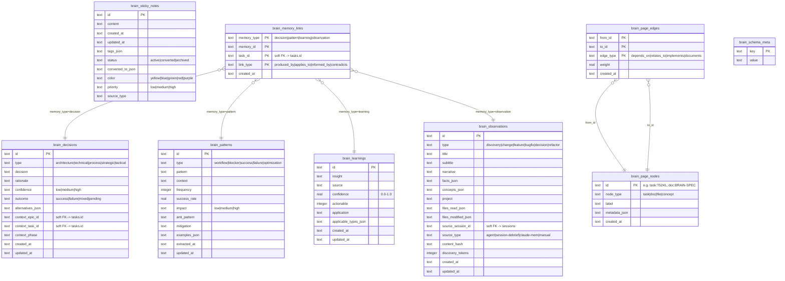
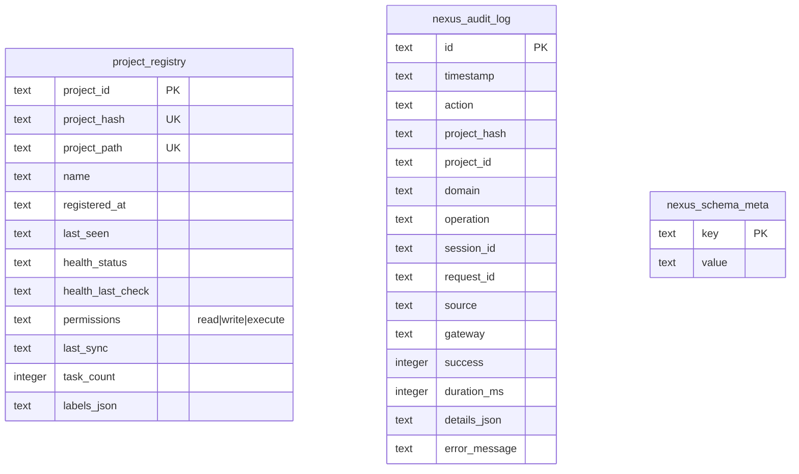

# CLEO Database ERD Reference

**Version**: 1.0.0
**Date**: 2026-03-19
**Status**: Current (post Core Hardening Waves 0-3)

---

## Overview

CLEO uses three SQLite databases, each serving a distinct domain:

| Database | Schema File(s) | Purpose |
|----------|---------------|---------|
| `tasks.db` | `tasks-schema.ts`, `chain-schema.ts`, `agent-schema.ts` | Core work management, sessions, lifecycle, audit, agents |
| `brain.db` | `brain-schema.ts` | Cognitive memory: decisions, patterns, learnings, observations, graph |
| `nexus.db` | `nexus-schema.ts` | Cross-project registry and audit |

---

## 1. tasks.db

The primary database containing task management, session lifecycle, RCASD pipeline governance, WarpChain orchestration, audit logging, token telemetry, and agent runtime tracking.

### 1.1 ERD

```mermaid
erDiagram
    tasks {
        text id PK
        text title
        text description
        text status "pending|active|blocked|done|cancelled|archived"
        text priority "critical|high|medium|low"
        text type "epic|task|subtask"
        text parent_id FK "SET NULL -> tasks.id"
        text phase
        text size "small|medium|large"
        integer position
        integer position_version
        text labels_json
        text notes_json
        text acceptance_json
        text files_json
        text origin
        text blocked_by
        text epic_lifecycle
        integer no_auto_complete
        text created_at
        text updated_at
        text completed_at
        text cancelled_at
        text cancellation_reason
        text archived_at
        text archive_reason
        integer cycle_time_days
        text verification_json
        text created_by
        text modified_by
        text session_id
    }

    task_dependencies {
        text task_id PK_FK "CASCADE -> tasks.id"
        text depends_on PK_FK "CASCADE -> tasks.id"
    }

    task_relations {
        text task_id PK_FK "CASCADE -> tasks.id"
        text related_to PK_FK "CASCADE -> tasks.id"
        text relation_type "related|blocks|duplicates|absorbs|fixes|extends|supersedes"
        text reason
    }

    sessions {
        text id PK
        text name
        text status "active|ended|orphaned|suspended"
        text scope_json
        text current_task
        text task_started_at
        text agent
        text notes_json
        text tasks_completed_json
        text tasks_created_json
        text handoff_json
        text started_at
        text ended_at
        text previous_session_id FK "SET NULL -> sessions.id"
        text next_session_id FK "SET NULL -> sessions.id"
        text agent_identifier
        text handoff_consumed_at
        text handoff_consumed_by
        text debrief_json
        text provider_id
        text stats_json
        integer resume_count
        integer grade_mode
    }

    task_work_history {
        integer id PK "autoIncrement"
        text session_id FK "CASCADE -> sessions.id"
        text task_id
        text set_at
        text cleared_at
    }

    lifecycle_pipelines {
        text id PK
        text task_id FK "CASCADE -> tasks.id"
        text status "active|completed|blocked|failed|cancelled|aborted"
        text current_stage_id
        text started_at
        text completed_at
        text updated_at
        integer version
    }

    lifecycle_stages {
        text id PK
        text pipeline_id FK "CASCADE -> lifecycle_pipelines.id"
        text stage_name "research|consensus|architecture_decision|specification|decomposition|implementation|validation|testing|release|contribution"
        text status "not_started|in_progress|blocked|completed|skipped|failed"
        integer sequence
        text started_at
        text completed_at
        text blocked_at
        text block_reason
        text skipped_at
        text skip_reason
        text notes_json
        text metadata_json
        text output_file
        text created_by
        text validated_by
        text validated_at
        text validation_status "pending|in_review|approved|rejected|needs_revision"
        text provenance_chain_json
    }

    lifecycle_gate_results {
        text id PK
        text stage_id FK "CASCADE -> lifecycle_stages.id"
        text gate_name
        text result "pass|fail|warn"
        text checked_at
        text checked_by
        text details
        text reason
    }

    lifecycle_evidence {
        text id PK
        text stage_id FK "CASCADE -> lifecycle_stages.id"
        text uri
        text type "file|url|manifest"
        text recorded_at
        text recorded_by
        text description
    }

    lifecycle_transitions {
        text id PK
        text pipeline_id FK "CASCADE -> lifecycle_pipelines.id"
        text from_stage_id
        text to_stage_id
        text transition_type "automatic|manual|forced"
        text transitioned_by
        text created_at
    }

    manifest_entries {
        text id PK
        text pipeline_id FK "CASCADE -> lifecycle_pipelines.id"
        text stage_id FK "CASCADE -> lifecycle_stages.id"
        text title
        text date
        text status "completed|partial|blocked|archived"
        text agent_type
        text output_file
        text topics_json
        text findings_json
        text linked_tasks_json
        text created_by
        text created_at
    }

    pipeline_manifest {
        text id PK
        text session_id
        text task_id
        text epic_id
        text type
        text content
        text content_hash
        text status
        integer distilled
        text brain_obs_id
        text source_file
        text metadata_json
        text created_at
        text archived_at
    }

    release_manifests {
        text id PK
        text version UK
        text status
        text pipeline_id FK "-> lifecycle_pipelines.id"
        text epic_id
        text tasks_json
        text changelog
        text notes
        text previous_version
        text commit_sha
        text git_tag
        text npm_dist_tag
        text created_at
        text prepared_at
        text committed_at
        text tagged_at
        text pushed_at
    }

    architecture_decisions {
        text id PK
        text title
        text status "proposed|accepted|superseded|deprecated"
        text supersedes_id "soft FK -> architecture_decisions.id"
        text superseded_by_id "soft FK -> architecture_decisions.id"
        text consensus_manifest_id
        text content
        text created_at
        text updated_at
        text date
        text accepted_at
        text gate "HITL|automated"
        text gate_status "pending|passed|failed|waived"
        text amends_id
        text file_path
        text summary
        text keywords
        text topics
    }

    adr_task_links {
        text adr_id PK_FK "CASCADE -> architecture_decisions.id"
        text task_id PK "soft FK"
        text link_type "related|governed_by|implements"
    }

    adr_relations {
        text from_adr_id PK_FK "CASCADE -> architecture_decisions.id"
        text to_adr_id PK_FK "CASCADE -> architecture_decisions.id"
        text relation_type PK "supersedes|amends|related"
    }

    external_task_links {
        text id PK
        text task_id FK "CASCADE -> tasks.id"
        text provider_id
        text external_id
        text external_url
        text external_title
        text link_type "created|matched|manual"
        text sync_direction "inbound|outbound|bidirectional"
        text metadata_json
        text linked_at
        text last_sync_at
    }

    status_registry {
        text name PK
        text entity_type PK "task|session|lifecycle_pipeline|lifecycle_stage|adr|gate|manifest"
        text namespace "workflow|governance|manifest"
        text description
        integer is_terminal
    }

    audit_log {
        text id PK
        text timestamp
        text action
        text task_id "no FK - survives deletion"
        text actor
        text details_json
        text before_json
        text after_json
        text domain
        text operation
        text session_id
        text request_id
        integer duration_ms
        integer success
        text source
        text gateway
        text error_message
        text project_hash
    }

    token_usage {
        text id PK
        text created_at
        text provider
        text model
        text transport "cli|mcp|api|agent|unknown"
        text gateway
        text domain
        text operation
        text session_id
        text task_id
        text request_id
        integer input_chars
        integer output_chars
        integer input_tokens
        integer output_tokens
        integer total_tokens
        text method "otel|provider_api|tokenizer|heuristic"
        text confidence "real|high|estimated|coarse"
        text request_hash
        text response_hash
        text metadata_json
    }

    warp_chains {
        text id PK
        text name
        text version
        text description
        text definition "JSON"
        integer validated
        text created_at
        text updated_at
    }

    warp_chain_instances {
        text id PK
        text chain_id FK "CASCADE -> warp_chains.id"
        text epic_id
        text variables "JSON"
        text stage_to_task "JSON"
        text status "pending|active|completed|failed|cancelled"
        text current_stage
        text gate_results "JSON"
        text created_at
        text updated_at
    }

    agent_instances {
        text id PK
        text agent_type "orchestrator|executor|researcher|architect|validator|documentor|custom"
        text status "starting|active|idle|error|crashed|stopped"
        text session_id
        text task_id
        text started_at
        text last_heartbeat
        text stopped_at
        integer error_count
        integer total_tasks_completed
        text capacity
        text metadata_json
        text parent_agent_id
    }

    agent_error_log {
        integer id PK "autoIncrement"
        text agent_id
        text error_type "retriable|permanent|unknown"
        text message
        text stack
        text occurred_at
        integer resolved
    }

    schema_meta {
        text key PK
        text value
    }

    tasks ||--o{ task_dependencies : "task_id"
    tasks ||--o{ task_dependencies : "depends_on"
    tasks ||--o{ task_relations : "task_id"
    tasks ||--o{ task_relations : "related_to"
    tasks ||--o{ lifecycle_pipelines : "task_id"
    tasks ||--o{ external_task_links : "task_id"
    tasks ||--o| tasks : "parent_id"

    sessions ||--o{ task_work_history : "session_id"
    sessions ||--o| sessions : "previous_session_id"
    sessions ||--o| sessions : "next_session_id"

    lifecycle_pipelines ||--o{ lifecycle_stages : "pipeline_id"
    lifecycle_pipelines ||--o{ lifecycle_transitions : "pipeline_id"
    lifecycle_pipelines ||--o{ manifest_entries : "pipeline_id"
    lifecycle_pipelines ||--o| release_manifests : "pipeline_id"

    lifecycle_stages ||--o{ lifecycle_gate_results : "stage_id"
    lifecycle_stages ||--o{ lifecycle_evidence : "stage_id"
    lifecycle_stages ||--o{ manifest_entries : "stage_id"

    architecture_decisions ||--o{ adr_task_links : "adr_id"
    architecture_decisions ||--o{ adr_relations : "from_adr_id"
    architecture_decisions ||--o{ adr_relations : "to_adr_id"

    warp_chains ||--o{ warp_chain_instances : "chain_id"
```

### 1.2 Foreign Key Legend

| FK | From | To | On Delete | Type |
|----|------|----|-----------|------|
| `tasks.parent_id` | `tasks` | `tasks.id` | SET NULL | Self-referential |
| `task_dependencies.task_id` | `task_dependencies` | `tasks.id` | CASCADE | Hard |
| `task_dependencies.depends_on` | `task_dependencies` | `tasks.id` | CASCADE | Hard |
| `task_relations.task_id` | `task_relations` | `tasks.id` | CASCADE | Hard |
| `task_relations.related_to` | `task_relations` | `tasks.id` | CASCADE | Hard |
| `sessions.previous_session_id` | `sessions` | `sessions.id` | SET NULL | Self-referential |
| `sessions.next_session_id` | `sessions` | `sessions.id` | SET NULL | Self-referential |
| `task_work_history.session_id` | `task_work_history` | `sessions.id` | CASCADE | Hard |
| `lifecycle_pipelines.task_id` | `lifecycle_pipelines` | `tasks.id` | CASCADE | Hard |
| `lifecycle_stages.pipeline_id` | `lifecycle_stages` | `lifecycle_pipelines.id` | CASCADE | Hard |
| `lifecycle_gate_results.stage_id` | `lifecycle_gate_results` | `lifecycle_stages.id` | CASCADE | Hard |
| `lifecycle_evidence.stage_id` | `lifecycle_evidence` | `lifecycle_stages.id` | CASCADE | Hard |
| `lifecycle_transitions.pipeline_id` | `lifecycle_transitions` | `lifecycle_pipelines.id` | CASCADE | Hard |
| `manifest_entries.pipeline_id` | `manifest_entries` | `lifecycle_pipelines.id` | CASCADE | Hard |
| `manifest_entries.stage_id` | `manifest_entries` | `lifecycle_stages.id` | CASCADE | Hard |
| `release_manifests.pipeline_id` | `release_manifests` | `lifecycle_pipelines.id` | None (nullable) | Soft |
| `architecture_decisions.supersedes_id` | `architecture_decisions` | `architecture_decisions.id` | — | Soft (DB-level) |
| `architecture_decisions.superseded_by_id` | `architecture_decisions` | `architecture_decisions.id` | — | Soft (DB-level) |
| `adr_task_links.adr_id` | `adr_task_links` | `architecture_decisions.id` | CASCADE | Hard |
| `adr_task_links.task_id` | `adr_task_links` | — | — | Soft (tasks can be purged) |
| `adr_relations.from_adr_id` | `adr_relations` | `architecture_decisions.id` | CASCADE | Hard |
| `adr_relations.to_adr_id` | `adr_relations` | `architecture_decisions.id` | CASCADE | Hard |
| `external_task_links.task_id` | `external_task_links` | `tasks.id` | CASCADE | Hard |
| `warp_chain_instances.chain_id` | `warp_chain_instances` | `warp_chains.id` | CASCADE | Hard |
| `audit_log.task_id` | `audit_log` | — | — | None (survives deletion) |
| `agent_error_log.agent_id` | `agent_error_log` | — | — | None (soft) |

### 1.3 Index Listing

| Table | Index Name | Column(s) |
|-------|-----------|-----------|
| `tasks` | `idx_tasks_status` | `status` |
| `tasks` | `idx_tasks_parent_id` | `parent_id` |
| `tasks` | `idx_tasks_phase` | `phase` |
| `tasks` | `idx_tasks_type` | `type` |
| `tasks` | `idx_tasks_priority` | `priority` |
| `tasks` | `idx_tasks_session_id` | `session_id` |
| `task_dependencies` | `idx_deps_depends_on` | `depends_on` |
| `task_relations` | `idx_task_relations_related_to` | `related_to` |
| `sessions` | `idx_sessions_status` | `status` |
| `sessions` | `idx_sessions_previous` | `previous_session_id` |
| `sessions` | `idx_sessions_agent_identifier` | `agent_identifier` |
| `sessions` | `idx_sessions_started_at` | `started_at` |
| `task_work_history` | `idx_work_history_session` | `session_id` |
| `lifecycle_pipelines` | `idx_lifecycle_pipelines_task_id` | `task_id` |
| `lifecycle_pipelines` | `idx_lifecycle_pipelines_status` | `status` |
| `lifecycle_stages` | `idx_lifecycle_stages_pipeline_id` | `pipeline_id` |
| `lifecycle_stages` | `idx_lifecycle_stages_stage_name` | `stage_name` |
| `lifecycle_stages` | `idx_lifecycle_stages_status` | `status` |
| `lifecycle_stages` | `idx_lifecycle_stages_validated_by` | `validated_by` |
| `lifecycle_gate_results` | `idx_lifecycle_gate_results_stage_id` | `stage_id` |
| `lifecycle_evidence` | `idx_lifecycle_evidence_stage_id` | `stage_id` |
| `lifecycle_transitions` | `idx_lifecycle_transitions_pipeline_id` | `pipeline_id` |
| `manifest_entries` | `idx_manifest_entries_pipeline_id` | `pipeline_id` |
| `manifest_entries` | `idx_manifest_entries_stage_id` | `stage_id` |
| `manifest_entries` | `idx_manifest_entries_status` | `status` |
| `pipeline_manifest` | `idx_pipeline_manifest_task_id` | `task_id` |
| `pipeline_manifest` | `idx_pipeline_manifest_session_id` | `session_id` |
| `pipeline_manifest` | `idx_pipeline_manifest_distilled` | `distilled` |
| `pipeline_manifest` | `idx_pipeline_manifest_status` | `status` |
| `pipeline_manifest` | `idx_pipeline_manifest_content_hash` | `content_hash` |
| `release_manifests` | `idx_release_manifests_status` | `status` |
| `release_manifests` | `idx_release_manifests_version` | `version` |
| `architecture_decisions` | `idx_arch_decisions_status` | `status` |
| `architecture_decisions` | `idx_arch_decisions_amends_id` | `amends_id` |
| `adr_task_links` | `idx_adr_task_links_task_id` | `task_id` |
| `external_task_links` | `idx_ext_links_task_id` | `task_id` |
| `external_task_links` | `idx_ext_links_provider_external` | `provider_id, external_id` |
| `external_task_links` | `idx_ext_links_provider_id` | `provider_id` |
| `status_registry` | `idx_status_registry_entity_type` | `entity_type` |
| `status_registry` | `idx_status_registry_namespace` | `namespace` |
| `audit_log` | `idx_audit_log_task_id` | `task_id` |
| `audit_log` | `idx_audit_log_action` | `action` |
| `audit_log` | `idx_audit_log_timestamp` | `timestamp` |
| `audit_log` | `idx_audit_log_domain` | `domain` |
| `audit_log` | `idx_audit_log_request_id` | `request_id` |
| `audit_log` | `idx_audit_log_project_hash` | `project_hash` |
| `audit_log` | `idx_audit_log_actor` | `actor` |
| `token_usage` | `idx_token_usage_created_at` | `created_at` |
| `token_usage` | `idx_token_usage_request_id` | `request_id` |
| `token_usage` | `idx_token_usage_session_id` | `session_id` |
| `token_usage` | `idx_token_usage_task_id` | `task_id` |
| `token_usage` | `idx_token_usage_provider` | `provider` |
| `token_usage` | `idx_token_usage_transport` | `transport` |
| `token_usage` | `idx_token_usage_domain_operation` | `domain, operation` |
| `token_usage` | `idx_token_usage_method` | `method` |
| `token_usage` | `idx_token_usage_gateway` | `gateway` |
| `warp_chains` | `idx_warp_chains_name` | `name` |
| `warp_chain_instances` | `idx_warp_instances_chain` | `chain_id` |
| `warp_chain_instances` | `idx_warp_instances_epic` | `epic_id` |
| `warp_chain_instances` | `idx_warp_instances_status` | `status` |
| `agent_instances` | `idx_agent_instances_status` | `status` |
| `agent_instances` | `idx_agent_instances_agent_type` | `agent_type` |
| `agent_instances` | `idx_agent_instances_session_id` | `session_id` |
| `agent_instances` | `idx_agent_instances_task_id` | `task_id` |
| `agent_instances` | `idx_agent_instances_parent_agent_id` | `parent_agent_id` |
| `agent_instances` | `idx_agent_instances_last_heartbeat` | `last_heartbeat` |
| `agent_error_log` | `idx_agent_error_log_agent_id` | `agent_id` |
| `agent_error_log` | `idx_agent_error_log_error_type` | `error_type` |
| `agent_error_log` | `idx_agent_error_log_occurred_at` | `occurred_at` |

### 1.4 Unique Constraints

| Table | Constraint | Column(s) |
|-------|-----------|-----------|
| `release_manifests` | (column-level) | `version` |
| `external_task_links` | `uq_ext_links_task_provider_external` | `task_id, provider_id, external_id` |

### 1.5 Table Descriptions

| Table | Group | Purpose |
|-------|-------|---------|
| `tasks` | Core Tasks | Central work item store -- tasks, subtasks, epics with hierarchy, status, and provenance |
| `task_dependencies` | Core Tasks | Directed dependency edges between tasks (composite PK) |
| `task_relations` | Core Tasks | Typed relationships between tasks (related, blocks, duplicates, etc.) |
| `sessions` | Sessions | Agent work sessions with scope, handoff, debrief, and chain linking |
| `task_work_history` | Sessions | Tracks which task each session was working on over time |
| `lifecycle_pipelines` | Lifecycle | RCASD-IVTR+C pipeline instances bound to epic tasks |
| `lifecycle_stages` | Lifecycle | Individual stage progress within a pipeline (10 canonical stages) |
| `lifecycle_gate_results` | Lifecycle | Gate check outcomes (pass/fail/warn) for stage transitions |
| `lifecycle_evidence` | Lifecycle | Artifacts (files, URLs, manifests) attached as stage evidence |
| `lifecycle_transitions` | Lifecycle | Transition audit log between pipeline stages |
| `manifest_entries` | Manifests | RCASD provenance manifest entries linked to pipelines/stages |
| `pipeline_manifest` | Manifests | Pipeline-scoped content artifacts for distillation into brain.db |
| `release_manifests` | Manifests | Release version tracking with changelog, git tag, npm dist-tag |
| `architecture_decisions` | ADRs | Architecture Decision Records with supersession chains |
| `adr_task_links` | ADRs | Junction table linking ADRs to tasks (soft FK on task_id) |
| `adr_relations` | ADRs | Cross-reference relationships between ADRs |
| `external_task_links` | External Links | Provider-agnostic links between CLEO tasks and external issue trackers |
| `status_registry` | Registry | Runtime-queryable registry of all status values by entity type |
| `audit_log` | Audit | Append-only change log for all task operations (survives task deletion) |
| `token_usage` | Audit | Provider-aware token telemetry for CLI, MCP, and agent transports |
| `warp_chains` | WarpChains | Stored WarpChain definitions (serialized JSON) |
| `warp_chain_instances` | WarpChains | Runtime chain instances bound to epics |
| `agent_instances` | Agents | Runtime agent process tracking with heartbeat protocol |
| `agent_error_log` | Agents | Agent error history for self-healing and diagnostics |
| `schema_meta` | Metadata | Key-value store for schema version and migration metadata |

---

## 2. brain.db

The cognitive memory database storing decisions, patterns, learnings, observations, sticky notes, and a PageIndex knowledge graph.

### 2.1 ERD



### 2.2 Foreign Key Legend

brain.db uses **soft foreign keys** exclusively. All cross-database references (to tasks.db) are by convention, not enforced at the DB level.

| Reference | From | To | Type |
|-----------|------|----|------|
| `brain_decisions.context_epic_id` | `brain_decisions` | `tasks.id` (tasks.db) | Soft (cross-DB) |
| `brain_decisions.context_task_id` | `brain_decisions` | `tasks.id` (tasks.db) | Soft (cross-DB) |
| `brain_observations.source_session_id` | `brain_observations` | `sessions.id` (tasks.db) | Soft (cross-DB) |
| `brain_memory_links.task_id` | `brain_memory_links` | `tasks.id` (tasks.db) | Soft (cross-DB) |
| `brain_memory_links.memory_id` | `brain_memory_links` | varies by `memory_type` | Polymorphic (in-DB) |
| `brain_page_edges.from_id` | `brain_page_edges` | `brain_page_nodes.id` | Soft (in-DB) |
| `brain_page_edges.to_id` | `brain_page_edges` | `brain_page_nodes.id` | Soft (in-DB) |

### 2.3 Index Listing

| Table | Index Name | Column(s) |
|-------|-----------|-----------|
| `brain_decisions` | `idx_brain_decisions_type` | `type` |
| `brain_decisions` | `idx_brain_decisions_confidence` | `confidence` |
| `brain_decisions` | `idx_brain_decisions_outcome` | `outcome` |
| `brain_decisions` | `idx_brain_decisions_context_epic` | `context_epic_id` |
| `brain_decisions` | `idx_brain_decisions_context_task` | `context_task_id` |
| `brain_patterns` | `idx_brain_patterns_type` | `type` |
| `brain_patterns` | `idx_brain_patterns_impact` | `impact` |
| `brain_patterns` | `idx_brain_patterns_frequency` | `frequency` |
| `brain_learnings` | `idx_brain_learnings_confidence` | `confidence` |
| `brain_learnings` | `idx_brain_learnings_actionable` | `actionable` |
| `brain_observations` | `idx_brain_observations_type` | `type` |
| `brain_observations` | `idx_brain_observations_project` | `project` |
| `brain_observations` | `idx_brain_observations_created_at` | `created_at` |
| `brain_observations` | `idx_brain_observations_source_type` | `source_type` |
| `brain_observations` | `idx_brain_observations_source_session` | `source_session_id` |
| `brain_observations` | `idx_brain_observations_content_hash` | `content_hash` |
| `brain_sticky_notes` | `idx_brain_sticky_status` | `status` |
| `brain_sticky_notes` | `idx_brain_sticky_created` | `created_at` |
| `brain_sticky_notes` | `idx_brain_sticky_tags` | `tags_json` |
| `brain_memory_links` | `idx_brain_links_task` | `task_id` |
| `brain_memory_links` | `idx_brain_links_memory` | `memory_type, memory_id` |
| `brain_page_nodes` | `idx_brain_nodes_type` | `node_type` |
| `brain_page_edges` | `idx_brain_edges_from` | `from_id` |
| `brain_page_edges` | `idx_brain_edges_to` | `to_id` |

### 2.4 Table Descriptions

| Table | Group | Purpose |
|-------|-------|---------|
| `brain_decisions` | Memory | Architecture, technical, process, strategic, and tactical decisions with rationale and outcome tracking |
| `brain_patterns` | Memory | Detected workflow, blocker, success, failure, and optimization patterns with frequency and success rate |
| `brain_learnings` | Memory | Extracted insights with confidence scores and applicability metadata |
| `brain_observations` | Memory | General-purpose observations (claude-mem compatible) with facts, concepts, and file tracking |
| `brain_sticky_notes` | Sticky Notes | Ephemeral quick-capture notes before formal classification, with color and priority |
| `brain_memory_links` | Memory | Polymorphic cross-reference linking any memory entry type to tasks in tasks.db |
| `brain_page_nodes` | Graph | PageIndex knowledge graph nodes (tasks, docs, files, concepts) |
| `brain_page_edges` | Graph | Directed weighted edges between graph nodes |
| `brain_schema_meta` | Metadata | Key-value store for brain.db schema versioning |

---

## 3. nexus.db

The cross-project registry database for the Nexus domain, tracking project registration and audit trails.

### 3.1 ERD



### 3.2 Foreign Key Legend

nexus.db has **no hard foreign keys**. The `project_hash` and `project_id` columns in `nexus_audit_log` are informational references to `project_registry` rows, but are not enforced -- audit entries must survive project unregistration.

### 3.3 Index Listing

| Table | Index Name | Column(s) |
|-------|-----------|-----------|
| `project_registry` | `idx_project_registry_hash` | `project_hash` |
| `project_registry` | `idx_project_registry_health` | `health_status` |
| `project_registry` | `idx_project_registry_name` | `name` |
| `nexus_audit_log` | `idx_nexus_audit_timestamp` | `timestamp` |
| `nexus_audit_log` | `idx_nexus_audit_action` | `action` |
| `nexus_audit_log` | `idx_nexus_audit_project_hash` | `project_hash` |
| `nexus_audit_log` | `idx_nexus_audit_project_id` | `project_id` |
| `nexus_audit_log` | `idx_nexus_audit_session` | `session_id` |

### 3.4 Unique Constraints

| Table | Column(s) |
|-------|-----------|
| `project_registry` | `project_hash` (column-level) |
| `project_registry` | `project_path` (column-level) |

### 3.5 Table Descriptions

| Table | Purpose |
|-------|---------|
| `project_registry` | Central registry of all CLEO projects known to the Nexus, with health, permissions, and sync metadata |
| `nexus_audit_log` | Append-only audit log for all Nexus operations (register, unregister, sync, permission changes) |
| `nexus_schema_meta` | Key-value store for nexus.db schema versioning |

---

## Aggregate Statistics

| Database | Tables | Hard FKs | Soft FKs | Indexes | Unique Constraints |
|----------|--------|----------|----------|---------|-------------------|
| tasks.db | 25 | 19 | 4 | 63 | 2 |
| brain.db | 8 | 0 | 7 | 24 | 0 |
| nexus.db | 3 | 0 | 0 | 8 | 2 |
| **Total** | **36** | **19** | **11** | **95** | **4** |
