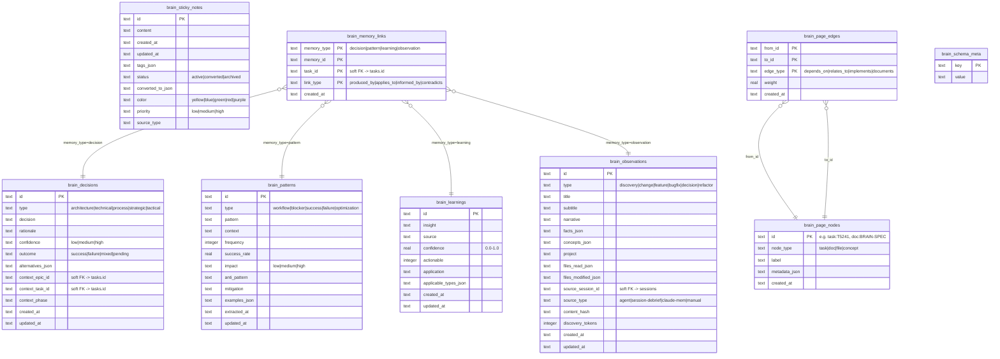
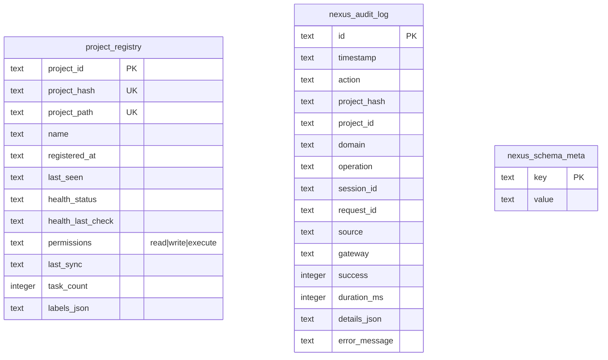

# CLEO Database ERD Reference

**Version**: 1.1.0
**Date**: 2026-03-21
**Status**: Current (post Core Hardening Waves 0-3, T033 indexes, T060 pipeline stage binding)
**Schema Authority**: `packages/core/src/store/tasks-schema.ts`, `brain-schema.ts`, `chain-schema.ts`, `agent-schema.ts`, `nexus-schema.ts`
**Related Audits**: T030 (soft FK audit), T031 (index analysis)

---

## Overview

CLEO uses three SQLite databases, each serving a distinct domain:

| Database | Schema File(s) | Purpose |
|----------|---------------|---------|
| `tasks.db` | `tasks-schema.ts`, `chain-schema.ts`, `agent-schema.ts` | Core work management, sessions, lifecycle, audit, agents |
| `brain.db` | `brain-schema.ts` | Cognitive memory: decisions, patterns, learnings, observations, graph |
| `nexus.db` | `nexus-schema.ts` | Cross-project registry and audit |

---

## 1. tasks.db

The primary database containing task management, session lifecycle, RCASD pipeline governance, WarpChain orchestration, audit logging, token telemetry, and agent runtime tracking.

### 1.1 ERD

```mermaid
erDiagram
    tasks {
        text id PK "Task identifier (e.g. T001, T029)"
        text title "Human-readable task title (NOT NULL)"
        text description "Extended description (nullable)"
        text status "pending|active|blocked|done|cancelled|archived"
        text priority "critical|high|medium|low (default: medium)"
        text type "epic|task|subtask"
        text parent_id FK "SET NULL -> tasks.id (self-ref)"
        text phase "Project phase name (nullable)"
        text size "small|medium|large (nullable)"
        integer position "Sort order within sibling group (nullable)"
        integer position_version "Optimistic lock counter (default: 0)"
        text labels_json "JSON array of label strings (default: [])"
        text notes_json "JSON array of note strings (default: [])"
        text acceptance_json "JSON array of acceptance criteria strings (default: [])"
        text files_json "JSON array of related file paths (default: [])"
        text origin "Provenance source (nullable)"
        text blocked_by "Free-text blocker description (nullable)"
        text epic_lifecycle "Epic lifecycle phase name (nullable)"
        integer no_auto_complete "Disable auto-complete on subtask completion (boolean, nullable)"
        text created_at "ISO 8601 timestamp (NOT NULL, default: now)"
        text updated_at "ISO 8601 timestamp (nullable)"
        text completed_at "ISO 8601 timestamp (nullable)"
        text cancelled_at "ISO 8601 timestamp (nullable)"
        text cancellation_reason "Reason for cancellation (nullable)"
        text archived_at "ISO 8601 timestamp set when status=archived (nullable)"
        text archive_reason "Reason for archiving (nullable)"
        integer cycle_time_days "Computed days from creation to completion (nullable)"
        text verification_json "JSON verification gate state object (nullable)"
        text created_by "Agent or user identifier (nullable)"
        text modified_by "Last modifier identifier (nullable)"
        text session_id FK "SET NULL -> sessions.id (soft FK, T033)"
        text pipeline_stage "RCASD-IVTR+C stage name (T060, nullable)"
    }

    task_dependencies {
        text task_id PK_FK "CASCADE -> tasks.id"
        text depends_on PK_FK "CASCADE -> tasks.id (composite PK)"
    }

    task_relations {
        text task_id PK_FK "CASCADE -> tasks.id"
        text related_to PK_FK "CASCADE -> tasks.id (composite PK)"
        text relation_type "related|blocks|duplicates|absorbs|fixes|extends|supersedes (default: related)"
        text reason "Human-readable relation rationale (nullable)"
    }

    sessions {
        text id PK "Session identifier (e.g. ses_20260320172953_529cc7)"
        text name "Human-readable session name (NOT NULL)"
        text status "active|ended|orphaned|suspended (default: active)"
        text scope_json "JSON scope object (NOT NULL, default: {})"
        text current_task FK "SET NULL -> tasks.id (soft FK, T033)"
        text task_started_at "ISO 8601 when current task was set (nullable)"
        text agent "Agent name/identifier (nullable)"
        text notes_json "JSON array of session notes (default: [])"
        text tasks_completed_json "JSON array of completed task IDs (default: [])"
        text tasks_created_json "JSON array of created task IDs (default: [])"
        text handoff_json "JSON handoff context for next session (nullable)"
        text started_at "ISO 8601 start time (NOT NULL, default: now)"
        text ended_at "ISO 8601 end time (nullable)"
        text previous_session_id FK "SET NULL -> sessions.id (chain)"
        text next_session_id FK "SET NULL -> sessions.id (chain)"
        text agent_identifier "Provider-specific agent identifier (nullable)"
        text handoff_consumed_at "ISO 8601 when handoff was consumed (nullable)"
        text handoff_consumed_by "Session ID that consumed the handoff (nullable)"
        text debrief_json "JSON debrief object from session end (nullable)"
        text provider_id "Provider adapter identifier (nullable)"
        text stats_json "JSON session statistics object (nullable)"
        integer resume_count "Number of times session was resumed (nullable)"
        integer grade_mode "Whether session was started with grading enabled (boolean, nullable)"
    }

    task_work_history {
        integer id PK "Auto-increment surrogate key"
        text session_id FK "CASCADE -> sessions.id"
        text task_id FK "CASCADE -> tasks.id (soft FK, T033)"
        text set_at "ISO 8601 when task was set as current (NOT NULL, default: now)"
        text cleared_at "ISO 8601 when task was unset (nullable)"
    }

    lifecycle_pipelines {
        text id PK "Pipeline identifier"
        text task_id FK "CASCADE -> tasks.id (must reference an epic)"
        text status "active|completed|blocked|failed|cancelled|aborted (default: active)"
        text current_stage_id "ID of the currently active stage (soft ref, nullable)"
        text started_at "ISO 8601 pipeline start time (NOT NULL, default: now)"
        text completed_at "ISO 8601 completion time (nullable)"
        text updated_at "ISO 8601 last update time (default: now)"
        integer version "Optimistic lock version (NOT NULL, default: 1)"
    }

    lifecycle_stages {
        text id PK "Stage identifier"
        text pipeline_id FK "CASCADE -> lifecycle_pipelines.id"
        text stage_name "research|consensus|architecture_decision|specification|decomposition|implementation|validation|testing|release|contribution"
        text status "not_started|in_progress|blocked|completed|skipped|failed (default: not_started)"
        integer sequence "Ordered position within the pipeline (NOT NULL)"
        text started_at "ISO 8601 when stage was entered (nullable)"
        text completed_at "ISO 8601 when stage completed (nullable)"
        text blocked_at "ISO 8601 when stage was blocked (nullable)"
        text block_reason "Reason for blockage (nullable)"
        text skipped_at "ISO 8601 when stage was skipped (nullable)"
        text skip_reason "Reason for skip (nullable)"
        text notes_json "JSON array of stage notes (default: [])"
        text metadata_json "JSON blob of stage-specific metadata (default: {})"
        text output_file "Path to the stage output artifact (nullable)"
        text created_by "Agent identifier that created the stage (nullable)"
        text validated_by "Agent identifier that validated the stage (nullable)"
        text validated_at "ISO 8601 validation timestamp (nullable)"
        text validation_status "pending|in_review|approved|rejected|needs_revision (nullable)"
        text provenance_chain_json "JSON array of provenance chain entries (nullable)"
    }

    lifecycle_gate_results {
        text id PK "Gate result identifier"
        text stage_id FK "CASCADE -> lifecycle_stages.id"
        text gate_name "Name of the gate being checked (NOT NULL)"
        text result "pass|fail|warn (NOT NULL)"
        text checked_at "ISO 8601 check timestamp (NOT NULL, default: now)"
        text checked_by "Agent/system that checked the gate (NOT NULL)"
        text details "Extended details about the result (nullable)"
        text reason "Reason for fail/warn result (nullable)"
    }

    lifecycle_evidence {
        text id PK "Evidence identifier"
        text stage_id FK "CASCADE -> lifecycle_stages.id"
        text uri "URI to the evidence artifact (NOT NULL)"
        text type "file|url|manifest (NOT NULL)"
        text recorded_at "ISO 8601 recording timestamp (NOT NULL, default: now)"
        text recorded_by "Agent/system that recorded the evidence (nullable)"
        text description "Human-readable description of the artifact (nullable)"
    }

    lifecycle_transitions {
        text id PK "Transition identifier"
        text pipeline_id FK "CASCADE -> lifecycle_pipelines.id"
        text from_stage_id FK "CASCADE -> lifecycle_stages.id (soft FK pending T033)"
        text to_stage_id FK "CASCADE -> lifecycle_stages.id (soft FK pending T033)"
        text transition_type "automatic|manual|forced (NOT NULL, default: automatic)"
        text transitioned_by "Agent/system that triggered the transition (nullable)"
        text created_at "ISO 8601 transition timestamp (NOT NULL, default: now)"
    }

    manifest_entries {
        text id PK "Manifest entry identifier"
        text pipeline_id FK "CASCADE -> lifecycle_pipelines.id (nullable)"
        text stage_id FK "CASCADE -> lifecycle_stages.id (nullable)"
        text title "Manifest entry title (NOT NULL)"
        text date "ISO 8601 date of the entry (NOT NULL)"
        text status "completed|partial|blocked|archived (NOT NULL)"
        text agent_type "Type of agent that produced this entry (nullable)"
        text output_file "Path to the output file artifact (nullable)"
        text topics_json "JSON array of topic strings (default: [])"
        text findings_json "JSON array of finding strings (default: [])"
        text linked_tasks_json "JSON array of linked task IDs (default: [])"
        text created_by "Agent identifier (nullable)"
        text created_at "ISO 8601 creation timestamp (NOT NULL, default: now)"
    }

    pipeline_manifest {
        text id PK "Manifest entry identifier"
        text session_id FK "SET NULL -> sessions.id (soft FK, T033)"
        text task_id FK "SET NULL -> tasks.id (soft FK, T033)"
        text epic_id FK "SET NULL -> tasks.id (soft FK, T033)"
        text type "Content type classifier (NOT NULL)"
        text content "Full manifest entry content (NOT NULL)"
        text content_hash "SHA-256 hash prefix for deduplication (nullable)"
        text status "Entry status (NOT NULL, default: active)"
        integer distilled "Whether entry has been distilled to brain.db (boolean, default: false)"
        text brain_obs_id "Soft ref to brain_observations.id in brain.db (cross-DB, nullable)"
        text source_file "Source file path (nullable)"
        text metadata_json "JSON metadata blob (nullable)"
        text created_at "ISO 8601 creation timestamp (NOT NULL)"
        text archived_at "ISO 8601 archive timestamp (nullable)"
    }

    release_manifests {
        text id PK "Release manifest identifier"
        text version UK "Semantic version string (NOT NULL, UNIQUE)"
        text status "draft|prepared|committed|tagged|pushed (NOT NULL, default: draft)"
        text pipeline_id FK "SET NULL -> lifecycle_pipelines.id (nullable)"
        text epic_id FK "SET NULL -> tasks.id (soft FK, T033)"
        text tasks_json "JSON array of task IDs included in release (NOT NULL, default: [])"
        text changelog "Release changelog text (nullable)"
        text notes "Release notes (nullable)"
        text previous_version "Version string of the previous release (nullable)"
        text commit_sha "Git commit SHA (nullable)"
        text git_tag "Git tag name (nullable)"
        text npm_dist_tag "npm distribution tag (nullable)"
        text created_at "ISO 8601 creation timestamp (NOT NULL)"
        text prepared_at "ISO 8601 prepare timestamp (nullable)"
        text committed_at "ISO 8601 commit timestamp (nullable)"
        text tagged_at "ISO 8601 tag timestamp (nullable)"
        text pushed_at "ISO 8601 push timestamp (nullable)"
    }

    architecture_decisions {
        text id PK "ADR identifier (e.g. ADR-001)"
        text title "ADR title (NOT NULL)"
        text status "proposed|accepted|superseded|deprecated (NOT NULL, default: proposed)"
        text supersedes_id "Soft FK -> architecture_decisions.id (SET NULL)"
        text superseded_by_id "Soft FK -> architecture_decisions.id (SET NULL)"
        text consensus_manifest_id "Soft FK -> manifest_entries.id (SET NULL, T033)"
        text content "Full ADR content in Markdown (NOT NULL)"
        text created_at "ISO 8601 creation timestamp (NOT NULL, default: now)"
        text updated_at "ISO 8601 last update timestamp (nullable)"
        text date "ADR date string (NOT NULL, default: empty)"
        text accepted_at "ISO 8601 acceptance timestamp (nullable)"
        text gate "HITL|automated (nullable)"
        text gate_status "pending|passed|failed|waived (nullable)"
        text amends_id "Soft FK -> architecture_decisions.id (SET NULL)"
        text file_path "Relative path to the ADR markdown file (NOT NULL, default: empty)"
        text summary "Short cognitive search summary (nullable)"
        text keywords "Comma-separated keyword list (nullable)"
        text topics "Comma-separated topic list (nullable)"
    }

    adr_task_links {
        text adr_id PK_FK "CASCADE -> architecture_decisions.id"
        text task_id PK "CASCADE -> tasks.id (soft FK per T030 SFK-001)"
        text link_type "related|governed_by|implements (NOT NULL, default: related)"
    }

    adr_relations {
        text from_adr_id PK_FK "CASCADE -> architecture_decisions.id"
        text to_adr_id PK_FK "CASCADE -> architecture_decisions.id"
        text relation_type PK "supersedes|amends|related (NOT NULL)"
    }

    external_task_links {
        text id PK "External link identifier"
        text task_id FK "CASCADE -> tasks.id"
        text provider_id "Provider name (e.g. linear, jira, github) (NOT NULL)"
        text external_id "Provider-assigned task identifier (NOT NULL)"
        text external_url "URL to external task (nullable)"
        text external_title "Title of external task at last sync (nullable)"
        text link_type "created|matched|manual|transferred (NOT NULL)"
        text sync_direction "inbound|outbound|bidirectional (NOT NULL, default: inbound)"
        text metadata_json "JSON provider-specific metadata (default: {})"
        text linked_at "ISO 8601 link creation timestamp (NOT NULL, default: now)"
        text last_sync_at "ISO 8601 last sync timestamp (nullable)"
    }

    status_registry {
        text name PK "Status value string (composite PK with entity_type)"
        text entity_type PK "task|session|lifecycle_pipeline|lifecycle_stage|adr|gate|manifest"
        text namespace "workflow|governance|manifest (NOT NULL)"
        text description "Human-readable description (NOT NULL)"
        integer is_terminal "Whether this is a terminal state (boolean, NOT NULL, default: false)"
    }

    audit_log {
        text id PK "Audit log entry identifier"
        text timestamp "ISO 8601 event timestamp (NOT NULL, default: now)"
        text action "Operation action name (NOT NULL)"
        text task_id "Referenced task ID - intentional soft FK, survives task deletion (NOT NULL)"
        text actor "Agent/system that performed the action (NOT NULL, default: system)"
        text details_json "JSON details object (default: {})"
        text before_json "JSON snapshot of entity before change (nullable)"
        text after_json "JSON snapshot of entity after change (nullable)"
        text domain "MCP domain (e.g. tasks, session, memory) (nullable)"
        text operation "MCP operation name (nullable)"
        text session_id "Active session ID (soft ref, nullable)"
        text request_id "MCP request correlation ID (nullable)"
        integer duration_ms "Operation duration in milliseconds (nullable)"
        integer success "1 for success, 0 for failure (nullable)"
        text source "Operation source: cli|mcp|agent (nullable)"
        text gateway "Gateway type: query|mutate (nullable)"
        text error_message "Error description on failure (nullable)"
        text project_hash "SHA-256 prefix for multi-project correlation (nullable)"
    }

    token_usage {
        text id PK "Token usage record identifier"
        text created_at "ISO 8601 timestamp (NOT NULL, default: now)"
        text provider "AI provider name (NOT NULL, default: unknown)"
        text model "Model name/version (nullable)"
        text transport "cli|mcp|api|agent|unknown (NOT NULL, default: unknown)"
        text gateway "Gateway type: query|mutate (nullable)"
        text domain "MCP domain (nullable)"
        text operation "MCP operation (nullable)"
        text session_id FK "SET NULL -> sessions.id (soft FK, T033)"
        text task_id FK "SET NULL -> tasks.id (soft FK, T033)"
        text request_id "MCP request correlation ID (nullable)"
        integer input_chars "Input character count (NOT NULL, default: 0)"
        integer output_chars "Output character count (NOT NULL, default: 0)"
        integer input_tokens "Input token count (NOT NULL, default: 0)"
        integer output_tokens "Output token count (NOT NULL, default: 0)"
        integer total_tokens "Total token count (NOT NULL, default: 0)"
        text method "otel|provider_api|tokenizer|heuristic (NOT NULL, default: heuristic)"
        text confidence "real|high|estimated|coarse (NOT NULL, default: coarse)"
        text request_hash "SHA-256 hash of request (nullable)"
        text response_hash "SHA-256 hash of response (nullable)"
        text metadata_json "JSON metadata blob (NOT NULL, default: {})"
    }

    warp_chains {
        text id PK "WarpChain definition identifier"
        text name "Human-readable chain name (NOT NULL)"
        text version "Semantic version string (NOT NULL)"
        text description "Optional description (nullable)"
        text definition "JSON-serialized WarpChain definition (NOT NULL)"
        integer validated "Whether chain definition has been validated (boolean, default: false)"
        text created_at "ISO 8601 creation timestamp (default: now)"
        text updated_at "ISO 8601 last update timestamp (default: now)"
    }

    warp_chain_instances {
        text id PK "Chain instance identifier"
        text chain_id FK "CASCADE -> warp_chains.id"
        text epic_id "Soft FK -> tasks.id (epic), cascade recommended (T030 SFK-007)"
        text variables "JSON variable bindings for this instance (nullable)"
        text stage_to_task "JSON map of stage names to task IDs (nullable)"
        text status "pending|active|completed|failed|cancelled (NOT NULL, default: pending)"
        text current_stage "Name of the currently executing stage (nullable)"
        text gate_results "JSON array of GateResult objects (nullable)"
        text created_at "ISO 8601 creation timestamp (default: now)"
        text updated_at "ISO 8601 last update timestamp (default: now)"
    }

    agent_instances {
        text id PK "Agent instance identifier"
        text agent_type "orchestrator|executor|researcher|architect|validator|documentor|custom (NOT NULL)"
        text status "starting|active|idle|error|crashed|stopped (NOT NULL, default: starting)"
        text session_id "Soft FK -> sessions.id (SET NULL, T030 SFK-014)"
        text task_id "Soft FK -> tasks.id (SET NULL, T030 SFK-015)"
        text started_at "ISO 8601 start timestamp (NOT NULL, default: now)"
        text last_heartbeat "ISO 8601 last heartbeat timestamp (NOT NULL, default: now)"
        text stopped_at "ISO 8601 stop timestamp (nullable)"
        integer error_count "Cumulative error count (NOT NULL, default: 0)"
        integer total_tasks_completed "Cumulative completed task count (NOT NULL, default: 0)"
        text capacity "Fractional capacity value string 0.0-1.0 (NOT NULL, default: 1.0)"
        text metadata_json "JSON agent-specific metadata (default: {})"
        text parent_agent_id "Soft FK -> agent_instances.id (SET NULL, T030 SFK-016)"
    }

    agent_error_log {
        integer id PK "Auto-increment surrogate key"
        text agent_id "Soft FK -> agent_instances.id (CASCADE recommended, T030 SFK-017)"
        text error_type "retriable|permanent|unknown (NOT NULL)"
        text message "Error message (NOT NULL)"
        text stack "Stack trace (nullable)"
        text occurred_at "ISO 8601 occurrence timestamp (NOT NULL, default: now)"
        integer resolved "Whether error has been resolved (boolean, NOT NULL, default: false)"
    }

    schema_meta {
        text key PK "Metadata key"
        text value "Metadata value (NOT NULL)"
    }

    tasks ||--o{ task_dependencies : "task_id"
    tasks ||--o{ task_dependencies : "depends_on"
    tasks ||--o{ task_relations : "task_id"
    tasks ||--o{ task_relations : "related_to"
    tasks ||--o{ lifecycle_pipelines : "task_id"
    tasks ||--o{ external_task_links : "task_id"
    tasks ||--o| tasks : "parent_id"

    sessions ||--o{ task_work_history : "session_id"
    sessions ||--o| sessions : "previous_session_id"
    sessions ||--o| sessions : "next_session_id"

    lifecycle_pipelines ||--o{ lifecycle_stages : "pipeline_id"
    lifecycle_pipelines ||--o{ lifecycle_transitions : "pipeline_id"
    lifecycle_pipelines ||--o{ manifest_entries : "pipeline_id"
    lifecycle_pipelines ||--o| release_manifests : "pipeline_id"

    lifecycle_stages ||--o{ lifecycle_gate_results : "stage_id"
    lifecycle_stages ||--o{ lifecycle_evidence : "stage_id"
    lifecycle_stages ||--o{ manifest_entries : "stage_id"

    architecture_decisions ||--o{ adr_task_links : "adr_id"
    architecture_decisions ||--o{ adr_relations : "from_adr_id"
    architecture_decisions ||--o{ adr_relations : "to_adr_id"

    warp_chains ||--o{ warp_chain_instances : "chain_id"
```

### 1.2 Foreign Key Legend

Hard FKs are enforced via Drizzle ORM schema declarations. Soft FKs are application-enforced only.

> **Note**: `PRAGMA foreign_keys` is currently OFF at runtime (see T030). Hard FK constraints exist in the schema but are not enforced by SQLite at runtime. Enabling FK enforcement is a prerequisite for the T030 remediation plan.

#### Hard Foreign Keys (declared in schema)

| FK | From | To | On Delete |
|----|------|----|-----------|
| `tasks.parent_id` | `tasks` | `tasks.id` | SET NULL (self-referential) |
| `tasks.session_id` | `tasks` | `sessions.id` | SET NULL (T033 migration) |
| `task_dependencies.task_id` | `task_dependencies` | `tasks.id` | CASCADE |
| `task_dependencies.depends_on` | `task_dependencies` | `tasks.id` | CASCADE |
| `task_relations.task_id` | `task_relations` | `tasks.id` | CASCADE |
| `task_relations.related_to` | `task_relations` | `tasks.id` | CASCADE |
| `sessions.current_task` | `sessions` | `tasks.id` | SET NULL |
| `sessions.previous_session_id` | `sessions` | `sessions.id` | SET NULL (self-referential) |
| `sessions.next_session_id` | `sessions` | `sessions.id` | SET NULL (self-referential) |
| `task_work_history.session_id` | `task_work_history` | `sessions.id` | CASCADE |
| `lifecycle_pipelines.task_id` | `lifecycle_pipelines` | `tasks.id` | CASCADE |
| `lifecycle_stages.pipeline_id` | `lifecycle_stages` | `lifecycle_pipelines.id` | CASCADE |
| `lifecycle_gate_results.stage_id` | `lifecycle_gate_results` | `lifecycle_stages.id` | CASCADE |
| `lifecycle_evidence.stage_id` | `lifecycle_evidence` | `lifecycle_stages.id` | CASCADE |
| `lifecycle_transitions.pipeline_id` | `lifecycle_transitions` | `lifecycle_pipelines.id` | CASCADE |
| `manifest_entries.pipeline_id` | `manifest_entries` | `lifecycle_pipelines.id` | CASCADE |
| `manifest_entries.stage_id` | `manifest_entries` | `lifecycle_stages.id` | CASCADE |
| `manifestEntries.id (consensusManifestId)` | `architecture_decisions` | `manifest_entries.id` | SET NULL |
| `architecture_decisions.supersedes_id` | `architecture_decisions` | `architecture_decisions.id` | SET NULL (self-referential) |
| `architecture_decisions.superseded_by_id` | `architecture_decisions` | `architecture_decisions.id` | SET NULL (self-referential) |
| `architecture_decisions.amends_id` | `architecture_decisions` | `architecture_decisions.id` | SET NULL (self-referential) |
| `adr_task_links.adr_id` | `adr_task_links` | `architecture_decisions.id` | CASCADE |
| `adr_relations.from_adr_id` | `adr_relations` | `architecture_decisions.id` | CASCADE |
| `adr_relations.to_adr_id` | `adr_relations` | `architecture_decisions.id` | CASCADE |
| `external_task_links.task_id` | `external_task_links` | `tasks.id` | CASCADE |
| `release_manifests.pipeline_id` | `release_manifests` | `lifecycle_pipelines.id` | SET NULL |
| `pipeline_manifest.session_id` | `pipeline_manifest` | `sessions.id` | SET NULL |
| `pipeline_manifest.task_id` | `pipeline_manifest` | `tasks.id` | SET NULL |
| `pipeline_manifest.epic_id` | `pipeline_manifest` | `tasks.id` | SET NULL |
| `warp_chain_instances.chain_id` | `warp_chain_instances` | `warp_chains.id` | CASCADE |
| `token_usage.session_id` | `token_usage` | `sessions.id` | SET NULL |
| `token_usage.task_id` | `token_usage` | `tasks.id` | SET NULL |

#### Intentional Soft Foreign Keys (no DB constraint by design)

| FK | From | To | Reason |
|----|------|----|--------|
| `audit_log.task_id` | `audit_log` | `tasks.id` | Audit log must survive task deletion; `'system'` sentinel used for non-task ops |
| `adr_task_links.task_id` | `adr_task_links` | `tasks.id` | Tasks can be purged; T030 SFK-001 recommends CASCADE |
| `warp_chain_instances.epic_id` | `warp_chain_instances` | `tasks.id` | T030 SFK-007 recommends CASCADE |
| `agent_instances.session_id` | `agent_instances` | `sessions.id` | T030 SFK-014 recommends SET NULL |
| `agent_instances.task_id` | `agent_instances` | `tasks.id` | T030 SFK-015 recommends SET NULL |
| `agent_instances.parent_agent_id` | `agent_instances` | `agent_instances.id` | T030 SFK-016 recommends SET NULL (self-referential) |
| `agent_error_log.agent_id` | `agent_error_log` | `agent_instances.id` | T030 SFK-017 recommends CASCADE |
| `release_manifests.epic_id` | `release_manifests` | `tasks.id` | T030 SFK-006 recommends SET NULL |
| `lifecycle_transitions.from_stage_id` | `lifecycle_transitions` | `lifecycle_stages.id` | T030 SFK-008 recommends CASCADE |
| `lifecycle_transitions.to_stage_id` | `lifecycle_transitions` | `lifecycle_stages.id` | T030 SFK-009 recommends CASCADE |
| `pipeline_manifest.brain_obs_id` | `pipeline_manifest` | `brain_observations.id` (brain.db) | Cross-DB, application guard required (T030 SFK-005) |

### 1.3 Index Listing

Indexes marked with **(T033)** were added by the T033 composite index migration. See T031 analysis for rationale.

| Table | Index Name | Column(s) | Notes |
|-------|-----------|-----------|-------|
| `tasks` | `idx_tasks_status` | `status` | |
| `tasks` | `idx_tasks_parent_id` | `parent_id` | |
| `tasks` | `idx_tasks_phase` | `phase` | |
| `tasks` | `idx_tasks_type` | `type` | |
| `tasks` | `idx_tasks_priority` | `priority` | |
| `tasks` | `idx_tasks_session_id` | `session_id` | |
| `tasks` | `idx_tasks_pipeline_stage` | `pipeline_stage` | T060 |
| `tasks` | `idx_tasks_parent_status` | `parent_id, status` | T033 — getChildren hot path |
| `tasks` | `idx_tasks_status_priority` | `status, priority` | T033 — dashboard/list queries |
| `tasks` | `idx_tasks_type_phase` | `type, phase` | T033 — epic/phase-scoped listing |
| `tasks` | `idx_tasks_status_archive_reason` | `status, archive_reason` | T033 — archived stats |
| `task_dependencies` | `idx_deps_depends_on` | `depends_on` | |
| `task_relations` | `idx_task_relations_related_to` | `related_to` | |
| `sessions` | `idx_sessions_status` | `status` | |
| `sessions` | `idx_sessions_previous` | `previous_session_id` | |
| `sessions` | `idx_sessions_agent_identifier` | `agent_identifier` | |
| `sessions` | `idx_sessions_started_at` | `started_at` | |
| `sessions` | `idx_sessions_status_started_at` | `status, started_at` | T033 — getActiveSession hot path |
| `task_work_history` | `idx_work_history_session` | `session_id` | |
| `lifecycle_pipelines` | `idx_lifecycle_pipelines_task_id` | `task_id` | |
| `lifecycle_pipelines` | `idx_lifecycle_pipelines_status` | `status` | |
| `lifecycle_stages` | `idx_lifecycle_stages_pipeline_id` | `pipeline_id` | |
| `lifecycle_stages` | `idx_lifecycle_stages_stage_name` | `stage_name` | |
| `lifecycle_stages` | `idx_lifecycle_stages_status` | `status` | |
| `lifecycle_stages` | `idx_lifecycle_stages_validated_by` | `validated_by` | |
| `lifecycle_gate_results` | `idx_lifecycle_gate_results_stage_id` | `stage_id` | |
| `lifecycle_evidence` | `idx_lifecycle_evidence_stage_id` | `stage_id` | |
| `lifecycle_transitions` | `idx_lifecycle_transitions_pipeline_id` | `pipeline_id` | |
| `manifest_entries` | `idx_manifest_entries_pipeline_id` | `pipeline_id` | |
| `manifest_entries` | `idx_manifest_entries_stage_id` | `stage_id` | |
| `manifest_entries` | `idx_manifest_entries_status` | `status` | |
| `pipeline_manifest` | `idx_pipeline_manifest_task_id` | `task_id` | |
| `pipeline_manifest` | `idx_pipeline_manifest_session_id` | `session_id` | |
| `pipeline_manifest` | `idx_pipeline_manifest_distilled` | `distilled` | |
| `pipeline_manifest` | `idx_pipeline_manifest_status` | `status` | |
| `pipeline_manifest` | `idx_pipeline_manifest_content_hash` | `content_hash` | |
| `release_manifests` | `idx_release_manifests_status` | `status` | |
| `release_manifests` | `idx_release_manifests_version` | `version` | |
| `architecture_decisions` | `idx_arch_decisions_status` | `status` | |
| `architecture_decisions` | `idx_arch_decisions_amends_id` | `amends_id` | |
| `adr_task_links` | `idx_adr_task_links_task_id` | `task_id` | |
| `external_task_links` | `idx_ext_links_task_id` | `task_id` | |
| `external_task_links` | `idx_ext_links_provider_external` | `provider_id, external_id` | |
| `external_task_links` | `idx_ext_links_provider_id` | `provider_id` | |
| `status_registry` | `idx_status_registry_entity_type` | `entity_type` | |
| `status_registry` | `idx_status_registry_namespace` | `namespace` | |
| `audit_log` | `idx_audit_log_task_id` | `task_id` | |
| `audit_log` | `idx_audit_log_action` | `action` | |
| `audit_log` | `idx_audit_log_timestamp` | `timestamp` | |
| `audit_log` | `idx_audit_log_domain` | `domain` | |
| `audit_log` | `idx_audit_log_request_id` | `request_id` | |
| `audit_log` | `idx_audit_log_project_hash` | `project_hash` | |
| `audit_log` | `idx_audit_log_actor` | `actor` | |
| `audit_log` | `idx_audit_log_session_timestamp` | `session_id, timestamp` | T033 — session grading |
| `audit_log` | `idx_audit_log_domain_operation` | `domain, operation` | T033 — dispatch-layer queries |
| `token_usage` | `idx_token_usage_created_at` | `created_at` | |
| `token_usage` | `idx_token_usage_request_id` | `request_id` | |
| `token_usage` | `idx_token_usage_session_id` | `session_id` | |
| `token_usage` | `idx_token_usage_task_id` | `task_id` | |
| `token_usage` | `idx_token_usage_provider` | `provider` | |
| `token_usage` | `idx_token_usage_transport` | `transport` | |
| `token_usage` | `idx_token_usage_domain_operation` | `domain, operation` | |
| `token_usage` | `idx_token_usage_method` | `method` | |
| `token_usage` | `idx_token_usage_gateway` | `gateway` | |
| `warp_chains` | `idx_warp_chains_name` | `name` | |
| `warp_chain_instances` | `idx_warp_instances_chain` | `chain_id` | |
| `warp_chain_instances` | `idx_warp_instances_epic` | `epic_id` | |
| `warp_chain_instances` | `idx_warp_instances_status` | `status` | |
| `agent_instances` | `idx_agent_instances_status` | `status` | |
| `agent_instances` | `idx_agent_instances_agent_type` | `agent_type` | |
| `agent_instances` | `idx_agent_instances_session_id` | `session_id` | |
| `agent_instances` | `idx_agent_instances_task_id` | `task_id` | |
| `agent_instances` | `idx_agent_instances_parent_agent_id` | `parent_agent_id` | |
| `agent_instances` | `idx_agent_instances_last_heartbeat` | `last_heartbeat` | |
| `agent_error_log` | `idx_agent_error_log_agent_id` | `agent_id` | |
| `agent_error_log` | `idx_agent_error_log_error_type` | `error_type` | |
| `agent_error_log` | `idx_agent_error_log_occurred_at` | `occurred_at` | |

### 1.4 Unique Constraints

| Table | Constraint | Column(s) |
|-------|-----------|-----------|
| `release_manifests` | (column-level) | `version` |
| `external_task_links` | `uq_ext_links_task_provider_external` | `task_id, provider_id, external_id` |

### 1.5 Table Descriptions

| Table | Group | Purpose |
|-------|-------|---------|
| `tasks` | Core Tasks | Central work item store -- tasks, subtasks, epics with hierarchy, status, and provenance |
| `task_dependencies` | Core Tasks | Directed dependency edges between tasks (composite PK) |
| `task_relations` | Core Tasks | Typed relationships between tasks (related, blocks, duplicates, etc.) |
| `sessions` | Sessions | Agent work sessions with scope, handoff, debrief, and chain linking |
| `task_work_history` | Sessions | Tracks which task each session was working on over time |
| `lifecycle_pipelines` | Lifecycle | RCASD-IVTR+C pipeline instances bound to epic tasks |
| `lifecycle_stages` | Lifecycle | Individual stage progress within a pipeline (10 canonical stages) |
| `lifecycle_gate_results` | Lifecycle | Gate check outcomes (pass/fail/warn) for stage transitions |
| `lifecycle_evidence` | Lifecycle | Artifacts (files, URLs, manifests) attached as stage evidence |
| `lifecycle_transitions` | Lifecycle | Transition audit log between pipeline stages |
| `manifest_entries` | Manifests | RCASD provenance manifest entries linked to pipelines/stages |
| `pipeline_manifest` | Manifests | Pipeline-scoped content artifacts for distillation into brain.db |
| `release_manifests` | Manifests | Release version tracking with changelog, git tag, npm dist-tag |
| `architecture_decisions` | ADRs | Architecture Decision Records with supersession chains |
| `adr_task_links` | ADRs | Junction table linking ADRs to tasks (soft FK on task_id) |
| `adr_relations` | ADRs | Cross-reference relationships between ADRs |
| `external_task_links` | External Links | Provider-agnostic links between CLEO tasks and external issue trackers |
| `status_registry` | Registry | Runtime-queryable registry of all status values by entity type |
| `audit_log` | Audit | Append-only change log for all task operations (survives task deletion) |
| `token_usage` | Audit | Provider-aware token telemetry for CLI, MCP, and agent transports |
| `warp_chains` | WarpChains | Stored WarpChain definitions (serialized JSON) |
| `warp_chain_instances` | WarpChains | Runtime chain instances bound to epics |
| `agent_instances` | Agents | Runtime agent process tracking with heartbeat protocol |
| `agent_error_log` | Agents | Agent error history for self-healing and diagnostics |
| `schema_meta` | Metadata | Key-value store for schema version and migration metadata |

---

## 2. brain.db

The cognitive memory database storing decisions, patterns, learnings, observations, sticky notes, and a PageIndex knowledge graph.

### 2.1 ERD



### 2.2 Foreign Key Legend

brain.db uses **soft foreign keys** exclusively. All cross-database references (to tasks.db) are by convention, not enforced at the DB level.

| Reference | From | To | Type |
|-----------|------|----|------|
| `brain_decisions.context_epic_id` | `brain_decisions` | `tasks.id` (tasks.db) | Soft (cross-DB) |
| `brain_decisions.context_task_id` | `brain_decisions` | `tasks.id` (tasks.db) | Soft (cross-DB) |
| `brain_observations.source_session_id` | `brain_observations` | `sessions.id` (tasks.db) | Soft (cross-DB) |
| `brain_memory_links.task_id` | `brain_memory_links` | `tasks.id` (tasks.db) | Soft (cross-DB) |
| `brain_memory_links.memory_id` | `brain_memory_links` | varies by `memory_type` | Polymorphic (in-DB) |
| `brain_page_edges.from_id` | `brain_page_edges` | `brain_page_nodes.id` | Soft (in-DB) |
| `brain_page_edges.to_id` | `brain_page_edges` | `brain_page_nodes.id` | Soft (in-DB) |

### 2.3 Index Listing

Indexes marked with **(T033)** were added by the T033 brain index migration. See T031 analysis for rationale.

| Table | Index Name | Column(s) | Notes |
|-------|-----------|-----------|-------|
| `brain_decisions` | `idx_brain_decisions_type` | `type` | |
| `brain_decisions` | `idx_brain_decisions_confidence` | `confidence` | |
| `brain_decisions` | `idx_brain_decisions_outcome` | `outcome` | |
| `brain_decisions` | `idx_brain_decisions_context_epic` | `context_epic_id` | |
| `brain_decisions` | `idx_brain_decisions_context_task` | `context_task_id` | |
| `brain_patterns` | `idx_brain_patterns_type` | `type` | |
| `brain_patterns` | `idx_brain_patterns_impact` | `impact` | |
| `brain_patterns` | `idx_brain_patterns_frequency` | `frequency` | |
| `brain_learnings` | `idx_brain_learnings_confidence` | `confidence` | |
| `brain_learnings` | `idx_brain_learnings_actionable` | `actionable` | |
| `brain_observations` | `idx_brain_observations_type` | `type` | |
| `brain_observations` | `idx_brain_observations_project` | `project` | |
| `brain_observations` | `idx_brain_observations_created_at` | `created_at` | |
| `brain_observations` | `idx_brain_observations_source_type` | `source_type` | |
| `brain_observations` | `idx_brain_observations_source_session` | `source_session_id` | |
| `brain_observations` | `idx_brain_observations_content_hash` | `content_hash` | Superseded by T033 composite |
| `brain_observations` | `idx_brain_observations_content_hash_created_at` | `content_hash, created_at` | T033 — dedup hot path in observeBrain |
| `brain_observations` | `idx_brain_observations_type_project` | `type, project` | T033 — findObservations compound filter |
| `brain_sticky_notes` | `idx_brain_sticky_status` | `status` | |
| `brain_sticky_notes` | `idx_brain_sticky_created` | `created_at` | |
| `brain_sticky_notes` | `idx_brain_sticky_tags` | `tags_json` | |
| `brain_memory_links` | `idx_brain_links_task` | `task_id` | |
| `brain_memory_links` | `idx_brain_links_memory` | `memory_type, memory_id` | |
| `brain_page_nodes` | `idx_brain_nodes_type` | `node_type` | |
| `brain_page_edges` | `idx_brain_edges_from` | `from_id` | |
| `brain_page_edges` | `idx_brain_edges_to` | `to_id` | |

### 2.4 Table Descriptions

| Table | Group | Purpose |
|-------|-------|---------|
| `brain_decisions` | Memory | Architecture, technical, process, strategic, and tactical decisions with rationale and outcome tracking |
| `brain_patterns` | Memory | Detected workflow, blocker, success, failure, and optimization patterns with frequency and success rate |
| `brain_learnings` | Memory | Extracted insights with confidence scores and applicability metadata |
| `brain_observations` | Memory | General-purpose observations (claude-mem compatible) with facts, concepts, and file tracking |
| `brain_sticky_notes` | Sticky Notes | Ephemeral quick-capture notes before formal classification, with color and priority |
| `brain_memory_links` | Memory | Polymorphic cross-reference linking any memory entry type to tasks in tasks.db |
| `brain_page_nodes` | Graph | PageIndex knowledge graph nodes (tasks, docs, files, concepts) |
| `brain_page_edges` | Graph | Directed weighted edges between graph nodes |
| `brain_schema_meta` | Metadata | Key-value store for brain.db schema versioning |

---

## 3. nexus.db

The cross-project registry database for the Nexus domain, tracking project registration and audit trails.

### 3.1 ERD



### 3.2 Foreign Key Legend

nexus.db has **no hard foreign keys**. The `project_hash` and `project_id` columns in `nexus_audit_log` are informational references to `project_registry` rows, but are not enforced -- audit entries must survive project unregistration.

### 3.3 Index Listing

| Table | Index Name | Column(s) |
|-------|-----------|-----------|
| `project_registry` | `idx_project_registry_hash` | `project_hash` |
| `project_registry` | `idx_project_registry_health` | `health_status` |
| `project_registry` | `idx_project_registry_name` | `name` |
| `nexus_audit_log` | `idx_nexus_audit_timestamp` | `timestamp` |
| `nexus_audit_log` | `idx_nexus_audit_action` | `action` |
| `nexus_audit_log` | `idx_nexus_audit_project_hash` | `project_hash` |
| `nexus_audit_log` | `idx_nexus_audit_project_id` | `project_id` |
| `nexus_audit_log` | `idx_nexus_audit_session` | `session_id` |

### 3.4 Unique Constraints

| Table | Column(s) |
|-------|-----------|
| `project_registry` | `project_hash` (column-level) |
| `project_registry` | `project_path` (column-level) |

### 3.5 Table Descriptions

| Table | Purpose |
|-------|---------|
| `project_registry` | Central registry of all CLEO projects known to the Nexus, with health, permissions, and sync metadata |
| `nexus_audit_log` | Append-only audit log for all Nexus operations (register, unregister, sync, permission changes) |
| `nexus_schema_meta` | Key-value store for nexus.db schema versioning |

---

## Aggregate Statistics

Post T033 indexes and T060 pipeline stage binding.

| Database | Tables | Hard FKs | Intentional Soft FKs | Indexes | Unique Constraints |
|----------|--------|----------|----------------------|---------|-------------------|
| tasks.db | 25 | 30 | 11 | 79 | 2 |
| brain.db | 9 | 0 | 7 | 26 | 0 |
| nexus.db | 3 | 0 | 2 | 8 | 2 |
| **Total** | **37** | **30** | **20** | **113** | **4** |

## Cross-Database Reference Map

CLEO uses three separate SQLite databases. Cross-database references are enforced at the application layer only (SQLite cannot enforce FKs across connections).

```
tasks.db                    brain.db                    nexus.db
────────────────────        ────────────────────        ────────────────────
tasks.id ◄──────────────── brain_decisions.context_task_id
tasks.id ◄──────────────── brain_decisions.context_epic_id
sessions.id ◄────────────── brain_observations.source_session_id
tasks.id ◄──────────────── brain_memory_links.task_id
tasks.id ◄──────────────── brain_page_nodes.id (task:T* prefix)
brain_observations.id ◄──── pipeline_manifest.brain_obs_id
                                                        project_registry (no cross-DB refs)
                                                        nexus_audit_log.project_id (informational only)
```

See T030 audit for full soft FK remediation plan and cross-DB application guard requirements.

## Status Registry Values

The status_registry table (tasks.db) stores all valid status values. The canonical source is `packages/contracts/src/status-registry.ts`.

| Entity Type | Valid Values | Terminal Values |
|-------------|-------------|-----------------|
| `task` | pending, active, blocked, done, cancelled, archived | done, cancelled, archived |
| `session` | active, ended, orphaned, suspended | ended |
| `lifecycle_pipeline` | active, completed, blocked, failed, cancelled, aborted | completed, failed, cancelled, aborted |
| `lifecycle_stage` | not_started, in_progress, blocked, completed, skipped, failed | completed, skipped, failed |
| `adr` | proposed, accepted, superseded, deprecated | (none) |
| `gate` | pending, passed, failed, waived | (none) |
| `manifest` | completed, partial, blocked, archived | (none) |

### Additional Enum Values (not in status_registry)

| Field | Values | Notes |
|-------|--------|-------|
| `tasks.priority` | critical, high, medium, low | Default: medium |
| `tasks.type` | epic, task, subtask | |
| `tasks.size` | small, medium, large | |
| `tasks.pipeline_stage` | research, consensus, architecture_decision, specification, decomposition, implementation, validation, testing, release, contribution | T060, RCASD-IVTR+C stages |
| `task_relations.relation_type` | related, blocks, duplicates, absorbs, fixes, extends, supersedes | Default: related |
| `lifecycle_stages.stage_name` | (same as pipeline_stage above) | Canonical RCASD-IVTR+C stages |
| `lifecycle_stages.validation_status` | pending, in_review, approved, rejected, needs_revision | RCASD provenance |
| `token_usage.transport` | cli, mcp, api, agent, unknown | Default: unknown |
| `token_usage.method` | otel, provider_api, tokenizer, heuristic | Default: heuristic |
| `token_usage.confidence` | real, high, estimated, coarse | Default: coarse |
| `external_task_links.link_type` | created, matched, manual, transferred | |
| `external_task_links.sync_direction` | inbound, outbound, bidirectional | Default: inbound |
| `adr_task_links.link_type` | related, governed_by, implements | Default: related |
| `adr_relations.relation_type` | supersedes, amends, related | |
| `architecture_decisions.gate` | HITL, automated | |
| `agent_instances.agent_type` | orchestrator, executor, researcher, architect, validator, documentor, custom | |
| `agent_instances.status` | starting, active, idle, error, crashed, stopped | Default: starting |
| `agent_error_log.error_type` | retriable, permanent, unknown | |
| `brain_decisions.type` | architecture, technical, process, strategic, tactical | |
| `brain_decisions.confidence` | low, medium, high | |
| `brain_decisions.outcome` | success, failure, mixed, pending | |
| `brain_patterns.type` | workflow, blocker, success, failure, optimization | |
| `brain_patterns.impact` | low, medium, high | |
| `brain_observations.type` | discovery, change, feature, bugfix, decision, refactor | |
| `brain_observations.source_type` | agent, session-debrief, claude-mem, manual | Default: agent |
| `brain_memory_links.memory_type` | decision, pattern, learning, observation | |
| `brain_memory_links.link_type` | produced_by, applies_to, informed_by, contradicts | |
| `brain_page_nodes.node_type` | task, doc, file, concept | |
| `brain_page_edges.edge_type` | depends_on, relates_to, implements, documents | |
| `brain_sticky_notes.status` | active, converted, archived | Default: active |
| `brain_sticky_notes.color` | yellow, blue, green, red, purple | |
| `brain_sticky_notes.priority` | low, medium, high | |
| `project_registry.permissions` | read, write, execute | Default: read |
| `project_registry.health_status` | unknown, healthy, degraded, unreachable | Default: unknown |

## Related Documents

- `docs/specs/SCHEMA-AUTHORITY.md` — canonical source rules and migration authority
- `docs/specs/CLEO-BRAIN-SPECIFICATION.md` — brain.db capability model
- `docs/specs/CLEO-NEXUS-ARCHITECTURE.md` — nexus.db architecture
- `docs/specs/CLEO-DATA-INTEGRITY-SPEC.md` — data integrity rules
- `.cleo/agent-outputs/T030-soft-fk-audit.md` — soft FK audit and remediation plan
- `.cleo/agent-outputs/T031-index-analysis.md` — index analysis and recommendations
- `packages/contracts/src/status-registry.ts` — status enum canonical source
- `packages/core/src/store/tasks-schema.ts` — tasks.db Drizzle ORM schema
- `packages/core/src/store/brain-schema.ts` — brain.db Drizzle ORM schema
- `packages/core/src/store/nexus-schema.ts` — nexus.db Drizzle ORM schema
