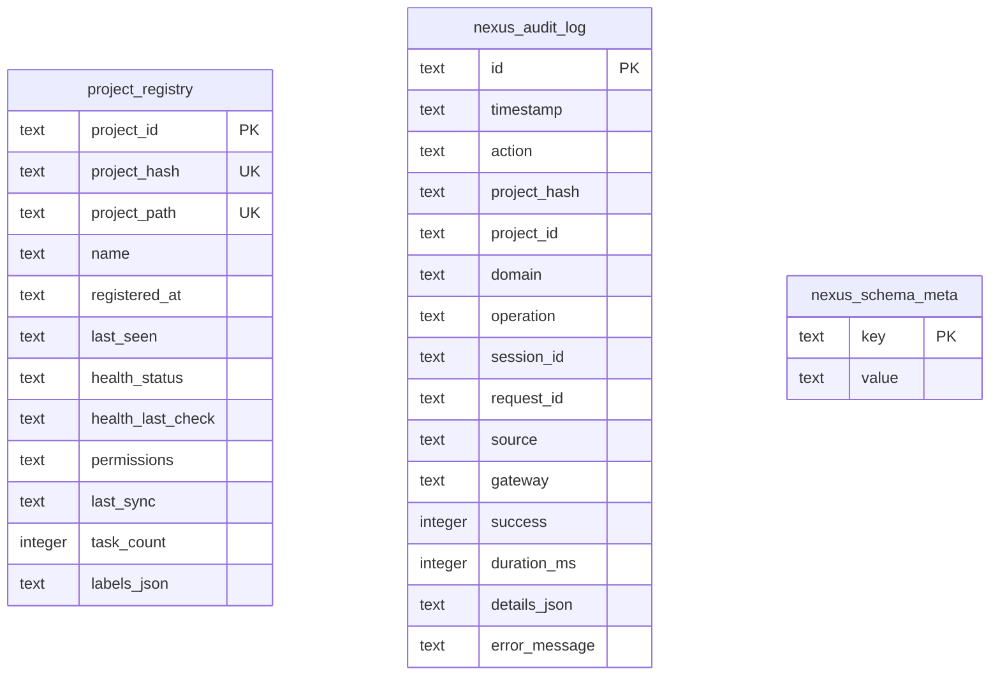

# CLEO Database Architecture — Combined ERD

**Databases**: tasks.db, brain.db, nexus.db
**Schema sources**: `packages/core/src/store/tasks-schema.ts`, `brain-schema.ts`, `agent-schema.ts`, `chain-schema.ts`, `nexus-schema.ts`
**Generated**: 2026-03-21
**Epic**: T029 (Schema Architecture Review) / Task: T036

---

## Overview

CLEO uses four databases, each with a distinct responsibility. See `docs/specs/DATABASE-ARCHITECTURE.md` for the full architecture including ORM strategy and cloud deployment notes.

| Database | File | Tables | Purpose |
|----------|------|--------|---------|
| **tasks.db** | `.cleo/tasks.db` | 25 | Project task lifecycle, sessions, lifecycle pipeline, ADRs, telemetry |
| **brain.db** | `.cleo/brain.db` | 9 | Cognitive memory: decisions, patterns, learnings, observations, graph |
| **signaldock.db** | `.cleo/signaldock.db` | 17+ | Agent identity SSoT, messaging, conversations, auth (Diesel ORM, Rust) |
| **nexus.db** | `~/.local/share/cleo/nexus.db` | 3 | Cross-project registry and audit (global, not per-project) |

The databases are **isolated** — no native SQLite foreign keys cross database boundaries. Cross-DB references are enforced at the application layer. signaldock.db is managed by Diesel ORM (Rust), while the other three use Drizzle ORM (TypeScript).

---

## Database Cluster Diagram

```mermaid
erDiagram

  %% =========================================================
  %%  tasks.db — CORE CLUSTER
  %% =========================================================

  tasks {
    text id PK
    text title
    text status
    text priority
    text type
    text parent_id FK
    text session_id FK
    text pipeline_stage
  }

  sessions {
    text id PK
    text name
    text status
    text current_task FK
    text previous_session_id FK
    text next_session_id FK
  }

  task_dependencies {
    text task_id PK-FK
    text depends_on PK-FK
  }

  task_relations {
    text task_id PK-FK
    text related_to PK-FK
    text relation_type
  }

  task_work_history {
    integer id PK
    text session_id FK
    text task_id FK
  }

  tasks ||--o{ tasks : "parent_id"
  tasks }o--o| sessions : "session_id"
  sessions }o--o| tasks : "current_task"
  sessions ||--o{ sessions : "previous/next_session_id"
  tasks ||--o{ task_dependencies : "task_id / depends_on"
  tasks ||--o{ task_relations : "task_id / related_to"
  sessions ||--o{ task_work_history : "session_id CASCADE"
  tasks ||--o{ task_work_history : "task_id CASCADE"

  %% =========================================================
  %%  tasks.db — LIFECYCLE CLUSTER
  %% =========================================================

  lifecycle_pipelines {
    text id PK
    text task_id FK
    text status
  }

  lifecycle_stages {
    text id PK
    text pipeline_id FK
    text stage_name
    text status
    integer sequence
  }

  lifecycle_gate_results {
    text id PK
    text stage_id FK
    text gate_name
    text result
  }

  lifecycle_evidence {
    text id PK
    text stage_id FK
    text uri
    text type
  }

  lifecycle_transitions {
    text id PK
    text pipeline_id FK
    text from_stage_id FK
    text to_stage_id FK
  }

  manifest_entries {
    text id PK
    text pipeline_id FK
    text stage_id FK
    text title
    text status
  }

  pipeline_manifest {
    text id PK
    text session_id FK
    text task_id FK
    text epic_id FK
    text brain_obs_id
    text content
  }

  release_manifests {
    text id PK
    text version
    text pipeline_id FK
    text epic_id FK
  }

  tasks ||--o{ lifecycle_pipelines : "CASCADE"
  lifecycle_pipelines ||--o{ lifecycle_stages : "CASCADE"
  lifecycle_stages ||--o{ lifecycle_gate_results : "CASCADE"
  lifecycle_stages ||--o{ lifecycle_evidence : "CASCADE"
  lifecycle_pipelines ||--o{ lifecycle_transitions : "CASCADE"
  lifecycle_stages ||--o{ lifecycle_transitions : "from/to CASCADE"
  lifecycle_pipelines ||--o{ manifest_entries : "CASCADE"
  lifecycle_stages ||--o{ manifest_entries : "CASCADE"
  sessions }o--o{ pipeline_manifest : "SET NULL"
  tasks }o--o{ pipeline_manifest : "task/epic SET NULL"
  lifecycle_pipelines }o--o| release_manifests : "SET NULL"
  tasks }o--o| release_manifests : "epic SET NULL"

  %% =========================================================
  %%  tasks.db — ADR CLUSTER
  %% =========================================================

  architecture_decisions {
    text id PK
    text title
    text status
    text supersedes_id FK
    text superseded_by_id FK
    text amends_id FK
    text consensus_manifest_id FK
  }

  adr_task_links {
    text adr_id PK-FK
    text task_id PK-FK
    text link_type
  }

  adr_relations {
    text from_adr_id PK-FK
    text to_adr_id PK-FK
    text relation_type PK
  }

  architecture_decisions ||--o{ architecture_decisions : "supersedes/amends SET NULL"
  manifest_entries }o--o| architecture_decisions : "consensus_manifest_id SET NULL"
  architecture_decisions ||--o{ adr_task_links : "CASCADE"
  tasks ||--o{ adr_task_links : "CASCADE"
  architecture_decisions ||--o{ adr_relations : "CASCADE"

  %% =========================================================
  %%  tasks.db — AGENT CLUSTER
  %% =========================================================

  agent_instances {
    text id PK
    text agent_type
    text status
    text session_id
    text task_id
    text parent_agent_id
  }

  agent_error_log {
    integer id PK
    text agent_id
    text error_type
    text message
  }

  warp_chains {
    text id PK
    text name
    text version
  }

  warp_chain_instances {
    text id PK
    text chain_id FK
    text epic_id
    text status
  }

  agent_instances ||--o{ agent_instances : "parent_agent_id soft"
  agent_instances ||--o{ agent_error_log : "agent_id soft"
  warp_chains ||--o{ warp_chain_instances : "CASCADE"
  tasks }o--o{ warp_chain_instances : "epic_id soft"

  %% =========================================================
  %%  tasks.db — TELEMETRY CLUSTER
  %% =========================================================

  audit_log {
    text id PK
    text timestamp
    text action
    text task_id
    text session_id
    text domain
    text operation
  }

  token_usage {
    text id PK
    text provider
    text transport
    text session_id FK
    text task_id FK
    integer total_tokens
  }

  external_task_links {
    text id PK
    text task_id FK
    text provider_id
    text external_id
  }

  status_registry {
    text name PK
    text entity_type PK
    text namespace
  }

  sessions }o--o{ token_usage : "SET NULL"
  tasks }o--o{ token_usage : "SET NULL"
  tasks ||--o{ external_task_links : "CASCADE"

  %% =========================================================
  %%  brain.db — COGNITIVE CLUSTER
  %% =========================================================

  brain_decisions {
    text id PK
    text type
    text decision
    text confidence
    text context_epic_id
    text context_task_id
  }

  brain_patterns {
    text id PK
    text type
    text pattern
    real success_rate
  }

  brain_learnings {
    text id PK
    text insight
    real confidence
    integer actionable
  }

  brain_observations {
    text id PK
    text type
    text title
    text project
    text source_session_id
    text content_hash
  }

  brain_sticky_notes {
    text id PK
    text content
    text status
  }

  brain_memory_links {
    text memory_type PK
    text memory_id PK
    text task_id PK
    text link_type PK
  }

  brain_page_nodes {
    text id PK
    text node_type
    text label
  }

  brain_page_edges {
    text from_id PK
    text to_id PK
    text edge_type PK
    real weight
  }

  brain_page_nodes ||--o{ brain_page_edges : "from_id/to_id (app-level)"

  %% =========================================================
  %%  nexus.db — REGISTRY CLUSTER
  %% =========================================================

  project_registry {
    text project_id PK
    text project_hash
    text project_path
    text name
    text health_status
    integer task_count
  }

  nexus_audit_log {
    text id PK
    text timestamp
    text action
    text project_hash
    text project_id
    text session_id
  }

  nexus_schema_meta {
    text key PK
    text value
  }
```

---

## Cross-Database Reference Map

These references exist in code but cannot be declared as native SQLite FKs.

```
brain.db                              tasks.db
────────────────────────────────────────────────────────────────────────
brain_decisions.context_epic_id   --> tasks.id (type='epic')     N:1 opt
brain_decisions.context_task_id   --> tasks.id                   N:1 opt
brain_memory_links.task_id        --> tasks.id                   N:1 req
brain_observations.source_session_id --> sessions.id             N:1 opt
brain_page_nodes.id (task:*)      --> tasks.id (composite key)   1:1 opt
pipeline_manifest.brain_obs_id    --> brain_observations.id      N:1 opt

nexus.db                              tasks.db (per-project)
────────────────────────────────────────────────────────────────────────
nexus_audit_log.project_hash      ~-> project_registry.project_hash (same DB)
nexus_audit_log.project_id        ~-> project_registry.project_id  (same DB)
nexus_audit_log.session_id        --> sessions.id (tasks.db, per-project — cross-DB soft ref)
```

---

## Relationship Cardinality Summary

### tasks.db Internal

| Relationship | Cardinality | Constraint |
|-------------|-------------|------------|
| task → child tasks | 1:N | SET NULL |
| task → task_dependencies | 1:N (both sides) | CASCADE |
| task → task_relations | 1:N (both sides) | CASCADE |
| task → lifecycle_pipelines | 1:N | CASCADE |
| lifecycle_pipeline → lifecycle_stages | 1:N | CASCADE |
| lifecycle_stage → gate_results | 1:N | CASCADE |
| lifecycle_stage → evidence | 1:N | CASCADE |
| lifecycle_pipeline → transitions | 1:N | CASCADE |
| lifecycle_pipeline → manifest_entries | 1:N | CASCADE |
| task → pipeline_manifest (task_id) | 1:N | SET NULL |
| task → pipeline_manifest (epic_id) | 1:N | SET NULL |
| session → pipeline_manifest | 1:N | SET NULL |
| lifecycle_pipeline → release_manifests | 1:N | SET NULL |
| task (epic) → release_manifests | 1:N | SET NULL |
| task → adr_task_links | 1:N | CASCADE |
| architecture_decision → adr_task_links | 1:N | CASCADE |
| architecture_decision → self (supersedes/amends) | 1:N opt | SET NULL |
| session → task_work_history | 1:N | CASCADE |
| task → task_work_history | 1:N | CASCADE |
| task → token_usage | 1:N | SET NULL |
| session → token_usage | 1:N | SET NULL |
| task → external_task_links | 1:N | CASCADE |
| warp_chain → warp_chain_instances | 1:N | CASCADE |

### Cross-Database (application-enforced)

| Relationship | Cardinality | Source |
|-------------|-------------|--------|
| brain_decisions → tasks (context) | N:1 opt | brain.db → tasks.db |
| brain_memory_links → tasks | N:1 req | brain.db → tasks.db |
| brain_observations → sessions | N:1 opt | brain.db → tasks.db |
| brain_page_nodes (task type) → tasks | 1:1 opt | brain.db → tasks.db |
| pipeline_manifest → brain_observations | N:1 opt | tasks.db → brain.db |

---

## nexus.db

nexus.db is the **global** registry database. It is not per-project; it lives at the XDG data home alongside brain.db.



**Note**: `nexus_audit_log.project_hash` and `project_id` are soft FKs to `project_registry` — no DB-level constraints. The audit log is append-only and must survive project deregistration.
