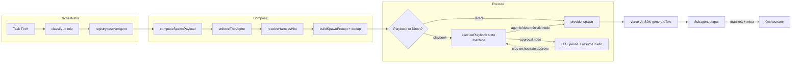

# CLEO Orchestration Flow

> Canonical architectural reference for CLEO's spawn + execution pipeline.
> Shipped as part of T910 (Orchestration Coherence v4, v2026.4.93).

## Overview

CLEO's orchestration pipeline moves a task from epic scaffolding through subagent
execution to verified completion across **six distinct layers**. Each layer has a
single responsibility, a typed contract, and a pinned version. New features are
added by extending a layer in place — never by bypassing or duplicating one.

This document is the ground truth for what the pipeline does **today**. It is
kept in sync with the shipping code; anything aspirational is called out
explicitly in the "Planned" callouts.

## The 6 Layers

| # | Layer | Responsibility | Key Module |
|---|-------|---------------|-----------|
| 1 | Classify | Task → role + agentId inference | `packages/core/src/orchestration/spawn.ts` (inline, `orchLevelToRole`) |
| 2 | Registry | `agentId` + tier → `ResolvedAgent` envelope | `packages/core/src/store/agent-resolver.ts` |
| 3 | Composer | `ResolvedAgent` + task → `SpawnPayload` (`composerVersion: '3.0.0'`) | `packages/core/src/orchestration/spawn.ts` |
| 4 | Harness Hint | Dedup decision: skip CLEO-INJECTION embed when harness loads `AGENTS.md` | `packages/core/src/orchestration/harness-hint.ts` |
| 5 | Playbook Runtime | State-machine execution of `.cantbook` DSL with HITL gates | `packages/playbooks/src/runtime.ts` |
| 6 | Subagent Dispatch | Provider-specific LLM call via Vercel AI SDK | `packages/adapters/src/providers/` |

## Mermaid Diagram

The diagram shows the single path a task takes. Branches are decisions the
runtime makes, not alternative code paths — every spawn goes through the same
composer, the same dispatch, and the same subagent output contract.

## Each Layer in Detail

### Layer 1: Classify

**Responsibility**: Given a `Task`, infer the role (`orchestrator`, `lead`,
`worker`) and the `agentId` the subagent should execute as.

**Current implementation**: The composer treats `options.agentId` as explicit
input, defaulting to `'cleo-subagent'` when unset, then derives `role` from the
resolved agent's `orchLevel` via `orchLevelToRole(0) → orchestrator`, `1 → lead`,
`2 → worker`. The richer classification router (team routing, skill-tag match)
is tracked as follow-up work and will replace the default `cleo-subagent`
without changing the surface of `composeSpawnPayload`.

**Inputs**
- `task: Task`
- `options.role?: AgentSpawnCapability`
- `options.agentId?: string`

**Outputs** (fed into Layer 2)
- `role: 'orchestrator' | 'lead' | 'worker'`
- `agentId: string`

### Layer 2: Registry

**Responsibility**: Translate `agentId` into a fully-populated `ResolvedAgent`
envelope using the four-tier precedence: **project → global → packaged →
fallback**.

**Module**: `packages/core/src/store/agent-resolver.ts`

**Contract**: `resolveAgent(db, agentId, { projectRoot })` returns a
`ResolvedAgent` carrying:
- `agentId`, `tier`, `orchLevel`, `specVersion`
- `promptSha256`, `cantPath` (filesystem path to the `.cant`)
- `capabilities`, `skills`, `spawnCapability`

The resolver always returns a value — when no row matches, a synthetic
`ResolvedAgent` is synthesized from the bundled `seed-agents/<id>.cant` on
disk. Orphan rows (row exists but `cant_path` is gone) are skipped so a stale
installation never hard-breaks spawn availability.

The global `signaldock.db:agents` row is the SSoT for metadata; filesystem is
secondary.

### Layer 3: Composer (`composeSpawnPayload`)

**Responsibility**: Produce a ready-to-dispatch `SpawnPayload` from a task and
a resolved agent. Exactly one public API builds spawn payloads; the legacy
`buildSpawnPrompt` engine is now an internal assembler called by the composer.

**Module**: `packages/core/src/orchestration/spawn.ts`

**Resolution pipeline** (numbered to match the code):
1. Resolve the agent via `resolveAgent` (Layer 2).
2. Determine `role` — explicit option or `orchLevelToRole(orchLevel)`.
3. Resolve `tier` — explicit option or role-default (`orchestrator=2`, `lead=1`,
   `worker=0`).
4. Resolve harness hint via `resolveHarnessHint` cascade (Layer 4).
5. Run `checkAtomicity` worker file-scope gate (skip when
   `skipAtomicityCheck: true`).
6. Run `enforceThinAgent` (T931) — reject workers carrying `Agent`/`Task` tools
   in strict mode, strip them in strip mode, bypass in off mode.
7. Render the prompt via `buildSpawnPrompt` (the T882 engine) — pass the harness
   hint so `skipCleoInjectionEmbed` dedups when appropriate.
8. Package everything into `SpawnPayload` with traceability metadata.

**Envelope contract** (`SpawnPayload`, `composerVersion: '3.0.0'`):
- `taskId`, `agentId`, `role`, `tier`
- `harnessHint`
- `resolvedAgent: ResolvedAgent`
- `atomicity: AtomicityResult` (worker file-scope verdict)
- `prompt: string` (copy-pastable into any LLM)
- `meta: SpawnPayloadMeta` (diagnostic accounting)

The `composerVersion` pin (`'3.0.0'`) is how integration tests assert that
callers are on the new composer path and not on a legacy bypass (see
`packages/cleo/src/dispatch/engines/__tests__/orchestrate-engine-composer.test.ts`).

### Layer 4: Harness Hint

**Responsibility**: Decide whether the target runtime already has
`CLEO-INJECTION.md` loaded, and save the ~9 KB tier-1 embed when it does.

**Module**: `packages/core/src/orchestration/harness-hint.ts`

**Three hint values**:
- `claude-code` — Claude Code CLI auto-loads `AGENTS.md`, so the embed is
  redundant. Dedup saves `DEDUP_EMBED_CHARS` (~9 KB).
- `generic` — any non-Claude-Code runtime (OpenAI Agents, LangGraph, Gemini,
  hand-rolled wrappers). Default. Receives the full embed so the protocol
  reaches the subagent at least once.
- `bare` — no harness. Treated like `generic` for embed purposes; reserved for
  future divergence (e.g. skipping session commands the runtime cannot exec).

**Resolution cascade** (first match wins):
1. Explicit option (`options.explicit`)
2. `CLEO_HARNESS` env var
3. Persisted profile at `<projectRoot>/.cleo/harness-profile.json`
4. Auto-detect Claude Code (both `CLAUDECODE=1` **and** `CLAUDE_CODE_ENTRYPOINT`
   must be set — requiring both signals blocks false positives from nested
   shells that re-exported only one)
5. Default `generic`

The persisted profile is written atomically via `.tmp` + rename, so readers
never observe a half-written file.

### Layer 5: Playbook Runtime

**Responsibility**: Deterministic state-machine execution of `.cantbook` DSL
flows, including HITL approval gates. This is the executable heart of T910.

**Module**: `packages/playbooks/src/runtime.ts` (T930)

**Three node kinds** (discriminated union `PlaybookNode`):
- **`agentic`** — dispatched through an injected `AgentDispatcher`. The
  dispatcher is responsible for Layer 6 (subagent dispatch). The runtime passes
  a snapshot of the accumulated context; the dispatcher returns a success /
  failure envelope.
- **`deterministic`** — an injected `DeterministicRunner` (command + args +
  cwd/env/timeout). If no runner is supplied, the runtime falls back to the
  dispatcher with a synthetic `agentId = "deterministic:<command>"` so a single
  stub can cover both node kinds during tests.
- **`approval`** — HITL gate. The runtime writes a `PlaybookApproval` row with
  an HMAC-signed resume token, marks the run `paused`, and returns. Execution
  continues when a human approves via `resumePlaybook(token)`.

**Invariants**:
- Pure dependency injection — the runtime never imports or instantiates
  subprocess code. Tests exercise every branch without mocking `@cleocode/*`.
- Deterministic ordering — topological traversal is computed up front from
  `edges` (with `depends[]` folded in as reverse edges). Order is stable across
  process restarts.
- Fail-closed — unknown node kinds, missing successors, unresolved
  `inject_into` targets, and dispatcher errors all terminate the run with a
  typed `terminalStatus`. Nothing is silently swallowed.
- HITL persists — approval gates survive process death because
  `playbook_runs.status='paused'` and the HMAC token are on disk before
  `executePlaybook` returns.

**Iteration caps**: per-node `on_failure.max_iterations` (default 3, max 10 via
parser). When the cap fires, `on_failure.inject_into` optionally hands control
to a named recovery node with `__lastError` / `__lastFailedNode` in context;
otherwise the run terminates `exceeded_iteration_cap`.

**Terminal statuses** (`PlaybookTerminalStatus`):
- `completed` — reached an end node (no successors)
- `failed` — a node failed and `inject_into` pointed to an unknown target
- `exceeded_iteration_cap` — a node hit its retry cap
- `pending_approval` — paused at an approval node; resume with
  `ExecutePlaybookResult.approvalToken`

**Resume tokens** (`packages/playbooks/src/approval.ts`): 32-char hex
HMAC-SHA256 derived from `HMAC(secret, "runId:nodeId:canonicalBindings")`.
Canonical bindings use sorted-keys JSON so semantically identical payloads
always yield the same token. Production deployments MUST set
`CLEO_PLAYBOOK_SECRET`; the dev fallback is clearly marked as such.

### Layer 6: Subagent Dispatch

**Responsibility**: Execute a prompt against a specific LLM provider through a
single, unified SDK surface.

**Module**: `packages/adapters/src/providers/` (claude-sdk, openai-sdk, cursor,
codex, gemini-cli, opencode, pi, claude-code, kimi, shared)

**SDK**: **Vercel AI SDK** (`ai` v6 + `@ai-sdk/anthropic` + `@ai-sdk/openai`).
Every provider adapter maps to `generateText` / `streamText` / `generateObject`
under the hood. See [ADR-052](../adr/ADR-052-sdk-consolidation.md) for the
consolidation rationale.

**What CLEO owns**: `composeSpawnPayload`, the playbook runtime, agent
registry, CANT DSL, session ledger, harness hints. These are the orchestration
primitives. The Vercel AI SDK is strictly the LLM bridge — model invocation,
streaming, tool calls, structured output. It is not the orchestrator.

**CLEO-native types** replacing legacy SDK types (preserved as aliases for
backward compatibility): `CleoAgent`, `CleoInputGuardrail`, `CleoTraceProcessor`,
`CleoSpan`.

## Data Model

| Table | DB | Purpose |
|-------|-----|---------|
| `playbook_runs` | `tasks.db` | One row per playbook execution. Holds `current_node`, JSON `bindings`, JSON `iteration_counts`, `status`, `epic_id`, `session_id`. |
| `playbook_approvals` | `tasks.db` | One row per HITL gate. Holds `token` (HMAC), `status` (`pending`/`approved`/`rejected`), `approver`, `reason`, `auto_passed`. |
| `agents` | `signaldock.db` (global) | Registry SSoT. UNIQUE on `agent_id`. `tier` column records which directory holds the canonical `.cant`. |
| `agent_skills` | `signaldock.db` (global) | Dynamic skill attachment (junction table — see T889 Wave 1). |

Schema definitions: `packages/playbooks/src/schema.ts` (playbook tables),
`packages/core/src/store/signaldock-sqlite.ts` (agents/skills), migration at
`packages/core/migrations/drizzle-tasks/20260417220000_t889-playbook-tables/`.

## CLI Surface

| Command | Status | Description |
|---------|--------|-------------|
| `cleo orchestrate spawn <taskId>` | Shipped (T882) | Emit a `SpawnPayload` for a task. |
| `cleo orchestrate ready --epic <id>` | Shipped | Return parallel-safe wave. |
| `cleo orchestrate waves <epicId>` | Shipped | View epic wave plan. |
| `cleo orchestrate start <epicId>` | Shipped | Initialize epic pipeline (auto-inits LOOM research). |
| `cleo orchestrate plan <epicId>` | Shipped (T889) | Plan epic decomposition. |
| `cleo orchestrate ivtr <taskId> --start` | Shipped | Multi-agent IVTR loop. |
| `cleo playbook run <name>` | Planned (T935) | Execute a `.cantbook` playbook. |
| `cleo playbook status <runId>` | Planned (T935) | Inspect run state. |
| `cleo playbook resume <runId>` | Planned (T935) | Continue after HITL approval. |
| `cleo orchestrate approve <resumeToken>` | Planned (T935) | Grant approval for a paused run. |
| `cleo orchestrate reject <resumeToken> --reason <r>` | Planned (T935) | Deny with audit. |
| `cleo orchestrate pending` | Planned (T935) | List awaiting approvals. |

"Planned" entries are documented here because the runtime and contracts
already exist. The CLI surface that exposes them lands in a follow-up release
as part of T935.

## Starter Playbooks

Three reference `.cantbook` playbooks ship with `@cleocode/playbooks`:

- `starter/rcasd.cantbook` — RCASD planning pipeline (Research → Consensus →
  Architecture → Specification → Decomposition). Linear five-stage agent chain.
- `starter/ivtr.cantbook` — IVTR execution loop (Implementation → Verification
  → Tests → Review).
- `starter/release.cantbook` — Release pipeline with a HITL approval gate
  before the publish step.

These are intentionally thin — they exercise every node kind and demonstrate
the contract requires/ensures pattern without prescribing a specific project
structure.

## References

- [ADR-052 — SDK Consolidation (Vercel AI SDK)](../adr/ADR-052-sdk-consolidation.md)
- [ADR-053 — Playbook Runtime State Machine](../adr/ADR-053-playbook-runtime.md)
- ADR-051 — Programmatic Gate Integrity (evidence-based verify)
- T882 — Orchestrate Spawn Prompt Rebuild
- T889 — Orchestration Coherence v3 (Foundation)
- T910 — Orchestration Coherence v4 (this document)
- `packages/playbooks/README.md` — DSL grammar + API reference
- `packages/playbooks/src/runtime.ts` — state-machine executor
- `packages/core/src/orchestration/spawn.ts` — canonical composer
