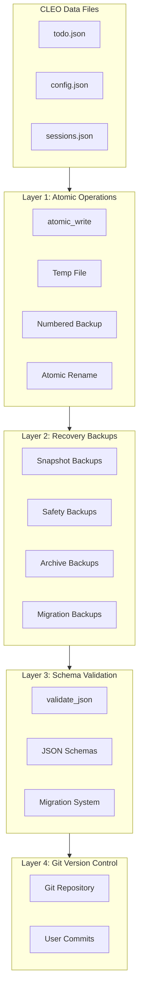
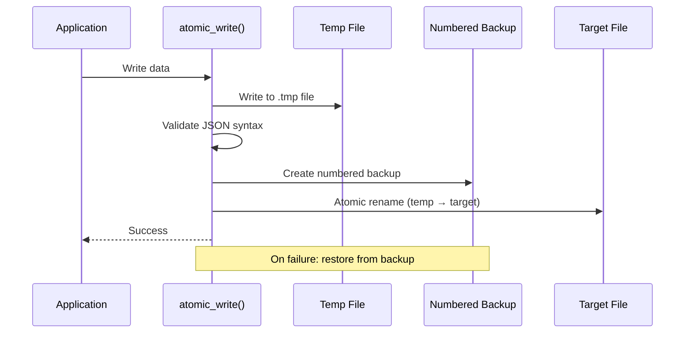

# Backup System Architecture

CLEO implements a **four-layer data integrity system** designed for defense-in-depth. Each layer serves a distinct purpose, and together they provide comprehensive protection against data loss and corruption.

<Info>
The backup layers are **complementary by design**, not competing mechanisms. Each layer addresses different failure modes and recovery scenarios.
</Info>

## Architecture Overview



## Layer Summary

| Layer | Purpose | Trigger | Location |
|-------|---------|---------|----------|
| **1: Atomic Operations** | Per-write safety | Every write | `.cleo/backups/operational/` |
| **2: Recovery Backups** | Point-in-time snapshots | User/system events | `.cleo/backups/{type}/` |
| **3: Schema Validation** | Data integrity | Manual/CI | Schema definitions |
| **4: Git Version Control** | Project history | User commits | Git repository |

---

## Layer 1: Atomic Operations

<Card title="Purpose" icon="shield">
Protect against I/O failures, system crashes, and interrupted writes. Every write operation is atomic and reversible.
</Card>

### How It Works

Every write operation follows this sequence:



### Key Functions

<CodeGroup>
```bash lib/atomic-write.sh
# Primitive atomic write (no validation dependencies)
aw_atomic_write "$file" "$content"

# Create numbered backup with rotation
aw_create_backup "$file"

# Rotate backups (keep last N)
_aw_rotate_backups "$file" "$max_backups"
```

```bash lib/file-ops.sh
# High-level atomic write with locking
atomic_write "$file" "$content"

# JSON-specific wrapper
save_json "$file" "$json" "$file_type"
```
</CodeGroup>

### Backup Rotation

- **Location**: `.cleo/backups/operational/`
- **Naming**: `{filename}.{1|2|3|...}` (lower = newer)
- **Retention**: Configurable (default 5-10 backups)
- **Rotation**: FIFO - oldest backup deleted when limit reached

### Automatic Rollback

```bash
# If atomic rename fails, restore from backup
if ! aw_atomic_move "$temp_file" "$file"; then
    if [[ -f "$backup_file" ]]; then
        cp "$backup_file" "$file"
    fi
fi
```

---

## Layer 2: Recovery Backups

<Card title="Purpose" icon="clock-rotate-left">
Enable point-in-time recovery for disaster scenarios. User-initiated or automatic before destructive operations.
</Card>

### Backup Types

<CardGroup cols={2}>
  <Card title="Snapshot" icon="camera">
    **Purpose**: Full system backup

    **Trigger**: Manual `cleo backup`

    **Retention**: Count-based (default 10)

    **Contents**: All CLEO data files
  </Card>

  <Card title="Safety" icon="shield-halved">
    **Purpose**: Pre-operation protection

    **Trigger**: Before destructive operations

    **Retention**: Time (7d) + count (5)

    **Contents**: Affected file only
  </Card>

  <Card title="Archive" icon="box-archive">
    **Purpose**: Pre-archive protection

    **Trigger**: Before `cleo archive`

    **Retention**: Count-based (3)

    **Contents**: todo.json + archive
  </Card>

  <Card title="Migration" icon="database">
    **Purpose**: Schema migration safety

    **Trigger**: Before `cleo migrate`

    **Retention**: **PERMANENT**

    **Contents**: All affected files
  </Card>
</CardGroup>

### Directory Structure

```
.cleo/backups/
├── operational/           # Layer 1 numbered backups
│   ├── todo.json.1
│   ├── todo.json.2
│   └── sessions.json.1
├── snapshot/              # Full system snapshots
│   └── 2026-01-26_153000_snapshot/
│       ├── todo.json
│       ├── config.json
│       └── metadata.json
├── safety/                # Pre-operation backups
├── archive/               # Pre-archive backups
├── migration/             # Schema migration backups
└── backup-manifest.json   # Index for O(1) lookup
```

### Metadata Format

Each backup includes metadata for verification:

```json
{
  "id": "backup_20260126_153000",
  "type": "snapshot",
  "createdAt": "2026-01-26T15:30:00Z",
  "trigger": "manual",
  "neverDelete": false,
  "files": [
    {
      "name": "todo.json",
      "size": 12345,
      "checksum": "sha256:abc123..."
    }
  ]
}
```

### Recovery Commands

```bash
# List available backups
cleo backup --list

# Create manual snapshot
cleo backup

# Restore from backup
cleo restore [backup-id]

# Restore specific file
cleo restore --file todo.json
```

---

## Layer 3: Schema Validation

<Card title="Purpose" icon="check-circle">
Ensure data semantic correctness. Detect invalid data structures, missing fields, and constraint violations.
</Card>

<Warning>
Schema validation is currently **detection-only**, not prevention. Invalid data CAN be written; validation catches it afterward.
</Warning>

### Validation Functions

| Function | Purpose | When Called |
|----------|---------|-------------|
| `validate_json_syntax()` | JSON parsing | Before write |
| `validate_schema()` | Schema compliance | Manual/CI |
| `validate_task()` | Task object rules | Manual/CI |
| `validate_all()` | Comprehensive check | Manual/CI |

### Schema Locations

```
schemas/
├── todo.schema.json        # Task data
├── config.schema.json      # Configuration
├── sessions.schema.json    # Session state
├── archive.schema.json     # Archived tasks
└── log.schema.json         # Audit log
```

### Validation Commands

```bash
# Run full validation
cleo validate

# Attempt automatic fixes
cleo validate --fix

# Check specific aspects
cleo validate --check-orphans
cleo validate --check-deps
```

### Migration System

Schema versions are tracked and migrated safely:

```bash
# Check current versions
cleo upgrade --status

# Run migrations
cleo migrate

# Migrations are recorded in .cleo/migrations.json
```

---

## Layer 4: Git Version Control

<Card title="Purpose" icon="code-branch">
Provide project history, collaboration support, and disaster recovery via version control.
</Card>

### What's Git-Tracked

<Tabs>
  <Tab title="Tracked Files">
    Core data files ARE tracked in git:

    - `.cleo/todo.json` - Active tasks
    - `.cleo/todo-archive.json` - Completed tasks
    - `.cleo/config.json` - Configuration
    - `.cleo/sessions.json` - Session state
    - `.cleo/todo-log.jsonl` - Audit trail
  </Tab>

  <Tab title="Ignored Files">
    Backup directories are NOT tracked:

    - `.cleo/backups/` - All backup types
    - `.cleo/*.tmp` - Temporary files
    - `.cleo/*.lock` - Lock files
    - `.cleo/.cache/` - Cache data
  </Tab>
</Tabs>

### Git Integration Points

| Location | Command | Purpose |
|----------|---------|---------|
| `scripts/safestop.sh` | `git add -A && git commit` | WIP snapshot on agent shutdown |
| `dev/hooks/pre-commit` | `git add` | Auto-stage generated migrations |

### Recommended Workflow

```bash
# After significant task work
cleo archive                    # Clean up completed tasks
git add .cleo/todo.json .cleo/todo-archive.json
git commit -m "chore: Update task status"
```

<Note>
Git commits are intentionally **not automated** to preserve user control over commit granularity and messages.
</Note>

---

## Recovery Procedures

### Scenario 1: Corrupted Write

**Problem**: Write interrupted mid-operation

**Recovery**:
1. Layer 1 atomic write ensures temp file corruption, not target
2. Target file remains intact
3. If target corrupted, automatic rollback from numbered backup

### Scenario 2: Bad Data Written

**Problem**: Invalid data passed validation but is semantically wrong

**Recovery**:
```bash
# Check what's wrong
cleo validate

# Restore from operational backup
cp .cleo/backups/operational/todo.json.1 .cleo/todo.json

# Or restore from snapshot
cleo restore
```

### Scenario 3: Schema Migration Failed

**Problem**: Migration script had a bug

**Recovery**:
```bash
# Migration backups are PERMANENT
cleo backup --list --type migration

# Restore pre-migration state
cleo restore <migration-backup-id>
```

### Scenario 4: Disaster Recovery

**Problem**: All local data lost

**Recovery**:
1. Restore from git (data files are tracked)
2. Or restore from Tier 2 snapshot backup
3. Run `cleo validate --fix` to repair any issues

---

## Best Practices

<Steps>
  <Step title="Regular Snapshots">
    Run `cleo backup` before major work sessions
  </Step>

  <Step title="Commit Regularly">
    Git commit CLEO data files after significant changes
  </Step>

  <Step title="Validate Periodically">
    Run `cleo validate` as part of CI/CD or before releases
  </Step>

  <Step title="Monitor Backups">
    Check `cleo backup --list` to ensure backups exist
  </Step>
</Steps>

---

## Configuration

### Backup Settings

```bash
# View current backup configuration
cleo config get backup

# Set operational backup retention
cleo config set backup.operationalRetention 10

# Set snapshot retention
cleo config set backup.snapshotRetention 5
```

### Validation Settings

```bash
# Enable/disable pre-write validation (future)
cleo config set validation.preWriteEnabled true

# Set validation strictness
cleo config set validation.strictMode true
```

---

## Related

<CardGroup cols={2}>
  <Card title="Validate Command" icon="check" href="/commands/validate">
    Run data integrity checks
  </Card>

  <Card title="Backup Command" icon="floppy-disk" href="/commands/backup">
    Create manual backups
  </Card>

  <Card title="Restore Command" icon="rotate-left" href="/commands/restore">
    Recover from backups
  </Card>

  <Card title="Migrate Command" icon="database" href="/commands/migrate">
    Schema migrations
  </Card>
</CardGroup>
