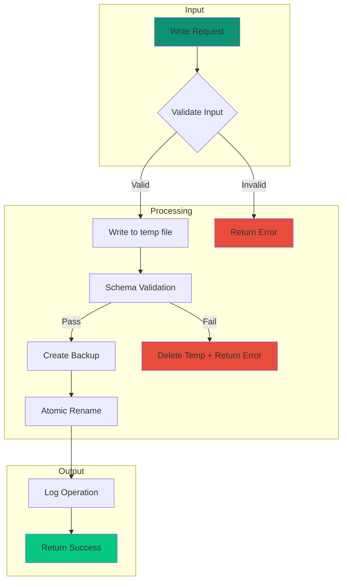
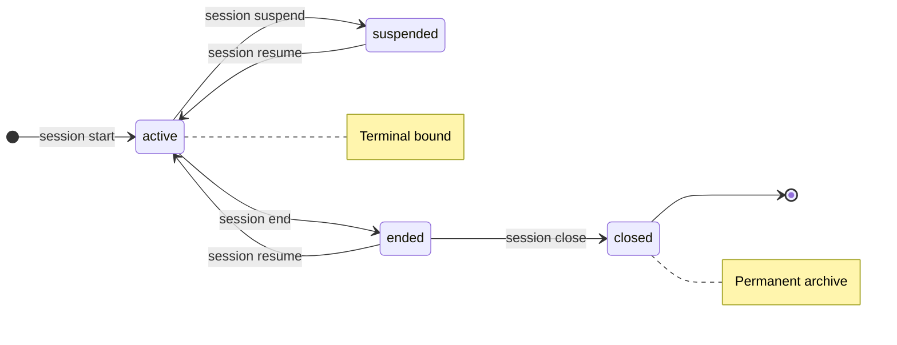
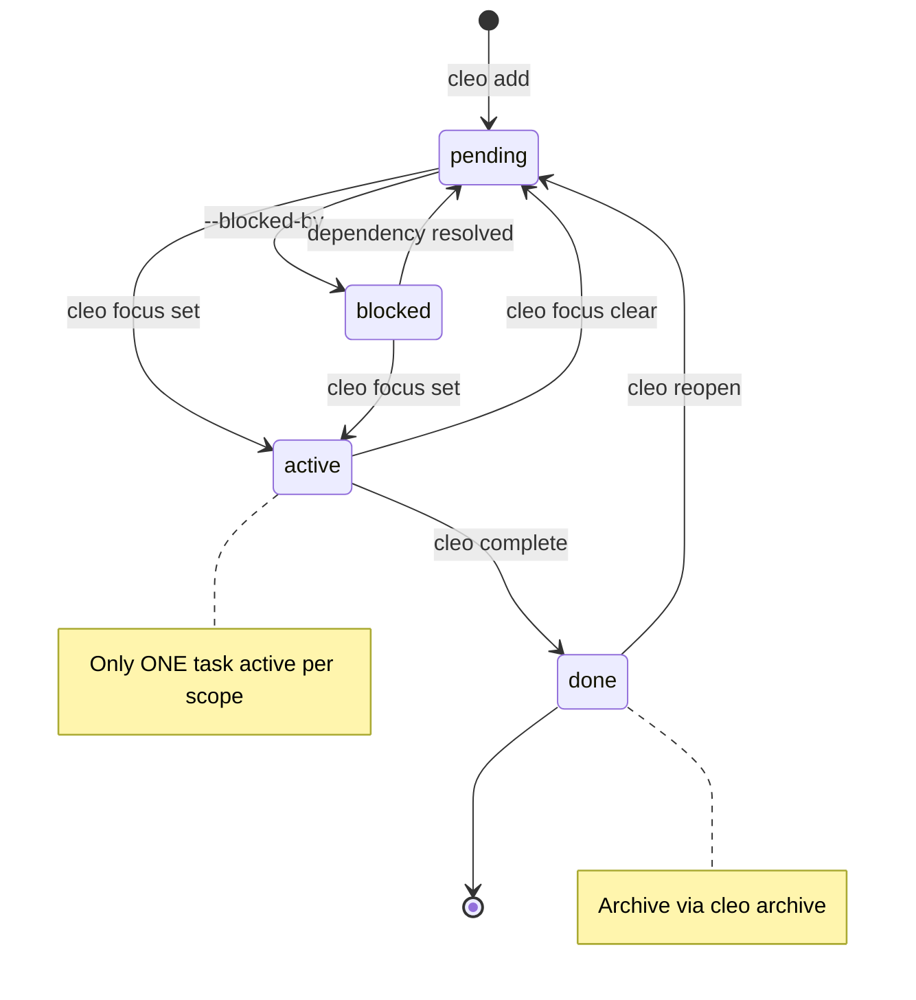
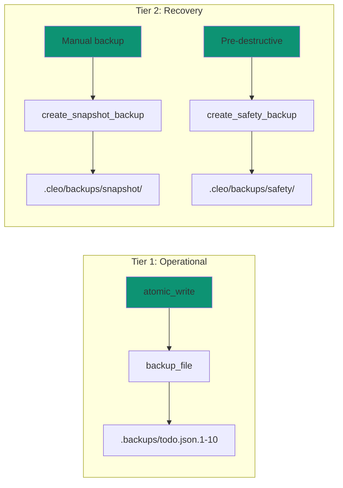

# Data Flows

This page visualizes how data moves through CLEO during key operations.

## Task Creation Flow

<Steps>
  <Step title="User Input">
    User runs `cleo add "Task title" --priority high`
  </Step>
  <Step title="Input Validation">
    CLI validates required fields and format
  </Step>
  <Step title="ID Generation">
    System generates unique task ID (T###)
  </Step>
  <Step title="Atomic Write">
    Task written using atomic pattern
  </Step>
  <Step title="Audit Log">
    Operation logged to `todo-log.jsonl`
  </Step>
</Steps>

## Atomic Write Pattern

Every write operation in CLEO follows this pattern:

<Info>
This pattern ensures no partial writes - the operation either fully succeeds or the original file is preserved.
</Info>

## Validation Layers

<Tabs>
  <Tab title="Schema">
    JSON Schema validation ensures correct data types, required fields, and enum values.
  </Tab>
  <Tab title="Semantic">
    Cross-file checks for ID uniqueness, valid references, and cycle detection.
  </Tab>
  <Tab title="Temporal">
    Timestamp validation prevents future dates and ensures logical ordering.
  </Tab>
  <Tab title="Content">
    Content validation ensures meaningful data (title != description).
  </Tab>
</Tabs>

## Session State Machine

Sessions transition through defined states:

## Task Lifecycle

## Backup System

## Related Concepts

<CardGroup cols={2}>
  <Card title="Architecture" icon="cubes" href="/concepts/architecture">
    System design and components
  </Card>
  <Card title="Anti-Hallucination" icon="shield" href="/concepts/anti-hallucination">
    Validation mechanisms in detail
  </Card>
</CardGroup>
