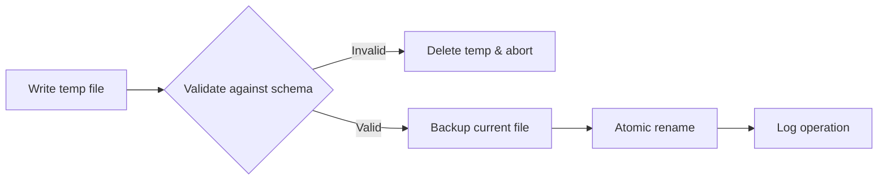

# CLEO Vision

**The contract between you and your AI coding agent.**

## Vision Charter (Immutable)

This document is CLEO's constitutional vision and source of product identity.

## Agent Entry (Deterministic)

```
MODE: READ_ONLY_IDENTITY_BOOTSTRAP
PRIMARY_SOURCE: docs/concepts/vision.mdx
IDENTITY_LOCK: TRUE

READ_ORDER:
1) docs/concepts/vision.mdx
2) docs/specs/PORTABLE-BRAIN-SPEC.md
3) README.md
4) docs/specs/CLEO-STRATEGIC-ROADMAP-SPEC.md
5) docs/specs/CLEO-BRAIN-SPECIFICATION.md

NON_NEGOTIABLES:
- Do not redefine CLEO identity
- Treat planned/gated as not shipped
- Preserve canonical pillars and terminology

CANONICAL_IDENTITY:
CLEO is a vendor-neutral Brain and Memory system for AI software development that provides portable project memory, verifiable provenance, and agent-safe orchestration across any repository, model provider, or coding tool.

CANONICAL_PILLARS:
- Portable Memory
- Provenance by Default
- Interoperable Interfaces
- Deterministic Safety
- Cognitive Retrieval
```

### Canonical Product Statement

CLEO is a vendor-neutral Brain and Memory system for AI software development that provides portable project memory, verifiable provenance, and agent-safe orchestration across any repository, model provider, or coding tool.

### Five Pillars

1. **Portable Memory**: Project -> Epic -> Task hierarchy, research manifests, and agent outputs.
2. **Provenance by Default**: Every artifact is traceable to task, decision, agent, and operation.
3. **Interoperable Interfaces**: CLI + MCP + adapters for any AI agent framework/provider.
4. **Deterministic Safety**: Validation layers, lifecycle gates, atomic writes, immutable audit logs.
5. **Cognitive Retrieval**: Page index + graph/vector/RAG for contextual reasoning at Tier M/L.

## Mission Statement

CLEO provides a structured protocol that:

<CardGroup cols={2}>
  <Card title="Prevents Hallucination" icon="shield-check">
    Four-layer validation ensures AI-generated data is always correct
  </Card>
  <Card title="Maintains Context" icon="database">
    Immutable audit trails preserve state across sessions
  </Card>
  <Card title="Enables Reliable Workflows" icon="gears">
    Atomic operations and exit codes for programmatic handling
  </Card>
  <Card title="Scales Complexity" icon="network-wired">
    Orchestrated multi-agent coordination for complex projects
  </Card>
</CardGroup>

<Note>
**One developer. One AI agent. One source of truth.**
</Note>

## Core Philosophy

### Command System Architecture

CLEO uses a shared-core architecture with a single semantic contract:

- **CLI (TypeScript)**: authoritative runtime behavior and deterministic enforcement via Commander.js
- **MCP (TypeScript)**: provider-neutral integration surface for AI tooling, sharing the same core logic
- **Adapters (optional)**: tool-specific UX optimizations without changing core semantics

All interfaces MUST preserve the same memory model, lifecycle guarantees, and provenance invariants.

### Agent-First Design

CLEO is built for LLM agents first, with human accessibility second. When your primary "user" is an AI coding agent, everything changes:

| Dimension | Human User | LLM Agent |
|-----------|------------|-----------|
| **Input** | Natural language, flexibility | Structured data, constraints |
| **Errors** | Reads error messages | Branches on exit codes |
| **Validation** | Trusts own judgment | Needs external ground truth |
| **Context** | Maintains mental model | Loses context between sessions |
| **Completion** | Knows when "done" | Needs explicit success criteria |

### Five Founding Principles

<Steps>
  <Step title="Simplicity">
    Flat sequential IDs (`T001`, `T042`) that never change, regardless of hierarchy restructuring
  </Step>
  <Step title="Flat Structures">
    Three-level hierarchy maximum: Epic -> Task -> Subtask. Research shows this is optimal for navigation.
  </Step>
  <Step title="Computed Metrics">
    No time estimates; scope-based sizing only. AI cannot accurately predict duration.
  </Step>
  <Step title="Portability">
    Single installation (`~/.cleo/`), per-project initialization (`.cleo/`)
  </Step>
  <Step title="Dual Readability">
    JSON for agents (default), human-readable on request (`--human`)
  </Step>
</Steps>

## Anti-Hallucination Protocol

Every operation undergoes **four-layer validation**:

<Tabs>
  <Tab title="Layer 1: Schema">
    **JSON Schema Enforcement**

    - Structure validation
    - Type checking
    - Enum constraints (`status: pending|active|blocked|done`)
    - Format validation (ISO 8601 timestamps, T### IDs)
  </Tab>

  <Tab title="Layer 2: Semantic">
    **Cross-File Integrity**

    - ID uniqueness across `todo.json` + archive
    - Timestamp sanity (not future, `completedAt > createdAt`)
    - Content pairing (title != description)
    - Duplicate detection
  </Tab>

  <Tab title="Layer 3: Cross-File">
    **Referential Integrity**

    - Log entries reference valid IDs
    - Archive consistency
    - Synchronized updates
  </Tab>

  <Tab title="Layer 4: State Machine">
    **Transition Validation**

    - Valid status transitions only
    - Configuration policy enforcement
    - Constraint checking
  </Tab>
</Tabs>

## Atomic Operations

<Info>
**No partial writes. No data corruption. Full rollback on any failure.**
</Info>

Every file modification follows this pattern:



## The Contract

When you use CLEO with any AI coding tool, you establish a formal contract:

<AccordionGroup>
  <Accordion title="Stable Identity" icon="fingerprint">
    Tasks are identified by stable IDs (`T001`) that **never change**, regardless of hierarchy restructuring
  </Accordion>

  <Accordion title="Machine-Parseable Output" icon="code">
    All output is JSON by default, enabling programmatic handling
  </Accordion>

  <Accordion title="Numeric Exit Codes" icon="hashtag">
    All errors have numeric exit codes for branching logic
  </Accordion>

  <Accordion title="Validation First" icon="shield">
    All operations validate first, fail fast on invalid input
  </Accordion>

  <Accordion title="Persistent State" icon="database">
    All state is persisted in `todo.json` as single source of truth
  </Accordion>

  <Accordion title="Audit Trail" icon="clock-rotate-left">
    All changes are logged in immutable audit trail (`todo-log.json`)
  </Accordion>

  <Accordion title="Atomic Writes" icon="atom">
    All writes are atomic with automatic backup and rollback
  </Accordion>
</AccordionGroup>

This contract enables **reliable, repeatable AI-assisted development**.

## Daily Workflow

### Morning Routine

```bash
cleo session start
cleo dash              # See project state
cleo focus show        # What was I working on?
cleo next --explain    # What should I do next?
```

### During Work

```bash
cleo focus set T042              # Start task
cleo update T042 --notes "..."   # Document progress
cleo complete T042               # Finish task
```

### End of Day

```bash
cleo session end --note "Completed auth flow, tests passing"
```

## What CLEO Solves

| Problem | CLEO Solution |
|---------|---------------|
| AI agent forgets yesterday's context | Session notes + audit logs |
| Unclear which tasks are actually done | Verification gates + status tracking |
| Hallucinated task references | ID validation on every operation |
| Context degrades over long sessions | Manifest-based handoffs |
| Complex workflows overwhelm context | Orchestrator with 10K token budget |

## Current State vs Strategic Direction

<CardGroup cols={2}>
  <Card title="Current State (Shipped)" icon="check">
    TypeScript-native CLI and MCP server sharing a common core, deterministic validation, atomic operations, audit logs, hierarchy lifecycle, and project-local memory are production baseline.
  </Card>
  <Card title="Strategic Direction (Gated)" icon="road">
    Nexus validation, hybrid storage (ADR-002), and Tier M/L cognitive infrastructure expansion follow evidence-gated roadmap progression.
  </Card>
</CardGroup>

## Provider Neutrality

CLEO is provider-agnostic by design. Tool-specific integrations MAY optimize user experience, but core memory models, provenance semantics, and lifecycle enforcement MUST remain neutral and portable.

## Global Intelligence (Nexus)

CLEO Nexus extends the task graph across project boundaries, creating a "super brain" for cross-project intelligence:

<CardGroup cols={2}>
  <Card title="Cross-Project Discovery" icon="magnifying-glass">
    Find related tasks across all registered projects using similarity algorithms
  </Card>
  <Card title="Unified Dependencies" icon="diagram-project">
    Analyze dependencies that span project boundaries with global graph
  </Card>
  <Card title="Permission Control" icon="shield">
    Three-tier access model (read/write/execute) protects project isolation
  </Card>
  <Card title="Neural Brain" icon="brain">
    Memory and context persistence for autonomous AI agents
  </Card>
</CardGroup>

<Info>
Nexus implements neural network semantics: tasks are neurons, relationships are synapses, and similarity scores are weights. This enables AI agents to navigate and discover context autonomously.
</Info>

**Learn more**: [Nexus Guide](/guides/nexus)

## Summary

CLEO bridges the gap between human intention and AI execution:

<CardGroup cols={2}>
  <Card title="For Developers" icon="user">
    A shared memory system that maintains continuity across coding sessions
  </Card>
  <Card title="For AI Agents" icon="robot">
    Structured protocols that prevent hallucination and enable reliable workflows
  </Card>
</CardGroup>

## Vision Governance

- This document defines what CLEO **is**, not just what CLEO builds next.
- Any change that alters canonical identity requires explicit vision amendment and synchronized updates to `README.md` and `docs/specs/PORTABLE-BRAIN-SPEC.md`.
- Strategic docs MUST align to this vision; they cannot redefine it.

## Next Steps

<CardGroup cols={2}>
  <Card title="Architecture" icon="cubes" href="/concepts/architecture">
    Deep dive into CLEO system components
  </Card>
  <Card title="Orchestrator" icon="network-wired" href="/guides/orchestrator">
    Multi-agent coordination for complex projects
  </Card>
  <Card title="Quick Start" icon="rocket" href="/getting-started/quickstart">
    Get started with CLEO in 5 minutes
  </Card>
  <Card title="Sessions Guide" icon="clock" href="/guides/sessions">
    Master session management for context preservation
  </Card>
</CardGroup>
