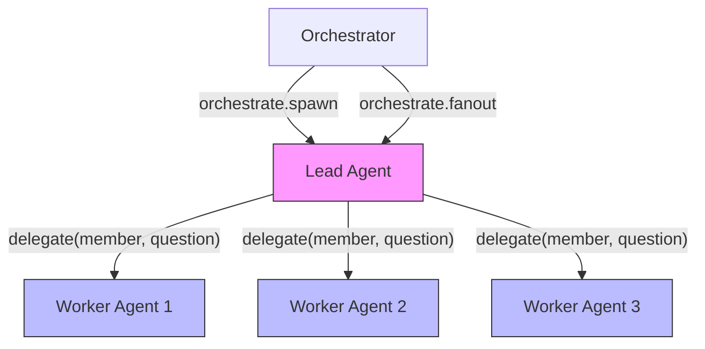

# Lead vs Worker Injection Differences

**Version**: 1.0.0
**Status**: ACTIVE
**Task**: T440 (WS-3 Documentation Lead)

This document details the behavioral, tooling, and enforcement differences between lead and worker roles in the CleoOS subagent injection system.

---

## Role Architecture



Leads are coordinators that reason about a problem and dispatch work to specialist workers. Workers are executors that perform the actual file operations within their declared scope.

---

## Tool Access

### Lead Agents

Leads receive **read-only tools** and the **delegate** tool. They are structurally blocked from executing Edit, Write, and Bash by the `tool_call` hook in the cleo-cant-bridge.

| Tool | Access |
|------|--------|
| `Read` | Allowed |
| `Grep` | Allowed |
| `Glob` | Allowed |
| `Edit` | **BLOCKED** (code 70) |
| `Write` | **BLOCKED** (code 70) |
| `Bash` | **BLOCKED** (code 70) |
| `delegate` | Allowed (registered by lead-delegate extension) |

### Worker Agents

Workers receive the **full tool set** (Read, Write, Edit, Bash, Glob, Grep, plus any MCP tools declared in the `.cant` file). They do not have the `delegate` tool.

| Tool | Access |
|------|--------|
| `Read` | Allowed |
| `Grep` | Allowed |
| `Glob` | Allowed |
| `Edit` | Allowed (subject to path ACL) |
| `Write` | Allowed (subject to path ACL) |
| `Bash` | Allowed (subject to path ACL, best-effort) |
| `delegate` | Not available |
| MCP tools | As declared in `.cant` `tools:` section |

---

## Bridge Enforcement at `tool_call` Time

**File**: `packages/cleo-os/extensions/cleo-cant-bridge.ts` (line 488-568)

The `tool_call` event handler implements a two-tier enforcement pipeline:

### Lead Blocking (First Gate)

```typescript
// cleo-cant-bridge.ts, line 515-531
if (agentDef.role !== "lead") {
  // Fall through to worker path ACL check
} else {
  if (!BLOCKED_TOOLS.includes(toolName)) return {};
  return {
    rejected: true,
    error: {
      code: 70,
      codeName: "E_LEAD_TOOL_BLOCKED",
      message: `Lead agents cannot execute ${toolName} -- dispatch to a worker instead`,
      fix: "Use the delegate tool to spawn a worker agent for this work",
    },
  };
}
```

When a lead agent attempts to invoke Edit, Write, or Bash, the hook returns a LAFS error envelope with code 70. The error message directs the lead to use `delegate` instead. Non-blocked tools (Read, Grep, Glob, and custom tools) pass through unchanged.

### Worker Path ACL (Second Gate)

```typescript
// cleo-cant-bridge.ts, line 533-567
if (
  agentDef.role === "worker" &&
  agentDef.filePermissions !== undefined &&
  BLOCKED_TOOLS.includes(toolName)
) {
  const writeGlobs = agentDef.filePermissions.write;
  if (writeGlobs !== undefined) {
    const targetPath = extractTargetPath(toolName, event.toolInput);
    if (targetPath !== null && !matchesAnyGlob(targetPath, writeGlobs)) {
      return {
        rejected: true,
        error: {
          code: 71,
          codeName: "E_WORKER_PATH_ACL_VIOLATION",
          // ...
        },
      };
    }
  }
}
```

Workers with declared `filePermissions.write` globs are restricted to writing only within those paths. The enforcement applies to Edit, Write, and Bash tools.

### Path Extraction

**File**: `packages/cleo-os/extensions/cleo-cant-bridge.ts` (line 212-249)

The `extractTargetPath()` function extracts the target file path from tool inputs:

| Tool | Extraction Method |
|------|-------------------|
| `Edit` | `input.file_path`, `input.filePath`, or `input.path` |
| `Write` | `input.file_path`, `input.filePath`, or `input.path` |
| `Bash` | Best-effort regex: redirect (`>`), `tee`, `cp`/`mv` destination |

For Bash commands where the write destination cannot be determined, the function returns `null`, which is treated as allow-by-default. This is a deliberate design choice -- workers are expected to self-report any violations.

### Glob Matching

**File**: `packages/cleo-os/extensions/cleo-cant-bridge.ts` (line 147-195)

Glob patterns are converted to RegExp for matching. Supported patterns:

| Pattern | Meaning |
|---------|---------|
| `**` | Matches any path segment sequence (including none) |
| `*` | Matches any characters within a single path segment |
| `?` | Matches a single character |

Paths are normalized to forward slashes with leading slashes stripped for relative matching.

---

## Environment Variables

### Worker-Specific Environment

Workers spawned via the domain-enforcer extension receive these environment variables:

**File**: `temp/extensions/domain-enforcer.ts` (line 29-46)

| Variable | Type | Description |
|----------|------|-------------|
| `AGENT_DOMAIN_RULES` | JSON array of `DomainRule` | Directory-level access control rules |
| `AGENT_PROJECT_ROOT` | String | Absolute path to project root |
| `AGENT_EXPERTISE` | JSON array of `ExpertiseEntry` | Per-file access overrides with optional line limits |
| `AGENT_ALLOWED_TOOLS` | JSON array of strings | Tool allowlist (empty = all allowed) |

#### `AGENT_DOMAIN_RULES` Shape

```typescript
interface DomainRule {
  path: string;     // Directory path (relative to project root)
  read: boolean;    // Can read files in this path
  upsert: boolean;  // Can create/modify files in this path
  delete: boolean;  // Can delete files in this path
}
```

Example:
```json
[
  { "path": "packages/api/", "read": true, "upsert": true, "delete": false },
  { "path": "packages/core/", "read": true, "upsert": false, "delete": false },
  { "path": ".", "read": true, "upsert": false, "delete": false }
]
```

Rules are evaluated in order -- first match wins. A catchall rule with `path: "."` should be last.

#### `AGENT_EXPERTISE` Shape

```typescript
interface ExpertiseEntry {
  absPath: string;      // Absolute path to the file
  updatable: boolean;   // Can the agent modify this file
  maxLines?: number;    // Optional line count limit
}
```

Expertise entries take precedence over domain rules for exact file matches. This allows an agent to be granted specific-file access even outside its domain.

### Lead-Specific Environment

Leads spawned via the lead-delegate extension receive these environment variables:

**File**: `temp/extensions/lead-delegate.ts` (line 15-16, 47-51)

| Variable | Type | Description |
|----------|------|-------------|
| `LEAD_MEMBERS_JSON` | JSON array of `AgentConfig` | Team member configurations for the `delegate` tool |
| `LEAD_LOG_PATH` | String | Absolute path to the shared conversation log |
| `AGENT_PROJECT_ROOT` | String | Absolute path to project root |

#### `LEAD_MEMBERS_JSON` Shape

Each entry contains the full configuration needed to spawn a member subprocess:

```typescript
interface AgentConfig {
  name: string;          // Member name (e.g., "Backend Dev")
  model: string;         // Model to use
  systemPrompt: string;  // System prompt for the member
  sessionFile: string;   // Session state file path
  domain: string;        // Domain scope
  expertise: string;     // Expertise description
  consultWhen: string;   // When to consult this member
}
```

The `LEAD_MEMBERS_JSON` variable is explicitly deleted from the environment before passing it to spawned member subprocesses (line 50-51). This prevents workers from registering the `delegate` tool.

---

## The `delegate()` Tool (Lead-Only)

**File**: `temp/extensions/lead-delegate.ts` (line 54-186)

The `delegate` tool is registered by the lead-delegate Pi extension. It is only activated when `LEAD_MEMBERS_JSON` is set in the environment, which means only lead subprocesses get it.

### Parameters

| Parameter | Type | Description |
|-----------|------|-------------|
| `member` | String | Exact member name to consult (case-insensitive matching) |
| `question` | String | The question for the member, with the lead's own analysis for context |

### Behavior

1. **Finds the member** by name in the `LEAD_MEMBERS_JSON` array
2. **Builds context**: Reads the shared conversation log and formats a transcript
3. **Spawns a subprocess**: Calls `callAgent()` with the member's configuration, the question (with conversation history), and a 10-minute timeout
4. **Streams responses**: Sends incremental updates via `onUpdate` (streaming text, tool calls, usage stats)
5. **Logs the interaction**: Appends the member's response to the shared conversation log at `LEAD_LOG_PATH`
6. **Returns the response**: Returns the member's response text

### Error Handling

- If the member name is not found, throws an error listing available members
- Timeout: 10 minutes per member consultation
- On error or timeout, returns partial text or an error message
- Errors are logged to the shared conversation log for traceability

---

## Domain Enforcer Extension (Worker)

**File**: `temp/extensions/domain-enforcer.ts` (line 28-190)

The domain enforcer is a Pi extension loaded by worker subprocesses that structurally enforces domain restrictions. It reads `AGENT_DOMAIN_RULES` and `AGENT_EXPERTISE` from the environment and intercepts tool calls.

### Evaluation Order (First Match Wins)

1. **Expertise file paths** -- Exact file match overrides domain rules
2. **Domain rules** -- Directory-level access control

### Tool Classification

| Tool | Operation Checked |
|------|-------------------|
| `read`, `grep`, `find`, `ls`, `glob` | `read` permission |
| `write`, `edit` | `upsert` permission |
| `bash` | Heuristic analysis for write/delete patterns |

### Bash Heuristic Patterns

The enforcer detects write and delete operations in Bash commands:

**Write patterns** (line 100-108):
- Output redirect (`>`, `>>`)
- `tee`, `mv`, `cp`, `mkdir`, `touch`
- `chmod`, `chown`
- `npm install`, `bun install/add`
- `git commit/push/merge/rebase/reset/checkout`
- `sed -i`, `patch`
- `dd of=`, `curl -o`, `wget -O`

**Delete patterns** (line 109-111):
- `rm`, `rmdir`, `unlink`
- `git clean`

### Line Limit Enforcement

The enforcer also monitors `tool_result` events for expertise files with `maxLines` limits. If a write exceeds the line limit, a warning is injected into the tool result instructing the agent to trim the file.

---

## Comparison Summary

| Aspect | Lead | Worker |
|--------|------|--------|
| **Primary role** | Coordinate and delegate | Execute file operations |
| **Edit/Write/Bash** | Blocked (code 70) | Allowed (with path ACL) |
| **Read/Grep/Glob** | Allowed | Allowed |
| **`delegate` tool** | Available | Not available |
| **Path ACL** | N/A (cannot write) | Enforced via `permissions.files.write` globs |
| **Domain rules env** | `LEAD_MEMBERS_JSON`, `LEAD_LOG_PATH` | `AGENT_DOMAIN_RULES`, `AGENT_EXPERTISE`, `AGENT_ALLOWED_TOOLS` |
| **`AGENT_PROJECT_ROOT`** | Set | Set |
| **Subprocess spawning** | Can spawn member subprocesses via `delegate` | Cannot spawn subprocesses |
| **Timeout per consultation** | 10 minutes per `delegate` call | N/A |
| **Conversation logging** | Appends to shared log at `LEAD_LOG_PATH` | N/A |
| **Enforcement location** | `cleo-cant-bridge.ts` `tool_call` hook | `cleo-cant-bridge.ts` + `domain-enforcer.ts` |

---

## CANT Declaration Differences

### Lead Agent `.cant` Pattern

```cant
agent my-lead:
  model: opus
  role: lead          # <-- Triggers lead blocking in tool_call hook
  prompt: "You are a lead agent. Analyze problems and delegate to your team members."
  skills: ["ct-cleo", "ct-orchestrator"]

  # No write tools needed -- leads delegate
  tools:
    core: [Read, Glob, Grep]

  permissions:
    tasks: read, write
    session: read, write
    memory: read, write
```

### Worker Agent `.cant` Pattern

```cant
agent my-worker:
  model: sonnet
  role: worker        # <-- Triggers path ACL enforcement
  prompt: "You are a worker agent. Execute tasks within your domain scope."
  skills: ["ct-cleo", "ct-task-executor"]

  tools:
    core: [Read, Write, Edit, Bash, Glob, Grep]

  permissions:
    tasks: read, write
    session: read, write
    memory: read, write
    pipeline: read, write
    files:
      write: ["packages/api/**", "packages/core/**"]
      read: ["**/*"]
```

---

## Key File Reference

| File | Purpose |
|------|---------|
| `packages/cleo-os/extensions/cleo-cant-bridge.ts` | Lead blocking + worker path ACL enforcement |
| `temp/extensions/domain-enforcer.ts` | Domain rule enforcement for workers |
| `temp/extensions/lead-delegate.ts` | `delegate` tool registration for leads |
| `packages/cant/src/composer.ts` | `PathPermissions` interface definition |
| `packages/agents/cleo-subagent/AGENT.md` | Base subagent protocol (shared by both roles) |
