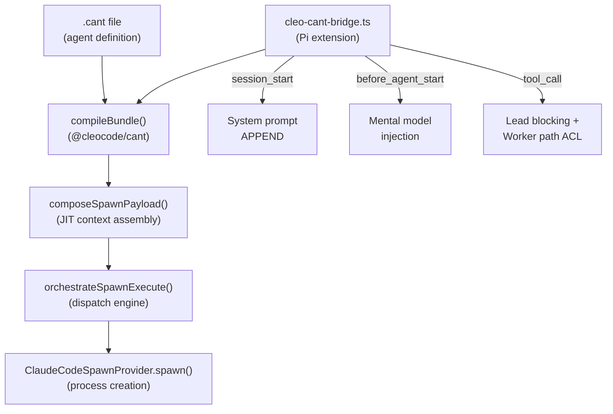
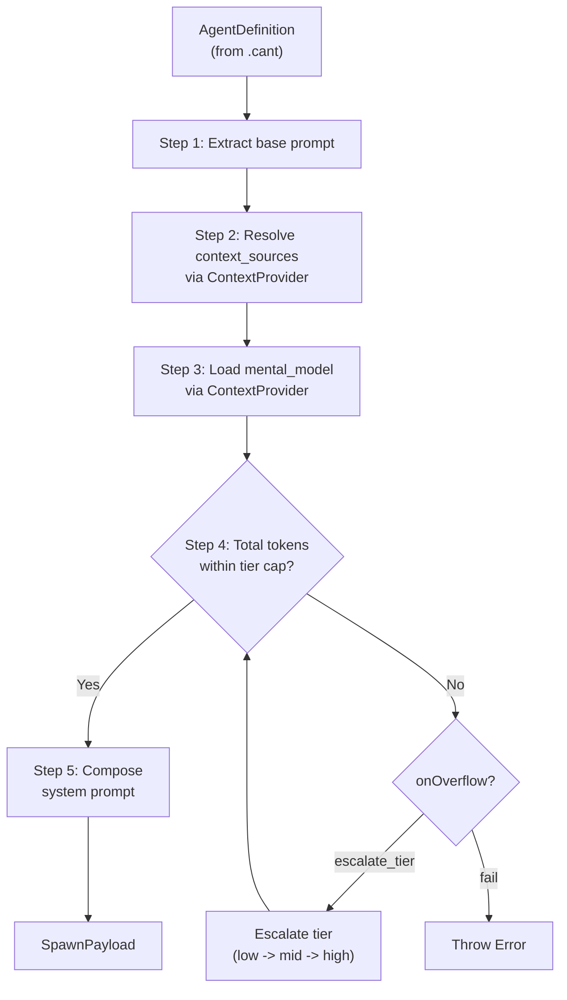

# Subagent Injection Pipeline

**Version**: 1.0.0
**Status**: ACTIVE
**Task**: T440 (WS-3 Documentation Lead)

This document traces the complete path from a `.cant` agent definition file to a running subagent process within the CleoOS Agent Platform.

---

## Architecture Overview

The injection pipeline has five stages:



---

## Stage 1: `.cant` File Discovery and Compilation

### Discovery

`.cant` files are discovered by the **cleo-cant-bridge** Pi extension at session start.

**File**: `packages/cleo-os/extensions/cleo-cant-bridge.ts` (line 579-668)

The bridge scans all three tiers of the CANT hierarchy using `discoverCantFilesMultiTier()`:

```typescript
// cleo-cant-bridge.ts, line 579-586
pi.on("session_start", async (_event, ctx) => {
  bundlePrompt = null;
  lastDiagnosticSummary = null;
  lastBundleCounts = null;

  const { files, stats } = discoverCantFilesMultiTier(ctx.cwd);
  if (files.length === 0) return;
  // ...
});
```

The `discoverCantFilesMultiTier()` function (line 455-497) resolves XDG-compliant paths via `resolveThreeTierPaths()` (line 428-443), then scans each tier with the single-directory `discoverCantFiles()` helper (line 389-404) and merges results using basename-keyed override semantics.

**Resolution tiers** (3-tier discovery implemented in T438):

| Tier | Path | Precedence |
|------|------|------------|
| Global | `$XDG_DATA_HOME/cleo/cant/` (`~/.local/share/cleo/cant/`) | Lowest |
| User | `$XDG_CONFIG_HOME/cleo/cant/` (`~/.config/cleo/cant/`) | Middle |
| Project | `<project>/.cleo/cant/` | Highest |

Files in higher-precedence tiers override files in lower-precedence tiers that share the same basename (project > user > global).

### Compilation via `compileBundle()`

**File**: `packages/cant/src/bundle.ts` (line 465-595)

`compileBundle()` takes an array of absolute `.cant` file paths and:

1. **Parses** each file via `parseDocument()` (calls into the Rust cant-core NAPI binding)
2. **Validates** each file via `validateDocument()` (structural validation rules like S01)
3. **Extracts entities** from the AST: agents, teams, and tools
4. **Collects diagnostics** from both parse and validation phases
5. **Returns a `CompiledBundle`** with a `renderSystemPrompt()` method

The `CompiledBundle` shape:

```typescript
interface CompiledBundle {
  documents: Map<string, ParsedCantDocument>;
  agents: AgentEntry[];
  teams: TeamEntry[];
  tools: ToolEntry[];
  diagnostics: BundleDiagnostic[];
  valid: boolean;
  renderSystemPrompt(): string;  // Markdown addendum for Pi
}
```

Agent entity extraction happens in `extractAgents()` (line 234-266), which walks the AST `sections` array looking for `Agent` nodes and simplifies the AST value wrappers (e.g., `{ Identifier: "worker" }` becomes `"worker"`).

### System Prompt Injection

The compiled bundle prompt is appended to the Pi system prompt during the `before_agent_start` event (line 672-721):

```typescript
// cleo-cant-bridge.ts, line 672
pi.on("before_agent_start", async (event, ctx) => {
  const existingPrompt = event.systemPrompt ?? "";
  let appendix = "";
  if (bundlePrompt) {
    appendix += "\n\n" + bundlePrompt;
  }
  // ... mental model injection follows ...
  return { systemPrompt: existingPrompt + appendix };
});
```

The rendered prompt lists all declared agents with their roles, tiers, and first line of their prompt text. This gives the LLM awareness of the full agent roster.

---

## Stage 2: `composeSpawnPayload()` -- JIT Context Assembly

**File**: `packages/cant/src/composer.ts` (line 267-365)

At spawn time (not at session start), the composer runs JIT context assembly. This is the ULTRAPLAN section 9.3 implementation. It takes an `AgentDefinition` (extracted from a compiled `.cant` bundle) and produces a token-budgeted `SpawnPayload`.

### Algorithm



### Token Budget Caps per Tier

Defined at `composer.ts` line 19-23 (ULTRAPLAN section 9.4):

| Tier | System Prompt | Mental Model | Context Sources |
|------|---------------|--------------|-----------------|
| `low` | 4,000 | 0 | 0 |
| `mid` | 12,000 | 1,000 | 4,000 |
| `high` | 32,000 | 2,000 | 12,000 |

### Context Source Resolution

Context sources are defined in the `AgentDefinition.contextSources` array. Each entry specifies a BRAIN table category (patterns, decisions, learnings, observations), a query string, and a max entry count.

The `ContextProvider` interface (line 81-90) defines two methods:
- `queryContext(source, query, maxTokens)` -- retrieves context slices from BRAIN
- `loadMentalModel(agentName, projectHash, maxTokens)` -- loads the agent's mental model

### BRAIN Context Provider

**File**: `packages/cant/src/context-provider-brain.ts` (line 104-272)

The `brainContextProvider()` factory creates a `ContextProvider` backed by the project's `brain.db`. It:

1. Maps `source` to BRAIN tables: `patterns`, `decisions`, `learnings`, `observations`
2. Calls `memoryFind()` to discover relevant entries (up to 10 hits)
3. Calls `memoryFetch()` to retrieve full content
4. Truncates content to fit the token budget (4 chars per token estimate)

Mental model loading uses the T417/T418 `agent` filter to retrieve only observations written by the specific agent, sorted by date descending.

### Model Selection per Tier

Defined at `composer.ts` line 230-234:

| Tier | Primary Model | Fallbacks |
|------|---------------|-----------|
| `low` | `claude-haiku-4-5` | `kimi-k2.5` |
| `mid` | `claude-sonnet-4-6` | `kimi-k2.5`, `claude-haiku-4-5` |
| `high` | `claude-opus-4-6` | `claude-sonnet-4-6`, `kimi-k2.5` |

### Tier Escalation

When the total token count exceeds the current tier's `systemPrompt` cap, the composer escalates:
- `low` -> `mid` -> `high`
- If content exceeds even the `high` cap, the composer throws an error
- The `onOverflow` field on the `AgentDefinition` controls behavior: `'escalate_tier'` (default) or `'fail'`

### SpawnPayload Output

```typescript
interface SpawnPayload {
  agentName: string;
  resolvedTier: Tier;        // May differ from declaredTier
  escalated: boolean;
  declaredTier: Tier;
  systemPrompt: string;      // Fully composed
  systemPromptTokens: number;
  model: string;             // Primary model for the tier
  fallbackModels: string[];
  skills: string[];
  tools: string[];
  injectedContextSources: string[];
  mentalModelInjected: boolean;
}
```

---

## Stage 3: Orchestrate Dispatch Domain

### `orchestrate.spawn` (Query spawn context)

**File**: `packages/cleo/src/dispatch/domains/orchestrate.ts` (line 297-311)

The `OrchestrateHandler.mutate('spawn', ...)` route requires a `taskId` and optional `protocolType` and `tier`. It delegates to `orchestrateSpawn()` in the engine, which:

1. Validates spawn readiness via `validateSpawnReadiness()`
2. Calls `prepareSpawn()` to build the raw spawn context

### `orchestrate.spawn.execute` (Execute actual spawn)

**File**: `packages/cleo/src/dispatch/domains/orchestrate.ts` (line 356-378)

The `OrchestrateHandler.mutate('spawn.execute', ...)` route delegates to `orchestrateSpawnExecute()` in the engine.

### `orchestrate.fanout` (Parallel spawn)

**File**: `packages/cleo/src/dispatch/domains/orchestrate.ts` (line 453-481)

The fanout operation takes an array of `{ team, taskId, skill? }` items and dispatches them concurrently via `Promise.allSettled`. Each item routes through `orchestrateSpawnExecute()`.

Results are stored in an in-process `fanoutManifestStore` (capped at 64 entries) for later querying via `orchestrate.fanout.status`.

---

## Stage 4: `orchestrateSpawnExecute()` -- Engine Spawn Path

**File**: `packages/cleo/src/dispatch/engines/orchestrate-engine.ts` (line 436-594)

This is the central function that connects all the pieces:

### Step-by-Step Flow

1. **Initialize adapter registry**: Imports and calls `initializeDefaultAdapters()` from `@cleocode/core/internal`

2. **Find adapter**: Uses the CAAMP `spawnRegistry` to find a capable spawn adapter (auto-selects the first capable adapter if no `adapterId` is specified)

3. **Verify capabilities**: Checks that the provider supports `spawn.supportsSubagents` via `providerSupportsById()`

4. **Prepare raw spawn context**: Calls `prepareSpawn(taskId, cwd, accessor)` from `@cleocode/core/internal` which:
   - Loads the task from `tasks.db`
   - Auto-dispatches the protocol type (research, implementation, etc.)
   - Calls `buildSpawnPrompt()` to create the raw prompt with task details

5. **T432 JIT Context Assembly** (line 524-552): Attempts to compose a token-budgeted system prompt via `composeSpawnPayload()`:
   - Derives a project hash from the cwd (SHA-256, first 12 chars)
   - Checks if the spawn context carries an `agentDef` from a compiled CANT bundle
   - If present, calls `composeSpawnPayload(agentDef, brainContextProvider(cwd), projectHash)`
   - The composed prompt replaces the raw `prepareSpawn` prompt
   - **Graceful degradation**: If no `agentDef` is available or the composer throws, the raw prompt is used unchanged

6. **Build CLEOSpawnContext**: Assembles the final context with `taskId`, `protocol`, `prompt`, `provider`, and `workingDirectory`

7. **Execute spawn**: Calls `adapter.spawn(cleoSpawnContext)`

8. **Return result**: Returns `instanceId`, `status`, `providerId`, `taskId`, and `timing`

---

## Stage 5: `ClaudeCodeSpawnProvider.spawn()` -- Process Creation

**File**: `packages/adapters/src/providers/claude-code/spawn.ts` (line 44-190)

### How it works

1. **Generate instance ID**: `claude-${Date.now()}-${random}`

2. **Write prompt to temp file**: The full system prompt is written to `/tmp/claude-spawn-<instanceId>.txt`

3. **Spawn detached process**: Uses Node.js `child_process.spawn()`:
   ```typescript
   const args = ['--allow-insecure', '--no-upgrade-check', tmpFile];
   const child = nodeSpawn('claude', args, {
     detached: true,
     stdio: 'ignore',
     cwd: context.workingDirectory,  // Set to worktree path
   });
   child.unref();
   ```

4. **Track process**: Stores `{ pid, taskId, startTime }` in an in-memory `processMap`

5. **Cleanup on exit**: Registers a handler that removes the tracking entry and deletes the temp file when the child process exits

### CLI Flags

| Flag | Purpose |
|------|---------|
| `--allow-insecure` | Prevents interactive security prompts |
| `--no-upgrade-check` | Skips version check on startup |

### Process Lifecycle

- **Detached**: The child process runs independently of the parent
- **Unreffed**: The parent process can exit without waiting for the child
- **Liveness checking**: `listRunning()` uses `process.kill(pid, 0)` to verify processes are still alive
- **Termination**: `terminate()` sends `SIGTERM` to the tracked PID

---

## Runtime Enforcement: cleo-cant-bridge `tool_call` Hook

**File**: `packages/cleo-os/extensions/cleo-cant-bridge.ts` (line 728-808)

The `tool_call` event handler enforces role-based restrictions at runtime:

### Lead Agent Blocking (line 755-771)

Agents with CANT role `"lead"` are blocked from executing `Edit`, `Write`, and `Bash` tools. They receive a LAFS error envelope:

```json
{
  "rejected": true,
  "error": {
    "code": 70,
    "codeName": "E_LEAD_TOOL_BLOCKED",
    "message": "Lead agents cannot execute Edit -- dispatch to a worker instead",
    "fix": "Use the delegate tool to spawn a worker agent for this work"
  }
}
```

### Worker Path ACL (line 776-804)

Workers with declared `filePermissions.write` globs are restricted to writing only within those paths. The enforcement:

1. Extracts the target file path from the tool input (handles `Edit`, `Write`, and best-effort `Bash` parsing)
2. Tests the path against the declared write globs using `matchesAnyGlob()`
3. If the path does not match, returns a LAFS error with code 71 (`E_WORKER_PATH_ACL_VIOLATION`)

---

## What the Spawned Process Receives

The spawned Claude CLI process receives a system prompt composed of these layers (in order):

1. **Base AGENT.md protocol** -- Loaded by Claude Code from `packages/agents/cleo-subagent/AGENT.md`. Contains the worktree guard, immutable constraints (BASE-001 through BASE-008), the 4-phase lifecycle, domain catalog, LAFS envelope format, and anti-patterns.

2. **Raw spawn prompt** -- Built by `buildSpawnPrompt()` in `packages/core/src/orchestration/index.ts` (line 371-397). Contains task ID, title, description, protocol, epic, date, instructions, acceptance criteria, and dependencies.

3. **JIT-composed context** (when `agentDef` is available):
   - Context sources from BRAIN (patterns, decisions, learnings, observations) under a `## Context (JIT-injected)` header
   - Mental model with validation prefix: `"VALIDATE THIS MENTAL MODEL. Re-evaluate each claim against current code state. Mental models are dynamic per project; assume drift."`

4. **CANT bundle prompt** (appended by cleo-cant-bridge) -- Markdown listing all declared agents, teams, and tools from the project's `.cleo/cant/` directory.

5. **Mental model injection** (appended by cleo-cant-bridge) -- Numbered list of prior observations with the validate-on-load preamble.

---

## Token Replacement

Tokens in the base AGENT.md are replaced at spawn time by the orchestrator before the prompt is written to the temp file:

| Token | Resolved From | Example |
|-------|---------------|---------|
| `{{TASK_ID}}` | `task.id` | `T1234` |
| `{{DATE}}` | `new Date().toISOString().split('T')[0]` | `2026-04-09` |
| `{{TOPIC_SLUG}}` | Derived from task labels/title | `auth-research` |
| `{{EPIC_ID}}` | `task.parentId` | `T250` |
| `{{OUTPUT_DIR}}` | Default: `.cleo/agent-outputs` | `.cleo/agent-outputs` |
| `{{SESSION_ID}}` | Active session ID | `ses_20260409...` |

The `findUnresolvedTokens()` function checks for any remaining `{{...}}` patterns and reports them in the spawn context's `tokenResolution` field. Spawning is blocked if any required tokens remain unresolved.

---

## Key File Reference

| File | Role |
|------|------|
| `packages/agents/cleo-subagent/AGENT.md` | Base subagent protocol (worktree guard, constraints, lifecycle) |
| `packages/agents/cleo-subagent/cleo-subagent.cant` | CANT version of the base protocol |
| `packages/cant/src/bundle.ts` | `compileBundle()` -- parse, validate, extract entities |
| `packages/cant/src/composer.ts` | `composeSpawnPayload()` -- JIT context assembly |
| `packages/cant/src/context-provider-brain.ts` | BRAIN-backed `ContextProvider` |
| `packages/core/src/orchestration/index.ts` | `prepareSpawn()`, `buildSpawnPrompt()` |
| `packages/cleo/src/dispatch/engines/orchestrate-engine.ts` | `orchestrateSpawnExecute()` |
| `packages/cleo/src/dispatch/domains/orchestrate.ts` | `OrchestrateHandler` -- dispatch routing |
| `packages/adapters/src/providers/claude-code/spawn.ts` | `ClaudeCodeSpawnProvider` -- process creation |
| `packages/cleo-os/extensions/cleo-cant-bridge.ts` | Pi extension: discovery, compilation, prompt injection, tool_call enforcement |
| `packages/contracts/src/spawn.ts` | `AdapterSpawnProvider`, `SpawnContext`, `SpawnResult` interfaces |
| `packages/contracts/src/spawn-types.ts` | `CLEOSpawnAdapter`, `CLEOSpawnContext`, `CLEOSpawnResult` interfaces |
