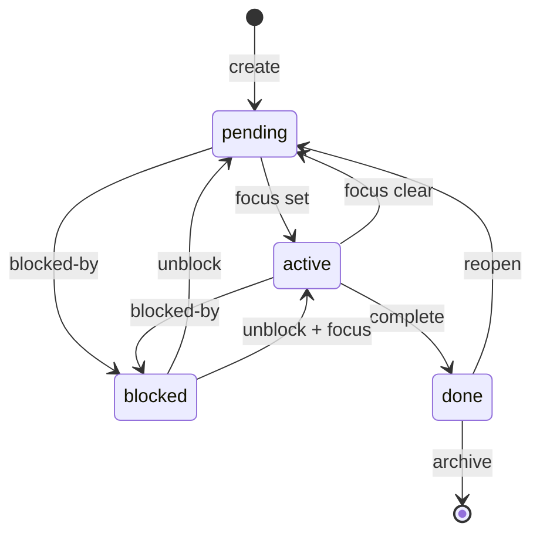

# Schema Reference

CLEO uses JSON Schema for data validation. This reference documents the core data structures.

## Task Object

The fundamental unit of work in CLEO.

```json
{
  "id": "T001",
  "title": "Implement authentication",
  "description": "Add JWT-based auth with refresh tokens",
  "status": "pending",
  "priority": "high",
  "type": "task",
  "parentId": null,
  "size": "medium",
  "labels": ["backend", "security"],
  "phase": "core",
  "depends": ["T000"],
  "files": ["src/auth/jwt.ts"],
  "acceptanceCriteria": ["Tests pass", "Code reviewed"],
  "notes": [
    {
      "timestamp": "2025-01-19T12:00:00Z",
      "text": "Started implementation"
    }
  ],
  "createdAt": "2025-01-19T10:00:00Z",
  "updatedAt": "2025-01-19T12:00:00Z",
  "completedAt": null
}
```

### Field Reference

<ResponseField name="id" type="string" required>
  Unique task identifier. Format: `T` followed by digits (e.g., `T001`, `T1234`)
</ResponseField>

<ResponseField name="title" type="string" required>
  Action-oriented task title. Must differ from description.
</ResponseField>

<ResponseField name="description" type="string">
  Detailed task description
</ResponseField>

<ResponseField name="status" type="string" required>
  Task status. One of: `pending`, `active`, `blocked`, `done`
</ResponseField>

<ResponseField name="priority" type="string">
  Priority level. One of: `critical`, `high`, `medium`, `low`. Default: `medium`
</ResponseField>

<ResponseField name="type" type="string">
  Task type. One of: `epic`, `task`, `subtask`. Inferred from hierarchy.
</ResponseField>

<ResponseField name="parentId" type="string | null">
  Parent task ID for hierarchy. `null` for root tasks.
</ResponseField>

<ResponseField name="size" type="string">
  Scope-based size (NOT time). One of: `small`, `medium`, `large`
</ResponseField>

<ResponseField name="labels" type="string[]">
  Array of labels for categorization
</ResponseField>

<ResponseField name="phase" type="string">
  Project phase assignment (e.g., `setup`, `core`, `testing`)
</ResponseField>

<ResponseField name="depends" type="string[]">
  Array of task IDs this task depends on
</ResponseField>

<ResponseField name="notes" type="object[]">
  Array of timestamped notes
</ResponseField>

<ResponseField name="createdAt" type="string">
  ISO 8601 creation timestamp
</ResponseField>

<ResponseField name="updatedAt" type="string">
  ISO 8601 last modification timestamp
</ResponseField>

<ResponseField name="completedAt" type="string | null">
  ISO 8601 completion timestamp. `null` if not complete.
</ResponseField>

## todo.json Structure

<CodeGroup>
```json Full Structure
{
  "_meta": {
    "schemaVersion": "2.6.0",
    "lastModified": "2025-01-19T12:00:00Z",
    "checksum": "sha256:abc123..."
  },
  "project": {
    "currentPhase": "core",
    "phases": [
      {
        "slug": "setup",
        "name": "Setup",
        "status": "completed"
      },
      {
        "slug": "core",
        "name": "Core Development",
        "status": "active"
      }
    ]
  },
  "focus": {
    "taskId": "T001",
    "setAt": "2025-01-19T12:00:00Z",
    "sessionNote": "Working on JWT implementation"
  },
  "tasks": [
    { /* task object */ }
  ]
}
```

```json Minimal
{
  "_meta": {
    "schemaVersion": "2.6.0"
  },
  "tasks": []
}
```
</CodeGroup>

## Status Transitions

Valid status transitions:



<Note>
Use `cleo complete` for the `active/pending → done` transition. Use `cleo reopen` for `done → pending`.
</Note>

## Priority Values

| Priority | Use Case |
|----------|----------|
| `critical` | Blocking deployment or other work |
| `high` | Important, needs attention soon |
| `medium` | Normal priority (default) |
| `low` | Nice to have, do when time permits |

## Hierarchy Constraints

| Constraint | Value |
|------------|-------|
| Maximum depth | 3 levels (epic → task → subtask) |
| Maximum siblings | Unlimited (configurable via `hierarchy.maxSiblings`) |
| Valid parent types | epic can have tasks, task can have subtasks |

## config.json Structure

```json
{
  "_meta": {
    "schemaVersion": "1.2.0"
  },
  "archive": {
    "daysUntilArchive": 7,
    "preserveRecentCount": 3
  },
  "validation": {
    "maxActiveTasks": 1,
    "requireDescription": false,
    "maxTitleLength": 200
  },
  "hierarchy": {
    "maxDepth": 3,
    "maxSiblings": 7,
    "autoCompleteParent": true,
    "autoCompleteMode": "auto"
  },
  "defaults": {
    "priority": "medium",
    "phase": "core"
  },
  "contextAlerts": {
    "enabled": true,
    "warningThreshold": 70,
    "criticalThreshold": 90
  }
}
```

## Session Object

Sessions track multi-agent work coordination.

<Expandable title="Full Session Schema">
```json
{
  "id": "session_20260119_193457_1e6699",
  "status": "active",
  "name": "Feature Development",
  "agentId": "claude-opus-1",
  "scope": {
    "type": "epic",
    "rootTaskId": "T001",
    "computedTaskIds": ["T001", "T002", "T003"]
  },
  "focus": {
    "currentTask": "T002",
    "sessionNote": "Implementing auth flow",
    "nextAction": "Write unit tests"
  },
  "startedAt": "2026-01-19T19:34:57Z",
  "lastActivity": "2026-01-19T20:15:00Z"
}
```
</Expandable>

<ResponseField name="id" type="string" required>
  Unique session identifier. Format: `session_YYYYMMDD_HHMMSS_hash`
</ResponseField>

<ResponseField name="status" type="string" required>
  Session state. One of: `active`, `suspended`, `ended`, `closed`
</ResponseField>

<ResponseField name="scope" type="object" required>
  Defines what tasks this session can access.

  <Expandable title="Scope Properties">
    <ResponseField name="type" type="string" required>
      Scope type. One of: `task`, `taskGroup`, `subtree`, `epicPhase`, `epic`
    </ResponseField>
    <ResponseField name="rootTaskId" type="string" required>
      Root task ID defining scope boundary
    </ResponseField>
    <ResponseField name="computedTaskIds" type="string[]">
      Array of task IDs computed from scope
    </ResponseField>
  </Expandable>
</ResponseField>

<ResponseField name="focus" type="object">
  Current focus state within session.

  <Expandable title="Focus Properties">
    <ResponseField name="currentTask" type="string | null">
      Currently focused task ID
    </ResponseField>
    <ResponseField name="sessionNote" type="string">
      Session-level progress note
    </ResponseField>
    <ResponseField name="nextAction" type="string">
      Suggested next action
    </ResponseField>
  </Expandable>
</ResponseField>

## Verification Object

Verification gates for task completion quality.

```json
{
  "passed": false,
  "round": 1,
  "gates": {
    "implemented": true,
    "testsPassed": true,
    "qaPassed": null,
    "securityPassed": null,
    "documented": false
  },
  "lastAgent": "coder",
  "lastUpdated": "2026-01-19T20:00:00Z",
  "failureLog": [
    {
      "round": 1,
      "agent": "coder",
      "reason": "Tests failing on edge case",
      "timestamp": "2026-01-19T19:45:00Z"
    }
  ]
}
```

<ResponseField name="passed" type="boolean" required>
  Overall verification status. True when all required gates pass.
</ResponseField>

<ResponseField name="gates" type="object" required>
  Individual verification gates.

  <Expandable title="Gate Definitions">
    <ResponseField name="implemented" type="boolean | null">
      Implementation complete. Auto-set by `complete` command.
    </ResponseField>
    <ResponseField name="testsPassed" type="boolean | null">
      Tests pass. Set via `cleo verify --gate testsPassed`
    </ResponseField>
    <ResponseField name="qaPassed" type="boolean | null">
      QA review passed.
    </ResponseField>
    <ResponseField name="securityPassed" type="boolean | null">
      Security scan clear.
    </ResponseField>
    <ResponseField name="documented" type="boolean | null">
      Documentation complete.
    </ResponseField>
  </Expandable>
</ResponseField>

<ResponseField name="failureLog" type="object[]">
  History of verification failures for debugging.
</ResponseField>

## Error Response Object

All error responses follow this structure.

```json
{
  "success": false,
  "error": {
    "code": "E_VALIDATION_FAILED",
    "message": "Task title exceeds maximum length",
    "exitCode": 6,
    "recoverable": true,
    "suggestion": "Shorten title to under 200 characters",
    "fix": "cleo update T001 --title \"Shorter title\"",
    "alternatives": [
      {
        "action": "View current task",
        "command": "cleo show T001"
      }
    ],
    "context": {
      "field": "title",
      "maxLength": 200,
      "actualLength": 250
    }
  }
}
```

<ResponseField name="code" type="string" required>
  Error code identifier (e.g., `E_VALIDATION_FAILED`, `E_NOT_FOUND`)
</ResponseField>

<ResponseField name="exitCode" type="number" required>
  CLI exit code for scripting
</ResponseField>

<ResponseField name="recoverable" type="boolean">
  Whether error can be retried with different input
</ResponseField>

<ResponseField name="fix" type="string">
  Copy-paste ready command to resolve the error
</ResponseField>

<ResponseField name="alternatives" type="object[]">
  Alternative commands to try
</ResponseField>

<ResponseField name="context" type="object">
  Structured error context for debugging
</ResponseField>

## Next Steps

<CardGroup cols={2}>
  <Card title="Exit Codes" icon="hashtag" href="/api/exit-codes">
    CLI exit code reference
  </Card>
  <Card title="Output Formats" icon="file-export" href="/api/output-formats">
    JSON, CSV, and other output formats
  </Card>
</CardGroup>
