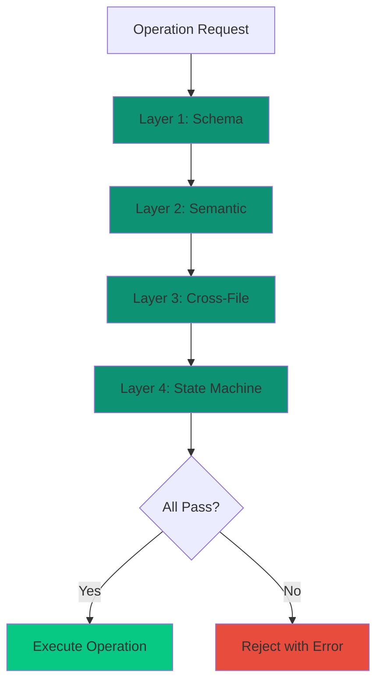
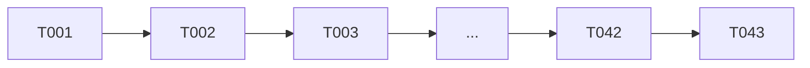

# Anti-Hallucination Protocol

CLEO's core mission is preventing hallucination - when AI generates plausible but incorrect data. Every operation undergoes **four-layer validation**.

## The Four Validation Layers



<Tabs>
  <Tab title="Layer 1: Schema">
    **JSON Schema Enforcement**

    Every data structure is validated against a strict JSON Schema:

    - **Structure validation** - Required fields, proper nesting
    - **Type checking** - Strings, numbers, arrays, objects
    - **Enum constraints** - `status: pending|active|blocked|done`
    - **Format validation** - ISO 8601 timestamps, T### IDs

    ```json
    {
      "status": {
        "type": "string",
        "enum": ["pending", "active", "blocked", "done"]
      }
    }
    ```
  </Tab>

  <Tab title="Layer 2: Semantic">
    **Content Integrity**

    Beyond structure, content must be meaningful:

    - **ID uniqueness** - Across `todo.json` + archive
    - **Timestamp sanity** - Not future, `completedAt > createdAt`
    - **Content pairing** - Title != description
    - **Duplicate detection** - No duplicate task descriptions
  </Tab>

  <Tab title="Layer 3: Cross-File">
    **Referential Integrity**

    Relationships between files must be consistent:

    - **Log entries** - Reference valid task IDs
    - **Archive consistency** - Archived tasks don't exist in active
    - **Dependency validity** - Dependencies reference existing tasks
    - **Synchronized updates** - Related files update atomically
  </Tab>

  <Tab title="Layer 4: State Machine">
    **Transition Validation**

    State changes must follow allowed transitions:

    - `pending` -> `active` (via focus set)
    - `active` -> `done` (via complete)
    - `done` -> `pending` (via reopen)
    - `cancelled` is terminal (no transitions out)
  </Tab>
</Tabs>

## Exit Code Guarantees

Every operation returns a meaningful exit code:

| Code | Category | Meaning |
|------|----------|---------|
| 0 | Success | Operation completed |
| 2 | Input | Invalid arguments |
| 4 | Resource | Not found |
| 6 | Validation | Schema/semantic failure |
| 10-14 | Hierarchy | Parent/depth/sibling issues |
| 20-22 | Integrity | Checksum/sequence/collision |
| 100-102 | Special | No data/exists/no change |

<Note>
Exit codes enable LLM agents to branch programmatically without parsing error messages.
</Note>

## Checksum Protection

Critical files include checksums for integrity verification:

```json
{
  "_meta": {
    "checksum": "abc123def456",
    "schemaVersion": "2.6.0"
  }
}
```

If an external process modifies the file, the checksum mismatch is detected:

```bash
cleo validate
# Exit code 6 if checksum mismatch detected
# Use --fix to recalculate checksums
```

## Sequence Integrity

Task IDs follow a strict sequential pattern:



<Warning>
Never manually edit `.cleo/todo.json` - use CLI commands only to maintain integrity.
</Warning>

## Recovery Mechanisms

When validation fails, CLEO provides recovery paths:

<AccordionGroup>
  <Accordion title="Checksum Mismatch" icon="shield-exclamation">
    ```bash
    cleo validate --fix
    ```
    Recalculates checksums after verifying data integrity.
  </Accordion>
  <Accordion title="Orphaned Tasks" icon="unlink">
    ```bash
    cleo validate --check-orphans
    cleo validate --fix-orphans unlink
    ```
    Detects and fixes tasks with invalid parent references.
  </Accordion>
  <Accordion title="Schema Outdated" icon="arrow-up">
    ```bash
    cleo upgrade
    ```
    Migrates data to latest schema version.
  </Accordion>
</AccordionGroup>

## Related

<CardGroup cols={2}>
  <Card title="Data Flows" icon="diagram-project" href="/concepts/data-flows">
    Visualize validation in context
  </Card>
  <Card title="Exit Codes" icon="hashtag" href="/api/exit-codes">
    Complete exit code reference
  </Card>
</CardGroup>
