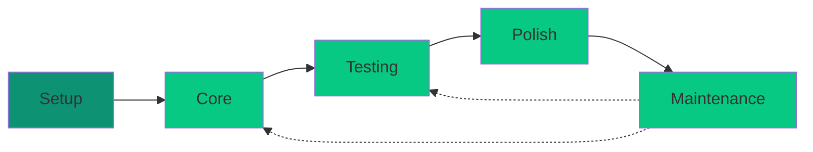

# Phases

Phases organize project work into logical stages, providing structure and progress tracking.

## The Five Phases

CLEO uses a five-phase workflow structure:

<Steps>
  <Step title="Setup" icon="play">
    Foundation and planning - project initialization, architecture decisions, environment setup
  </Step>
  <Step title="Core" icon="code">
    Main development - feature implementation, primary functionality
  </Step>
  <Step title="Testing" icon="vial">
    Validation - unit tests, integration tests, QA review
  </Step>
  <Step title="Polish" icon="sparkles">
    Refinement - documentation, edge cases, performance tuning
  </Step>
  <Step title="Maintenance" icon="wrench">
    Ongoing support - bug fixes, updates, long-term maintenance
  </Step>
</Steps>

## Phase Progress

View phase progress across your project:

```bash
cleo phases
```

Output:

```
Phase         Progress    Tasks
────────────────────────────────
setup         ████████░░  80%  (4/5)
core          ██████░░░░  60%  (6/10)
testing       ████░░░░░░  40%  (4/10)
polish        ░░░░░░░░░░  0%   (0/5)
maintenance   ░░░░░░░░░░  0%   (0/2)
```

## Assigning Phases

<Tabs>
  <Tab title="At Creation">
    ```bash
    cleo add "Implement login" --phase core --priority high
    ```
  </Tab>
  <Tab title="Update Existing">
    ```bash
    cleo update T005 --phase testing
    ```
  </Tab>
  <Tab title="Bulk Filter">
    ```bash
    # View all testing phase tasks
    cleo list --phase testing
    ```
  </Tab>
</Tabs>

## Project Phase Context

Set the current project phase to provide context for your session:

```bash
# Set current phase
cleo phase set testing

# Show current phase
cleo phase show

# View phase history
cleo phase history
```

<Info>
The project phase provides context but doesn't restrict which tasks you can work on. Cross-phase work is allowed when intentional.
</Info>

## Phase Discipline

When working with phases, follow these guidelines:

<CardGroup cols={2}>
  <Card title="Same Phase Preferred" icon="bullseye">
    Focus on current phase tasks for clarity and momentum
  </Card>
  <Card title="Intentional Cross-Phase" icon="shuffle">
    Document rationale when working across phases
  </Card>
  <Card title="Phase Completion" icon="flag-checkered">
    Understand what triggers phase advancement
  </Card>
  <Card title="Context Preservation" icon="link">
    Maintain phase relationships during reorganization
  </Card>
</CardGroup>

## Phase-Aware Session Scoping

Sessions can be scoped to specific phases:

```bash
# Work only on testing phase of epic T001
cleo session start --scope epicPhase --root T001 --phase testing
```

This restricts your session's scope to tasks matching both the epic and phase criteria.

## Phase Transition Patterns



<Note>
Maintenance phase can feed back into Core or Testing as bugs are discovered and fixed.
</Note>

## Phase Statistics

Get detailed phase analytics:

```bash
cleo phases stats
```

Includes:
- Tasks per phase
- Completion rates
- Average cycle time per phase
- Blocked tasks per phase

## Related

<CardGroup cols={2}>
  <Card title="Commands: phase" icon="flag" href="/commands/phase">
    Project phase management
  </Card>
  <Card title="Commands: phases" icon="flag-checkered" href="/commands/phases">
    Phase listing and statistics
  </Card>
</CardGroup>
