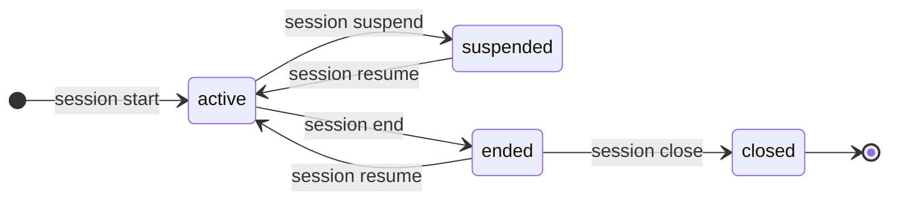
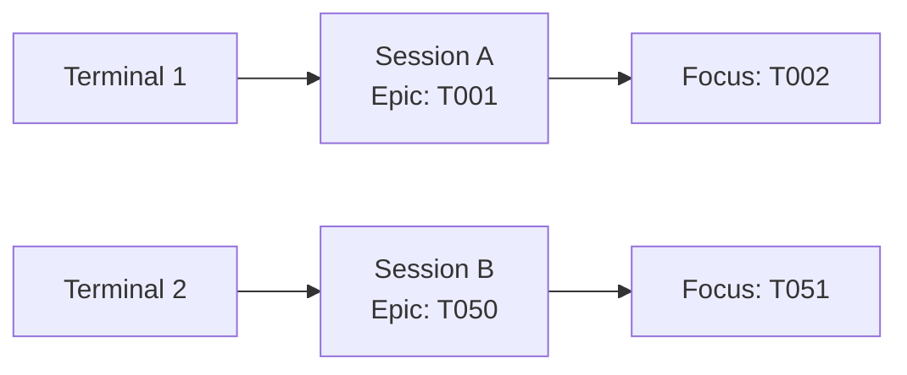
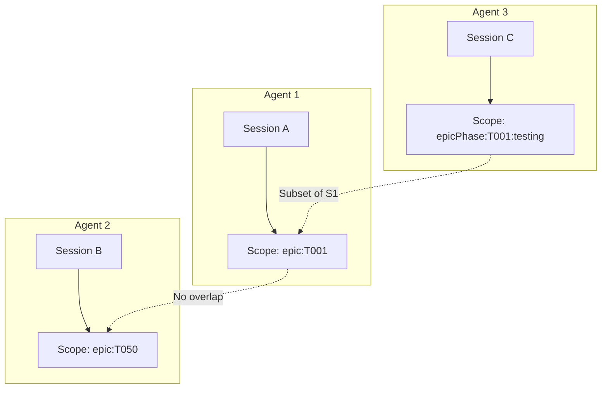

# Sessions

Sessions in CLEO provide work continuity across terminal sessions and Claude conversations. This page explains the conceptual model.

## What Is a Session?

A session represents a bounded work context:

- **Scope** - What tasks you're working on (an epic, task group, or phase)
- **Binding** - Which terminal is working on this session
- **State** - Active, suspended, ended, or closed
- **Focus** - The single active task within the scope

<Note>
Sessions persist independently of terminal sessions and Claude conversations. When you start a new Claude conversation, your CLEO sessions are still there.
</Note>

## Session States



<CardGroup cols={2}>
  <Card title="Active" icon="circle-play">
    Currently working. Terminal bound to this session.
  </Card>
  <Card title="Suspended" icon="circle-pause">
    Paused explicitly. Waiting on external blocker.
  </Card>
  <Card title="Ended" icon="circle-stop">
    Work complete for now. Resumable later.
  </Card>
  <Card title="Closed" icon="circle-xmark">
    Permanently archived. Not resumable.
  </Card>
</CardGroup>

## Scope Types

Sessions can be scoped to different task groupings:

| Scope Type | Definition | Example |
|------------|------------|---------|
| `task` | Single task only | `--scope task:T005` |
| `taskGroup` | Parent + direct children | `--scope taskGroup:T005` |
| `subtree` | Parent + all descendants | `--scope subtree:T001` |
| `epicPhase` | Epic filtered by phase | `--scope epicPhase --root T001 --phase testing` |
| `epic` | Full epic tree | `--scope epic:T001` |

## Terminal Binding

When you start or resume a session, CLEO writes to `.cleo/.current-session`. This **binds your terminal** to that session.



<Info>
Multiple terminals can have different active sessions. Each terminal is bound to exactly one session.
</Info>

## Single-Task Focus

Within each session scope, only one task can be `active` at a time:

- Starting a session with `--auto-focus` sets focus to the first available task
- `cleo start T005` changes the active task
- `cleo complete T005` automatically suggests the next task

```bash
# Check current focus
cleo current

# Change focus
cleo start T006

# Add progress note
cleo update T006 --notes "Implemented validation logic"
```

## Multi-Session Coordination

When multiple agents work simultaneously:



<Warning>
Sessions cannot claim the same task simultaneously. Scope overlap is configurable via `multiSession.allowScopeOverlap`.
</Warning>

## Session vs Focus

| Aspect | Session | Focus |
|--------|---------|-------|
| **Scope** | Group of tasks | Single task |
| **Persistence** | Survives restarts | Within session |
| **Purpose** | Work boundary | Current attention |
| **Commands** | `session start/end` | `start/show` |

## Related

<CardGroup cols={2}>
  <Card title="Session Guide" icon="clock" href="/guides/sessions">
    Step-by-step session workflows
  </Card>
  <Card title="Multi-Agent Setup" icon="users" href="/guides/multi-agent">
    Configuring concurrent sessions
  </Card>
</CardGroup>
