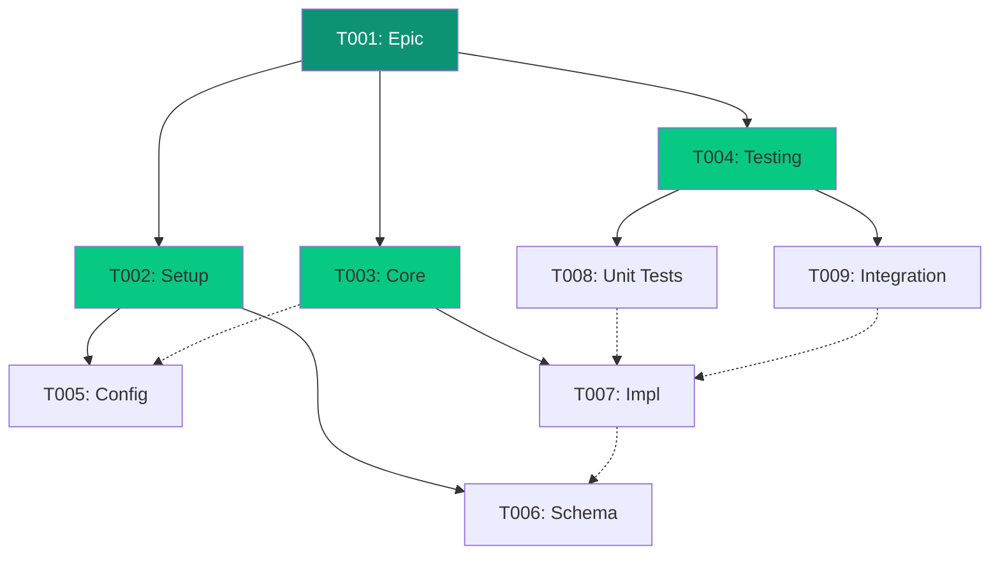

# Task Hierarchy

CLEO uses a simple three-level hierarchy to organize work: **Epic -> Task -> Subtask**.

## The Three Levels

<CardGroup cols={3}>
  <Card title="Epic" icon="flag">
    Large features or milestones containing multiple tasks
  </Card>
  <Card title="Task" icon="check-square">
    Individual work items, can stand alone or be part of an epic
  </Card>
  <Card title="Subtask" icon="list-check">
    Granular steps within a task
  </Card>
</CardGroup>

## Why Three Levels?

Research shows that deeper hierarchies impair navigation and understanding. Three levels provide:

- **Sufficient structure** for complex projects
- **Easy navigation** - never more than 2 clicks to any item
- **Clear responsibility** - each level has distinct purpose

<Note>
Attempting to create a fourth level (subtask of subtask) will return exit code 11 (depth exceeded).
</Note>

## Creating Hierarchies

<Tabs>
  <Tab title="Epic">
    ```bash
    cleo add "User Authentication System" \
      --type epic \
      --priority high \
      --phase core
    # Creates T001 as epic
    ```
  </Tab>
  <Tab title="Task">
    ```bash
    cleo add "Implement JWT middleware" \
      --parent T001 \
      --priority medium
    # Creates T002 under T001
    ```
  </Tab>
  <Tab title="Subtask">
    ```bash
    cleo add "Add token validation" \
      --parent T002 \
      --type subtask \
      --size small
    # Creates T003 under T002
    ```
  </Tab>
</Tabs>

## Viewing Hierarchy

```bash
# Tree view of all tasks
cleo tree

# Subtree from specific epic
cleo tree --parent T001

# List children of a task
cleo list --parent T001
```

Example output:

```
T001 [epic] User Authentication System
├── T002 [task] Implement JWT middleware
│   ├── T003 [subtask] Add token validation
│   └── T004 [subtask] Handle refresh tokens
├── T005 [task] Create login endpoint
└── T006 [task] Add password hashing
```

## Moving Tasks

<CodeGroup>
```bash Reparent
# Move T005 under T002
cleo reparent T005 --to T002
```

```bash Promote
# Remove parent, make root-level
cleo promote T005
```

```bash Reorder
# Change position within siblings
cleo reorder T005 --position 1
cleo reorder T005 --top
cleo reorder T005 --after T003
```
</CodeGroup>

## Auto-Complete Behavior

When all children of a task are complete, the parent can auto-complete:

```bash
# Enable auto-complete
cleo config set hierarchy.autoCompleteParent true
cleo config set hierarchy.autoCompleteMode auto  # auto|suggest|off
```

<Info>
With `suggest` mode, CLEO prompts before auto-completing parents.
</Info>

## Constraints

| Constraint | Value | Configurable |
|------------|-------|--------------|
| Max depth | 3 levels | No |
| Max siblings | 7 (default) | Yes |
| Type inference | Automatic | Yes |

```bash
# Adjust sibling limit
cleo config set hierarchy.maxSiblings 10
```

## Dependency Visualization



**Legend**: Solid lines = parent-child, Dashed lines = dependencies

## Related

<CardGroup cols={2}>
  <Card title="Commands: reparent" icon="sitemap" href="/commands/reparent">
    Move tasks between parents
  </Card>
  <Card title="Commands: tree" icon="folder-tree" href="/commands/tree">
    View hierarchy as tree
  </Card>
</CardGroup>
