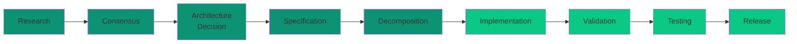
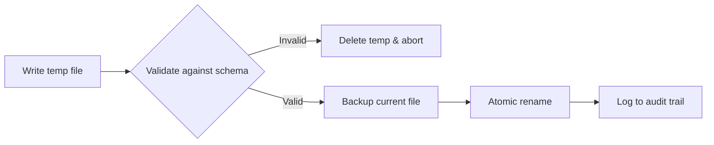

# CLEO Vision

**The contract between you and your AI coding agent.**

## Vision Charter (Immutable)

This document is CLEO's constitutional vision and source of product identity. All strategic documents, specifications, ADRs, and implementation work MUST align to this vision. This document defines what CLEO **is** — not what it builds next.

## Agent Entry (Deterministic)

```
MODE: READ_ONLY_IDENTITY_BOOTSTRAP
PRIMARY_SOURCE: docs/concepts/vision.mdx
IDENTITY_LOCK: TRUE

READ_ORDER:
1) docs/concepts/vision.md                     (this document — canonical identity)
2) docs/specs/PORTABLE-BRAIN-SPEC.md            (normative product contract)
3) README.md                                    (public-facing product statement)
4) docs/specs/CLEO-STRATEGIC-ROADMAP-SPEC.md    (phase/gate execution plan)
5) docs/specs/CLEO-BRAIN-SPECIFICATION.md       (BRAIN capability model)

NON_NEGOTIABLES:
- Do not redefine CLEO identity
- Treat planned/gated as not shipped
- Preserve canonical pillars and terminology
- LAFS is the agent communication contract
- RCASD-IVTR+C is the lifecycle pipeline
- BRAIN is the memory system
- NEXUS is the cross-project connective layer

CANONICAL_IDENTITY:
CLEO is a vendor-neutral Brain and Memory system for AI software
development that provides portable project memory, verifiable
provenance, and agent-safe orchestration across any repository,
model provider, or coding tool.

CANONICAL_PILLARS:
- Portable Memory (BRAIN)
- Agent Communication Contract (LAFS)
- Structured Lifecycle (RCASD-IVTR+C)
- Deterministic Safety
- Cognitive Retrieval (BRAIN + NEXUS)
```

---

## Canonical Product Statement

CLEO is a vendor-neutral **Brain and Memory system** for AI software development. It provides portable project memory, verifiable provenance, and agent-safe orchestration across any repository, model provider, or coding tool.

<Note>
**One developer. One AI agent. One source of truth.**
</Note>

### The Name

CLEO is the name of the system. It originated as "Command Line Entity Orchestrator" but has evolved beyond that acronym. CLEO is now the proper name for the complete platform — encompassing the Brain, the lifecycle pipeline, the cross-project network, and the agent communication protocol. The name stands on its own.

---

## System Architecture

CLEO is composed of four interdependent systems. Each has a distinct role, and together they form a complete platform for AI-assisted software development.

```
+=====================================================================+
|                            C L E O                                  |
|              The Portable Brain and Memory System                   |
+=====================================================================+
|                                                                     |
|  +------------------------------+  +----------------------------+   |
|  |          B R A I N            |  |     R C A S D - I V T R    |   |
|  |     Memory & Cognition       |  |     + C  Lifecycle          |   |
|  |                              |  |                            |   |
|  |  Observations  Patterns      |  |  Research -> Consensus     |   |
|  |  Learnings     Decisions     |  |  -> Architecture Decision  |   |
|  |  Sessions      Profiles      |  |  -> Specification          |   |
|  |  FTS5 + Vector + Graph       |  |  -> Decomposition          |   |
|  |                              |  |  -> Implementation         |   |
|  +------------------------------+  |  -> Validation -> Testing  |   |
|                                    |  -> Release                |   |
|  +------------------------------+  |  + Contribution (X-cut)    |   |
|  |         N E X U S             |  +----------------------------+   |
|  |   Cross-Project Network      |                                   |
|  |                              |  +----------------------------+   |
|  |  Project Registry            |  |          L A F S            |   |
|  |  Global Graph                |  |   Agent Communication      |   |
|  |  Permission Model            |  |                            |   |
|  |  Federated Queries           |  |  JSON Envelopes   MVI      |   |
|  |  PageIndex + Similarity      |  |  Field Filtering  Flags    |   |
|  +------------------------------+  |  Exit Codes       Schema   |   |
|                                    +----------------------------+   |
|                                                                     |
|  +-----------------------------------------------------------------+
|  |                   Shared Core (src/core/)                       |
|  |  CLI (Commander.js)  |  MCP (cleo_query/cleo_mutate)  |  SDK   |
|  +-----------------------------------------------------------------+
|  |                   SQLite (Drizzle ORM)                          |
|  |  .cleo/tasks.db   .cleo/brain.db   |  ~/.cleo/nexus.db         |
|  |  (project work)   (memory/cognition)|  (global network)         |
|  +-----------------------------------------------------------------+
+=====================================================================+
```

### The Four Systems

<CardGroup cols={2}>
  <Card title="BRAIN" icon="brain">
    **Memory & Cognition** — The persistent memory backend. Stores observations, patterns, learnings, and decisions. Provides FTS5 search, vector similarity, and graph-based retrieval. The lifeblood of anti-hallucination.
  </Card>
  <Card title="RCASD-IVTR+C" icon="list-check">
    **Structured Lifecycle** — The project lifecycle pipeline. Ten stages from Research through Release, plus the cross-cutting Contribution protocol. Provides deterministic gates, protocol validation, and manifest-based provenance.
  </Card>
  <Card title="NEXUS" icon="circle-nodes">
    **Cross-Project Network** — The connective layer between registered CLEO projects. Uses the project's exposed tools to bridge global graphs, shared patterns, and federated queries while preserving per-project isolation.
  </Card>
  <Card title="LAFS" icon="file-contract">
    **Agent Communication Contract** — The LLM-Agent-First Specification protocol. Defines how agents communicate with CLEO: JSON envelopes, MVI progressive disclosure, field filtering, exit codes, and output format semantics.
  </Card>
</CardGroup>

---

## Five Pillars

<Steps>
  <Step title="Portable Memory (BRAIN)">
    Every project carries its own `.cleo/` directory with two SQLite databases: `tasks.db` for project work (tasks, sessions, lifecycle, ADRs, audit) and `brain.db` for memory and cognition (observations, patterns, learnings, decisions, FTS5 indexes, PageIndex, vector embeddings). Move the `.cleo/` directory, and the entire brain moves with it. Each project is identified by a unique `projectHash` in `project-info.json`.
  </Step>
  <Step title="Agent Communication Contract (LAFS)">
    All agent-CLEO communication follows the LAFS protocol: JSON envelopes with metadata, MVI-tiered progressive disclosure (minimal/standard/full/custom), field filtering via `_fields`, and deterministic exit codes. This contract is provider-neutral — any LLM agent that speaks LAFS can use CLEO.
  </Step>
  <Step title="Structured Lifecycle (RCASD-IVTR+C)">
    Every significant piece of work follows a structured pipeline: Research, Consensus, Architecture Decision, Specification, Decomposition, Implementation, Validation, Testing, Release — plus the cross-cutting Contribution protocol for provenance. Lifecycle gates enforce progression.
  </Step>
  <Step title="Deterministic Safety">
    Four-layer validation (schema, semantic, referential, state machine), atomic write operations, immutable audit logs, and lifecycle gate enforcement. No partial writes. No hallucinated references. No skipped validation.
  </Step>
  <Step title="Cognitive Retrieval (BRAIN + NEXUS)">
    Three-tier retrieval: FTS5 keyword search, vector similarity via SQLite-vec, and graph-based discovery via PageIndex and dependency traversal — all in `brain.db`. Currently, vectorless RAG (5 discovery methods) is shipped. FTS5, vector, and PageIndex tiers are gated on the `brain.db` migration. NEXUS extends retrieval across project boundaries with federated queries and global pattern libraries.
  </Step>
</Steps>

---

## BRAIN: The Memory System

BRAIN is the persistent memory backend that makes CLEO a non-hallucination tool system. Inspired by [claude-mem](https://github.com/thedotmack/claude-mem) (observation compression, progressive disclosure, and the three-layer retrieval workflow) and [supermemory](https://github.com/supermemoryai/supermemory) (knowledge graphs, temporal decay, memory extraction, and semantic retrieval), BRAIN implements a dedicated memory database (`brain.db`) alongside the project work database (`tasks.db`).

### Database Architecture

| Database | Contents | Scope |
|----------|----------|-------|
| **`.cleo/tasks.db`** | Tasks, sessions, lifecycle pipelines, ADRs, audit log, status registry | Project work — the structured RCASD-IVTR+C pipeline |
| **`.cleo/brain.db`** | Observations, patterns, learnings, decisions, FTS5 indexes, PageIndex, vector embeddings, knowledge graph | Memory and cognition — everything BRAIN stores and retrieves |
| **`~/.cleo/nexus.db`** | Project registry, cross-project graph edges, permissions, global pattern library | Global NEXUS network — connects all registered projects |

The `brain.db` is linked to `tasks.db` via task IDs. Every observation, pattern, and learning references the task context it came from. This separation keeps project work operations fast while allowing BRAIN to grow with rich memory structures (FTS5 virtual tables, vector indexes, graph edges) without impacting task CRUD performance.

### Memory Model

BRAIN distinguishes between **raw artifacts** (session transcripts, code diffs, manifest entries) and **extracted knowledge** (patterns, learnings, decisions). This mirrors the Document/Memory distinction — raw input is ingested, then AI-powered extraction produces structured, searchable knowledge units.

| Memory Type | Description | Persistence |
|-------------|-------------|-------------|
| **Observations** | Compressed records of what happened during sessions | Permanent |
| **Patterns** | Recurring workflows, blockers, successes, and optimizations | Strengthens with repetition |
| **Learnings** | Actionable insights extracted from project work | Confidence-scored |
| **Decisions** | Architecture Decision Records (ADRs) with cognitive search | Permanent (version-chained) |
| **Sessions** | Handoff notes, briefings, and continuity context | Per-session |
| **Profiles** | Static project facts + dynamic recent context | Auto-maintained |

### Three-Layer Retrieval

BRAIN uses a progressive retrieval workflow that achieves ~10x token savings over traditional RAG:

1. **Search** — Returns a compact index with IDs and titles (~50-100 tokens per result)
2. **Timeline** — Shows chronological context around interesting results
3. **Fetch** — Retrieves full details ONLY for pre-filtered IDs (~500-1000 tokens each)

The agent manages its own token budget by deciding what to fetch based on relevance.

### Knowledge Graph

Memories form a graph with three relationship types:

| Relation | Meaning | Example |
|----------|---------|---------|
| **Updates** | Supersedes prior knowledge | New ADR replaces old architecture decision |
| **Extends** | Enriches existing knowledge | Implementation detail adds to specification |
| **Derives** | Inferred from related context | Pattern detected from recurring task failures |

The `isLatest` flag tracks which version of a fact is current, enabling temporal reasoning and preventing stale knowledge from polluting agent context.

### Search Infrastructure

| Tier | Technology | Status | Capability |
|------|-----------|--------|------------|
| **S** | `brain.db` + FTS5 | Gated | Full-text keyword search with auto-sync triggers |
| **M** | `brain.db` + SQLite-vec | Gated | Vector embeddings for semantic similarity search |
| **L** | `brain.db` + PageIndex + Graph | Gated | Graph-based traversal and cross-reference discovery via NEXUS |

<Info>
Currently, BRAIN memory is stored in JSONL files (`.cleo/memory/patterns.jsonl`, `.cleo/memory/learnings.jsonl`). The migration to a dedicated `brain.db` database is the critical enabler for all three search tiers.
</Info>

### Current State vs Target

<CardGroup cols={2}>
  <Card title="Shipped" icon="check">
    Pattern memory (JSONL), learning memory (JSONL), ADR cognitive search (in tasks.db), session handoffs, contradiction detection, vectorless RAG (label/description/file/hierarchy discovery), 263+ tests
  </Card>
  <Card title="Gated" icon="road">
    Dedicated `brain.db` database (migration from JSONL files), FTS5 virtual tables with auto-sync, vector embeddings (SQLite-vec), PageIndex graph tables, knowledge graph with version chains, temporal decay, auto-extraction from sessions, memory consolidation, agent profiles
  </Card>
</CardGroup>

---

## LAFS: The Agent Communication Contract

[LAFS](https://github.com/kryptobaseddev/lafs-protocol) (LLM-Agent-First Specification) is the protocol that makes CLEO truly provider-neutral. It defines the contract between any AI agent and CLEO's tools.

### Why LAFS Matters

Every LLM provider has different capabilities, context windows, and tool-calling conventions. LAFS normalizes communication so that Claude, GPT, Gemini, or any future model can use CLEO identically:

| LAFS Component | Purpose |
|----------------|---------|
| **JSON Envelopes** | Structured response format with `_meta`, `result`, and `_warnings` |
| **MVI Levels** | Progressive disclosure: `minimal` (lists), `standard` (details), `full` (everything), `custom` (field-filtered) |
| **Field Filtering** | `_fields` parameter for token-efficient partial responses |
| **Exit Codes** | Deterministic numeric codes for programmatic error handling |
| **Output Formats** | `--json` (default for agents), `--human` (for developers), `--quiet` (for scripts) |
| **Flag Resolution** | Deterministic precedence rules when multiple format flags conflict |

### Agent-First Design

CLEO is built for LLM agents first, with human accessibility second:

| Dimension | Human User | LLM Agent |
|-----------|------------|-----------|
| **Input** | Natural language, flexibility | Structured data, constraints |
| **Errors** | Reads error messages | Branches on exit codes |
| **Validation** | Trusts own judgment | Needs external ground truth |
| **Context** | Maintains mental model | Loses context between sessions |
| **Completion** | Knows when "done" | Needs explicit success criteria |
| **Output** | Prefers readable text | Prefers parseable JSON |

---

## RCASD-IVTR+C: The Lifecycle Pipeline

Every significant piece of work in CLEO follows a structured lifecycle pipeline. This ensures quality, traceability, and reproducibility across autonomous agent workflows.

### Pipeline Stages

```
RCASD (Planning Phase)
  R  Research              Gather information before deciding
  C  Consensus             Validate recommendations, evidence-based decisions
  A  Architecture Decision Document architectural choices (ADRs)
  S  Specification         Formal requirements (RFC 2119 language)
  D  Decomposition         Break into atomic tasks with dependencies

IVTR (Execution Phase)
  I  Implementation        Write code that meets specifications
  V  Validation            Verify implementation matches spec
  T  Testing               Formal test suites for coverage
  R  Release               Version, document, and ship

+C (Cross-Cutting)
  C  Contribution          Attribution tracking across ALL stages
```

### Lifecycle Gates

Each stage transition is enforced by a **lifecycle gate**. Gates verify that prerequisite stages are complete before allowing progression:



| Mode | Behavior | Use Case |
|------|----------|----------|
| `strict` | Blocks progression with exit 75 | Production (default) |
| `advisory` | Warns but allows progression | Development |
| `off` | Skips gate checks | Emergency bypass |

### Provenance

The Contribution protocol (+C) applies across all stages. Every task completion, manifest entry, and audit log record carries provenance tags linking work to its task ID, agent, session, and lifecycle stage. This creates an unbroken chain from research finding to shipped release.

---

## NEXUS: The Cross-Project Network

NEXUS extends CLEO's tools across project boundaries. Each CLEO project is self-contained in its `.cleo/` directory. NEXUS connects them.

### Design Principles

- NEXUS uses each project's **existing exposed tools** — it does not bypass project boundaries
- Every project remains portable: `.cleo/` is the complete brain, NEXUS is the optional network
- Cross-project queries respect a three-tier permission model (read/write/execute)
- On-demand operation, not real-time sync — solo developer focus

### Architecture

```
~/.cleo/                          (Global NEXUS Layer)
  nexus.db                        Global registry, cross-project graph, permissions
  config.json                     Global CLEO configuration

/project-a/.cleo/                 (Project A — fully portable)
  project-info.json               Unique projectHash (85f1cc25bb9f)
  tasks.db                        Tasks, sessions, ADRs, lifecycle, audit
  brain.db                        Observations, patterns, learnings, decisions
                                  FTS5 indexes, PageIndex, vector embeddings

/project-b/.cleo/                 (Project B — fully portable)
  project-info.json               Unique projectHash (c4e9a1f03d72)
  tasks.db                        Tasks, sessions, ADRs, lifecycle, audit
  brain.db                        Observations, patterns, learnings, decisions

NEXUS connects them:
  project-a:T042 --depends--> project-b:T015
  Pattern from project-a discoverable in project-b
  Federated search across all registered projects

Portability:
  Move .cleo/ directory → project works anywhere
  NEXUS auto-detects registered projects via project-info.json
  Unregistered projects work standalone (no NEXUS required)
```

### Capabilities

<CardGroup cols={2}>
  <Card title="Cross-Project Discovery" icon="magnifying-glass">
    Find related tasks, patterns, and decisions across all registered projects using graph traversal and similarity algorithms
  </Card>
  <Card title="Federated Dependencies" icon="diagram-project">
    Reference syntax `project:task_id` enables dependencies that span project boundaries
  </Card>
  <Card title="Permission Control" icon="shield">
    Three-tier access model (read/write/execute) preserves project isolation while enabling collaboration
  </Card>
  <Card title="Global Pattern Library" icon="book">
    Patterns and learnings from BRAIN can be shared across projects — what works in one project benefits all
  </Card>
</CardGroup>

### Graph Infrastructure

NEXUS leverages graph structures built into each project's `brain.db` and `tasks.db`:

| Component | Purpose | Storage |
|-----------|---------|---------|
| **PageIndex** | Hierarchical content index for efficient retrieval | `brain.db` table per project (gated) |
| **Dependency Graph** | Forward and reverse task dependency edges | `tasks.db` — `taskDependencies` + `taskRelations` tables (shipped) |
| **Similarity Graph** | Weighted edges from label/description/file/hierarchy matching | Computed on demand, cached in memory (shipped) |
| **Vector Index** | Embedding-based similarity for semantic search | `brain.db` via SQLite-vec (gated) |
| **Knowledge Graph** | Memory relationships (updates/extends/derives) | `brain.db` (gated) |

### Current State vs Target

<CardGroup cols={2}>
  <Card title="Shipped" icon="check">
    Project registry (JSON), three-tier permissions, cross-project task resolution, dependency graph in `tasks.db`, vectorless similarity discovery (5 methods), graph caching with TTL, `project-info.json` with unique `projectHash` for portable identity
  </Card>
  <Card title="Gated" icon="road">
    Dedicated `nexus.db` (migration from JSON registry), PageIndex tables in `brain.db`, vector similarity via SQLite-vec, federated BRAIN queries across projects, global pattern/learning library, knowledge graph with version chains
  </Card>
</CardGroup>

---

## Anti-Hallucination Protocol

Every operation undergoes **four-layer validation**:

<Tabs>
  <Tab title="Layer 1: Schema">
    **JSON Schema Enforcement**

    - Structure validation
    - Type checking
    - Enum constraints (`status: pending|active|blocked|done`)
    - Format validation (ISO 8601 timestamps, T### IDs)
  </Tab>

  <Tab title="Layer 2: Semantic">
    **Cross-Record Integrity**

    - ID uniqueness across active + archived tasks
    - Timestamp sanity (not future, `completedAt > createdAt`)
    - Content pairing (title != description)
    - Duplicate detection
  </Tab>

  <Tab title="Layer 3: Referential">
    **Referential Integrity**

    - Audit log entries reference valid task IDs
    - Dependency targets exist
    - Parent-child hierarchy valid (max depth 3)
    - Archive consistency
  </Tab>

  <Tab title="Layer 4: State Machine">
    **Transition Validation**

    - Valid status transitions only
    - Lifecycle gate enforcement (RCASD-IVTR+C)
    - Protocol compliance checking (exit codes 60-67)
    - Configuration policy enforcement
  </Tab>
</Tabs>

## Atomic Operations

<Info>
**No partial writes. No data corruption. Full rollback on any failure.**
</Info>

Every write operation follows this pattern:



---

## The Contract

When you use CLEO with any AI coding tool, you establish a formal contract:

<AccordionGroup>
  <Accordion title="Stable Identity" icon="fingerprint">
    Tasks are identified by stable IDs (`T001`) that **never change**, regardless of hierarchy restructuring
  </Accordion>

  <Accordion title="LAFS-Compliant Output" icon="code">
    All output follows the LAFS protocol: JSON envelopes with `_meta`, MVI-tiered progressive disclosure, and deterministic field filtering
  </Accordion>

  <Accordion title="Numeric Exit Codes" icon="hashtag">
    All errors have numeric exit codes for programmatic branching (0-99 standard, 100+ special conditions)
  </Accordion>

  <Accordion title="Validation First" icon="shield">
    All operations validate first, fail fast on invalid input — four-layer anti-hallucination
  </Accordion>

  <Accordion title="Persistent Memory" icon="brain">
    All project state is persisted in SQLite (`tasks.db` for work, `brain.db` for memory) as the single source of truth per project
  </Accordion>

  <Accordion title="Immutable Audit Trail" icon="clock-rotate-left">
    All changes are logged in an append-only audit log with provenance tags
  </Accordion>

  <Accordion title="Atomic Writes" icon="atom">
    All writes are atomic with automatic backup and rollback — no partial corruption
  </Accordion>

  <Accordion title="Lifecycle Governance" icon="list-check">
    Significant work follows the RCASD-IVTR+C pipeline with gate enforcement
  </Accordion>
</AccordionGroup>

This contract enables **reliable, repeatable AI-assisted development** regardless of which LLM provider powers the agent.

---

## Shared-Core Architecture

CLEO uses a shared-core architecture where both MCP and CLI are thin wrappers around `src/core/`:

- **MCP (Primary)**: 2 tools (`cleo_query`, `cleo_mutate`), 140+ operations across 11 domains — the agent interface
- **CLI (Backup)**: 80+ commands via Commander.js — the human interface
- **src/core/ (Canonical)**: All business logic. Both MCP and CLI delegate here
- **Adapters (Optional)**: Tool-specific UX optimizations without changing core semantics

All interfaces MUST preserve the same memory model, lifecycle guarantees, provenance invariants, and LAFS compliance.

---

## Founding Principles

<Steps>
  <Step title="Simplicity">
    Flat sequential IDs (`T001`, `T042`) that never change, regardless of hierarchy restructuring
  </Step>
  <Step title="Flat Structures">
    Three-level hierarchy maximum: Epic -> Task -> Subtask. Seven siblings maximum per parent.
  </Step>
  <Step title="Computed Metrics">
    No time estimates; scope-based sizing only (small/medium/large). AI cannot accurately predict duration.
  </Step>
  <Step title="Portability">
    Per-project `.cleo/` directory is the complete brain. Global `~/.cleo/` for NEXUS and shared configuration.
  </Step>
  <Step title="Dual Readability">
    JSON for agents (default via LAFS), human-readable on request (`--human`). Agent-first, human-accessible.
  </Step>
</Steps>

---

## Provider Neutrality

CLEO is provider-agnostic by design. The LAFS protocol ensures that any LLM agent — Claude, GPT, Gemini, Llama, or future models — can use CLEO identically through the same structured interface.

- Tool-specific integrations (Claude Code plugin, Cursor adapter) MAY optimize user experience
- Core memory models, provenance semantics, and lifecycle enforcement MUST remain neutral and portable
- BRAIN stores project knowledge in SQLite — no cloud dependencies, no vendor lock-in
- NEXUS connects projects locally — no external services required

---

## What CLEO Solves

| Problem | CLEO Solution |
|---------|---------------|
| AI agent forgets yesterday's context | **BRAIN** memory with session handoffs and observation compression |
| Unclear which tasks are actually done | **RCASD-IVTR+C** lifecycle gates and verification |
| Hallucinated task references | Four-layer anti-hallucination validation on every operation |
| Context degrades over long sessions | Progressive disclosure via **LAFS** MVI levels and three-layer retrieval |
| Complex workflows overwhelm context | Orchestrated multi-agent coordination with 10K token budget |
| Knowledge trapped in one project | **NEXUS** cross-project discovery and federated queries |
| Agent outputs aren't traceable | Provenance by default — every artifact linked to task, agent, session |

---

## Daily Workflow

### Morning Routine

```bash
cleo session start
cleo dash              # See project state via BRAIN
cleo current           # What was I working on?
cleo next --explain    # What should I do next?
```

### During Work

```bash
cleo start T042              # Start task (lifecycle tracking)
cleo update T042 --notes "..." # Document progress (BRAIN stores it)
cleo complete T042             # Finish task (provenance recorded)
```

### End of Day

```bash
cleo session end --note "Completed auth flow, tests passing"
# BRAIN persists session context for next time
```

---

## Vision Governance

- This document defines what CLEO **is**, not just what it builds next.
- Any change that alters canonical identity requires explicit vision amendment.
- Changes MUST be synchronized to `README.md` and `docs/mintlify/specs/PORTABLE-BRAIN-SPEC.md`.
- Strategic documents MUST align to this vision; they cannot redefine it.
- The four systems (BRAIN, RCASD-IVTR+C, NEXUS, LAFS) are canonical and immutable.
- Individual system specifications may evolve, but the roles described here are fixed.

### Document Authority Hierarchy

| Priority | Document | Purpose |
|----------|----------|---------|
| 1 | `docs/concepts/vision.md` | Immutable vision identity (this document) |
| 2 | `docs/specs/PORTABLE-BRAIN-SPEC.md` | Normative product contract |
| 3 | `README.md` | Public-facing product statement |
| 4 | `docs/specs/CLEO-STRATEGIC-ROADMAP-SPEC.md` | Phase/gate execution plan |
| 5 | `docs/specs/CLEO-BRAIN-SPECIFICATION.md` | BRAIN capability model |

If conflicts occur, higher priority prevails.

<Info>
**Migration note**: These paths reflect the target GitBook canonical structure under `docs/`. During the Mintlify-to-GitBook migration (T4556), documents are being validated against code and promoted from `docs/mintlify/` to their canonical `docs/` locations. See T4573 for alignment task tracking.
</Info>

---

## Next Steps

<CardGroup cols={2}>
  <Card title="Architecture" icon="cubes" href="/concepts/architecture">
    Deep dive into CLEO system components
  </Card>
  <Card title="BRAIN Memory" icon="brain" href="/concepts/brain">
    Understanding the memory and cognition system
  </Card>
  <Card title="RCASD-IVTR+C" icon="list-check" href="/developer/specifications/RCSD-IVTR-PROTOCOL-STACK">
    The complete lifecycle pipeline specification
  </Card>
  <Card title="Quick Start" icon="rocket" href="/getting-started/quickstart">
    Get started with CLEO in 5 minutes
  </Card>
</CardGroup>
