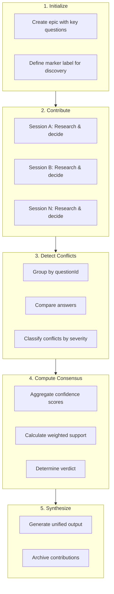
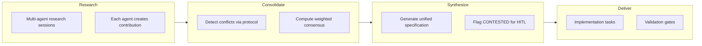

# Contribution Protocol

**Structured decisions. Automated consensus. Zero ambiguity.**

<Info>
The Contribution Protocol enables multiple AI agents to contribute structured decisions to a shared research effort, with automated conflict detection and confidence-weighted consensus computation.
</Info>

## When to Use

| Scenario | Use Protocol? | Rationale |
|----------|--------------|-----------|
| Multi-agent research (2+ sessions) | **Yes** | Structured conflict detection |
| Consensus-building on architecture | **Yes** | Weighted voting, evidence tracking |
| RCSD pipeline integration | **Yes** | JSON format enables automation |
| Single-agent research | No | Simpler research manifest sufficient |
| Quick decision with no alternatives | No | Protocol overhead not justified |

## Key Concepts

<CardGroup cols={2}>
  <Card title="JSON Contributions" icon="file-code">
    All contributions are structured JSON files with confidence scores and evidence references
  </Card>
  <Card title="Conflict Detection" icon="code-compare">
    Automatic detection of disagreements between agents on the same questions
  </Card>
  <Card title="Weighted Consensus" icon="scale-balanced">
    Confidence-weighted voting for decision aggregation (not binary yes/no)
  </Card>
  <Card title="HITL Escalation" icon="user">
    Split votes and blocked decisions automatically flagged for human review
  </Card>
</CardGroup>

## Workflow Overview



<Steps>
  <Step title="Initialize Protocol">
    Create an epic with key decision questions and a marker label for cross-session discovery. Each research session will contribute answers to these questions.
  </Step>
  <Step title="Submit Contributions">
    Each agent creates a JSON contribution file with decisions, confidence scores, rationale, and evidence references. Contributions are appended to a JSONL manifest.
  </Step>
  <Step title="Detect Conflicts">
    Run conflict detection to identify disagreements. Conflicts are classified by type (contradiction, partial-overlap, scope-difference) and severity (critical, high, medium, low).
  </Step>
  <Step title="Compute Consensus">
    Aggregate decisions using confidence-weighted voting. Each answer's support is calculated as the sum of confidence scores from contributing agents.
  </Step>
  <Step title="Generate Synthesis">
    Create a unified output document with consensus verdicts, noting contested decisions that require human review.
  </Step>
</Steps>

## JSON Format

### Contribution Object Structure

```json
{
  "$schema": "https://cleo-dev.com/schemas/v1/contribution.schema.json",
  "_meta": {
    "contributionId": "contrib_a1b2c3d4",
    "protocolVersion": "1.0.0",
    "createdAt": "2026-01-26T14:00:00Z",
    "agentId": "opus-1",
    "consensusReady": true
  },
  "sessionId": "session_20260126_140000_abc123",
  "epicId": "T2204",
  "taskId": "T2215",
  "markerLabel": "consensus-source",
  "decisions": [...],
  "conflicts": [...],
  "researchOutputs": [...],
  "status": "draft|complete|validated|merged"
}
```

### Decision Object Format

Each decision documents a single question-answer pair:

```json
{
  "questionId": "RCSD-001",
  "question": "Codebase Map Architecture: Single JSON file or split files?",
  "answer": "Single .cleo/codebase/codebase-map.json with internal sections",
  "confidence": 0.85,
  "rationale": "Single file simplifies atomic updates and validation",
  "evidence": [
    {
      "file": "lib/file-ops.sh",
      "section": "atomic_write function",
      "line": 142,
      "type": "code"
    }
  ],
  "uncertaintyNote": "Performance at scale (>50K files) not validated",
  "alternatives": [
    {
      "option": "Split into separate files per component type",
      "reason": "Adds merge complexity without proportional benefit"
    }
  ]
}
```

### Confidence Score Semantics

| Range | Level | Meaning | Requirements |
|-------|-------|---------|--------------|
| 0.90-1.00 | Very High | Near-certain | MUST have 2+ independent evidence sources |
| 0.70-0.89 | High | Confident | MUST have at least 1 evidence source |
| 0.50-0.69 | Medium | Balanced uncertainty | SHOULD include `uncertaintyNote` |
| 0.30-0.49 | Low | Significant uncertainty | MUST include `uncertaintyNote` |
| 0.00-0.29 | Tentative | Speculative | MUST include `uncertaintyNote` |

<Warning>
Confidence below 0.30 SHOULD NOT be used for critical design decisions without additional research.
</Warning>

### Conflict Object Format

Conflicts document disagreements requiring resolution:

```json
{
  "questionId": "RCSD-001",
  "conflictId": "conflict_c3d4e5f6",
  "severity": "high",
  "conflictType": "contradiction",
  "thisSession": {
    "position": "Single JSON file architecture",
    "confidence": 0.85,
    "evidence": [...]
  },
  "otherSession": {
    "sessionId": "session_20260126_120000_abc123",
    "sessionLabel": "Session A",
    "contributionId": "contrib_a1b2c3d4",
    "position": "Split files per component type",
    "confidence": 0.75,
    "evidence": [...]
  },
  "rationale": "Session A prioritized parallel editing; this session prioritized atomic consistency",
  "resolution": {
    "status": "proposed",
    "proposedBy": "opus-1",
    "proposal": "Use single file with internal locking; add split-file mode as future config option",
    "resolutionType": "merge"
  },
  "requiresConsensus": true,
  "escalatedToHITL": false
}
```

### Conflict Types

| Type | Definition | Detection Method |
|------|------------|------------------|
| `contradiction` | Mutually exclusive answers | Semantic analysis |
| `partial-overlap` | Agree on some aspects, disagree on others | Field-by-field comparison |
| `scope-difference` | Different interpretation of question scope | Question normalization |
| `priority-difference` | Same options, different ranking | Confidence comparison |
| `evidence-conflict` | Same evidence, different conclusions | Evidence cross-reference |

### Severity Levels

| Severity | Definition | Action Required |
|----------|------------|-----------------|
| `critical` | Mutually exclusive positions on core design | MUST resolve before merge |
| `high` | Significant impact on implementation | SHOULD resolve before merge |
| `medium` | Different approaches, both viable | MAY defer resolution |
| `low` | Minor preference differences | MAY accept either position |

## Library Functions

### Core Functions

<Tabs>
  <Tab title="Instantiate Protocol">
    **`contribution_protocol_instantiate()`**

    Instantiate protocol from template with provided values.

    ```bash
    source lib/contribution-protocol.sh

    # Basic usage
    protocol=$(contribution_protocol_instantiate "T2204" "Session A" "$decisions_json")

    # With options
    options='{"epicTitle": "RCSD Integration", "markerLabel": "rcsd-contrib"}'
    protocol=$(contribution_protocol_instantiate "T2204" "Session A" "$decisions_json" "$baseline_json" "$options")
    ```

    **Parameters:**
    | Param | Type | Required | Description |
    |-------|------|----------|-------------|
    | `$1` | string | Yes | Epic ID (e.g., "T2204") |
    | `$2` | string | Yes | Baseline session identifier |
    | `$3` | JSON | Yes | Decision questions array |
    | `$4` | JSON | No | Baseline decisions array |
    | `$5` | JSON | No | Options object |
  </Tab>

  <Tab title="Validate Task">
    **`contribution_validate_task()`**

    Validate task against contribution protocol requirements.

    ```bash
    source lib/contribution-protocol.sh

    # Validate with expected epic and label
    result=$(contribution_validate_task "T2215" "T2204" "consensus-source")

    # Check result
    valid=$(echo "$result" | jq -r '.valid')
    if [[ "$valid" == "true" ]]; then
      echo "Task is valid"
    else
      echo "Validation errors:"
      echo "$result" | jq -r '.errors[]'
    fi
    ```

    **Returns:**
    ```json
    {
      "valid": true,
      "taskId": "T2215",
      "errors": [],
      "warnings": [],
      "checkedAt": "2026-01-26T15:00:00Z"
    }
    ```
  </Tab>

  <Tab title="Get Injection">
    **`contribution_get_injection()`**

    Get compact injection block for subagent prompts.

    ```bash
    source lib/contribution-protocol.sh

    # Get injection for subagent
    injection=$(contribution_get_injection "T2204" "claudedocs/protocol.md")

    # With options
    options='{"markerLabel": "rcsd-contrib", "taskId": "T2215"}'
    injection=$(contribution_get_injection "T2204" "" "$options")
    ```
  </Tab>

  <Tab title="Generate ID">
    **`contribution_generate_id()`**

    Generate unique contribution ID.

    ```bash
    source lib/contribution-protocol.sh

    id=$(contribution_generate_id)
    echo "$id"  # contrib_a1b2c3d4
    ```
  </Tab>
</Tabs>

### Planned Functions

These functions are planned for implementation:

| Function | Purpose | Task |
|----------|---------|------|
| `contribution_submit()` | Submit contribution to manifest | T2314 |
| `contribution_detect_conflicts()` | Detect conflicts across contributions | T2314 |
| `contribution_compute_consensus()` | Compute weighted consensus | T2315 |
| `contribution_generate_synthesis()` | Generate unified output document | T2315 |

## Consensus Computation

### Weighted Voting Algorithm

For each `questionId`:

1. **Collect** all decisions with that `questionId`
2. **Group** by normalized answer (semantic equivalence)
3. **Calculate** weighted support:
   ```
   support[answer] = sum(confidence) for matching contributions
   total_support = sum(all confidences)
   percentage = support[answer] / total_support
   ```
4. **Determine** verdict:

| Percentage | Verdict | Meaning |
|------------|---------|---------|
| >= 0.80 | **PROVEN** | Strong consensus |
| >= 0.60 | **LIKELY** | Moderate consensus |
| >= 0.40 | **CONTESTED** | Split decision (requires HITL) |
| < 0.40 | **MINORITY** | Insufficient support |

<Info>
CONTESTED verdicts are automatically flagged for human-in-the-loop review.
</Info>

### Query Examples

```bash
# Find all contributions for an epic
jq 'select(.epicId == "T2204")' .cleo/contributions/*.json

# Extract decisions for a specific question
jq '.decisions[] | select(.questionId == "RCSD-001")' .cleo/contributions/*.json

# Find high-severity conflicts
jq '.conflicts[] | select(.severity == "critical" or .severity == "high")' .cleo/contributions/*.json

# Calculate average confidence for a decision
jq '[.decisions[] | select(.questionId == "RCSD-001") | .confidence] | add / length' .cleo/contributions/*.json
```

## Integration with RCSD Pipeline

The Contribution Protocol is a core component of the **Research-Consolidate-Synthesize-Deliver** (RCSD) pipeline:



### How It Fits

| RCSD Phase | Protocol Role |
|------------|---------------|
| **Research** | Agents submit contributions with decisions and evidence |
| **Consolidate** | Conflict detection identifies disagreements |
| **Synthesize** | Consensus computation produces unified decisions |
| **Deliver** | Implementation proceeds from consensus decisions |

## JSONL Manifest

### Purpose

The JSONL manifest (`.cleo/contributions/CONTRIBUTIONS.jsonl`) provides:

- **Audit Trail**: Immutable log of all contributions
- **Query Index**: Efficient filtering by epic, session, status, agent
- **Conflict Aggregation**: Quick identification of tasks needing consensus
- **Integrity Validation**: Checksum verification for contribution files

### Entry Structure

Each line is a self-contained JSON object:

```json
{
  "id": "contrib_a1b2c3d4",
  "sessionId": "session_20260126_091524_e716bd",
  "epicId": "T2308",
  "taskId": "T2310",
  "agentId": "opus-1",
  "status": "complete",
  "createdAt": "2026-01-26T17:15:00Z",
  "updatedAt": "2026-01-26T17:20:00Z",
  "decisionCount": 5,
  "conflictCount": 2,
  "filePath": ".cleo/contributions/T2310.json",
  "checksum": "a1b2c3d4"
}
```

### Manifest Operations

<Warning>
The manifest is **append-only**. Never modify or delete existing entries.
</Warning>

```bash
# Append new entry (use atomic operation)
echo '{"id":"contrib_x1y2z3w4",...}' >> .cleo/contributions/CONTRIBUTIONS.jsonl

# Query contributions with conflicts
jq -s '[.[] | select(.conflictCount > 0)]' .cleo/contributions/CONTRIBUTIONS.jsonl

# Summary statistics
jq -s '{
  total: length,
  complete: [.[] | select(.status == "complete")] | length,
  totalConflicts: [.[].conflictCount] | add
}' .cleo/contributions/CONTRIBUTIONS.jsonl
```

## Examples

<Tabs>
  <Tab title="Research Contribution">
    A research session analyzing architecture options:

    ```json
    {
      "$schema": "https://cleo-dev.com/schemas/v1/contribution.schema.json",
      "_meta": {
        "contributionId": "contrib_f1e2d3c4",
        "createdAt": "2026-01-26T14:00:00Z",
        "agentId": "opus-1",
        "consensusReady": true
      },
      "sessionId": "session_20260126_140000_abc123",
      "epicId": "T2204",
      "taskId": "T2210",
      "markerLabel": "rcsd-consensus-contrib",
      "researchOutputs": [
        {
          "filePath": "claudedocs/agent-outputs/2026-01-26_codebase-map-analysis.md",
          "researchId": "research_a1b2c3d4",
          "type": "analysis",
          "title": "Codebase Map Architecture Analysis"
        }
      ],
      "decisions": [
        {
          "questionId": "RCSD-001",
          "question": "Codebase Map Architecture: Single JSON file or split files?",
          "answer": "Single .cleo/codebase/codebase-map.json with internal sections",
          "confidence": 0.85,
          "rationale": "Single file simplifies atomic updates. CLEO's existing atomic_write pattern handles this well.",
          "evidence": [
            {
              "file": "lib/file-ops.sh",
              "section": "atomic_write function",
              "line": 142,
              "type": "code"
            }
          ],
          "alternatives": [
            {
              "option": "Split into codebase-map-{type}.json per component",
              "reason": "Adds merge complexity and race conditions"
            }
          ]
        }
      ],
      "conflicts": [],
      "status": "complete"
    }
    ```
  </Tab>

  <Tab title="Conflict Detection Output">
    When two sessions disagree:

    ```json
    {
      "questionId": "RCSD-001",
      "conflictId": "conflict_d4e5f6g7",
      "severity": "high",
      "conflictType": "contradiction",
      "thisSession": {
        "position": "SQLite with JSON1 extension",
        "confidence": 0.75,
        "evidence": [
          {
            "url": "https://sqlite.org/json1.html",
            "section": "JSON Functions",
            "type": "external"
          }
        ]
      },
      "otherSession": {
        "sessionId": "session_20260126_100000_abc123",
        "sessionLabel": "Session A",
        "contributionId": "contrib_a1b2c3d4",
        "position": "Plain JSON files with jq queries",
        "confidence": 0.80,
        "evidence": [
          {
            "file": "lib/file-ops.sh",
            "section": "atomic_write pattern",
            "type": "code"
          }
        ]
      },
      "rationale": "Session A prioritizes simplicity. This session prioritizes query capability.",
      "resolution": {
        "status": "proposed",
        "proposedBy": "opus-2",
        "proposal": "Use JSON files for v1.0, add SQLite option as configurable backend in v2.0",
        "resolutionType": "merge"
      },
      "requiresConsensus": true,
      "escalatedToHITL": false
    }
    ```
  </Tab>

  <Tab title="Consensus Result">
    After aggregating contributions:

    ```json
    {
      "questionId": "RCSD-001",
      "question": "Codebase Map Architecture",
      "consensus": {
        "verdict": "LIKELY",
        "winningAnswer": "Single JSON file with internal sections",
        "support": 0.65,
        "contributions": 3,
        "confidenceRange": [0.70, 0.85]
      },
      "positions": [
        {
          "answer": "Single JSON file with internal sections",
          "totalConfidence": 1.70,
          "count": 2
        },
        {
          "answer": "Split files per component type",
          "totalConfidence": 0.75,
          "count": 1
        }
      ],
      "requiresHITL": false
    }
    ```
  </Tab>
</Tabs>

## Troubleshooting

### Common Validation Errors

| Error Code | Message | Fix |
|------------|---------|-----|
| `CONTRIB-001` | Task must be child of epic | `ct reparent T2215 --to T2204` |
| `CONTRIB-002` | Task must have marker label | `ct update T2215 --labels consensus-source` |
| `CONTRIB-005` | All key questions must have decisions | Add missing decisions to contribution |
| `CONTRIB-007` | Decisions must include rationale and evidence | Complete decision objects |

### Resolution Patterns

<Tabs>
  <Tab title="Merge Positions">
    When both positions have merit:

    ```json
    {
      "resolution": {
        "status": "proposed",
        "resolutionType": "merge",
        "proposal": "Combine approach A's simplicity with approach B's extensibility"
      }
    }
    ```
  </Tab>

  <Tab title="Choose by Confidence">
    When one position is significantly more confident:

    ```json
    {
      "resolution": {
        "status": "proposed",
        "resolutionType": "choose-a",
        "proposal": "Accept higher-confidence position (0.90 vs 0.60)"
      }
    }
    ```
  </Tab>

  <Tab title="Defer Decision">
    When more information is needed:

    ```json
    {
      "resolution": {
        "status": "proposed",
        "resolutionType": "defer",
        "proposal": "Defer until performance testing complete"
      }
    }
    ```
  </Tab>

  <Tab title="Escalate to HITL">
    When automated resolution fails:

    ```json
    {
      "resolution": {
        "status": "proposed",
        "resolutionType": "escalate",
        "proposal": "Requires human decision on business priorities"
      },
      "escalatedToHITL": true
    }
    ```
  </Tab>
</Tabs>

## Next Steps

<CardGroup cols={2}>
  <Card title="Orchestrator Protocol" icon="network-wired" href="/guides/orchestrator">
    Multi-agent coordination for complex projects
  </Card>
  <Card title="Multi-Agent Guide" icon="users" href="/guides/multi-agent">
    Run multiple concurrent sessions
  </Card>
  <Card title="Research Command" icon="magnifying-glass" href="/commands/research">
    Execute research with manifest tracking
  </Card>
  <Card title="Sessions Guide" icon="clock" href="/guides/sessions">
    Master session lifecycle management
  </Card>
</CardGroup>
