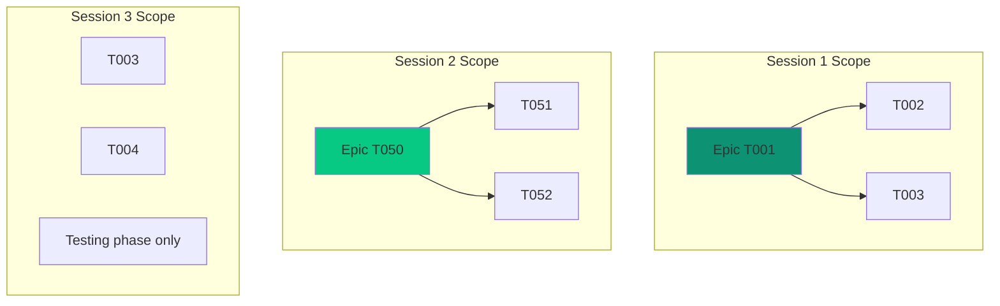

# Multi-Agent Setup

CLEO supports multiple AI agents working simultaneously on different parts of your project. This guide covers configuration and coordination patterns.

## When to Use Multi-Agent

<CardGroup cols={2}>
  <Card title="Large Projects" icon="folder-tree">
    Multiple epics that can progress independently
  </Card>
  <Card title="Specialized Agents" icon="robot">
    Different agents for research, implementation, testing
  </Card>
  <Card title="Parallel Workflows" icon="code-branch">
    Teams needing concurrent work streams
  </Card>
  <Card title="Phase-Based Work" icon="flag-checkered">
    Different agents per project phase
  </Card>
</CardGroup>

## Enabling Multi-Session Mode

```bash
cleo config set multiSession.enabled true
cleo config set multiSession.maxConcurrentSessions 5
```

## Configuration Options

| Option | Default | Description |
|--------|---------|-------------|
| `multiSession.enabled` | `false` | Enable multi-session support |
| `multiSession.maxConcurrentSessions` | `5` | Max simultaneous sessions |
| `multiSession.maxActiveTasksPerScope` | `1` | Active tasks per scope |
| `multiSession.scopeValidation` | `strict` | Overlap detection mode |
| `multiSession.allowScopeOverlap` | `false` | Allow overlapping scopes |

## Starting Concurrent Sessions

<Tabs>
  <Tab title="Agent 1: Auth Epic">
    ```bash
    cleo session start \
      --scope epic:T001 \
      --name "Auth Implementation" \
      --agent claude-opus-1 \
      --auto-focus
    ```
  </Tab>
  <Tab title="Agent 2: UI Epic">
    ```bash
    cleo session start \
      --scope epic:T050 \
      --name "UI Components" \
      --agent claude-opus-2 \
      --auto-focus
    ```
  </Tab>
  <Tab title="Agent 3: Testing">
    ```bash
    cleo session start \
      --scope epicPhase --root T001 --phase testing \
      --name "Auth Tests" \
      --agent claude-sonnet-1 \
      --auto-focus
    ```
  </Tab>
</Tabs>

## Scope Isolation

Each session operates within its defined scope:



<Warning>
Sessions cannot claim the same task simultaneously. Attempting to focus on a task claimed by another session returns an error.
</Warning>

## Managing Sessions

```bash
# List all sessions
cleo session list

# List active sessions
cleo session list --status active

# Show sessions touching an epic
cleo session list --scope T001

# Show session details
cleo session show <session-id>

# Switch which session this terminal uses
cleo session switch <session-id>
```

## Conflict Resolution

When scopes might overlap:

### Strict Mode (Default)

```bash
cleo config set multiSession.scopeValidation strict
```

- Sessions cannot overlap at all
- Error returned if scope conflict detected
- Safest for avoiding conflicts

### Relaxed Mode

```bash
cleo config set multiSession.allowScopeOverlap true
```

- Scopes can overlap
- First session to focus a task "wins"
- Requires more coordination discipline

## Agent Identification

Track which agent owns which session:

```bash
# Start with agent identifier
cleo session start --agent opus-1 --scope epic:T001

# View sessions by agent
cleo session list --format json | jq '.[] | select(.agent == "opus-1")'
```

## Best Practices

<Steps>
  <Step title="Plan Scope Boundaries">
    Design non-overlapping scopes before starting sessions
  </Step>
  <Step title="Use Phase Scoping">
    Separate agents by phase (one for core, one for testing)
  </Step>
  <Step title="Name Sessions Meaningfully">
    Use `--name` for clarity in session listings
  </Step>
  <Step title="Monitor Session Health">
    Check `cleo session list` regularly
  </Step>
</Steps>

## Handoff Patterns

When one agent completes work that unblocks another:

```bash
# Agent 1 completes core work
cleo complete T005
cleo session end --note "Core implementation complete, ready for testing"

# Agent 2 sees dependency resolved
cleo session list  # Check status
cleo focus set T008  # Testing task now unblocked
```

## Related

<CardGroup cols={2}>
  <Card title="Orchestrator" icon="network-wired" href="/guides/orchestrator">
    Automated multi-agent coordination
  </Card>
  <Card title="Sessions Guide" icon="clock" href="/guides/sessions">
    Basic session management
  </Card>
</CardGroup>
