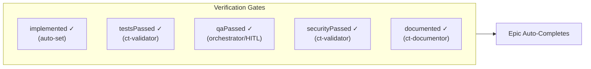

# Orchestrator Protocol

**One orchestrator. Zero implementation. Infinite subagents.**

## The Core Problem

You are a solo developer working with Claude Code. You want to:

1. **Interact with ONE Claude Code session** across an entire project lifecycle
2. **Have that conversation last as long as possible** without context exhaustion
3. **Complete complex multi-phase work** without losing continuity
4. **Leverage AI for the ENTIRE lifecycle**: research, spec, implement, test, document, release

<Warning>
**The fundamental tension**: Claude's context window is finite. Projects are not.
</Warning>

A typical feature epic involves thousands of lines of code changes, dozens of files, multiple test suites, and documentation updates. If Claude tries to hold all of this in context, the conversation dies within hours.

## The Vision

You speak to ONE Claude Code instance - the **orchestrator**. This orchestrator **NEVER** implements anything directly. Instead, it:

<CardGroup cols={2}>
  <Card title="Plans" icon="sitemap">
    Decomposes work into dependency waves
  </Card>
  <Card title="Spawns" icon="code-branch">
    Creates specialized subagents for each task
  </Card>
  <Card title="Reads" icon="book-open">
    Only compact summaries of output
  </Card>
  <Card title="Coordinates" icon="arrows-rotate">
    Manages handoffs between agents
  </Card>
</CardGroup>

<Note>
The orchestrator is a **conductor**, not a musician. It coordinates the symphony but never plays an instrument.
</Note>

## The Mantra

> **Stay high-level. Delegate everything. Read only manifests. Spawn in order.**

| Phrase | Meaning | Enforcement |
|--------|---------|-------------|
| **Stay high-level** | Orchestrator reasons about *what* to do, never *how* | ORC-001 |
| **Delegate everything** | Zero code, zero file reading, zero implementation | ORC-002 |
| **Read only manifests** | Subagents write summaries; orchestrator reads ONLY those | ORC-003 |
| **Spawn in order** | Respect CLEO dependency graph; wave-based execution | ORC-004 |

<Warning>
This mantra is not a guideline - it is an **immutable constraint**. Violation breaks the protocol.
</Warning>

## Architecture Overview

```mermaid
flowchart TB
    subgraph HITL["YOU (Human in the Loop)"]
        H[Single conversation<br/>"Build user authentication"]
    end

    subgraph ORC["ORCHESTRATOR"]
        O1[Context Budget: 10K tokens]
        O2[Reads: MANIFEST.jsonl key_findings]
        O3[Does: Plan → Spawn → Wait → Read → Update]
        O4[Never: Code, files, tests, implementation]
    end

    subgraph SUB["SUBAGENTS"]
        S1["Wave 0: Research<br/>Fresh 200K context"]
        S2["Wave 1: Implement<br/>Fresh 200K context"]
        S3["Wave 2: Test<br/>Fresh 200K context"]
    end

    subgraph MAN["MANIFEST.jsonl"]
        M1["key_findings: 3-7 sentences<br/>~200 tokens/entry"]
    end

    subgraph CLEO["CLEO Task System"]
        C1[Epic → Task → Subtask]
        C2[Dependencies & blocking]
        C3[Verification gates]
    end

    H --> ORC
    ORC --> SUB
    SUB --> MAN
    MAN --> ORC
    ORC --> CLEO
    CLEO --> SUB
```

## The 5 Immutable Constraints

<Tabs>
  <Tab title="ORC-001">
    **MUST stay high-level; MUST NOT implement code**

    *Rationale*: Context preservation. If orchestrator implements, context explodes.

    ```bash
    # Orchestrator DOES
    "Task T1234 requires JWT implementation. Spawning ct-task-executor..."

    # Orchestrator NEVER
    "Here's the JWT middleware code: function verifyToken(req, res, next) {...}"
    ```
  </Tab>

  <Tab title="ORC-002">
    **MUST delegate ALL work to subagents via Task tool**

    *Rationale*: Each subagent gets fresh 200K context; separation of concerns.

    ```bash
    # Spawn command
    cleo orchestrator spawn T1234
    ```
  </Tab>

  <Tab title="ORC-003">
    **MUST NOT read full files (>100 lines) into context**

    *Rationale*: Manifests are O(1) lookup; files are O(n) token consumption.

    ```bash
    # Orchestrator reads
    cat MANIFEST.jsonl | jq -s '.[-1].key_findings'

    # Orchestrator NEVER reads
    cat src/auth/jwt-middleware.ts
    ```
  </Tab>

  <Tab title="ORC-004">
    **MUST spawn agents in dependency order**

    *Rationale*: Spawning T3 before T1 completes = wasted work and conflicts.

    ```bash
    cleo orchestrator analyze T001  # Shows dependency waves
    cleo orchestrator next --epic T001  # Next task in order
    ```
  </Tab>

  <Tab title="ORC-005">
    **MUST maintain context budget under 10K tokens**

    *Rationale*: Leaves room for YOUR ongoing conversation with the orchestrator.
  </Tab>
</Tabs>

## Wave-Based Execution

Tasks are grouped by dependency depth for parallel execution:

```mermaid
flowchart LR
    subgraph W0["Wave 0 (No deps)"]
        T1["T1001: Research patterns"]
        T2["T1002: Write spec"]
    end

    subgraph W1["Wave 1 (Depends on W0)"]
        T3["T1003: Implement JWT"]
        T4["T1004: Refresh tokens"]
        T5["T1005: Auth library"]
    end

    subgraph W2["Wave 2 (Depends on W1)"]
        T6["T1006: Unit tests"]
        T7["T1007: Integration tests"]
        T8["T1008: Compliance check"]
    end

    subgraph W3["Wave 3 (Depends on W2)"]
        T9["T1009: API docs"]
        T10["T1010: Update README"]
    end

    W0 --> W1 --> W2 --> W3
```



### Wave Computation Algorithm

<Steps>
  <Step title="Extract Dependencies">
    Parse dependency graph from CLEO tasks
  </Step>
  <Step title="Calculate Depth">
    Each task: depth = 0 if no deps, else max(parent depths) + 1
  </Step>
  <Step title="Group by Depth">
    Tasks with same depth form a wave
  </Step>
  <Step title="Spawn in Order">
    Complete all tasks in wave N before starting wave N+1
  </Step>
</Steps>

## Manifest-Based Handoff

<Info>
**Context efficiency**: ~200 tokens/entry vs ~5000+ tokens for full file reads (25x savings)
</Info>

Each subagent appends exactly ONE line to `MANIFEST.jsonl`:

```json
{
  "id": "auth-jwt-2026-01-19",
  "title": "JWT Authentication Research",
  "status": "complete",
  "key_findings": [
    "JWT tokens should use RS256 with 15min expiry",
    "Refresh tokens require HttpOnly cookie storage",
    "Rate limiting: 5 attempts per minute per IP"
  ],
  "needs_followup": ["T1234"],
  "linked_tasks": ["T1230", "T1234"]
}
```

The orchestrator reads **ONLY** `key_findings` - never the full output file.

## Epic Types Supported

<CardGroup cols={2}>
  <Card title="Feature" icon="sparkles">
    New capability: Research → Spec → Implement → Test → Document
  </Card>
  <Card title="Bug Fix" icon="bug">
    Defect correction: Reproduce → Diagnose → Fix → Verify
  </Card>
  <Card title="Research" icon="magnifying-glass">
    Investigation: Survey → Analyze → Synthesize → Report
  </Card>
  <Card title="Refactor" icon="arrows-rotate">
    Code improvement: Analyze → Plan → Execute → Validate
  </Card>
  <Card title="Migration" icon="truck-moving">
    System transition: Assess → Plan → Execute → Cutover
  </Card>
  <Card title="Brownfield" icon="building">
    Existing codebase: Understand → Integrate → Adapt → Test
  </Card>
  <Card title="Greenfield" icon="seedling">
    New project: Design → Bootstrap → Implement → Launch
  </Card>
</CardGroup>

## Phase Discipline

| Phase | Purpose | Skills Used |
|-------|---------|-------------|
| **Setup** | Foundation and planning | ct-research-agent, ct-spec-writer, ct-epic-architect |
| **Core** | Main implementation | ct-task-executor, ct-library-implementer-bash |
| **Testing** | Validation and QA | ct-test-writer-bats, ct-validator |
| **Polish** | Refinement and docs | ct-documentor, ct-validator |
| **Maintenance** | Ongoing support | ct-task-executor, ct-research-agent |

## Verification Gates

Epics auto-complete when all children are done **AND** verified:



## Session Continuity

### Startup Protocol

The orchestrator executes this on every new conversation:

```bash
# 1. Check for pending work
cat MANIFEST.jsonl | jq -s '[.[] | select(.needs_followup | length > 0)]'

# 2. Check active sessions
cleo session list --status active

# 3. Check current focus
cleo focus show

# 4. Review epic status
cleo dash --compact
```

### Decision Matrix

| Condition | Action |
|-----------|--------|
| Active session with focus | Resume; continue focused task |
| Active session, no focus | Query manifest `needs_followup`; spawn next |
| No session, manifest has followup | Create session; spawn for followup |
| No session, no followup | Ask HITL for direction |

<Note>
**The orchestrator never starts from zero.** It always checks external state first.
</Note>

## Why This Works

### Traditional vs. Orchestrator

| Traditional | Orchestrator |
|-------------|--------------|
| One agent does everything | Many agents, one coordinator |
| Context exhausted at ~50K tokens | Conversation runs for days/weeks |
| Lost state between sessions | CLEO + MANIFEST = perfect continuity |
| Flat task list | Epic → Task → Subtask with dependencies |
| "Done" = code committed | "Done" = verified through gates |

### The Math

- Orchestrator context budget: **10K tokens**
- Each subagent context: **200K tokens**
- Manifest entry: **~200 tokens** (3-7 key_findings)
- 100 subagent completions = **20K tokens** in manifest summaries

<Info>
With careful manifest management, you can coordinate **hundreds of subagent executions** while keeping the orchestrator conversation alive.
</Info>

## Orchestrator Commands

```bash
# Analyze dependency waves
cleo orchestrator analyze T001

# Get next task (respects dependencies)
cleo orchestrator next --epic T001

# Spawn subagent for task
cleo orchestrator spawn T1234

# List parallel-safe tasks
cleo orchestrator ready --epic T001

# Graceful shutdown on context limit
cleo safestop --reason "context-limit" --handoff ./handoff.json
```

## Next Steps

<CardGroup cols={2}>
  <Card title="Epic Architect Skill" icon="mountain" href="/skills/epic-architect">
    Create comprehensive epics with task decomposition
  </Card>
  <Card title="Multi-Agent Guide" icon="users" href="/guides/multi-agent">
    Run multiple concurrent sessions
  </Card>
  <Card title="Sessions Guide" icon="clock" href="/guides/sessions">
    Master session lifecycle management
  </Card>
  <Card title="Context Monitoring" icon="chart-line" href="/guides/context-monitoring">
    Track and manage context usage
  </Card>
</CardGroup>
