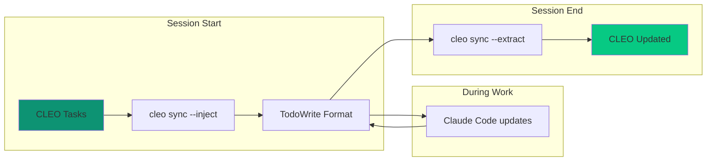

# TodoWrite Sync

CLEO provides bidirectional sync with Claude Code's built-in TodoWrite tool, enabling seamless workflow between persistent CLEO tasks and ephemeral session tasks.

## Why Sync?

<CardGroup cols={2}>
  <Card title="CLEO (Persistent)" icon="database">
    - Full metadata and history
    - Survives sessions
    - Hierarchies and dependencies
    - Verification gates
  </Card>
  <Card title="TodoWrite (Ephemeral)" icon="list-check">
    - Claude Code native
    - Session-scoped
    - Simplified format
    - Immediate visibility
  </Card>
</CardGroup>

<Note>
Use CLEO for durable task management, TodoWrite for real-time session tracking.
</Note>

## Sync Workflow



## Injecting Tasks

At session start, export CLEO tasks to TodoWrite format:

<Tabs>
  <Tab title="All Active Tasks">
    ```bash
    cleo sync --inject
    ```
    Exports pending/active tasks in current session scope.
  </Tab>
  <Tab title="Focused Task Only">
    ```bash
    cleo sync --inject --focused-only
    ```
    Exports only the currently focused task.
  </Tab>
  <Tab title="Preview">
    ```bash
    cleo sync --inject --dry-run
    ```
    Shows what would be exported without writing.
  </Tab>
</Tabs>

## Working with TodoWrite

During your Claude Code session, use TodoWrite normally:

```bash
# Claude Code maintains its todo list
# Updates status, adds notes, marks complete
```

Changes made in TodoWrite are tracked for extraction.

## Extracting Updates

At session end, merge TodoWrite state back to CLEO:

<CodeGroup>
```bash Extract Changes
cleo sync --extract
```

```bash Preview Changes
cleo sync --extract --dry-run
```

```bash Force Overwrite
cleo sync --extract --force
```
</CodeGroup>

## Sync Status

Check current sync state:

```bash
cleo sync --status
```

Returns:
- Last inject timestamp
- Last extract timestamp
- Pending changes count
- Conflict warnings

## Handling Conflicts

When CLEO and TodoWrite have conflicting changes:

<AccordionGroup>
  <Accordion title="Status Conflicts" icon="circle-exclamation">
    If TodoWrite marks a task complete but CLEO has it as blocked:
    - Default: TodoWrite status wins (more recent)
    - Override: `--preserve-cleo-status` to keep CLEO status
  </Accordion>
  <Accordion title="Missing Tasks" icon="triangle-exclamation">
    If a CLEO task is missing from TodoWrite:
    - Default: Task remains unchanged in CLEO
    - Override: `--sync-deletions` to mark as cancelled
  </Accordion>
  <Accordion title="New Tasks" icon="plus">
    If TodoWrite has tasks not in CLEO:
    - Default: Tasks are created in CLEO
    - Override: `--ignore-new` to skip creation
  </Accordion>
</AccordionGroup>

## Best Practices

<Steps>
  <Step title="Inject at Session Start">
    Always run `cleo sync --inject` before starting work
  </Step>
  <Step title="Extract Before Ending">
    Run `cleo sync --extract` before `cleo session end`
  </Step>
  <Step title="Use Dry-Run First">
    Preview changes with `--dry-run` to avoid surprises
  </Step>
  <Step title="One Direction at a Time">
    Don't inject and extract simultaneously
  </Step>
</Steps>

## Session Protocol Integration

The sync workflow integrates with session protocol:

```bash
# START Phase
cleo session start --scope epic:T001 --auto-focus
cleo sync --inject

# WORK Phase
# ... work with Claude Code and TodoWrite ...

# END Phase
cleo sync --extract
cleo session end --note "Synced TodoWrite changes"
```

## Export vs Sync

| Feature | `cleo export` | `cleo sync` |
|---------|---------------|-------------|
| Direction | One-way out | Bidirectional |
| Format | Multiple (CSV, JSON, MD) | TodoWrite only |
| Use case | Backup/reporting | Session integration |
| Preserves | Full metadata | Essential fields |

## Related

<CardGroup cols={2}>
  <Card title="Commands: sync" icon="arrows-rotate" href="/commands/sync">
    Complete sync command reference
  </Card>
  <Card title="Sessions Guide" icon="clock" href="/guides/sessions">
    Session management workflows
  </Card>
</CardGroup>
