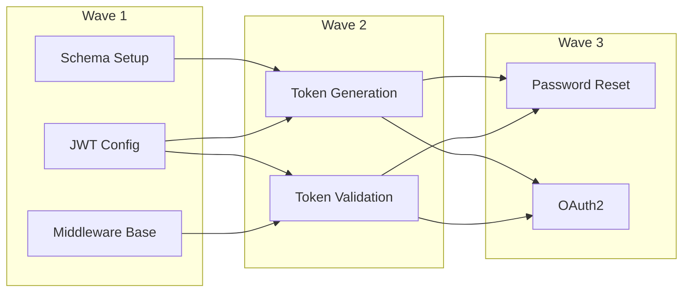

# Epic Architect Skill

The Epic Architect skill helps you create comprehensive epics with full task decomposition, dependency analysis, and wave planning.

## Overview

<CardGroup cols={2}>
  <Card title="Task Decomposition" icon="sitemap">
    Break down features into epic → task → subtask hierarchy
  </Card>
  <Card title="Dependency Analysis" icon="link">
    Identify and map task dependencies automatically
  </Card>
  <Card title="Wave Planning" icon="water">
    Group tasks into execution waves for parallel work
  </Card>
  <Card title="Structured Output" icon="file-code">
    Generate CLEO-compatible JSON for direct import
  </Card>
</CardGroup>

## Triggers

The Epic Architect activates with these phrases:

- "create epic"
- "plan epic"
- "decompose into tasks"
- "architect the work"
- "break down this project"
- "epic planning"
- "task breakdown"
- "wave planning"

## Usage

### Basic Usage

```
Create an epic for implementing user authentication with JWT tokens.
```

### Detailed Request

```
Create an epic for user authentication that includes:
- JWT token generation and validation
- Refresh token rotation
- Password reset flow
- OAuth2 integration (Google, GitHub)
- Session management

Consider security best practices and include testing tasks.
```

## Output Format

The Epic Architect produces structured output:

<Tabs>
  <Tab title="Epic Summary">
    ```markdown
    # Epic: User Authentication System

    ## Overview
    Implement a complete authentication system with JWT tokens...

    ## Scope
    - **In Scope**: JWT, refresh tokens, OAuth2, password reset
    - **Out of Scope**: Biometric auth, hardware keys

    ## Success Criteria
    - [ ] All auth flows working
    - [ ] 80%+ test coverage
    - [ ] Security audit passed
    ```
  </Tab>

  <Tab title="Task Breakdown">
    ```markdown
    ## Tasks

    ### Wave 1: Foundation (No Dependencies)
    - T001: Set up auth database schema
    - T002: Configure JWT library
    - T003: Create auth middleware base

    ### Wave 2: Core Auth (Depends on Wave 1)
    - T004: Implement token generation [depends: T001, T002]
    - T005: Add token validation [depends: T002, T003]

    ### Wave 3: Features (Depends on Wave 2)
    - T006: Password reset flow [depends: T004, T005]
    - T007: OAuth2 integration [depends: T004, T005]
    ```
  </Tab>

  <Tab title="CLEO JSON">
    ```json
    {
      "tasks": [
        {
          "title": "User Authentication System",
          "type": "epic",
          "size": "large",
          "description": "Complete auth implementation...",
          "labels": ["auth", "security"]
        },
        {
          "title": "Set up auth database schema",
          "type": "task",
          "parentId": "T001",
          "size": "medium",
          "depends": []
        }
      ]
    }
    ```
  </Tab>
</Tabs>

## Wave Planning

Tasks are organized into waves based on dependencies:



<Note>
Wave 1 tasks have no dependencies and can start immediately. Each subsequent wave requires completion of prerequisite tasks.
</Note>

## Importing to CLEO

After the Epic Architect generates output:

```bash
# Save the JSON output to a file
# Then import to CLEO

cleo import-tasks epic-auth.json --dry-run    # Preview
cleo import-tasks epic-auth.json              # Import
```

## Customization

### Epic Size Guidelines

| Size | Task Count | Typical Scope |
|------|------------|---------------|
| Small | 3-5 tasks | Single feature |
| Medium | 6-12 tasks | Feature set |
| Large | 13-25 tasks | Subsystem |

### Decomposition Depth

Request specific depth:

```
Create an epic for user authentication.
Break down to subtask level with acceptance criteria.
```

### Phase Assignment

Request phase-aware decomposition:

```
Create an epic for user authentication.
Assign tasks to setup, core, testing, and polish phases.
```

## Examples

<AccordionGroup>
  <Accordion title="Feature Epic" icon="star">
    **Request**: "Create an epic for implementing a shopping cart"

    **Result**: 12 tasks across 4 waves covering cart state, item management, checkout flow, and persistence.
  </Accordion>

  <Accordion title="Migration Epic" icon="arrow-right">
    **Request**: "Plan an epic for migrating from REST to GraphQL"

    **Result**: 18 tasks covering schema definition, resolver implementation, client updates, and deprecation.
  </Accordion>

  <Accordion title="Bug Fix Epic" icon="bug">
    **Request**: "Create an epic for fixing the performance issues in the dashboard"

    **Result**: 8 tasks covering profiling, optimization, caching, and monitoring.
  </Accordion>
</AccordionGroup>

## Best Practices

<CardGroup cols={2}>
  <Card title="Clear Scope" icon="bullseye">
    Define what's in and out of scope upfront to avoid scope creep
  </Card>
  <Card title="Reasonable Size" icon="ruler">
    Keep epics to 25 tasks or fewer. Split larger initiatives.
  </Card>
  <Card title="Testable Criteria" icon="check">
    Include specific, testable acceptance criteria for each task
  </Card>
  <Card title="Review Dependencies" icon="link">
    Verify dependency chains are accurate before importing
  </Card>
</CardGroup>

## Next Steps

<CardGroup cols={2}>
  <Card title="Orchestrator" icon="network-wired" href="/skills/orchestrator">
    Coordinate epic execution with multiple agents
  </Card>
  <Card title="Research Agent" icon="magnifying-glass" href="/skills/research-agent">
    Research before planning your epic
  </Card>
</CardGroup>
