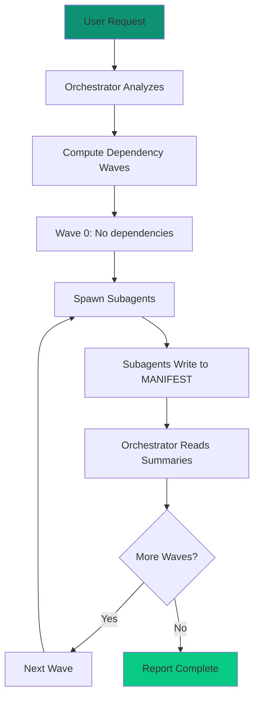

# Orchestrator Skill

The orchestrator skill enables automated multi-agent coordination for complex projects, managing subagent spawning and context-protected workflows.

## Overview

<CardGroup cols={2}>
  <Card title="Context Protection" icon="shield">
    Maintains 10K token budget by delegating all work
  </Card>
  <Card title="Wave Execution" icon="wave-square">
    Respects dependency order with wave-based spawning
  </Card>
  <Card title="Manifest-Based" icon="book">
    Reads only summaries, never full file contents
  </Card>
  <Card title="HITL Friendly" icon="user">
    Human stays in the loop for decisions
  </Card>
</CardGroup>

## Installation

The orchestrator skill is included with CLEO's skill system:

```bash
# Verify skill is available
cleo skill list | grep orchestrator

# Or activate via Claude Code
/ct-orchestrator
```

## The Protocol

<Warning>
The orchestrator NEVER implements anything directly. It only plans, spawns, reads summaries, and coordinates.
</Warning>

### The Mantra

> **Stay high-level. Delegate everything. Read only manifests. Spawn in order.**

| Phrase | Meaning | Constraint |
|--------|---------|------------|
| Stay high-level | Reason about *what*, never *how* | ORC-001 |
| Delegate everything | Zero code, zero file reading | ORC-002 |
| Read only manifests | Summaries only, no full files | ORC-003 |
| Spawn in order | Respect dependency graph | ORC-004 |

## Usage

<Tabs>
  <Tab title="Start Orchestration">
    ```
    /ct-orchestrator

    "Orchestrate the authentication epic T001"
    ```
  </Tab>
  <Tab title="Continue">
    ```
    /ct-orchestrator

    "Continue wave execution for T001"
    ```
  </Tab>
  <Tab title="Status">
    ```
    /ct-orchestrator

    "Show orchestration status for T001"
    ```
  </Tab>
</Tabs>

## How It Works



## Context Budget

The orchestrator operates within a strict context budget:

| Allocation | Tokens | Purpose |
|------------|--------|---------|
| User conversation | ~5,000 | Dialogue and decisions |
| Task queries | ~2,000 | `cleo show --brief` |
| Manifest summaries | ~2,000 | Key findings |
| Planning/reasoning | ~1,000 | Wave computation |
| **Total** | 10,000 | Hard limit |

<Note>
Subagents get fresh 200K context each, enabling deep implementation work.
</Note>

## Manifest Protocol

Subagents write to `MANIFEST.jsonl`:

```json
{
  "id": "task-T005-impl",
  "file": "agent-outputs/2026-01-20_auth-impl.md",
  "title": "Authentication Implementation",
  "key_findings": [
    "JWT middleware implemented with refresh token support",
    "Password hashing uses bcrypt with cost factor 12",
    "Session binding integrated with CLEO"
  ],
  "needs_followup": ["T006"],
  "linked_tasks": ["T005"]
}
```

The orchestrator reads ONLY `key_findings`, never the full output file.

## Wave Computation

Waves are computed from the dependency graph:

```
Wave 0: Tasks with no dependencies
Wave 1: Tasks depending only on Wave 0
Wave 2: Tasks depending only on Wave 0-1
...
```

<Steps>
  <Step title="Analyze Dependencies">
    `cleo deps --json | analyze`
  </Step>
  <Step title="Compute Waves">
    Group by dependency depth
  </Step>
  <Step title="Execute Wave">
    Spawn all tasks in current wave
  </Step>
  <Step title="Wait for Completion">
    Monitor subagent outputs
  </Step>
  <Step title="Advance">
    Move to next wave
  </Step>
</Steps>

## Constraints Reference

| ID | Constraint | Violation Consequence |
|----|------------|----------------------|
| ORC-001 | No implementation | Context explosion |
| ORC-002 | Delegate via Task tool | Subagent fresh context |
| ORC-003 | No file reads >100 lines | Budget exceeded |
| ORC-004 | Spawn in order | Wasted work |
| ORC-005 | 10K context budget | Protocol broken |

## Best Practices

<CardGroup cols={2}>
  <Card title="Break Down Epics" icon="sitemap">
    Create granular tasks before orchestrating
  </Card>
  <Card title="Define Dependencies" icon="arrow-right">
    Clear dependency graph enables wave computation
  </Card>
  <Card title="Trust Subagents" icon="robot">
    Don't micromanage - provide clear task descriptions
  </Card>
  <Card title="Read Summaries" icon="book-open">
    Only read key_findings from manifest
  </Card>
</CardGroup>

## Related

<CardGroup cols={2}>
  <Card title="Orchestrator Guide" icon="network-wired" href="/guides/orchestrator">
    Complete orchestrator protocol
  </Card>
  <Card title="Epic Architect" icon="sitemap" href="/skills/epic-architect">
    Plan and decompose epics
  </Card>
</CardGroup>
