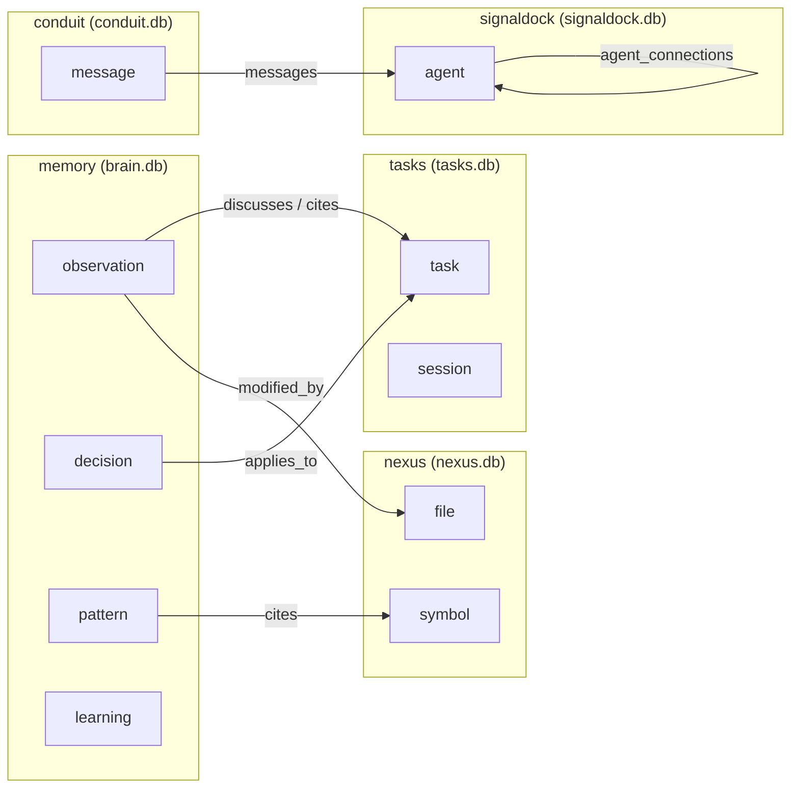

# CLEO Brain Package Specification

**Version**: 2026.4.96
**Status**: SPECIFIED
**Date**: 2026-04-17
**Task**: T985 (authoring) · T969 (extraction) · T968 (contracts) · T962 (epic)
**Package**: `@cleocode/brain`

> **Companion specs**:
> - `docs/specs/CLEO-API-AUTHORITY.md` — authority chain for wire contracts
> - `docs/specs/CLEO-NEXUS-ARCHITECTURE.md` — NEXUS substrate backing
> - `docs/specs/CLEO-CONDUIT-PROTOCOL-SPEC.md` — CONDUIT substrate backing
> - `docs/specs/memory-architecture-spec.md` — memory substrate (distinct domain)
> - `docs/specs/CLEO-TASKS-API-SPEC.md` — TASKS substrate backing
> - `docs/specs/CORE-PACKAGE-SPEC.md` — sibling package publish lane
> - `.cleo/agent-outputs/T910-reconciliation/living-brain-architecture.md` — base reference

---

## 1. Summary

`@cleocode/brain` is the unified-graph substrate package for CLEO — a substrate-agnostic projection that wraps **memory + nexus + tasks + conduit + signaldock** into a single navigable super-graph. It was extracted from `packages/studio/src/lib/server/living-brain/` to its own workspace package at T969 (commit `725fc4231`) to mirror `@cleocode/nexus`, give BRAIN first-class CLI access, and open a standalone publish lane.

The super-graph is **live-computed**, not materialized. Each query runs five pure adapters — one per substrate — against their respective SQLite databases, merges the outputs, prefixes every node ID with its substrate tag, then runs a second-pass stub-node loader to recover cross-substrate edges whose targets fall outside the initial node budget. The result is a single `LBGraph` object that unifies cognitive memory, code structure, task hierarchy, agent messaging, and agent identity under one node/edge schema.

---

## 2. Terminology

| Term | Definition |
|---|---|
| **substrate** | One of the five backing databases: `memory` (brain.db), `nexus` (nexus.db, global), `tasks` (tasks.db), `conduit` (conduit.db), `signaldock` (signaldock.db, global). |
| **BrainNode** | A single super-graph vertex. Every node carries a substrate-prefixed ID so cross-substrate edges reference nodes unambiguously. |
| **BrainEdge** | A directed edge between two `BrainNode`s. May be in-substrate or cross-substrate (bridge). |
| **BrainNodeId** | Substrate-prefixed identifier. Examples: `memory:O-abc`, `nexus:pkg/file.ts::Sym`, `tasks:T949`, `conduit:msg-7f3a`, `signaldock:agent-cleo`. |
| **bridge** | A cross-substrate edge. `substrate: 'cross'` on the edge distinguishes bridges from intra-substrate edges. |
| **adapter** | A pure function `(options) => { nodes, edges }` registered in `ADAPTER_MAP` that projects one substrate into the unified schema. |
| **stub node** | A minimal `BrainNode` (id + substrate + kind + label) loaded in the second pass to satisfy an edge target that was not in the budgeted result set. Carries `meta.isStub: true`. |
| **per-substrate budget** | Fair-share node cap computed as `ceil(limit / substrates.length)`. Default overall limit is 500; per-substrate becomes 100 when all five are requested. |
| **LB-prefix** | Historical naming. Current exports use `LB*` (`LBNode`, `LBEdge`, `LBGraph`). T973 will rename to `Brain*` across contracts and studio in a separate focused change. Both spellings are documented here. |

---

## 3. Authority Chain

```
┌───────────────────────────────────────────────────────────────────────────┐
│ LAYER 1 · CODE SSoT (binding)                                             │
│   packages/contracts/src/operations/brain.ts  ← wire-format contract      │
│   packages/brain/src/types.ts                 ← runtime types (LB*)       │
│   packages/brain/src/adapters/*.ts            ← substrate adapters        │
│   packages/brain/src/db-connections.ts        ← read-only SQLite getters  │
│                                                                           │
│   RULE: when code and docs disagree, code wins.                           │
└───────────────────────────────────────────────────────────────────────────┘
                              │
                              ▼
┌───────────────────────────────────────────────────────────────────────────┐
│ LAYER 2 · NARRATIVE (this file)                                           │
│   docs/specs/CLEO-BRAIN-PACKAGE-SPEC.md                                   │
└───────────────────────────────────────────────────────────────────────────┘
                              │
                              ▼
┌───────────────────────────────────────────────────────────────────────────┐
│ LAYER 3 · HTTP SURFACE                                                    │
│   packages/studio/src/routes/api/living-brain/*  ← current route prefix   │
│   T970 WILL rename to /api/brain/* (tracked — see §7.4)                   │
└───────────────────────────────────────────────────────────────────────────┘
```

Callers MUST cite Layer-1 files when updating this spec. Section 11 enumerates the authoritative file paths.

---

## 4. The Five Substrates

Every node carries a substrate-prefixed ID. Cross-substrate edges reference nodes unambiguously, e.g. `memory:O-abc` vs `nexus:sym-123`. The table below summarises node vocabularies and adapter sources.

| Substrate    | Database              | Scope     | Node kinds                                | Adapter file:line |
|--------------|-----------------------|-----------|-------------------------------------------|-------------------|
| `memory`     | `brain.db`            | project   | `observation`, `decision`, `pattern`, `learning` | `packages/brain/src/adapters/brain.ts:154` |
| `nexus`      | `nexus.db`            | global    | `symbol`, `file`                          | `packages/brain/src/adapters/nexus.ts:46` |
| `tasks`      | `tasks.db`            | project   | `task`, `session`                         | `packages/brain/src/adapters/tasks.ts:66` |
| `conduit`    | `conduit.db`          | project   | `message`                                 | `packages/brain/src/adapters/conduit.ts:48` |
| `signaldock` | `signaldock.db`       | global    | `agent`                                   | `packages/brain/src/adapters/signaldock.ts:53` |

> **Note on substrate naming**: The runtime `LBSubstrate` type (`packages/brain/src/types.ts:35`) still uses `brain` for the memory substrate to preserve a stable extraction diff. The contract (`packages/contracts/src/operations/brain.ts:50`) uses `memory` per the T965 rename. T973 will unify them.

### 4.1 memory (brain.db)

Typed cognitive memory — observations, decisions, patterns, learnings. Node weight comes from `quality_score` (0.0–1.0). Intra-memory edges are sourced from `brain_page_edges` (Hebbian/STDP-trained weights). Cross-substrate bridges:

- `brain_page_edges` whose `to_id` starts with `task:` → `tasks:*` (see `packages/brain/src/adapters/brain.ts:307`)
- `brain_page_edges` whose `to_id` matches `isNexusStyleId` (contains `::` or looks like a file path) → `nexus:*` (see `packages/brain/src/adapters/brain.ts:316`)
- `brain_memory_links` rows → `tasks:*` (see `packages/brain/src/adapters/brain.ts:341`)
- `brain_observations.files_modified_json` entries → `nexus:*` file paths (see `packages/brain/src/adapters/brain.ts:361`)
- `brain_decisions.context_task_id` soft-FK → `tasks:*` (see `packages/brain/src/adapters/brain.ts:385`)

### 4.2 nexus (nexus.db)

Code symbol and file graph indexed by `@cleocode/nexus`. The adapter fetches the highest in-degree nodes (capped at per-substrate budget) and loads relations between them only. Node weight is `min(1, in_degree / 50)`. See `CLEO-NEXUS-ARCHITECTURE.md` for full nexus semantics.

### 4.3 tasks (tasks.db)

Task hierarchy, dependencies, and sessions. Tasks are fetched priority-ordered (critical → high → medium → low) with 80% of the per-substrate budget; sessions take the remaining 20%. Intra-tasks edges:

- `parent_of` — from `tasks.parent_id`
- `depends_on` — from `task_dependencies`
- relation-typed — from `task_relations.relation_type`

See `CLEO-TASKS-API-SPEC.md` for full task semantics.

### 4.4 conduit (conduit.db)

Agent-to-agent messages. Each message becomes a node; aggregated `from_agent_id → to_agent_id` pairs become cross-substrate edges pointing into the `signaldock` agent graph (see `packages/brain/src/adapters/conduit.ts:104`). Weight is `min(1, pair_count / 10)`. See `CLEO-CONDUIT-PROTOCOL-SPEC.md` for message envelope semantics.

### 4.5 signaldock (signaldock.db)

Global agent identity. Agents serve as the cross-substrate identity anchor — they appear in TASKS (as assignee), CONDUIT (as from/to), and MEMORY (as source agent). `agent_connections` rows produce intra-signaldock edges.

---

## 5. Unified Node/Edge Model

The super-graph wire format is defined authoritatively in `packages/contracts/src/operations/brain.ts` (T968). The runtime types in `packages/brain/src/types.ts` mirror this shape under the transitional `LB*` prefix.

### 5.1 BrainNode

```ts
interface BrainNode {
  /** Substrate-prefixed identifier, e.g. "memory:O-abc", "nexus:sym-123". */
  id: BrainNodeId;
  /** Source substrate name. */
  substrate: BrainSubstrateName;
  /** Concrete node type within the substrate (observation, symbol, task, …). */
  type: BrainNodeType;
  /** Human-readable display label. */
  label: string;
  /** Substrate-specific opaque payload. */
  data: Record<string, unknown>;
  /** ISO 8601 creation timestamp, when exposed by the substrate. */
  createdAt?: string;
  /** ISO 8601 last-update timestamp, when exposed by the substrate. */
  updatedAt?: string;
}
```

Source: `packages/contracts/src/operations/brain.ts:117`.

The runtime `LBNode` (`packages/brain/src/types.ts:43`) additionally carries a numeric `weight` field and normalises `createdAt: string | null`. Both representations describe the same entity.

### 5.2 BrainEdge

```ts
interface BrainEdge {
  /** Source node id (substrate-prefixed). */
  from: BrainNodeId;
  /** Target node id (substrate-prefixed). */
  to: BrainNodeId;
  /** Semantic edge kind. */
  kind: BrainEdgeKind;
  /** Normalised weight in [0, 1]. Higher = stronger / more confident. */
  weight?: number;
  /** Substrate-specific opaque payload. */
  data?: Record<string, unknown>;
}
```

Source: `packages/contracts/src/operations/brain.ts:147`.

### 5.3 BrainNodeId

Substrate-prefixed identifier. The prefix before the first `:` MUST match one of `BrainSubstrateName`. The remainder is substrate-specific and opaque to super-graph callers. See `packages/contracts/src/operations/brain.ts:79`.

Examples:

- `task:T949` — TASKS substrate, task ID `T949`
- `memory:O-mo4abc123` — memory substrate, observation ID `O-mo4abc123`
- `nexus:packages/core/src/store/sqlite-data-accessor.ts::createSqliteDataAccessor` — NEXUS substrate, symbol path
- `conduit:msg-7f3a2b1c` — CONDUIT substrate, message ID
- `signaldock:agent-cleo-prime` — SIGNALDOCK substrate, agent ID

### 5.4 BrainEdgeKind

Open-ended string taxonomy. Built-in values enumerated for tooling autocompletion at `packages/contracts/src/operations/brain.ts:93`:

`parent` · `depends` · `blocks` · `references` · `discusses` · `cites` · `embeds` · `touches_code` · `messages` · `string` fallback

Substrate adapters MAY introduce new kinds (e.g. `applies_to`, `modified_by`, `supersedes`, `derived_from`) without a schema migration at this layer.

---

## 6. Cross-Substrate Edge Bridges

The super-graph becomes more than five isolated databases because of the bridges. Every bridge source is enumerated below with its file:line anchor.

| Bridge                           | Kind (example)      | Source mechanism                                 | File:line |
|----------------------------------|---------------------|--------------------------------------------------|-----------|
| memory → tasks (via page_edges)  | `discusses`, custom | `brain_page_edges` with `to_id` starting `task:` | `packages/brain/src/adapters/brain.ts:307` |
| memory → nexus (via page_edges)  | custom              | `brain_page_edges` whose `to_id` is nexus-style  | `packages/brain/src/adapters/brain.ts:316` |
| memory → tasks (memory_links)    | `link_type`         | `brain_memory_links` rows                        | `packages/brain/src/adapters/brain.ts:341` |
| memory → nexus (files_modified)  | `modified_by`       | `brain_observations.files_modified_json` array   | `packages/brain/src/adapters/brain.ts:361` |
| memory → tasks (context)         | `applies_to`        | `brain_decisions.context_task_id` soft FK        | `packages/brain/src/adapters/brain.ts:385` |
| conduit → signaldock (social)    | `messages`          | Aggregated `from_agent_id → to_agent_id` counts  | `packages/brain/src/adapters/conduit.ts:104` |

Every bridge edge carries `substrate: 'cross'`, distinguishing it from the substrate's intra-graph edges. See `packages/brain/src/types.ts:101`.



---

## 7. Adapter Pattern

### 7.1 Adapter Signature

Every substrate adapter is a pure function with the following signature:

```ts
type SubstrateAdapter = (options: LBQueryOptions) => { nodes: LBNode[]; edges: LBEdge[] };
```

Source: `packages/brain/src/adapters/index.ts:28`.

### 7.2 Registration

Adapters are registered in `ADAPTER_MAP` at `packages/brain/src/adapters/index.ts:27`:

```ts
const ADAPTER_MAP: Record<LBSubstrate, SubstrateAdapter> = {
  brain: getBrainSubstrate,
  nexus: getNexusSubstrate,
  tasks: getTasksSubstrate,
  conduit: getConduitSubstrate,
  signaldock: getSignaldockSubstrate,
};
```

`getAllSubstrates()` iterates the requested substrates (default all five) and calls each adapter with the shared `LBQueryOptions`.

### 7.3 Budget Allocation

`limit` is a cross-substrate total cap. Adapters share the budget fairly: `perSubstrateLimit = ceil(limit / 5)` when all five substrates are active (default). Within a substrate, the adapter MAY further subdivide its budget by node kind (e.g. the memory adapter spends 40% on observations, 25% on decisions, 20% on patterns, 15% on learnings — see `packages/brain/src/adapters/brain.ts:181`-`268`).

After all adapters run, `getAllSubstrates()` runs a second-pass stub-node loader for cross-substrate edges whose targets fall outside the budgeted node set. Stub nodes carry `meta.isStub: true` and include only `{id, substrate, kind, label}` (see `packages/brain/src/adapters/index.ts:51`).

### 7.4 Concrete Example — The TASKS Adapter

```ts
// packages/brain/src/adapters/tasks.ts:66
export function getTasksSubstrate(options: LBQueryOptions = {}) {
  const ctx = options.projectCtx ?? resolveDefaultProjectContext();
  const db = getTasksDb(ctx);
  if (!db) return { nodes: [], edges: [] };

  const perSubstrateLimit = Math.ceil((options.limit ?? 500) / 5);
  const nodes: LBNode[] = [];
  const edges: LBEdge[] = [];

  const taskRows = allTyped<TaskRow>(
    db.prepare(`SELECT ... FROM tasks WHERE status NOT IN ('archived','cancelled')
                ORDER BY priority, created_at DESC LIMIT ?`),
    Math.ceil(perSubstrateLimit * 0.8),
  );
  // ... emit task nodes, session nodes, parent_of/depends_on/relation edges ...

  return { nodes, edges };
}
```

All five adapters follow this template: open a read-only connection via `getXxxDb`, bound the fetch by per-substrate budget, emit substrate-prefixed nodes, synthesize edges between loaded IDs, return. Partial results are returned on error (try/catch wraps every adapter body).

---

## 8. Query Operations (8 ops from T968)

The contract defines eight super-graph operations in `packages/contracts/src/operations/brain.ts`. Each maps to a runtime adapter or HTTP endpoint.

| Op                   | Purpose                                             | Params                       | Result                       | Contract line |
|----------------------|-----------------------------------------------------|------------------------------|------------------------------|---------------|
| `brain.query`        | Fetch unified graph with substrate filter           | `BrainQueryParams`           | `BrainQueryResult`           | `:211`        |
| `brain.node`         | Single node + inbound/outbound neighbor edges       | `BrainNodeParams`            | `BrainNodeResult`            | `:253`        |
| `brain.substrate`    | All nodes/edges for one substrate                   | `BrainSubstrateParams`       | `BrainSubstrateResult`       | `:293`        |
| `brain.stream`       | SSE mutation events (7-variant union)               | `BrainStreamParams`          | `BrainStreamResult`          | `:385`        |
| `brain.bridges`      | List cross-substrate edges                          | `BrainBridgesParams`         | `BrainBridgesResult`         | `:429`        |
| `brain.neighborhood` | BFS from seed N hops                                | `BrainNeighborhoodParams`    | `BrainNeighborhoodResult`    | `:472`        |
| `brain.search`       | Text/label search across substrates with fusion     | `BrainSearchParams`          | `BrainSearchResult`          | `:532`        |
| `brain.stats`        | Per-substrate node/edge counters + timestamps       | `BrainStatsParams`           | `BrainStatsResult`           | `:587`        |

### 8.1 `brain.query` — Canonical Entry Point

Fetches the unified graph with substrate filtering and an overall node cap. The reference adapter is `getAllSubstrates()` in `packages/brain/src/adapters/index.ts:161`.

```ts
interface BrainQueryParams {
  substrates?: BrainSubstrateName[]; // default: all five
  limit?: number;                     // default 500, max 2000 at HTTP surface
  filter?: BrainGraphFilter;
}
```

### 8.2 `brain.stream` — Mutation Event Stream

Server-Sent Events emitted for live graph mutations. Seven variants discriminated by `type`:

| Variant            | Trigger                                         |
|--------------------|-------------------------------------------------|
| `hello`            | Sent immediately on connect                     |
| `heartbeat`        | Every 30 s to prevent connection timeout        |
| `node.create`      | New row in substrate's node source              |
| `node.update`      | Existing node metadata changed                  |
| `edge.strengthen`  | Edge weight updated (Hebbian/STDP or relation)  |
| `edge.create`      | New edge appeared                               |
| `task.status`      | Shortcut for tasks-substrate status changes     |
| `message.send`     | Shortcut for conduit-substrate message inserts  |

Source: `packages/contracts/src/operations/brain.ts:344`.

Clients MAY resume with `sinceTs: string` after reconnection — the server replays events emitted at or after the cursor before tailing the live stream.

---

## 9. HTTP Endpoints

Current Studio route surface under `packages/studio/src/routes/api/living-brain/`:

| Endpoint                              | Handler                 | Maps to        | Source                                                                      |
|---------------------------------------|-------------------------|----------------|-----------------------------------------------------------------------------|
| `GET /api/living-brain`               | unified query           | `brain.query`  | `packages/studio/src/routes/api/living-brain/+server.ts:23`                 |
| `GET /api/living-brain/node/[id]`     | single node + neighbors | `brain.node`   | `packages/studio/src/routes/api/living-brain/node/[id]/+server.ts`          |
| `GET /api/living-brain/substrate/[name]` | single-substrate projection | `brain.substrate` | `packages/studio/src/routes/api/living-brain/substrate/[name]/+server.ts` |
| `GET /api/living-brain/stream`        | SSE mutation events     | `brain.stream` | `packages/studio/src/routes/api/living-brain/stream/+server.ts`             |

### 9.1 Query Parameters for `GET /api/living-brain`

| Param        | Type      | Default | Semantics                                                |
|--------------|-----------|---------|----------------------------------------------------------|
| `limit`      | integer   | `500`   | Max nodes. Clamped to `[1, 2000]`.                       |
| `substrates` | CSV       | `all`   | Comma-separated list of substrate names.                 |
| `min_weight` | float     | `0`     | Minimum quality/weight threshold in `[0, 1]`.            |

### 9.2 Route Rename (T970)

The current `/api/living-brain/*` prefix is historical — the operator mental model calls the super-graph "BRAIN." T970 tracks the rename to `/api/brain/*`. The older `/api/brain/*` typed-memory endpoints (observations, decisions, graph, quality, tier-stats) will demote to `/api/memory/*` in the same change. Until T970 ships, this spec documents the current prefix and anticipates the future one.

Implementations SHOULD NOT hard-code the `/living-brain` prefix; consumers MUST resolve routes through the Studio HTTP contract (`CLEO-STUDIO-HTTP-SPEC.md`).

---

## 10. Performance Characteristics

### 10.1 Live Computation

There is no materialized super-graph table. Every `brain.query` request:

1. Opens read-only SQLite connections per substrate (sub-millisecond with `node:sqlite`).
2. Runs five adapters in sequence, each bounded by per-substrate budget.
3. Deduplicates nodes by substrate-prefixed ID (substrate prefix guarantees uniqueness across substrates; dedupe within a substrate handles malformed data).
4. Runs second-pass stub loader for unresolved cross-substrate edge targets.

Connection caching:

- **Global DBs** (`nexus.db`, `signaldock.db`) — cached at module scope; path is machine-scoped and never changes (`packages/brain/src/db-connections.ts:76`).
- **Per-project DBs** (`brain.db`, `tasks.db`, `conduit.db`) — opened fresh per call. Caching across `ProjectContext` values is the precise bug this module's Studio counterpart was rewritten to avoid. See `packages/brain/src/db-connections.ts:111`.

### 10.2 Budget Guardrails

- HTTP layer clamps `limit` to `[1, 2000]` (`packages/studio/src/routes/api/living-brain/+server.ts:24`).
- Per-substrate budget = `ceil(limit / 5)` when all substrates are active.
- Intra-substrate kinds further partition budget (memory: 40/25/20/15% for obs/dec/pat/learn).

### 10.3 Test Coverage

27+ unit tests verify adapter correctness and cross-substrate behaviour:

| Test file                                                              | Lines | Focus |
|------------------------------------------------------------------------|-------|-------|
| `packages/brain/src/__tests__/bridges.test.ts`                         | 777   | All five memory-adapter bridge synthesis paths. Synthetic in-memory fixtures. |
| `packages/brain/src/__tests__/stub-loader.test.ts`                     | 401   | Second-pass stub loader: missing targets, substrate partitioning, requested-filter contract, `isStub` marker. |
| `packages/brain/src/__tests__/types.test.ts`                           | 281   | Schema contract invariants for `LBNode` / `LBEdge` / `LBGraph`. |
| `packages/brain/src/__tests__/created-at-projection.test.ts`           | 226   | Timestamp normalisation across heterogeneous columns (ISO text vs UNIX epoch). |

---

## 11. Relationship: `@cleocode/brain` vs `packages/core/src/memory/`

These are TWO DISTINCT LAYERS that coexist:

| Layer             | Package                            | Scope                                    | Contract file                                      |
|-------------------|------------------------------------|------------------------------------------|----------------------------------------------------|
| **Super-graph**   | `@cleocode/brain`                  | Unified 5-substrate graph                | `packages/contracts/src/operations/brain.ts` (T968) |
| **Memory domain** | `packages/core/src/memory/` (T966) | Typed cognitive memory (obs/dec/pat/learn + PageIndex) | `packages/contracts/src/operations/memory.ts` (T965) |

The super-graph queries the memory domain as one of five substrates (see §4.1). The memory domain is orthogonal — it owns tier management, quality scoring, Hebbian/STDP training, and PageIndex graph semantics scoped to `brain.db`. See `docs/specs/memory-architecture-spec.md` for the memory-domain specification.

Callers using the super-graph MUST NOT reach into memory-domain internals; they MUST go through the `brain.*` operations enumerated in §8.

---

## 12. Public API Surface

### 12.1 Top-level exports (`@cleocode/brain`)

From `packages/brain/src/index.ts`:

```ts
// Substrate adapters + unified query
export {
  getAllSubstrates,
  getBrainSubstrate,
  getConduitSubstrate,
  getNexusSubstrate,
  getSignaldockSubstrate,
  getTasksSubstrate,
} from './adapters/index.js';

// Wire-format types
export type {
  LBConnectionStatus, LBEdge, LBGraph, LBNode,
  LBNodeKind, LBQueryOptions, LBStreamEvent, LBSubstrate,
} from './types.js';

// Low-level connection getters (advanced consumers)
export {
  getBrainDb, getConduitDb, getNexusDb,
  getSignaldockDb, getTasksDb,
} from './db-connections.js';

// Path helpers + project context
export {
  dbExists, getBrainDbPath, getCleoHome, getCleoProjectDir,
  getConduitDbPath, getNexusDbPath, getSignaldockDbPath, getTasksDbPath,
} from './cleo-home.js';
export type { ProjectContext } from './project-context.js';
export { resolveDefaultProjectContext } from './project-context.js';
```

### 12.2 Adapter subpath (`@cleocode/brain/adapters`)

Individual adapter functions re-exported for callers that only need one substrate:

```ts
import {
  getBrainSubstrate,
  getConduitSubstrate,
  getNexusSubstrate,
  getSignaldockSubstrate,
  getTasksSubstrate,
} from '@cleocode/brain/adapters';
```

### 12.3 Contract subpath (`@cleocode/contracts`)

Wire-format types and operation params/results:

```ts
import type {
  BrainNode, BrainEdge, BrainNodeId, BrainSubstrateName, BrainEdgeKind,
  BrainQueryParams, BrainQueryResult,
  BrainNodeParams, BrainNodeResult,
  BrainSubstrateParams, BrainSubstrateResult,
  BrainStreamParams, BrainStreamEvent, BrainStreamResult,
  BrainBridgesParams, BrainBridgesResult,
  BrainNeighborhoodParams, BrainNeighborhoodResult,
  BrainSearchParams, BrainSearchResult, BrainSearchHit,
  BrainStatsParams, BrainStatsResult, BrainSubstrateReport,
} from '@cleocode/contracts';
```

---

## 13. Extension Points

### 13.1 Adding a Sixth Substrate

1. Create `packages/brain/src/adapters/<name>.ts` with `export function get<Name>Substrate(options: LBQueryOptions): { nodes: LBNode[]; edges: LBEdge[] }`.
2. Open the source DB via a new getter in `packages/brain/src/db-connections.ts` (fresh connection per call for per-project DBs, module-cached for global DBs).
3. Add the substrate name to `LBSubstrate` (`packages/brain/src/types.ts:35`) AND `BrainSubstrateName` (`packages/contracts/src/operations/brain.ts:50`).
4. Register in `ADAPTER_MAP` and `ALL_SUBSTRATES` at `packages/brain/src/adapters/index.ts:24`.
5. Prefix every emitted node ID with `<name>:` to maintain cross-substrate uniqueness.
6. Emit any cross-substrate edges with `substrate: 'cross'` on the edge.
7. Add unit tests under `packages/brain/src/__tests__/` covering node emission, intra-substrate edges, and any new bridges.
8. Update the budget formula if node-budget fairness requires new weighting.

### 13.2 Adding a New Edge Kind

`BrainEdgeKind` is an open-ended `string` type with enumerated built-ins for tooling autocomplete (`packages/contracts/src/operations/brain.ts:93`). Adapters MAY emit new kinds without a contract change:

1. Choose a stable kebab-case or snake_case identifier (match existing neighbors, e.g. `applies_to`, `modified_by`).
2. Emit the edge from the appropriate adapter with the new `kind` value.
3. Add a test in `packages/brain/src/__tests__/bridges.test.ts` asserting the new edge is synthesized correctly.
4. If the kind becomes widespread, add it to the enumerated literals in `BrainEdgeKind` for better tooling support.

### 13.3 Extending the Frontend 3D Visualization

The 3D renderer lives in `packages/studio/src/lib/components/LivingBrain3D.svelte` (765 LoC, THREE.js + `3d-force-graph` + `UnrealBloomPass`). It consumes the `LBGraph` wire format directly.

- **New node kinds** require adding a color/glyph mapping in the component's style table.
- **New edge kinds** require adding a stroke-width / pulse-animation rule.
- **New stream events** require a handler in the SSE wiring that updates live synapse pulses.

See `.cleo/agent-outputs/T910-reconciliation/living-brain-architecture.md` §"Components" for the full renderer inventory.

---

## 14. Backward Compatibility

### 14.1 Naming Transition (`LB*` → `Brain*`)

The runtime package currently exports `LB*` names to preserve a stable extraction diff (T969). The contract package uses `Brain*` names (T968). T973 will unify them:

- Runtime `LBNode` → `BrainNode`
- Runtime `LBEdge` → `BrainEdge`
- Runtime `LBGraph` → `BrainQueryResult`-shaped
- Runtime `LBSubstrate` → `BrainSubstrateName`
- Runtime `LBStreamEvent` → `BrainStreamEvent`
- Runtime `LBQueryOptions` → `BrainQueryParams`-shaped
- Runtime `LBNodeKind` → removed (substrate-owned vocabulary)
- Runtime `LBConnectionStatus` → `BrainConnectionStatus`

Consumers SHOULD import from `@cleocode/contracts` where possible (already uses `Brain*`). Consumers that MUST use runtime types SHOULD centralise the import so the T973 rename is a single-file diff.

### 14.2 Substrate Key Drift (`brain` vs `memory`)

The runtime `LBSubstrate` union includes `'brain'` for the memory substrate; the contract `BrainSubstrateName` uses `'memory'`. T965 renamed the contract; T973 will rename the runtime. Callers that build substrate-keyed maps MUST bridge the key in the interim — do NOT hard-code either spelling without a commented `// TODO(T973): unify substrate key` marker.

### 14.3 HTTP Route Prefix (`/living-brain` → `/brain`)

See §9.2. Until T970 ships, callers MUST use `/api/living-brain/*`. After T970, the `/api/living-brain/*` routes will redirect (or be removed after a deprecation window).

---

## 15. Versioning and Publish Lane

- **Current version**: `2026.4.96` (matches monorepo CalVer).
- **Publish target**: `@cleocode/brain` on npm (public). Ships in the same release train as `@cleocode/core`, `@cleocode/contracts`, and `@cleocode/nexus`.
- **Dependencies**: `@cleocode/contracts` workspace link. Zero runtime deps beyond `node:sqlite` built-in and `node:fs`.
- **Engines**: `node >= 24.0.0` (node:sqlite availability).

Subsequent versions MUST follow CalVer (`YYYY.M.patch`) and MUST preserve the public entry-point exports enumerated in §12 until a breaking-change migration is coordinated across all five substrates.

---

## 16. Non-Goals

- `@cleocode/brain` MUST NOT write to any substrate database. All adapters open connections with `{ open: true }` for read-only access (`packages/brain/src/db-connections.ts:93`).
- `@cleocode/brain` MUST NOT materialize a super-graph table. Live computation with bounded budget is the contract; any cache layer belongs to consumers (Studio SSR, CLI).
- `@cleocode/brain` MUST NOT replace substrate-owned specifications. Each substrate's semantic rules live in its own spec (nexus, conduit, tasks, memory).

---

## 17. References

### 17.1 Tasks

- **T962** — Orchestration Coherence v4 epic (BRAIN super-domain).
- **T968** — `operations/brain.ts` contract authoring. Commit `62bcdc25e`.
- **T969** — Extract `@cleocode/brain` from `studio/living-brain`. Commit `725fc4231`.
- **T970** — Rename `/api/living-brain/*` → `/api/brain/*` (pending).
- **T973** — Unify `LB*` → `Brain*` naming across runtime and studio (pending).
- **T985** — Author `CLEO-BRAIN-PACKAGE-SPEC.md` (this document).

### 17.2 Code SSoT (Layer 1)

- `packages/contracts/src/operations/brain.ts` — Wire-format contract (T968).
- `packages/brain/src/types.ts` — Runtime types (`LB*` transitional).
- `packages/brain/src/adapters/index.ts` — `getAllSubstrates()` orchestrator, stub loader.
- `packages/brain/src/adapters/brain.ts` — Memory substrate adapter.
- `packages/brain/src/adapters/nexus.ts` — NEXUS substrate adapter.
- `packages/brain/src/adapters/tasks.ts` — TASKS substrate adapter.
- `packages/brain/src/adapters/conduit.ts` — CONDUIT substrate adapter.
- `packages/brain/src/adapters/signaldock.ts` — SIGNALDOCK substrate adapter.
- `packages/brain/src/db-connections.ts` — Read-only SQLite getters + `allTyped<T>` helper.
- `packages/brain/src/__tests__/` — 27+ unit tests.

### 17.3 Companion Specs

- `docs/specs/CLEO-API-AUTHORITY.md` — Authority chain (T984).
- `docs/specs/CLEO-NEXUS-ARCHITECTURE.md` — NEXUS substrate spec.
- `docs/specs/CLEO-CONDUIT-PROTOCOL-SPEC.md` — CONDUIT substrate spec.
- `docs/specs/memory-architecture-spec.md` — Memory substrate spec.
- `docs/specs/CLEO-TASKS-API-SPEC.md` — TASKS substrate spec.
- `docs/specs/CORE-PACKAGE-SPEC.md` — Sibling package publish lane.
- `docs/specs/CLEO-STUDIO-HTTP-SPEC.md` — Studio HTTP surface.

### 17.4 Audit and Context

- `.cleo/agent-outputs/T910-reconciliation/living-brain-architecture.md` — Base architectural audit.
- `.cleo/agent-outputs/T910-reconciliation/brain-memory-reconciliation.md` — Naming-collision resolution plan.
- `docs/plans/brain-synaptic-visualization-research.md` §5.2 — Research origin for the super-graph projection.

---

**End of specification.**
