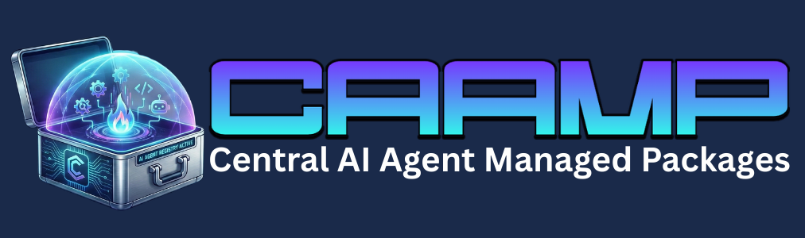

<p align="center">
  
</p>

<p align="center">
  <a href="https://www.npmjs.com/package/@cleocode/caamp"></a>
  <a href="https://github.com/kryptobaseddev/caamp/blob/main/LICENSE"></a>
  
  
  
  <a href="https://codluv.gitbook.io/caamp/"></a>
</p>

# CAAMP - Central AI Agent Managed Packages

**One CLI to manage Skills, MCP servers, and instruction files across 44 AI coding agents.**

CAAMP is a unified provider registry and package manager for AI coding agents. It replaces the need to manually configure each agent's MCP servers, skills, and instruction files individually -- handling the differences in config formats (JSON, JSONC, YAML, TOML), config keys (`mcpServers`, `mcp_servers`, `extensions`, `mcp`, `servers`, `context_servers`), and file paths across all supported providers.

CAAMP adopts LAFS for agent-facing output contracts. Protocol authority lives in the standalone LAFS repository and package.

## Install

```bash
# Global install (recommended)
npm install -g @cleocode/caamp

# Or run directly with npx
npx @cleocode/caamp <command>
```

After global install, use `caamp` directly:

```bash
caamp providers list
caamp providers detect
caamp mcp install fetch --provider claude-desktop -- npx -y @modelcontextprotocol/server-fetch
caamp skills install owner/repo
```

## Library Usage

CAAMP also exports a full programmatic API:

```bash
npm install @cleocode/caamp
```

```typescript
import {
  getAllProviders,
  getInstalledProviders,
  listAllMcpServers,
  installSkill,
  detectAllProviders,
} from "@cleocode/caamp";

// Get all registered providers
const providers = getAllProviders();

// Detect which agents are installed on this system
const installed = getInstalledProviders();

// List MCP servers across all installed providers
const servers = await listAllMcpServers(installed, "global");
```

### Querying Provider Capabilities

```typescript
import {
  getProviderCapabilities,
  getSpawnCapableProviders,
  getProvidersByHookEvent,
  buildSkillsMap,
} from "@cleocode/caamp";

// Get capabilities for a specific provider
const caps = getProviderCapabilities("claude-code");
console.log(caps?.spawn.supportsSubagents); // true
console.log(caps?.hooks.supported); // ["onSessionStart", ...]

// Find all providers that support spawning subagents
const spawnCapable = getSpawnCapableProviders();

// Find providers supporting a specific hook event
const hookProviders = getProvidersByHookEvent("onToolComplete");

// Get full skills precedence map
const skillsMap = buildSkillsMap();
```

See [API Reference](https://codluv.gitbook.io/caamp/api-and-reference/api-reference) for full programmatic API documentation.

## CLI Commands

### Providers

```bash
caamp providers list               # List all supported providers
caamp providers list --tier high   # Filter by priority tier
caamp providers detect             # Auto-detect installed providers
caamp providers detect --project   # Detect project-level configs
caamp providers show <id>          # Show provider details + all paths
```

### Skills

```bash
caamp skills install <source>      # Install from GitHub/URL/marketplace
caamp skills remove [name]         # Remove skill(s) + symlinks
caamp skills list [-g]             # List installed skills
caamp skills find [query]          # Search marketplace (agentskills.in + skills.sh)
caamp skills find [query] --recommend --top 5   # Ranked recommendations + CHOOSE flow
caamp skills find [query] --recommend --json    # LAFS envelope JSON for agent consumers
caamp skills init [name]           # Create new SKILL.md template
caamp skills validate [path]       # Validate SKILL.md format
caamp skills audit [path]          # Security scan (46+ rules, SARIF output)
caamp skills check                 # Check for available updates
caamp skills update                # Update all outdated skills
```

Recommendation criteria flags:

```bash
--must-have <term>   # repeatable and comma-delimited
--prefer <term>      # soft preference signal
--exclude <term>     # hard exclusion signal
--details            # expanded JSON evidence fields
--select <index>     # select from ranked CHOOSE list
```

### MCP Servers

```bash
caamp mcp detect                                              # Auto-detect MCP-configured providers
caamp mcp list                                                # List servers across every MCP-capable provider
caamp mcp list --provider cursor                              # List for a specific provider
caamp mcp install <name> --provider <id> -- <command> [args]  # Install via inline command
caamp mcp install <name> --provider <id> --from server.json   # Install via JSON file
caamp mcp install <name> --provider <id> --env KEY=VAL -- ... # With env vars
caamp mcp remove <name> --provider <id>                       # Remove from a single provider
caamp mcp remove <name> --all-providers                       # Remove from every provider
```

### Instructions

```bash
caamp instructions inject          # Inject blocks into instruction files
caamp instructions check           # Check injection status across providers
caamp instructions update          # Update all instruction file injections
```

### Config

```bash
caamp config show <provider>       # Show provider config contents
caamp config path <provider>       # Show config file path
caamp doctor                       # Diagnose configuration and health issues
```

### Advanced (LAFS-compliant wrappers)

```bash
caamp advanced providers --min-tier medium --details
caamp advanced batch --mcp-file ./mcp-batch.json --skills-file ./skills-batch.json
caamp advanced conflicts --mcp-file ./mcp-batch.json
caamp advanced apply --mcp-file ./mcp-batch.json --policy skip
caamp advanced instructions --content-file ./AGENT-BLOCK.md --scope project
caamp advanced configure -a claude-code --global-mcp-file ./global-mcp.json --project-mcp-file ./project-mcp.json
```

## Global Flags

| Flag | Description |
|------|-------------|
| `-a, --agent <name>` | Target specific agent(s), repeatable |
| `-g, --global` | Use global/user scope (default: project) |
| `-y, --yes` | Skip confirmation prompts |
| `--all` | Target all detected agents |
| `--json` | JSON output format |
| `--dry-run` | Preview changes without writing |

## Supported Providers

CAAMP supports **44 AI coding agents** across 3 priority tiers:

| Priority | Providers |
|----------|-----------|
| **High** | Claude Code, Cursor, Windsurf |
| **Medium** | Codex CLI, Gemini CLI, GitHub Copilot, OpenCode, Cline, Kimi, VS Code, Zed, Claude Desktop, Amazon Q Developer, GitHub Copilot CLI |
| **Low** | Roo, Continue, Goose, Antigravity, Kiro, Amp, Trae, Aide, Pear AI, Void AI, Cody, Kilo Code, Qwen Code, OpenHands, CodeBuddy, CodeStory, Aider, Tabnine, Augment, JetBrains AI, Devin, Replit Agent, Mentat, Sourcery, Blackbox AI, Double, Codegen, SWE-Agent, Forge, Gemini Code Assist |

### Config Key Mapping

Each provider uses a different key name for MCP server configuration:

| Config Key | Providers |
|------------|-----------|
| `mcpServers` | Claude Code, Cursor, Windsurf, Gemini CLI, GitHub Copilot, Cline, Kimi, and 12 others |
| `mcp_servers` | Codex |
| `extensions` | Goose |
| `mcp` | OpenCode |
| `servers` | VS Code |
| `context_servers` | Zed |

### Instruction File Mapping

| File | Providers |
|------|-----------|
| `CLAUDE.md` | Claude Code, Claude Desktop |
| `GEMINI.md` | Gemini CLI |
| `AGENTS.md` | All other providers (Cursor, Windsurf, Codex, Kimi, etc.) |

## Architecture

```
┌─────────────────────────────────────────────────┐
│                   CLI Layer                      │
│  providers │ skills │ mcp │ instructions │ config│
├─────────────────────────────────────────────────┤
│                 Core Layer                       │
│  registry │ formats │ skills │ mcp │             │
│  marketplace │ sources │ instructions            │
├─────────────────────────────────────────────────┤
│                Data Layer                        │
│  providers/registry.json │ lock files │ configs  │
└─────────────────────────────────────────────────┘
```

- **Provider Registry**: Single `providers/registry.json` with all provider definitions
- **Format Handlers**: JSON, JSONC (comment-preserving), YAML, TOML
- **Skills Model**: Canonical copy + symlinks (install once, link to all agents)
- **MCP Transforms**: Per-agent config shape transforms for Goose, Zed, OpenCode, Codex, Cursor
- **Lock File**: Tracks all installations at `~/.agents/.caamp-lock.json`

## Documentation

**[Read the full documentation on GitBook](https://codluv.gitbook.io/caamp/)**

| Document | Description |
|----------|-------------|
| [API Reference](https://codluv.gitbook.io/caamp/api-and-reference/api-reference) | Full library API (signatures and examples) |
| [Advanced CLI](https://codluv.gitbook.io/caamp/advanced-usage/advanced-cli) | LAFS-compliant advanced command wrappers and input/output schemas |
| [Advanced Recipes](https://codluv.gitbook.io/caamp/advanced-usage/advanced-recipes) | Production TypeScript patterns for tier filtering, rollback, conflict handling, and dual-scope operations |
| [Provider Configuration Guide](https://codluv.gitbook.io/caamp/user-guides/provider-configuration) | Config keys, formats, scopes, and provider mapping guidance |
| [Migration Guide](https://codluv.gitbook.io/caamp/getting-started/migration-v1) | Upgrade notes for moving to v1.0.0 |
| [Troubleshooting](https://codluv.gitbook.io/caamp/user-guides/troubleshooting) | Common failure modes and remediation steps |
| [CLI Help Examples](https://codluv.gitbook.io/caamp/user-guides/cli-help-examples) | `--help` command examples for every command group |
| [Skills Recommendations](https://codluv.gitbook.io/caamp/advanced-usage/skills-recommendations) | Marketplace search and recommendation engine |
| [Contributing](https://codluv.gitbook.io/caamp/contributing/contributing) | Development workflow and PR expectations |
| [Security Policy](https://codluv.gitbook.io/caamp/contributing/security) | Private vulnerability disclosure process |
| [LAFS Compliance Profile](https://codluv.gitbook.io/caamp/api-and-reference/lafs-compliance) | CAAMP-specific LAFS adoption scope and compliance mapping |
| [Agents Directory Standard](https://codluv.gitbook.io/caamp/api-and-reference/agents-directory-standard) | `.agents/` standard directory structure |
| [LAFS Specification](https://github.com/kryptobaseddev/lafs/blob/main/lafs.md) | Canonical cross-language LLM-agent-first protocol |
| [Technical Specification](claudedocs/specs/CAAMP-SPEC.md) | RFC 2119 spec covering all subsystems |
| [Vision & Architecture](claudedocs/VISION.md) | Project vision, design philosophy, and architecture |
| [Gap Analysis & Roadmap](claudedocs/GAP-ANALYSIS.md) | Current state vs plan, v0.2.0+ roadmap |

## Contributing

Provider definitions live in `providers/registry.json`. To add a new AI coding agent:

1. Add a provider entry to `providers/registry.json` with all required fields
2. Run `npm test` to validate the registry
3. Submit a PR

See the [Technical Specification](claudedocs/specs/CAAMP-SPEC.md#3-provider-registry-specification) for the full provider schema.

## License

MIT
