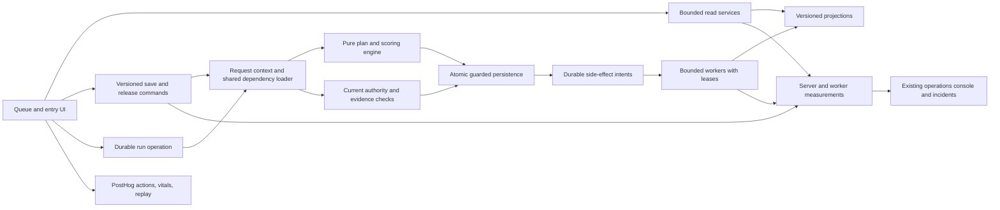

# Axiom performance optimization and measurement plan

Date: 2026-10-01. Owner: existing performance epic T386 under saga T381. Status: proposed engineering plan; documents only. Implementation, production recovery, deployment, vendor configuration and new paid services have not been performed.

## Goal

Make the analytical queue, run preparation, entry, saving and release fast and predictable by removing repeated dependency loading and plan reconstruction. Build shared read/compute/persistence engines that other application systems can adopt. Measure actual user wait, server work and durable-job throughput together; demonstrate p95/p99 against explicit workload and correctness contracts rather than infer performance from a green health probe.

## Evidence and authority

The preserved audit is `lab-performance-audit-20260930`, published as `docs/research/lab-performance-audit-20260930.md`, SHA-256 `5badf263e8e96d9df9fd61586fdb0888f8190df635e60ce8204c02be4b411db0`. It remains an unchanged historical observation of 2026-09-30, not a current order-state guarantee. Its incident: queue median 31.269s from seven requests, queue 502 after 117.892s, batch disconnect after 300.009s, 50 drafts created out of 56 samples. Detailed stage attribution remains a hypothesis until instrumented.

Source reviewed for this plan: checkout c4bf4f13f58624e671c629567ff57ee802ce39a3 on 2026-10-01. Queue, entry, lab-service, plan-refresh and operations files had no diff against the audit's ready SHA 0147229b759be0195eb72d984b4c2f1706d558ab. Subsequent COA presentation/PDF-cache files do have changes; rebaseline those consumers rather than assume every COA subsystem is identical. This is not a fresh production SHA verification. CLEO graph coverage is incomplete/stale; direct source and fetched canonical records provide the evidence.

Historical correction discovered while planning: the audit reported that no numeric lab SLO had been found. T386 does contain existing criteria: queue API p50 under 1s, START RUN including first entry under 2s, no weakened integrity/hash/criteria behavior, and before/after measurements for each child. Those criteria remain intact. They are not a complete p95/p99 contract. The targets below extend the proposal without silently rewriting owner criteria.

Canonical `capacity-validation-100-active-users-20260917` and `infra-media-optimization-completion-20260917` describe an isolated 2,000-account / 200-browser acceptance run and existing operations tooling. Tested workflows were validation, customer orders/certificate lists and public COA display; they do not prove large lab run creation, save or release. Existing success and failure evidence remains authoritative within its tested scope.

The owner states PostHog is already available. No PostHog dependency, initialization or capture call was found in the checked source, package/lockfile, layout or infrastructure files. An external snippet, another property or vendor-side setup is possible; project configuration and live capture are unverified. Do not install a second instance or purchase an alternative before reconciling that setup.

## Target architecture

### Shared dependency and plan engine

Separate four responsibilities now mixed across request paths: load authoritative inputs; compute the deterministic binding/results; decide whether synchronization is necessary; persist migrations/findings with concurrency guards. The pure engine must perform no database/object-storage writes. Every consumer uses the same scoring and binding implementation; do not create a faster but subtly different classifier.

Introduce a typed operation context with request-scoped promise memoization and batch loaders for sample/COA facts, latest primary COA, issued-certificate existence, order/client/organization identity, names, profiles, specifications and qualification inputs. Parallelize independent reads after authorization; maintain sequencing for actual dependencies. Cache promises only within an authorized context; discard failed entries and cap memory. Avoid selecting full compound/sample/COA rows when only scalar facts are required. Avoid multiple copies of the same 100KB+ binding.

Define a dependency manifest for the plan: engine/schema version, exact declaration inputs, applicable compendium/profile/specification revisions, qualification revision and other actual computation inputs. All mutation entry points affecting those inputs must update the corresponding revision atomically. Build a dependency coverage table before enabling reuse. A missing revision or untracked legacy write means UNKNOWN and uses the existing authoritative rebuild path. A timestamp-only or TTL-only test is insufficient.

Compare a cheap manifest fingerprint before reconstructing the plan. An unchanged sample and unchanged unsigned drafts need no rebuild or synchronization write. Issued-certificate protection and declaration/draft migration remain unchanged. A changed manifest uses the same pure engine once, then compare-and-swap persistence against expected sample/COA revisions. If source dependencies change during computation, discard/retry with a bounded attempt count. The cache must never publish an older result over a newer revision.

Use request/batch reuse first. Cross-request read caching follows only for immutable, revision-addressed dependency payloads; use existing Redis cache as an accelerator. Keys include environment, engine/schema version, authoritative revision and organization/visibility scope where applicable. A distributed single-flight mechanism must expire safely, recover after worker death and prevent stampedes; it cannot become the authority. Cache loss must yield correct bounded reads, not unavailable entry or stale release. Never cache current permissions, revocations or mutable sign-time eligibility as immutable facts. Preserve current qualification/evidence liveness and object-integrity checks at authoritative boundaries; any persistent reuse of digest verification requires an immutable object-version and revocation contract, not a cached HEAD result.

Finding writes become idempotent synchronization effects emitted only on a genuine transition. An unchanged read must not repeatedly upsert/resolve the same gap. Read projections expose assessed revision, pending work and findings; they never silently present stale readiness as current.

### Queue and navigation

Replace broad candidate scans and full-row joins with a bounded selection service and lightweight display projection. Push applicable filtering/sorting into SQL, choose the latest relevant primary COA before joining, and fetch needed IDs/columns only. Validate indexes using EXPLAIN and realistic data distributions. Batch names, organization priority, vial facts and shipment membership. Compute company/filter counts separately against the same filter semantics; counts must not depend on the loaded page.

Preserve whole-order grouping explicitly: page order groups, not arbitrary sample slices. If one order exceeds the normal page size, return a lightweight group summary and load its sample detail incrementally while preserving the user's ability to select the full order. Stable cursors include a deterministic tie-breaker; define behavior when readiness/priority changes between pages. Do not claim pagination bounds work while an unbounded selector still precedes it.

Remove repair from GET queue and entry bootstrap only once explicit/worker maintenance and command-time validation cover its correctness role. Dependency changes enqueue affected plans; queue reads show revision/readiness freshness. If pending, Start Run can prepare the affected sample safely. Retain fresh release-time authority checks.

Have one owner of debounced filter state and one request path per change. Preserve URL/share/back behavior without triggering redundant expensive server navigation plus API fetch. Retain a bounded cache for back-navigation; invalidate affected groups after acknowledged mutations. Coalesce interval/focus refreshes and avoid refetching every loaded page when one group changes. Prefetch only lightweight read-only entry data; never prefetch a route that synchronizes plans or creates drafts.

### Durable run preparation

Create a run operation with stable identity, ordered sample selection, tenant/access scope, payload fingerprint and per-sample states. Proposed API contract: submit returns accepted operation ID; status returns progress and usable draft IDs; UI opens the first eligible draft immediately. The UI retains the original run order as pending samples become ready, and can recover after navigation/reload without relying exclusively on sessionStorage.

Use a database-backed operation/item state machine: pending, preparing, ready, needs-review, retryable-failure and terminal-failure. Reuse the existing guarded claim/lease/retry patterns in media/PDF jobs, but do not put expensive plan work into their two lanes without a resource isolation decision. Use a separate bounded bench lane/module with fairness across orders and admission limits. Reclaim expired leases with generation fencing; stale workers cannot publish. Redis/notifications may wake workers, but the database operation is durable truth.

Creation must be idempotent across simultaneous staff actions, retries and deployment restarts. Establish a database-enforced uniqueness/ownership contract for the active draft where the current versioning rules permit it; atomically publish each item's result with its guarded sample/COA mutation. Existing released or amended states require explicit behavior. A retry discovers committed work, not merely repeats it. Batch shared dependencies once per revision; aggregate lifecycle after batches where safe. Cancellation stops pending work and preserves committed drafts.

Measure accepted-to-first-ready, click-to-first-usable-entry, all-items-prepared, queue wait and samples/second separately. An immediate 202 is not proof that run preparation got faster. Preserve progress for all samples and instrument starvation. Before any incident recovery, re-read the current 50/6 state; this plan does not retry the production order.

### Entry, save and release

Entry uses a projected read-only bootstrap with one sample/COA context, parallel independent auxiliary reads, lazy criteria/material detail and parallel media URL work. Split active-layer rendering and memoize pure derived calculations only after React/browser profiling demonstrates hot paths. Retain lossless observations, units, precision and source provenance. A JSON payload budget must be measured against representative methods, not met by deleting criteria the operator needs.

Save carries an expected record revision and a client save identity. Coalesce superseded edits, prevent older responses overwriting newer inputs and return a compact authoritative acknowledgement/results revision. Do not consider a local edit saved before server acknowledgement. Combine safe persistence work at one guarded boundary and remove the extra rebuild when the manifest proves inputs unchanged. Pure result recomputation shares the same engine as preflight/release; request context avoids repeated evidence/dependency reads.

Preflight returns a report tied to result revision, plan manifest, exact finding/acknowledgement set and policy version. A confirmation can reuse the unchanged saved observation revision; if anything changes, recompute and present the changed report. The sign command still rechecks current authorization, authority, certificate state, evidence and CAS fences. A preflight token is not permission to skip current integrity checks.

Define precisely what must commit before the UI says released: signature/seal, canonical certificate/sample state, and durable mandatory side-effect intents. Named-edition/partner behavior may be part of the user-visible release contract; map those invariants before moving them. Where safe, delivery/points/lifecycle/edition follow-up becomes idempotent leased work with reconciliation and visible failure status. Existing results-delivery intents currently can send synchronously; separate enqueue from processing without changing delivery identity/retry guarantees. No floating promise should be the only record of work after release. Remove the fixed 1.5s pause and navigate/prefetch the next read-only entry when the release receipt is authoritative.

## Measurement contract and provisional objectives

These are recommended engineering targets, not claimed compliance or newly approved owner policy. Maintain T386's existing criteria. Measure each operation and workload class separately; do not let fast health probes, cache hits or small runs hide large-run tails.

| Operation / boundary | Proposed p95 | Proposed p99 |
|---|---:|---:|
| Queue data API, complete payload | 1s | 2s |
| Queue navigation to visible usable rows | 2s | 3.5s |
| Start Run submission acknowledgement | 0.5s | 1s |
| Start COA / Run click to first usable entry, 1/5/12/56-item cohorts | 2s | 4s |
| Entry navigation to editable loaded form | 1.5s | 3s |
| Save click to durable acknowledgement | 1s | 2.5s |
| Sign click to committed release receipt, excluding human acknowledgement time | 2s | 4s |
| Sign click to next usable entry | 3s | 5s |
| Active-layer UI switch | 100ms | 250ms |
| Entire 56-item preparation, same representative methods/load | 20s | 40s |

Whole-batch targets are a starting throughput hypothesis to validate after baseline profiling; they do not authorize dropping checks. Report other batch sizes separately. Interactive objectives apply to supported ordinary/cold/changed-plan workloads; expensive qualification cases remain visible cohorts, not exclusions used to claim compliance. Break sign into save, preflight, confirmation and commit durations; measure actual active waiting without counting the analyst's decision time.

Proposed technical operation success objective: 99.9% over a rolling 28 days, separately from latency threshold compliance. Measured analytical FAIL is a successful operation when accurately persisted/published. Validation findings and stale-revision conflicts remain their own outcomes. Known deliberate filter cancellation is distinct from an unexplained disconnect/timeout; do not exclude every 499. Technical errors and incomplete attempts are bad operations for the availability/latency-threshold SLI even if no final duration exists. Show completed-attempt quantiles alongside failure/incomplete counts; never invent completed durations for abandoned operations.

Use 5m/1h views for diagnosis, 24h/7d/28d for sustained reporting. Display population, time window, coverage, sampling and histogram precision with every percentile. Low traffic is insufficient evidence, not healthy zero. A diagnostic floor such as 1,000 completed operations makes p99 less unstable but is not a statistical guarantee; acceptance aims for at least 10,000 observations in each critical workload cohort or explicitly reports the confidence/coverage limitation. Aggregate event samples or compatible histogram counts across replicas and time before deriving quantiles; never average p95/p99 values. Percentiles of component stages do not add to an end-to-end percentile.

## Existing tools and PostHog plan

| Tool already evidenced | Use / extension | Gap to close |
|---|---|---|
| PostHog, owner-reported | Workflow timing events, funnels, vitals, replay, deployment/flag comparison | Verify project, host, existing SDK/snippet, capture/consent settings and account features; source wiring not found |
| Redis operations histograms, src/lib/operations/performance.ts | Fast bounded live counters and SLO summaries across replicas | Only vials/catalog/orders; coarse p95 buckets; 15-minute TTL; ten-second best-effort flush can lose data |
| Admin system, operations snapshots/incidents | One operational view, acknowledgements, source freshness and runbooks | Persist long-window distributions and lab/worker SLO checks; current snapshot is not long-term percentile history |
| Uptime Kuma | Independent availability and safe public/read-only probes | A successful probe does not prove authenticated lab flow latency |
| API usage raw rows and rollup | Preserve existing external-integration analytics and recorder-health pattern | Internal lab is not covered; sum/count/max rollups cannot recover p99 |
| Railway request/runtime/deployment logs | Correlate edge errors, restarts and release version | Missing killed-process spans and capped log samples cannot form complete user SLIs |
| Database, Redis, worker/scheduler health and job leases | Pool/query/saturation, queue wait/service time, restart recovery | Extend beyond media/PDF to run preparation and release follow-up |

### PostHog event specification

First verify live capture on the intended application/domain and ensure a single initialization. Use current Next.js SDK guidance; preserve existing identity/consent and masked recording configuration. Product Analytics SQL insights support custom analysis, and session IDs can link server events to client sessions. See official sources below. No PostHog settings were changed in this planning task.

Proposed explicit events: `axiom_operation_started`, `axiom_operation_finished`, `axiom_operation_failed`, `axiom_run_progress`, `axiom_slow_interaction`. Operation enum: queue_load, queue_filter, start_coa, start_run, entry_load, save, preflight, release, next_entry. Fields: schema_version, operation_id (random opaque correlation ID), operation, attempt, outcome, duration_ms where complete, build_sha, environment, batch_size_bucket, changed_plan, cache_state and approved bounded device/network categories. Record started and terminal events once per attempt and deduplicate terminal events by operation/attempt identity. Use actual render-ready/acknowledged signals, not spinner disappearance or POST completion alone.

Track funnels: queue usable → run clicked → first entry usable → saved → preflight acknowledged when required → release committed → next entry usable. Break down time, failure, abandonment and samples completed per bench session. Avoid inflating counts with polling/progress events. Emit lightweight stage summaries from the server, asynchronously with bounded telemetry resources; do not make PostHog ingestion a save/sign dependency. Correlate opaque operation/request IDs and optional `$session_id` with authorized replay. Do not use correlation IDs as metric labels.

Enable/check Web Vitals for navigation/render responsiveness and selectively sampled replay/error tracking to investigate long tasks, network waterfalls and repeated clicks. Those features measure a different boundary than save/run wait; custom operation events remain necessary. Mask result fields, customer identity, images, signed media URLs, certificate content and network request/response bodies. Capture metadata only. Replay is not an audit log or a source of analytical observations.

Build a PostHog performance dashboard with p50/p95/p99 custom duration insights, operation counts, technical failure rates, drop-off, workload size, changed-plan flag and release comparison. Use a validated SQL quantile query over deduplicated terminal events; show attempted/terminal reconciliation separately. Query exact supported syntax in the existing project during implementation. Browser capture/ad blockers/unload and replay sampling create coverage gaps; quantify those gaps and do not claim all-traffic SLO compliance from replay or biased sampled traces alone.

### Server/worker telemetry and durable tails

Extend a single operation observer and a finite route/stage registry across lab, orders, catalog, vials and subsequent systems. Instrument auth, pool acquisition, query count/time/rows/bytes, manifest check, dependency load, plan compute, evidence HEAD/GET, hashing/scoring, guarded persistence, lifecycle, outbox and worker execution. Track cache hit/miss/rebuild reason, deduplicated loads, pool active/pending, event-loop delay, queue depth/oldest age, lease reclaim, retry and sample throughput. Shared context propagates correlation through workers.

Record distributions for all completed eligible operations, independent of trace/replay sampling. Add durable mergeable histogram rollups, with buckets at each objective boundary and enough tail resolution; native histograms are an option only if the selected backend supports them. Existing Redis can support the short-window layer, but it cannot be the only durable measurement source. Evaluate an OpenTelemetry-compatible collector/exporter with the existing environment and PostHog account; choose a backend based on verified retention/query/alert support, not an assumed PostHog infrastructure-APM feature. Avoid synchronous per-span inserts into Neon. Bound buffering/export, flush at controlled shutdown, and explicitly count drops/partial ingestion; monitoring failure must not stop business operations.

Proposed retention: minute distributions 48h, hourly mergeable distributions 90d, daily distributions 13 months; selected slow/error traces and raw operation events 30–90d subject to existing account retention/cost/privacy policy. Preserve histogram schemas and label version so incompatible distributions are not merged. New policy/provider costs require their ordinary review; these are planning defaults only.

Reconcile completed server counters with Railway edge counts and client starts/terminals. Killed processes can omit a completion span; edge failures and durable-operation unfinished states must remain visible. Validate start/completion/export clocks and ingestion lag. Mark telemetry stale/missing/dropped as coverage incidents; never show green because traffic went unobserved.

## Operational management

Use the existing admin system as the health/incident entry point and PostHog as the user-impact drill-down. Each operation card shows targets, p95/p99, sample count/window, success, bad-event budget, pending job age, throughput, build and coverage. Link a slow trace/session using authorized opaque references. Keep system health, UX latency and analytical findings distinguishable.

Define good events as technically successful within the configured threshold. For proposed 99.9% availability, error-budget burn is observed bad fraction / 0.001. For latency, maintain separate threshold good-event budgets at the p95 and p99 cutoffs (5% and 1% allowed late fractions); do not treat them as the same budget. Proposed sustained multi-window alerts: fast incident when 5m and 1h burn both exceed 14.4; slower investigation when 30m and 6h both exceed 6. Gate low-volume alerts by meaningful counts while retaining absolute stuck-job/dead-worker detection. Annotate deployment and cohort; first collect baselines to tune false positives.

Every alert includes affected operation/cohort/release, counts, coverage, likely slow stage, a safe runbook and rollback/disable guidance. Existing incidents support history/acknowledgement; outward notifications remain governed by normal owner channel rules. Do not introduce unsolicited customer email alerts. Runbooks: stale plan manifests, cache outage/stampede, pool saturation, aged preparation job, partial batch/restart, side-effect backlog, export gap and release conflict.

## Steps

| Wave | Scope and deliverable | Existing work / proposed addition | Exit evidence |
|---|---|---|---|
| 0 — medium | Verify PostHog, add correlated operation timing and passive baseline; agree final SLO contract | Extend T386 monitoring coverage; retain T442 historical completion | Capture/readback consistency, no sensitive payloads, cohort counts and baseline distributions; no behavior changes |
| 1 — large | Shared dependency context, pure engine boundary, manifest coverage, request/batch deduplication | Coordinate T390, T391, T383; propose engine task before implementation | Same binding hashes/results/findings, immutable release protections, unchanged path zero rebuilds, bounded queries/bytes |
| 2 — large | Bounded read-only queue, complete filter semantics, cached navigation | T384, T385, T392 | Whole-order/search parity, zero synchronization writes during GET, realistic EXPLAIN/payload measurements and queue p95/p99 |
| 3 — large | Durable run preparation with progressive first entry and recovery | T382 plus proposed durable-operation task | 1/5/12/56-item before/after, no duplicate drafts, lease/restart/retry recovery, first-ready and whole-batch targets |
| 4 — large | Read-only entry, compact/versioned save, preflight reuse and release outbox boundary | T383/T391 plus proposed save/release task | Lossless edits, stale/conflict handling, unchanged sign semantics, authoritative acknowledgement and tail targets |
| 5 — medium | Client hot-path work, long-window dashboards, alerts, representative acceptance and rollout | Proposed UX/SLO acceptance task | Profiling improvement, aggregate tails/coverage and controlled failure rehearsals; all historical correctness gates pass |

The rows above are a sequenced proposal, not newly filed implementation tasks or evidence that legacy pending tasks are unfinished in code. Re-read each full record and inspect source before reconciling stale task status; some older queue/catalog optimizations already exist. Do not overwrite historical acceptance or reopen T442 solely because the newly examined lab workflow is slow. The original performance epic remains open; no implementation gates are marked complete by this document.

Telemetry and shared-context work precede final engine decisions. Queue/run improvements may proceed independently once their common context and invariant contracts are stable. Release side-effect decoupling requires a separate invariant review. Do not combine this into a monolithic rewrite; ship bounded changes with before/after evidence.

## Owners

Proposed responsibilities: app engineering owns shared engines and request contracts; database engineering owns manifests, projections and persistence fences; frontend engineering owns action-ready signals and rendering; operations owns durable metrics, worker admission and runbooks; quality/compliance reviewers verify unchanged observation, criteria and release semantics. The owner retains final policy/SLO and spending decisions. These are responsibility definitions, not assignments to currently running agents.

## Validation, rollout and recovery

Build isolated synthetic fixtures with no production customer data or outward sends. Include individual/blend/diluent/qualified-method plans, changed specifications/declarations, retired/revoked evidence, missing photographs, measured FAIL, existing issued/amended COAs and simultaneous operators. Verify observation precision and provenance, exact hashes/seals, finding visibility, authority, tenant isolation and atomic fences. Use semantic equivalence checks, not tests that only mirror a new cache implementation.

Test warm/cold caches, manifest change, Redis loss, database delay, evidence storage failure, duplicate request, worker kill between commit/publication, rollout during 56-item preparation, response loss after release, retry and backlog recovery. Prove no lost drafts, falsely current readiness, duplicate certificates or duplicate notification identities. Test cache reuse across tenant boundaries and removal of permissions/revocations.

Reuse the prior isolated capacity methodology, recheck its source/runtime assumptions and restrict browser-generator CPU/memory/process/thread limits. The earlier acceptance needed five browsers per generator to avoid process-limit failures; do not repeat an unbounded local 200-browser run. Test actual expected bench concurrency plus the application's historical 100-active-user mixed workload and its 2x acceptance level where applicable. Include open-loop arrivals so latency stalls do not reduce offered load and hide the tail; record offered/accepted/completed work and generator resource health. Gather sufficient per-cohort observations, a sustained soak and deployments under load. Report failed harness attempts separately, never discard genuine app failures.

Rollout: instrumentation first; shadow pure computations only on explicitly read-only paths in isolation or bounded passive production comparison; compare hashes/findings before enabling reuse; then enable per-operation features in limited cohorts with current criteria preserved. Reconcile source revisions and notify relevant contract owners before any changed lab API contract ships. Each wave has a disable switch, backwards-compatible state/receipt contract and source-level recovery procedure. Cache rollback changes acceleration only; durable workers continue to reconcile accepted jobs even if new submissions are disabled. Never roll back a schema while jobs need it or automatically reapply production commands from a failed HTTP request.

Completion packet for every wave: source/deployment identifiers, scoped correctness checks, raw/mergeable latency evidence and cohort counts, p95/p99 precision and coverage, query/byte/rebuild savings, pool/job/resource metrics, error/drop/partial outcomes, resource cost, and successful recovery/rollback rehearsal. Final sustained lab compliance requires actual passive production evidence over the specified window; an isolated benchmark is an acceptance test, not proof of continuous production SLO achievement.

## Sources and durable retrieval

- Original audit: `cleo docs fetch lab-performance-audit-20260930`.
- This plan: `cleo docs fetch axiom-performance-optimization-plan-20261001`.
- Existing scope: `cleo show T386 --full`; historical rollout: `cleo show T442 --full`.
- Historical capacity/closeout: `cleo docs fetch capacity-validation-100-active-users-20260917` and `cleo docs fetch infra-media-optimization-completion-20260917`.
- Source boundaries: src/lib/intake/test-plan-refresh-service.ts; src/lib/intake/analytical-binding-repo.ts; src/lib/lab-service.ts; src/app/api/lab/queue/route.ts; src/app/api/lab/coas/create-batch/route.ts; src/app/portal/(shell)/lab/entry/[id]/page.tsx; src/components/AnalyticalQueue.tsx; src/components/CoaEntryForm.tsx.
- Monitoring/job source: src/lib/operations/{performance,collect,store,kuma}.ts; src/lib/api-usage/{record,query}.ts; src/app/api/cron/api-usage/rollup/route.ts; infra/worker/run.ts; src/lib/media-jobs.ts; src/lib/coa/pdf-jobs.ts; src/lib/orders/results-delivery.ts.
- PostHog official integration, custom insights, vitals and session correlation: [Next.js](https://posthog.com/docs/libraries/next-js), [insights](https://posthog.com/docs/product-analytics/insights), [Web Vitals](https://posthog.com/docs/web-analytics/web-vitals), [sessions](https://posthog.com/docs/data/sessions), [replay](https://posthog.com/docs/session-replay). Capabilities were checked against official documentation on 2026-10-01; availability/configuration in the owner's project is not yet verified.
- [Prometheus histogram guidance](https://prometheus.io/docs/practices/histograms/) supports aggregating distributions before quantile estimation; [OpenTelemetry sampling](https://opentelemetry.io/docs/concepts/sampling/) distinguishes trace sampling approaches. These explain telemetry design, not a claim that either stack is installed.
