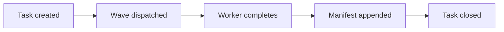

# Markdown Patterns

Concrete patterns for the code blocks, tables, lists, and other
markdown constructs that appear most often in CLEO docs. The right
pattern in the right place compresses information; the wrong pattern
makes the doc feel cluttered.

## Code Block Patterns

### Pattern: Instructions in Sequence

When the reader runs commands in order, separate each by prose that
states the outcome — not interjections inside the block.

````markdown
GOOD:
Run the migration:

```bash
pnpm run migrate
```

You should see "Migration complete" with no error output.

Then start the dev server:

```bash
pnpm run dev
```

It boots on port 3000 by default.

BAD (interjections buried in code):

```bash
# (Remember to run migration before this)
pnpm run dev
```

BAD (multiple commands smashed together):

```bash
pnpm run migrate
# then
pnpm run dev
```
````

The good pattern lets the reader pause between steps and confirm
each one. The bad patterns force them to read the comments to learn
the structure.

### Pattern: Annotated Output

When showing what command output looks like, use a separate code block
with the language `text` (or no language):

````markdown
Run:

```bash
cleo show T9567
```

You see:

```text
T9567 — E-SKILLS-DEPTH-BACKFILL
Status: pending
Acceptance:
  1. Each of 6+ stub skills gains references/ with min 3 docs each
  ...
```
````

Do NOT mix command and output in one block — it confuses syntax
highlighters and makes copy-paste error-prone.

### Pattern: TypeScript with Path Comment

When showing TypeScript that lives at a specific path, lead with a
path comment:

````markdown
```typescript
// packages/cleo/src/commands/release-plan.ts
import { defineCommand } from "citty";

export const releasePlan = defineCommand({
  meta: { name: "plan", description: "..." },
  // ...
});
```
````

The path comment gives the reader the "where" before the "what".

## Table Patterns

### Pattern: Comparison Table

Use when the reader is choosing between options.

```markdown
| Approach | Pros | Cons | Use when |
|----------|------|------|----------|
| A | fast, simple | limited | quick scripts |
| B | flexible, typed | more setup | production code |
| C | minimal | runtime cost | very small projects |
```

The "Use when" column is the punchline — readers scan the comparison
table to find their use case.

### Pattern: Reference Table

Use when listing options, flags, or enum values.

```markdown
| Flag | Default | Description |
|------|---------|-------------|
| `--verbose` | false | Print full execution trace |
| `--epic <id>` | (required) | Epic to release |
| `--no-tag` | false | Skip the tag step |
```

Default column makes the reader's reading order clear: read row,
notice it has a sensible default, move on. Without the default
column, the reader has to mentally guess what happens when they
don't specify the flag.

### Pattern: Status Table

Use for state machines or status codes.

```markdown
| Status | Meaning | Next states |
|--------|---------|-------------|
| pending | Created, not yet started | active |
| active | In progress | done, blocked |
| blocked | Awaiting dependency | active, cancelled |
| done | Complete | — |
```

The "Next states" column makes the state machine readable as a table.

### Anti-pattern: Too Many Columns

Tables wider than 5 columns become illegible on mobile and look like
data dumps. If you have more dimensions, split into multiple tables.

```markdown
BAD:
| Name | Status | Date | Owner | Priority | Estimate | Description | Notes |

GOOD (split):
| Name | Status | Date | Owner |
|------|--------|------|-------|
| ... | ... | ... | ... |

For details and estimates, see the [task tracker]...
```

## List Patterns

### Pattern: Numbered for Sequence

Use when order matters and the reader will follow steps.

```markdown
1. Install the CLI: `pnpm i -g @cleocode/cleo`
2. Initialize a project: `cleo init`
3. Open the first task: `cleo next`
```

### Pattern: Bulleted for Peers

Use when items are independent.

```markdown
The release pipeline runs these gates:

- Lint and format
- Build
- Type-check
- Unit tests
- Integration tests
- Security scan
```

### Pattern: Definition List

For term + definition pairs, use bold-prefixed bullets:

```markdown
- **Orchestrator** — the agent that dispatches subagents.
- **Worker** — an agent spawned for a leaf task.
- **Lead** — a middle-tier agent supervising one wave.
```

The em-dash separator reads cleanly. Don't use a colon (looks like
prose); don't use a hyphen alone (too thin).

## Link Patterns

### Pattern: Inline Reference

```markdown
The release pipeline is defined in [ADR-065](../.cleo/adrs/ADR-065-release-pipeline.md).
```

### Pattern: Section Reference

```markdown
See [§Worktree Discipline](#worktree-discipline) below for the full constraint.
```

### Pattern: External + Citation Comment

```markdown
The default cache behavior changed in [Next.js 15](https://nextjs.org/blog/next-15)
— retrieved 2026-05-19.
```

The retrieval date is essential when citing an external page that may
change. Without it, the reader can't tell whether the citation is
still accurate.

## Callout Patterns

CLEO docs use bold-prefixed paragraphs rather than custom admonitions
(no special syntax).

```markdown
**Note:** This feature requires CLEO v2026.5.81 or later.

**Warning:** Running this command on a dirty working tree will lose changes.

**Tip:** Use `cleo find` instead of `cleo list` for browsing.
```

The three callout types: Note (informational), Warning (potential
foot-gun), Tip (efficiency improvement). Don't invent new ones.

## Image Patterns

### Pattern: Scoped UI Screenshot

```markdown

```

The alt text describes what the image conveys, not what it is. "Three
green checks" is meaningful; "Dashboard screenshot" is not.

### Pattern: Diagram with Mermaid

```markdown

```

Mermaid renders inline in GitHub and most markdown viewers. Prefer
over PNG diagrams for anything textual — Mermaid is editable in
source control.

## Frontmatter Patterns

YAML frontmatter goes at the very top, between `---` fences.

```markdown
---
title: How to configure the release pipeline
date: 2026-05-19
audience: maintainer
status: draft
---

# How to configure the release pipeline
...
```

The first H1 in the body matches the title field. Keeping both in sync
is the writer's job.

## Footnote and Aside Patterns

CLEO docs avoid markdown footnotes — they break in many renderers.
Use inline parenthetical references instead.

```markdown
GOOD:
The orchestrator dispatches via `cleo orchestrate spawn` (see
`packages/cleo/src/commands/orchestrate/spawn.ts:107`).

BAD:
The orchestrator dispatches via `cleo orchestrate spawn`[^1].

[^1]: See `packages/cleo/src/commands/orchestrate/spawn.ts:107`.
```

## Whitespace and Structure

- One blank line between sections.
- Two blank lines around H1 headings (rare in CLEO docs — usually
  only one H1 per file).
- No trailing whitespace.
- Final newline at end of file (POSIX requirement).
- Tables: align the `|` separators by eye in source; it makes diff
  review easier.

## Final-Pass Checklist

Before declaring a doc done, run through:

- [ ] All code blocks have language tags.
- [ ] All links have descriptive text (no "here", "this").
- [ ] All tables ≤ 5 columns.
- [ ] All headings state the point (not just the topic).
- [ ] All "users" replaced with "people" or "companies".
- [ ] All contractions present (don't, can't, won't).
- [ ] No "easy", "simple", "just", "obviously".
- [ ] Title and frontmatter title match.
- [ ] Final newline present.
