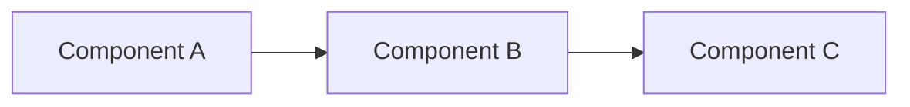

# Spec Templates

Templates for the spec types that CLEO produces most frequently. Each
template includes the canonical sections, required cross-references, and
the conformance criteria block that `ct-validator` reads downstream.

## Protocol Specification

For inter-component or inter-process contracts. Examples: the
`cleo-subagent` protocol, the `pipeline_manifest` schema, the LAFS
envelope contract.

```markdown
# {Protocol Name} Specification v{X.Y.Z}

The key words "MUST", "MUST NOT", "REQUIRED", "SHALL", "SHALL NOT",
"SHOULD", "SHOULD NOT", "RECOMMENDED", "MAY", and "OPTIONAL" in this
document are to be interpreted as described in RFC 2119.

**Status**: draft | proposed | accepted | deprecated
**Supersedes**: (none) | {ADR-XXX} | {Spec-Name v{X.Y.Z-1}}
**Related ADRs**: ADR-XXX, ADR-YYY

---

## Abstract

{One paragraph: what this protocol governs and why it exists.}

## Definitions

| Term | Definition |
|------|------------|
| {term} | {precise definition; avoid synonyms} |

## Roles

- **{Role A}**: {responsibilities}
- **{Role B}**: {responsibilities}

## Message Types / Operations

### {Operation 1}

**REQ-001**: {what MUST happen}.
- Inputs: {field list with types}
- Outputs: {field list with types}
- Errors: {error code enumeration}

### {Operation 2}
...

## State Machine (if applicable)

| State | Transitions | Triggers |
|-------|-------------|----------|
| init | → ready | start() |
| ready | → running, → cancelled | run(), cancel() |
| running | → done, → failed | (auto) |

## Security Considerations

{What can go wrong; threat model.}

## Compliance

An implementation is conformant if {enumerated conditions}.
```

## API Specification

For HTTP, gRPC, or CLI-level interfaces.

```markdown
# {API Name} Specification v{X.Y.Z}

{RFC 2119 boilerplate}

## Overview

{One paragraph.}

## Endpoints / Commands

### `{METHOD} /path` or `cleo {verb} {noun}`

**REQ-001**: The endpoint MUST return 2xx on success, 4xx on client
error, 5xx on server error.

**Request schema**:
```json
{ "field": "type", "field2": "type" }
```

**Response schema (success)**:
```json
{ "result": "type" }
```

**Errors**:
| Code | Meaning | When |
|------|---------|------|
| E_NOT_FOUND | Resource missing | {trigger} |
| E_VALIDATION | Bad input | {trigger} |

**REQ-002**: The endpoint SHOULD complete within {N}ms p95.

## Authentication

{Required headers, scopes, etc.}

## Versioning

{How breaking changes are communicated.}

## Compliance

{Conditions.}
```

## Architecture Document

For high-level structural decisions that do not fit the ADR (single
decision) shape but need normative weight. The ADR records the decision;
the architecture document specifies the resulting structure.

```markdown
# {System Name} Architecture v{X.Y.Z}

{RFC 2119 boilerplate}

## Context

{Why this system exists; what problem it solves.}

## Constraints

| ID | Constraint | Source |
|----|------------|--------|
| CON-001 | All DB opens go through openCleoDb() | ADR-D003 |
| CON-002 | No raw new DatabaseSync() outside chokepoint | ADR-D003 |

## Components

### {Component A}
- **Responsibility**: {one sentence}
- **Inputs**: {what it consumes}
- **Outputs**: {what it produces}
- **Constraints**: CON-XXX, CON-YYY

### {Component B}
...

## Dependencies



## Cross-cutting Concerns

- **Observability**: {logging, metrics, tracing requirements}
- **Security**: {authn, authz, secrets handling}
- **Resilience**: {failure modes, recovery}

## Compliance

{Conditions.}
```

## Requirements Document (small/targeted)

For a single feature where a full protocol spec is overkill but a
testable contract is needed.

```markdown
# {Feature Name} Requirements v{X.Y.Z}

{RFC 2119 boilerplate}

## Scope

{What's in; what's out.}

## Requirements

**REQ-001**: {requirement}
- Rationale: {why}
- Verification: {how to test}

**REQ-002**: {requirement}
- Rationale: {why}
- Verification: {how to test}

## Constraints

{CON-XXX list if relevant.}

## Open Questions

{Anything not yet resolved — these block acceptance.}

## Compliance

{Conditions.}
```

## Naming Conventions

| Type | Filename pattern | Location |
|------|------------------|----------|
| Protocol spec | `<name>-protocol-v<x>.md` | `docs/specs/protocols/` |
| API spec | `<name>-api-v<x>.md` | `docs/specs/apis/` |
| Architecture | `<name>-architecture-v<x>.md` | `docs/architecture/` |
| Requirements | `<name>-requirements.md` | `docs/specs/requirements/` |
| ADR | `ADR-NNN-<short-slug>.md` | `.cleo/adrs/` |

When in doubt: protocol vs requirements — a protocol governs a contract
between two parties; requirements govern behavior of a single party.

## Versioning Rules

| Bump | Trigger |
|------|---------|
| Patch (`X.Y.Z+1`) | Clarification, typo fix, no semantic change |
| Minor (`X.Y+1.0`) | Added requirement (additive) |
| Major (`X+1.0.0`) | Changed or removed requirement (breaking) |

A major bump REQUIRES a corresponding deprecation period for the prior
major version. State the period in `## Status` (e.g., "v2.x deprecated
2026-Q3, removed 2026-Q4").
